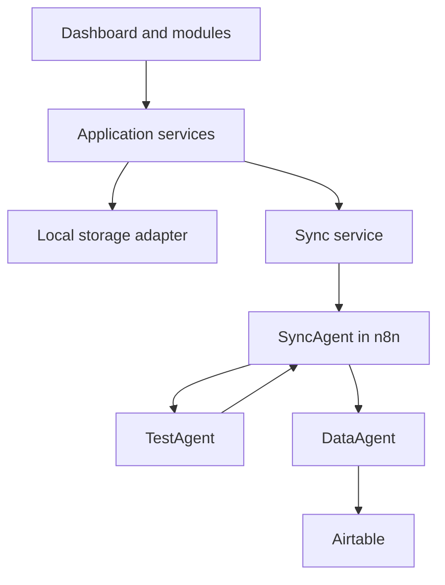

# GoldenDawn OS

## The Jan & Arisa Lichtwaldzentrale

> A personal AI Operations System for learning, projects, prompt engineering,
> automation, reflection, and measurable progress — developed step by step into
> a professional multi-agent portfolio project.

## Project status

**Current phase:** `v0.2.1 — LearningHub Local MVP in progress`

The `v0.2.0` implementation is complete, verified with the automated test
suite and production build, and published as tag `v0.2.0` with its
corresponding GitHub Release. The responsive
Command Center shell is implemented on top of the Vite and Vanilla JavaScript
foundation. PromptVault supports local viewing, creation, editing, permanent
deletion, search, category filters, persistent favorites, immutable version
history, and restoration as a new version. Git actions for future releases
remain entirely manual with Jan.

LearningHub `v0.2.1` is now in progress. Its Schema 2 content contract, local
service and storage path, controller, and private content UI are implemented.
Progress, notes, summaries, and the deterministic local mock test remain
planned before the milestone is complete. LichtwaldLog `v0.2.2` follows after
it and is not implemented yet.

## Vision

GoldenDawn OS is designed as a calm, modular command center that connects
personal workflows with professional AI engineering practices. It will combine
a browser-based dashboard, a central SyncAgent, specialized agents, n8n
workflows, and structured data storage.

The project has two complementary goals:

- provide a useful private system for learning, projects, prompts, routines,
  reviews, and automation;
- demonstrate clean architecture, prompt engineering, workflow orchestration,
  data design, and multi-agent collaboration as a portfolio project.

## Target architecture



The dashboard will communicate with external systems through the SyncAgent
instead of accessing Airtable, APIs, or specialized agents directly.
Only the DataAgent communicates with Airtable in Version 1.

See [`docs/architecture.md`](docs/architecture.md) for responsibilities,
boundaries, and end-to-end data flows.

Request, response, error, and agent payload formats are defined in
[`docs/data-contracts.md`](docs/data-contracts.md).

Accepted architecture decisions and their rationale are indexed in
[`docs/decisions/README.md`](docs/decisions/README.md).

## Modules

| Module | Purpose | Delivery target | Status |
| --- | --- | --- | --- |
| Command Center | Central overview, navigation, and system status | `v0.2.0` | Shell implemented; milestone complete |
| PromptVault | Local prompt library with editing, search, category filters, favorites, immutable history, and restoration | `v0.2.0` | Local MVP implemented; milestone complete |
| LearningHub | User-configured modules, trackable chapters, text-based LearningNodes, and deterministic synthetic mock tests | `v0.2.1` | Local content UI and persistence implemented; milestone in progress |
| LichtwaldLog | Local text journal with search and filters | `v0.2.2` | Planned; not implemented |
| Agent Hub | Agent overview, capabilities, and execution status | Later milestone | Planned |
| Automation Hub | Visibility into n8n workflows and results | Later milestone | Planned |
| Weekly Review | Structured summaries, progress, and next actions | Later, after the LichtwaldLog Local MVP | Planned; not part of `v0.2.2` |

### PromptVault local MVP

PromptVault currently uses the local storage key
`goldendawn.promptVault.v1`. If that key is completely missing, the service
initializes exactly three clearly marked synthetic example prompts. The local
MVP displays category metadata and the complete prompt text, lets users create
validated custom prompts with persistent local storage, and permanently deletes
prompts and their complete history only after an accessible inline
confirmation. Every new prompt starts with Version 1. A content-changing edit
appends an immutable `edited` snapshot while preserving prompt identity,
creation metadata, demo provenance, favorite state, and every earlier version.

Each prompt card provides an accessible version history with the newest entry
shown first without changing the stored ascending order. Historical content can
be reviewed in full and restored after an inline confirmation. Restoration
never overwrites history: it appends a new `restored` version that references
the selected source version. Restoring content that already matches the current
state is reported as unchanged and creates no additional version.

The module also provides local full-text search over the current prompt content,
category filters, and persistent favorites. Search text and filter selections
remain transient. Favorite changes are stored outside the content-version
history and do not create a new content version. A deliberately stored empty
list remains empty after a reload.

The implemented local data flow is:

```text
PromptVault view
  → PromptVault controller
  → Prompt service
  → Prompt storage
  → Storage adapter
  → localStorage
```

The UI does not access `localStorage` directly. Create, edit, favorite, delete,
and restore actions use the service and storage flow shown above and persist
within `goldendawn.promptVault.v1`; no second storage key is used. A restore
request passes only the prompt ID and version number to the service, never a
second content copy from the view.

These records exist only in `localStorage` for the current browser profile and
origin. They are not a cloud backup, do not synchronize across browsers or
devices, and can be lost when local browser data is cleared. Import/export,
webhooks, synchronization, Airtable, a backend, agent logic, user accounts, and
automatic cloud backup are not implemented.

### LearningHub Local MVP (in progress for v0.2.1)

LearningHub is a bounded local learning module, not a general-purpose LMS. Its
implemented Schema 2 foundation uses the hierarchy
`LearningHub → LearningModule → LearningChapter → LearningNode`. A new hub may
contain no modules, while every persisted module contains at least one chapter.
Chapters are implicitly trackable and may contain no LearningNodes;
LearningNodes are user-created text cards. The separate local UI now supports
creating and renaming modules and chapters as well as creating and editing
LearningNodes. It uses this implemented data flow:

```text
LearningHubView
  → LearningHubController
  → LearningHubService
  → LearningHubStorage
  → StorageAdapter
  → localStorage
```

The view and controller never access `localStorage` directly. Selection, open
accordions, and form state remain transient; persistent content stays at
`schemaVersion: 2` under `goldendawn.learningHub.content.v1`. User text is
rendered through safe DOM text APIs. Content remains in the current browser
profile without cloud backup or cross-device synchronization, and same-origin
scripts could read the unencrypted local storage. Private learning data and
independently invented synthetic portfolio data remain strictly separate.
Progress, notes, summaries, and test logic are not part of this content step.

The planned local test path is:

```text
LearningHubView
  → LearningHubController
  → LearningTestService
  → MockLearningTestProvider
```

This local provider will be deterministic, synthetic, visibly labeled
`Lokaler Mock-Test`, and will not use AI. Free-text evaluation and TestAgent
processing are deferred to `v0.5.0`, using the later path:

```text
LearningTestService
  → SyncService
  → SyncAgent
  → TestAgent
```

### LichtwaldLog Local MVP (planned for v0.2.2)

LichtwaldLog is limited to local CRUD for entries with a title, calendar date,
plain text, and tags, plus local search and filters. Private entries and
synthetic demo entries will remain separate. Images will not be stored as
Base64 in `localStorage`. Synchronization, agents, and Weekly Review are later
work and are not part of the `v0.2.2` Local MVP.

## Development principles

- Build in small, stable, and verifiable steps.
- Follow the sequence: **mock → webhook → Airtable → agent logic**.
- Keep every `v0.2.x` milestone local; external communication starts with
  `v0.3.0`.
- Keep UI components independent from concrete storage technologies.
- Encapsulate local persistence behind storage adapters.
- Route external communication through services and the SyncAgent.
- Never store API keys, access tokens, or other secrets in the frontend.
- Use UTF-8 and native German characters from the beginning.
- Add dependencies only when they solve a documented requirement.
- Keep private data and public portfolio demo data strictly separated.

## Technology

### Current foundation

- Vite
- Vanilla JavaScript
- HTML5
- CSS3
- Git and GitHub

### Planned integrations

- n8n for workflow orchestration and the SyncAgent
- Airtable as the first structured external data layer
- specialized AI agents for bounded domain tasks
- a later database or backend when the requirements justify it
- PWA support and server deployment after the core architecture is stable

## Roadmap

Detailed milestones and acceptance criteria are maintained in
[`docs/roadmap.md`](docs/roadmap.md).

| Version | Milestone | Outcome |
| --- | --- | --- |
| v0.1.0 | Project foundation | Documentation, architecture, and clean Vite structure |
| v0.2.0 | Command Center and PromptVault Local MVP | Complete, verified, and published |
| v0.2.1 | LearningHub Local MVP | Local Schema 2 content UI and persistence implemented; progress, notes, summaries, and deterministic mock tests remain planned |
| v0.2.2 | LichtwaldLog Local MVP | Planned local text-entry CRUD, search, and filters |
| v0.3.0 | SyncService, webhook, and SyncAgent | Planned first external communication boundary with validated n8n requests |
| v0.4.0 | DataAgent and Airtable | Planned controlled Airtable read and write flow through the DataAgent |
| v0.5.0 | TestAgent and learning tests | Planned routed tests and free-text evaluation through the SyncAgent |
| v0.6.0 | Integration | Planned integration and verification of the previously introduced local and external components |
| v1.0.0 | Portfolio release | Planned secure demo separation, portfolio documentation, and deployment |

The `v0.2.x` line intentionally remains local, and `v0.3.0` begins external
communication. Additional patch or minor versions may be inserted when needed
without reordering these milestones. The architecture sequence remains
**mock → webhook → Airtable → agent logic**.

## Getting started

### Requirements

- Node.js `20.19+` or `22.12+`
- npm
- Git

### Local development

```bash
git clone https://github.com/Varudan/goldendawn-os.git
cd goldendawn-os
npm install
npm run dev
```

Create a production build with:

```bash
npm run build
```

Safe, local PowerShell helpers for the manual commit and merged-branch cleanup
process are documented in [the Git workflow guide](docs/git-workflows.md).

## Verification

The published `v0.2.0` release was verified with:

```bash
npm test
npm run build
```

Both commands completed successfully for the published release.

## Security and privacy

GoldenDawn OS remains private during the current local MVP phase. Secrets must
never be committed to Git or exposed through frontend environment variables.
The later portfolio version will use dedicated demo data and a separate
configuration from the private system.

Detailed security rules are maintained in
[`docs/security.md`](docs/security.md).

## Project history

- **2026-07-05:** GoldenDawn began as the shared Jan & Arisa project vision.
- **2026-07-11:** GoldenDawn OS started as a clean, modular repository based on
  lessons learned from the original KI-Manager-Dashboard prototype.
- **2026-07-15:** The `v0.2.0` Local Dashboard MVP was completed and verified
  with its automated tests and production build, and published as tag `v0.2.0`
  with the corresponding GitHub Release.

## Author and collaboration

**Concept and development:** Jan Slominski

GoldenDawn OS is built as an AI-assisted engineering project in collaboration
with Arisa and OpenAI Codex. Decisions, prompts, experiments, and lessons
learned are documented as part of the portfolio.

## License

A license will be selected before the repository is released publicly.
