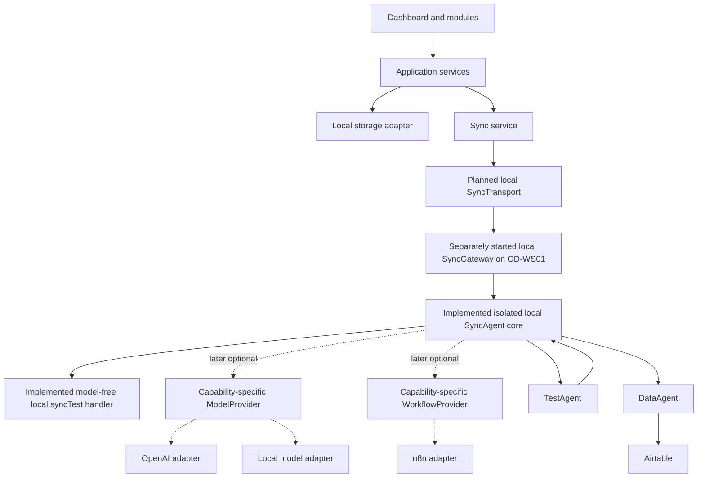

# GoldenDawn OS

## The Jan & Arisa Lichtwaldzentrale

> A personal AI Operations System for learning, projects, prompt engineering,
> automation, reflection, and measurable progress — developed step by step into
> a professional multi-agent portfolio project.

## Project status

**Current release:** `v0.2.2 — LichtwaldLog Local MVP complete, verified, and published`

**Current development:** `v0.3.0 – in Arbeit – Local Model-free SyncAgent Core Foundation / ADR 0024`

The `v0.2.0` implementation is complete, verified with the automated test
suite and production build, and published as tag `v0.2.0` with its
corresponding GitHub Release. The responsive
Command Center shell is implemented on top of the Vite and Vanilla JavaScript
foundation. PromptVault supports local viewing, creation, editing, permanent
deletion, search, category filters, persistent favorites, immutable version
history, and restoration as a new version. Git actions for future releases
remain entirely manual with Jan.

LearningHub `v0.2.1` is complete, verified, and published. Its Schema 2 content
path, separate chapter and module progress,
LearningArtifact notes and summaries, LearningTest bank, append-only attempts,
deterministic engine, question editor, module test runner, result view,
controlled session cancellation, and redacted attempt history are locally
operable. A completely new browser profile is initialized once with exactly
one clearly marked, fully synthetic demo module containing three chapters,
four LearningNodes, eight LearningArtifacts, and seven questions. The visible
`Lokaler Mock-Test` uses neither AI nor external communication. Existing
browser data remains authoritative and is never supplemented or overwritten
by the initializer. Final release verification passed 552/552 automated tests
and the production build. Tag `v0.2.1` and its corresponding GitHub Release
were published on 2026-07-25, and the repository is publicly visible for
portfolio and evaluation purposes without an open-source license. LichtwaldLog
`v0.2.2` was started on 2026-07-26 and is now complete, verified, and
published. Its Contract Foundation,
private Storage Foundation, Service Foundation, Controller Foundation, and
isolated View and CSS Foundation, together with ADRs 0013, 0014, and 0015, are
implemented as two explicitly separated stacks in `src/main.js`. Only the
private stack uses the shared `StorageAdapter`; the synthetic demo uses its
own in-memory stack without that adapter.
LichtwaldLog is reachable from the application navigation with the visible
status `Lokales MVP`. Viewing, creating, fully editing, permanently deleting, and
explicitly setting or clearing the featured entry are operable through
GoldenDawn OS. The entry authoritatively referenced by `featuredEntryId` is
presented in both overview and detail as `Besonderer Lichtwaldmoment`. This is
a View/CSS-only projection of the existing focus reference and adds no second
state, API, persistence path, or dashboard-wide redesign. Local text search
across calendar date, title, text, and tags,
together with exact calendar-date and tag filters, is also implemented. These
criteria are combined with logical AND exclusively over the transient
controller projection and are never persisted. Real-browser verification of
the complete navigation, CRUD, focus, dirty-guard, delete, reload, search, and
filter flow passed in fresh isolated temporary Chrome profiles at desktop
`1440 × 1000` and exactly `390 × 844`. A second, strictly separated
runtime now exposes five fully invented entries as a functional synthetic
in-memory demo. Demo mutations survive navigation within the current document
and reset to the canonical seed on reload or a new composition without reading
or changing private browser data. The permanent synthetic origin and reload
behavior remain visible, including in the featured-moment presentation. Final
verification passed 374/374 LichtwaldLog tests and 933/933 tests in the
complete suite with 0 skips and 0 todos; the production build transformed
exactly 46 modules. `v0.2.2` is complete, verified, and published. Its
annotated tag and corresponding GitHub Release were published on 2026-08-02,
making `v0.2.2` the latest published release. `private: true` is package metadata and
does not make this publicly visible repository private. The published release,
package version, and tag remain `v0.2.2`, `0.2.2`, and `v0.2.2`. Development
of `v0.3.0 – Local SyncAgent and Transport Foundation` began with the transport-neutral
**SyncContract Foundation**, which remains the binding contract basis. The
transport-neutral **SyncService Foundation** is also implemented. Its frozen
API exposes only the Promise-based `runSyncTest()`, builds and validates a
controlled six-field `syncTest` request with an exactly empty payload, and
invokes the injected `syncTransport.sendSyncRequest` method at most once
afterward. Only a defensively projected, fully validated, normally correlated
SyncResponse is accepted.

The synchronous, transport-neutral **SyncGateway Request Boundary Foundation**
is also implemented. Its frozen ordinary API exposes only
`processSyncRawBody(rawBody)` and accepts exactly one already materialized
Raw-Body value. It checks that unchanged value with the existing UTF-8-size
validator before parsing, calls native `JSON.parse` exactly once without a
reviver, validates the unchanged parsed request before any projection, then
creates, validates, deep-freezes, and finally revalidates a fresh defensive
six-field snapshot with a fresh empty payload. Accepted requests and
controlled input rejections are separated from static local boundary failures.
Controlled rejections use a fresh, fully validated early Gateway error
response with no claimed `SyncAgent` processing.

The separate **Local SyncGateway Raw-Wire and HTTP Foundation** is now
implemented according to ADR 0020. It is an import-inert Node process outside
the browser build graph and starts only through `npm run gateway:local` with
validated server-side port and exact loopback-Origin configuration. When
started explicitly, it binds only to `127.0.0.1`, exposes only the fixed local
path `/api/sync-test`, enforces the documented HTTP and CORS policy, limits the
application buffer while streaming, decodes UTF-8 exactly once, and calls the
existing request boundary exactly once after a valid receive path. Each
physical socket has at most one response owner, timeout checks use a fixed
bounded production interval, and a post-start server failure closes the
listener and tracked sockets before any further request processing.

The fully local **Model-free `syncTest` SyncAgent Core Foundation** is now
implemented according to ADR 0024 in `src/agents/syncAgent.js`. The module
exports only `createSyncAgent`. Its exact factory
`createSyncAgent({ getCurrentTimestamp = defaultUtcClock } = {})` returns a
fresh ordinary frozen API containing only the synchronous
`processSyncRequest(syncRequest)` method. The method accepts exactly one
argument and every controlled call returns a fresh, deeply frozen exact result
`{ ok, status, syncResponse, error }`; it never returns a Promise or Thenable.

On successful module evaluation, private references to `Object.freeze`,
`Object.isFrozen`, `Object.getPrototypeOf`, `Object.getOwnPropertyDescriptor`,
`Object.hasOwn`, and `Reflect.ownKeys`, plus the ordinary `Object.prototype`
identity, are captured. The captured reflection references are used only by the
terminal verifier for the factory API, local error records, and terminal failure
and success results; captured freeze protects those records and captured
`Object.isFrozen` performs every actual frozen-state check. The terminal
verifier uses bounded index comparisons and no live `Object.*`, `Reflect.*`,
Array prototype method, or iterator. It checks the ordinary prototype, exact
own keys, enumerable data properties, fixed values, required identities, and
actual frozen state. Internal request and response reflection and their
`Object.freeze` calls intentionally remain live. An observed internal
reflection or freeze throw, freeze no-op, mutation, or inconsistent view fails
closed as the static `agentFailed` result, while replacing a terminal
reflection, freeze, or frozen-state global after import cannot make a terminal
API, error, or result mutable or corrupted.

On every permitted one-argument path the Clock is evaluated exactly once. The
unchanged request is validated before descriptor-based defensive projection;
the projection is validated, deep-frozen, and finally revalidated. A successful
response is likewise validated against that stable internal request,
deep-frozen, and finally revalidated. It is always the correlated successful
`syncTest` response with `handledBy: "SyncAgent"`, synthetic `dataOrigin`, and
static unmeasured `durationMs: 0`. Local invocation, request-rejection, and
internal failures remain separate static redacted results rather than normal
Contract error responses.

Importing the module starts nothing. Creating the factory does not invoke the
resolved Clock function and starts no I/O, timer, or provider path. Its
parameter destructuring does resolve the trusted composition property
`getCurrentTimestamp`; an accessor or Proxy in that container can therefore run
or throw during factory creation, outside the method result contract. Only a
call to `processSyncRequest` with exactly one argument invokes the resolved
Clock function exactly once. The core has no transport, provider, model,
workflow, persistence, logging, or private-module dependency. It remains
isolated and is composed with neither the local SyncGateway nor the browser
path. These guarantees do not cover primordials compromised before module
evaluation, modified module code or lexical bindings, a compromised JavaScript
engine, out-of-memory or process termination, or coordinated manipulation of
all relevant reflection intrinsics. Same-realm execution and deep freeze are
not a sandbox. The focused SyncAgent suite passes 103/103 tests with 0 failures,
0 skips, and 0 todos. The four
combined Sync suites pass 245/245 tests, and the full serial suite passes
1315/1315 tests, likewise without failures, skips, or todos. The production
build still transforms exactly 46 modules, and the checked-in n8n boundary
bundle passes its no-drift check.

The **Generated n8n Boundary Bundle Foundation** is now implemented according
to ADR 0021. SyncContract and SyncGateway Request Boundary remain the only
domain-canonical sources. The small manifested entry is explicitly maintained
non-domain glue, and the deterministic generator is maintained repository
tooling; only Bundle and manifest are reproducibly generated derivatives.
Each manifested source is read exactly once through a safe file handle, and
both its SHA-256 hash and the Vite virtual modules use the same immutable
snapshot. The complete artifact bytes are one directly bindable,
side-effect-free expression IIFE: `"use strict";` is the first IIFE-body
directive rather than a top-level statement, so the unchanged artifact can
follow `const boundaryBundle =`. Evaluating it returns exactly the frozen API
`{ createSyncGatewayRequestBoundary }`; the resulting factory API remains
exactly `{ processSyncRawBody }`. Generate and write-free drift-check modes are
available through
`npm run bundle:n8n:generate` and `npm run bundle:n8n:check`.

The local **n8n Cloud Ingress & Runtime Evidence Gate Foundation** is now
implemented according to ADR 0022. It consists of
`scripts/n8n/n8nCloudIngressProbe.js`,
`scripts/n8n/n8nCloudIngressProbeObserver.js`,
`tests/n8nCloudIngressProbe.test.js`, and
`docs/evidence/n8n-cloud-ingress-runtime-evidence.template.json`. The fixed
registry contains exactly 32 synthetic vectors covering JSON and
unchanged text bytes, valid and invalid UTF-8, BOM, NFC/NFD, CRLF/whitespace,
NUL, the 65,535/65,536/65,537-byte boundaries, content encoding and compressed
expansion, Header Authentication including duplicate fields, and HTTP framing.
The former `auth-duplicate-conflicting` vector is replaced by the two ordered
IDs `auth-duplicate-conflicting-correct-first-wrong-last` and
`auth-duplicate-conflicting-wrong-first-correct-last`. All authentication
vectors share one identical body; absent/identity and Content-Length/chunked
each share an identical body; size fixtures are A-prefix-compatible; and the
gzip/deflate/br payloads share the same decompressed sentinel while the
expansion vector remains a separate 65,537-byte boundary probe.

The Foundation is import-inert and network-inactive by default. The command
below describes only the technical one-shot path; it is not authorization and
may be used only after the ADR/schema prerequisites and the individual
one-shot approval stated below. Its canonical, intended operator path is
`npm run probe:n8n:cloud:test -- --vector <probeId>`; the package script binds
exactly `node scripts/n8n/n8nCloudIngressProbe.js --run`. Import, factory
creation, builds, tests, the development server, and the bundle check bind no
real HTTPS transport. Endpoint and disposable secret are read only from
`GOLDENDAWN_N8N_CLOUD_PROBE_ENDPOINT` and
`GOLDENDAWN_N8N_CLOUD_PROBE_SECRET`; the secret is never a CLI argument. The
runner permits only HTTPS without URL userinfo, query, or fragment and only
canonical Test-URL paths of the form
`/webhook-test/<segment>[/<segment>...]`. Every nonempty suffix segment uses
only ASCII letters, digits, hyphens, or underscores. Percent encoding, raw or
encoded backslashes, control characters, empty segments, and `.` or `..`
segments are rejected before transport resolution. The runner uses a fixed
5,000 ms deadline and a 16 KiB response cap, follows no redirects, and performs
no automatic retry. After complete argument, configuration, and allowlisted-ID
validation, one invocation sends exactly one vector in exactly one request and
stops. Before every subsequent vector, the operator must manually register the
test webhook again or place it back into listening mode. There is no sweep,
automatic registration, Production-URL runner, or Production-URL measurement
path. The factory uses only an explicitly injected transport; only the CLI
adapter may bind real HTTPS after complete validation. Its output and the
closed evidence schema redact endpoint, tenant domain, URL path, credential and
Authorization values and headers, bodies, bytes, and Base64. The closed
execution settings include `readTimeRedaction` as well as the save/pruning
settings. Read-time redaction is necessary but not sufficient: the
[official n8n documentation](https://docs.n8n.io/deploy/host-n8n/configure-n8n/security/redact-execution-data/)
states that it does not alter stored database data. Unsafe observed settings
are `FAIL`; missing settings are `UNPROVEN`.

The human-reviewable Code-node observer uses only the officially documented
[`this.helpers.getBinaryDataBuffer(itemIndex, binaryPropertyName)`](https://docs.n8n.io/build/code-in-n8n/cookbook/code-node/get-the-binary-data-buffer/)
API and returns only `probeId`, `exactMatch`, `receivedByteLength`,
`strictUtf8Outcome`, `authorizationHeaderPresence`, and
`contentEncodingOutcome`. It deliberately composes neither SyncContract, the
request boundary, the generated Boundary bundle, nor `SyncAgent`.

Persisted evidence schema 1 has no `overallGate`. Its exact top-level fields
are `schemaVersion`, `endpointKind`, `tenantAlias`, `observedAt`, `timezone`,
`plan`, `region`, `n8nBuild`, `webhookNodeTypeVersion`,
`secretFreeWorkflowSha256`, `executionDataSettings`, `vectors`,
`testUrlTenantMeasurementStatus`, `stableOssCompatibility`,
`providerExecutionEvidenceStatus`, `productionUrlMeasurementStatus`,
`activationDecision`, `redactedProviderReference`, and `cleanupConfirmed`.
`endpointKind: "test"`, `stableOssCompatibility: "FAIL"`,
`productionUrlMeasurementStatus: "UNPROVEN"`, and
`activationDecision: "FAIL"` are immutable in schema 1;
`activationDecision: "PASS"` is always rejected. With no run, the Test-URL
tenant and provider statuses are `UNPROVEN`. Changing any fixed status requires
a new ADR and evidence schema version.

Provider `PASS` additionally requires non-null `tenantAlias`, `observedAt`,
`timezone`, `n8nBuild`, `webhookNodeTypeVersion`, and
`secretFreeWorkflowSha256`; `plan` and `region` may remain `null`. If any of
these six required bindings is missing, provider status is `UNPROVEN` unless a
known contradiction applies. A known unsafe setting, header, count, or
attribution value retains `FAIL` precedence.

Each of the 32 vector records has exactly `probeId`, `expectedByteLength`,
`observedByteLength`, `expectedSha256`, `httpStatus`, `observerCallCount`,
`workflowExecutionCount`, `uniqueVectorAttribution`, `exactMatch`,
`strictUtf8Outcome`, `authorizationHeaderPresence`,
`contentEncodingOutcome`, and `gate`. Counts and observations are nullable and
are never inferred from HTTP. Once a closed successful observer response has
been accepted for a `2xx` path, every non-null count must be exactly `1`; a
known `0` or value greater than `1` is `FAIL`. On normal and compressed
successful observer paths, `null` may still mean “not separately bound yet.”
Negative authentication acceptance with `2xx` is `FAIL`; early
`400`/`401`/`403` rejection alone is `UNPROVEN`, and `PASS` still requires
bound 0/0 counts plus unique attribution. Correct authentication still
requires 1/1, unique attribution, and an absent Authorization header in the
observer; `present` is `FAIL`, `unavailable` is `UNPROVEN`. Encoding uses only
`match`, `mismatch`, or `unavailable`; exact body alone is insufficient, and an
early `400` or `415` rejection alone remains `UNPROVEN`; an unambiguously bound
early compression rejection may still use 0/0 counts. A single vector `PASS`
can never set the full Test-URL tenant status or open activation.

No Cloud request or tenant measurement has been performed, so tenant evidence
remains `UNPROVEN`. The pinned official Stable reference
[`n8n@2.35.4`](https://github.com/n8n-io/n8n/releases/tag/n8n%402.35.4) at
commit `d2ce3c084c228622c2ffe7c245d25870430e18a9` already has two negative OSS
compatibility findings: its
[body reader](https://github.com/n8n-io/n8n/blob/d2ce3c084c228622c2ffe7c245d25870430e18a9/packages/cli/src/middlewares/body-parser.ts)
applies Gunzip/Inflate before `req.rawBody` for `gzip`/`deflate`, and its
[Header Authentication](https://github.com/n8n-io/n8n/blob/d2ce3c084c228622c2ffe7c245d25870430e18a9/packages/nodes-base/nodes/Webhook/utils.ts)
does not remove the successful value before the
[standard Webhook output](https://github.com/n8n-io/n8n/blob/d2ce3c084c228622c2ffe7c245d25870430e18a9/packages/nodes-base/nodes/Webhook/Webhook.node.ts)
passes request headers into runtime execution data. These commit-bound gates
and the resulting current activation gate are `FAIL`; this is an OSS source
observation, not a claim about any concrete Cloud tenant build. Both `FAIL` and
`UNPROVEN` keep the original n8n-ingress activation closed. ADR 0023 completes
the required reconsideration by formally replacing ADR 0002 and ADR 0019 and
placing the local SyncAgent before every optional provider.

The commit-pinned
[`test-webhooks.ts` source](https://github.com/n8n-io/n8n/blob/d2ce3c084c228622c2ffe7c245d25870430e18a9/packages/cli/src/webhooks/test-webhooks.ts)
is only an inspection anchor for the separate test-webhook lifecycle; no
undocumented symbol, line, or tenant guarantee is inferred from it. ADR 0022
historically supplemented and blocked ADR 0019 without replacing it. ADR 0023
now replaces ADR 0019 without changing ADR 0022 or its evidence.

The focused Evidence suite passes 26/26 tests. Bundle and Boundary remain at
115/115, the combined Sync suite including the Evidence Foundation passes
279/279, and the complete serial suite passes 1212/1212 tests; all four runs
have 0 failures, 0 skips, and 0 todos. Both new scripts pass syntax checking,
the production build still transforms exactly 46 browser modules, and the
write-free bundle check reports no drift.

Successful contract responses remain limited to
`dataOrigin: "synthetic"`. That value is only a contract classification, not
proof of actual provenance or privacy. The isolated SyncAgent core can create
the validated normal success response only when invoked directly; neither it,
the delivered service, nor the request boundary is composed in `src/main.js`.
Neither a browser SyncTransport nor the local Gateway/SyncAgent composition
exists. A request accepted by the boundary therefore still ends with a static
local HTTP `503`, never with a normal SyncResponse or claimed `SyncAgent`
processing. There is still no
n8n workflow or webhook, productive or composed Cloud transport, credential,
authentication, operational agent, Boundary-bundle composition, rate limit,
Hub UI, persistence, request logging, telemetry, or product data flow. The
existing Foundation and its exclusively synthetic runner remain network-
inactive by default, and no Cloud request has been performed. ADR 0023
authorizes neither Cloud access nor tenant measurement. Before any preparation
or execution of a new n8n tenant measurement, a new n8n-adapter ADR must be
accepted and a new adapter-specific evidence-schema version must be decided.
Only after both prerequisites are met does each of the following require its
own explicit approval: creation of a temporary workflow, a disposable
credential, every individual synthetic Test-URL one-shot, and the predefined
cleanup and removal of Cloud artifacts. Any support request is independently
approved and may inform a later decision, but authorizes no workflow,
credential, tenant preparation or execution, adapter activation, or Production
run. Without the accepted new ADR and decided new schema version, there is no
workflow, credential, or Test-URL traffic. There is no Production-URL runner or
measurement path. Schema 1 remains fixed at
`stableOssCompatibility: "FAIL"`,
`productionUrlMeasurementStatus: "UNPROVEN"`, and
`activationDecision: "FAIL"`, with no `overallGate`. Every `FAIL` or
`UNPROVEN` continues to keep the original n8n activation closed.

## Vision

GoldenDawn OS is designed as a calm, modular command center that connects
personal workflows with professional AI engineering practices. It will combine
a browser-based dashboard, a central local SyncAgent, specialized agents, and
structured data storage. Model and workflow providers may be added later only
through separately decided, capability-specific adapters.

The project has two complementary goals:

- provide a useful private system for learning, projects, prompts, routines,
  reviews, and automation;
- demonstrate clean architecture, prompt engineering, workflow orchestration,
  data design, and multi-agent collaboration as a portfolio project.

## Target architecture



The first locally connected flow will be browser-initiated:
`GoldenDawn browser → SyncService → planned local SyncTransport → local
SyncGateway on GD-WS01 → local SyncAgent → locally validated and correlated
normal SyncResponse`. The first `syncTest` handler remains deterministic,
synthetic, model-free, provider-free, and side-effect-free. The browser does
not terminate an incoming public webhook and chooses neither provider, model,
workflow, endpoint, nor environment.
The dashboard will not access Airtable, APIs, or specialized agents directly;
only the DataAgent communicates with Airtable in Version 1. This connected flow
remains incomplete: the completed service foundation adds a transport-neutral
port, the completed request-boundary slice processes an already materialized
string, ADR 0020 implements the separate local HTTP and Raw-Wire Foundation,
and ADR 0021 implements the generated standalone Boundary derivative with its
deterministic integrity manifest and parity checks. ADR 0023 formally replaces
ADR 0002 and ADR 0019 and makes the local SyncAgent the policy, validation,
routing, and response boundary. ADR 0024 now implements its synchronous,
model-free `syncTest` core as an isolated import-inert module. The browser
transport, Gateway/SyncAgent composition, operational HTTP path, and normal
response through that path remain absent.
n8n Cloud, self-hosted n8n, OpenAI, and local models are optional later
providers whose adapters are neither authorized nor implemented. Any later
provider receives only a fresh, explicit, minimized projection and responds
only to the local SyncAgent. Provider output remains untrusted and must be
locally bounded, defensively projected, validated, and correlated before it can
influence a response.

See [`docs/architecture.md`](docs/architecture.md) for responsibilities,
boundaries, and end-to-end data flows.

Request, response, error, and agent payload formats are defined in
[`docs/data-contracts.md`](docs/data-contracts.md).

Accepted architecture decisions and their rationale are indexed in
[`docs/decisions/README.md`](docs/decisions/README.md).

## Modules

| Module | Purpose | Delivery target | Status |
| --- | --- | --- | --- |
| Command Center | Central overview, navigation, and system status | `v0.2.0` | Shell implemented; milestone complete |
| PromptVault | Local prompt library with editing, search, category filters, favorites, immutable history, and restoration | `v0.2.0` | Local MVP implemented; milestone complete |
| LearningHub | User-configured modules, trackable chapters, text-based LearningNodes, local notes and summaries, and deterministic local tests | `v0.2.1` | Local MVP complete, verified, and published |
| LichtwaldLog | Local text journal with search and exact calendar-date and tag filters plus a strictly separated synthetic in-memory demo | `v0.2.2` | Local MVP complete, verified, and published |
| Agent Hub | Later presentation of the SyncAgent, its capabilities, and execution status | Later milestone | Responsibility documented; no UI implemented |
| Automation Hub | Later presentation of connections, webhooks, and workflows, including the only `syncTest` trigger | Later milestone | Responsibility documented; no UI implemented |
| Weekly Review | Structured summaries, progress, and next actions | Later, after the LichtwaldLog Local MVP | Planned; not part of `v0.2.2` |

### PromptVault local MVP

PromptVault currently uses the local storage key
`goldendawn.promptVault.v1`. If that key is completely missing, the service
initializes exactly three clearly marked synthetic example prompts. The local
MVP displays category metadata and the complete prompt text, lets users create
validated custom prompts with persistent local storage, and permanently deletes
prompts and their complete history only after an accessible inline
confirmation. Every new prompt starts with Version 1. A content-changing edit
appends an immutable `edited` snapshot while preserving prompt identity,
creation metadata, demo provenance, favorite state, and every earlier version.

Each prompt card provides an accessible version history with the newest entry
shown first without changing the stored ascending order. Historical content can
be reviewed in full and restored after an inline confirmation. Restoration
never overwrites history: it appends a new `restored` version that references
the selected source version. Restoring content that already matches the current
state is reported as unchanged and creates no additional version.

The module also provides local full-text search over the current prompt content,
category filters, and persistent favorites. Search text and filter selections
remain transient. Favorite changes are stored outside the content-version
history and do not create a new content version. A deliberately stored empty
list remains empty after a reload.

The implemented local data flow is:

```text
PromptVault view
  → PromptVault controller
  → Prompt service
  → Prompt storage
  → Storage adapter
  → localStorage
```

The UI does not access `localStorage` directly. Create, edit, favorite, delete,
and restore actions use the service and storage flow shown above and persist
within `goldendawn.promptVault.v1`; no second storage key is used. A restore
request passes only the prompt ID and version number to the service, never a
second content copy from the view.

These records exist only in `localStorage` for the current browser profile and
origin. They are not a cloud backup, do not synchronize across browsers or
devices, and can be lost when local browser data is cleared. Import/export,
webhooks, synchronization, Airtable, a backend, agent logic, user accounts, and
automatic cloud backup are not implemented.

## LearningHub Local MVP (released in v0.2.1)

LearningHub is a bounded local learning module, not a general-purpose LMS. Its
implemented Schema 2 foundation uses the hierarchy
`LearningHub → LearningModule → LearningChapter → LearningNode`. A new hub may
contain no modules, while every persisted module contains at least one chapter.
Chapters are implicitly trackable and may contain no LearningNodes;
LearningNodes are user-created text cards. The local UI supports creating and
renaming modules and chapters, creating and editing LearningNodes, marking
chapters complete or open, viewing derived module progress, and maintaining one
current note and one current summary per LearningNode. Content, progress, and
LearningArtifacts use these separate implemented paths:

```text
LearningHubView
  → LearningHubController
      ├→ LearningHubService
      │   → LearningHubStorage
      │   → StorageAdapter
      │   → localStorage
      │
      ├→ LearningProgressService
      │   ├→ LearningHubService
      │   └→ LearningProgressStorage
      │       → StorageAdapter
      │       → localStorage
      │
      └→ LearningArtifactService
          ├→ LearningHubService
          └→ LearningArtifactStorage
              → StorageAdapter
              → localStorage
```

The view and controller never access `localStorage` directly. Selection, open
accordions, and form state remain transient; persistent content stays at
`schemaVersion: 2` under `goldendawn.learningHub.content.v1`, while the
append-only progress log stays at `schemaVersion: 1` under
`goldendawn.learningHub.progress.v1`. Current notes and summaries use their own
`schemaVersion: 1` store under `goldendawn.learningHub.artifacts.v1`. The
controller gives the view validated UI projections instead of raw progress logs
or Artifact IDs, reference chains, and timestamps. If progress or artifacts
cannot be loaded, content management remains available, the affected controls
are marked unavailable, and a non-destructive retry is offered. Creating a
module or chapter refreshes progress without rolling back an already
successful content change if that refresh fails.

Before the regular LearningHub services are used, a small synchronous
coordinator handles the one-time first start. It seeds
`[Demo] KI-Grundlagen – vom Datensatz zum Transformer` only when the content,
Artifact, test-bank, and demo-initialization keys are all absent. The canonical
repository data is deeply frozen and synthetic; its validated local working
copy is persisted through the existing private domain storages. If any domain
key already exists, even as an empty or unreadable value, no demo data is added
or overwritten and a stable marker records that decision. The marker also
prevents edits or a later deletion from being reset on restart. Only clearing
the complete local application storage, including the marker, creates another
first start. The canonical seed contains exactly one module, three chapters,
four LearningNodes, eight LearningArtifacts, and seven questions.

Each domain storage and service still returns its write-free empty state when
its own key is missing. Only the preceding coordinator may initialize the
three domain stores together, and only when all relevant domain keys and the
initialization marker are absent.

All seed contracts and cross-store references are validated before the first
write. The three domain values are written sequentially and the marker last;
on failure, rollback may remove only values still byte-identical to the
prepared seed. Progress and attempt history are not prefilled. This startup
path is fully local and makes no network, AI, agent, or telemetry calls.

User text is rendered through safe DOM text APIs and form-value properties.
Native labeled chapter checkboxes, visible numeric progress, accessible
progress bars, status and alert regions, focus restoration, and isolated busy
states keep the workflows operable without relying on color alone. Note and
summary editors preserve the last valid UI projection on errors. Identical
saves are visible write-free no-ops; clearing uses an accessible inline
confirmation instead of a blocking browser dialog, and an already empty target
remains a write-free no-op. Completed modules remain visible and usable.

Content, progress, notes, summaries, test questions, and completed attempts
remain in the current browser profile without cloud backup or cross-device
synchronization. Local storage is unencrypted and can in principle be read by
other scripts on the same origin; browser quota and real-time or multi-tab
consistency remain limitations. In-progress sessions exist only in the
service instance and are lost on reload. Private learning data and
the canonical independently invented synthetic repository source stay
separate; the local working copy remains visibly marked as `[Demo]`.

The implemented local LearningTest path is:

```text
LearningHubView
  → LearningHubController
      → LearningTestService
          ├→ LearningHubService                reference validation
          ├→ LearningTestBankStorage
          │    → StorageAdapter
          │    → localStorage
          ├→ LearningTestAttemptStorage
          │    → StorageAdapter
          │    → localStorage
          └→ LearningTestEngine                pure determinism
```

The existing controller accepts only defensively validated bank, public
session, completion, and history projections. The authoring view can show the
correct option, while an active runner receives no `correctOptionId`,
explanation, or private bank snapshot before submission. Submission retries
reuse the same frozen answer payload. A safe cancellation removes only an
in-memory session, writes no attempt, and is refused while submission or
post-write reconciliation is pending.

The engine uses the validated user-configured question bank deterministically,
projects no solutions before submission, and does not use AI. The UI is
visibly labeled `Lokaler Mock-Test`; automated tests use independently
invented synthetic content. Free-text evaluation and TestAgent processing are
deferred to `v0.5.0`, using the later path:

```text
LearningTestService
  → SyncService
  → planned local SyncTransport
  → local SyncGateway on GD-WS01
  → local SyncAgent
  → TestAgent
```

ADR 0023 authorizes only the empty, synthetic, local `syncTest`; it does not
authorize this later private, stateful capability or any ModelProvider or
WorkflowProvider use. Its contract, identity, authorization, body binding,
replay, idempotency, and privacy model require a new decision before
implementation.

## LichtwaldLog Local MVP (released in v0.2.2)

The Contract Foundation, private Storage Foundation, Service Foundation,
Controller Foundation, and isolated View and CSS Foundation are implemented.
ADRs 0013, 0014, and 0015 document the contract, private storage, and strictly
separated demo-runtime decisions. The
contract consists of the Schema 1 model, the pure `validateLichtwaldLog`
validator, and synthetic contract tests. The implemented application path is
composed in `src/main.js` through the shared `StorageAdapter`:

```text
LichtwaldLogView
  → LichtwaldLogController
  → LichtwaldLogService
  → LichtwaldLogStorage
  → StorageAdapter
  → localStorage
```

The demo is composed as a separate stack with no private service, private
storage, shared adapter, or browser-storage port:

```text
Synthetic LichtwaldLogView
  → LichtwaldLogController(expectedDataOrigin: synthetic)
  → LichtwaldLogDemoService
  → LichtwaldLogDemoStorage
  → in-memory full snapshot
  → canonical demo factory
```

The private controller is explicitly composed with
`expectedDataOrigin: private`. Missing or `undefined` keeps that private
default for backwards compatibility; only exact `private` and `synthetic`
configuration is accepted. The controller validates every snapshot against the
fixed expected origin and projects only the transient view value
`runtimeMode: private` or `runtimeMode: syntheticDemo`.

The canonical factory returns a fresh detached Schema 1
`dataOrigin: synthetic` snapshot containing exactly five deterministic,
fully invented `[Demo]` entries and a valid featured-entry reference. The
demo storage keeps one defensively validated full snapshot per application
composition, enforces the same 500,000-UTF-16-code-unit boundary, and exposes
only load and save. The independent demo service exposes the same five domain
operations and business semantics as the private service, but never imports or
calls the private service or storage. It uses a separate demo-prefixed ID
generator lifecycle.

`createLichtwaldLogStorage` exposes only `loadLichtwaldLog` and
`saveLichtwaldLog`. It stores the complete validated private Schema 1 root
directly under `goldendawn.lichtwaldLog.content.v1`, without a second envelope
or separate entry and focus keys. The actual serialized JSON is limited to
500,000 UTF-16 code units according to JavaScript `String.length`; exactly the
limit is accepted. A missing key returns a fresh private empty state without a
write. Full validation, defensive cloning, and a read preflight protect
synthetic, damaged, incompatible, or oversized existing values from automatic
replacement. The preflight is not a transaction or a multi-tab lock, and the
application limit is not a browser-quota guarantee.

`createLichtwaldLogService({ lichtwaldLogStorage, generateLichtwaldLogEntryId })`
accepts the ID generator as an optional dependency and returns a frozen API
containing exactly `loadLog`, `createEntry`, `updateEntry`, `deleteEntry`,
and `setFeaturedEntry`. Passing `null` to `setFeaturedEntry` clears the
focus; there is no additional clear or toggle method.

`createLichtwaldLogController({ lichtwaldLogService, lichtwaldLogView,
scheduleTask, expectedDataOrigin })` returns a frozen API containing exactly
`open` and `close`.
The injected port remains limited to `render(viewModel, actions)` and
`unmount()`. `createLichtwaldLogView(rootElement)` implements it and returns a
frozen API with exactly the own data properties `render` and `unmount`. Every
render receives the same frozen action API with exactly:

```text
onRetryLoad
onSelectEntry
onBackToOverview
onOpenCreateEntryForm
onOpenUpdateEntryForm
onUpdateFormField
onSubmitForm
onCancelForm
onRequestDeleteEntry
onCancelDeleteEntry
onConfirmDeleteEntry
onSetFeaturedEntry
onChangeSearchQuery
onChangeCalendarDateFilter
onChangeTagFilter
onResetFilters
```

`lichtwaldLogSearch.js` is a pure module with exactly the public constants
`ALL_LICHTWALD_LOG_TAGS` and `LICHTWALD_LOG_SEARCH_QUERY_MAX_LENGTH` and the
functions `getLichtwaldLogFilterTags(entries)` and
`filterLichtwaldLogEntries(entries, filters)`. Search trims only outer query
whitespace for comparison, normalizes canonically with NFC, folds case with
`toLowerCase()`, and then performs literal contiguous substring matching only
against `calendarDate`, `title`, `text`, and each tag. Internal spaces, tabs,
and line breaks remain significant. The exact calendar-date filter uses the
existing arithmetic contract validation without `Date` or timezone conversion.
The exact tag filter uses the same NFC and case normalization. Tag options come
from every authoritative entry, preserve first spelling and source order, and
are deduplicated by normalized identity. Query, date, and tag combine with
logical AND without sorting, ranking, or mutating entries.

Each render creates a fresh DOM tree using safe DOM and form-control APIs.
Titles, text, tags, and form values remain unparsed plain text. Entry IDs stay
in closures and render-local maps and never become visible text, DOM or ARIA
IDs, selectors, classes, `data-*` attributes, or view-owned messages. Entry and
tag order and spelling remain unchanged.

The entry matching the authoritative `featuredEntryId` is presented in
overview and detail as `Besonderer Lichtwaldmoment`. The treatment is derived
only in the view from the existing projection and namespaced CSS; it introduces
no second state, controller or service API, persistence path, or dashboard-wide
redesign.

Create and update forms use separate tag controls rather than comma parsing.
Tag edits produce fresh dense arrays without trimming, sorting,
deduplication, or case normalization. Submit payloads remain flat and limited
to the controller contract.

The view renders accessible loading, authoritative-empty, filtered-empty, busy,
success, notice, validation, result-status, and error states and resolves every
controller focus target after replacing the DOM. Its overview filter panel uses
safe form-control APIs and fixed public IDs. Search focus and caret, calendar
date focus, and tag focus are restored without moving focus to a result card.
Focus actions express an entry ID or `null`, and content, deletion, and focus
are never projected optimistically. `unmount()` removes private DOM content and
transient filter, focus, and caret metadata. The namespaced CSS includes
responsive and reduced-motion rules and is imported into the application build
graph through `src/main.js`.

For `runtimeMode: syntheticDemo`, the view is permanently identified in
text as `Synthetische Demo`, `LichtwaldLog Demo`, and
`Demo · nur für diese Sitzung`. It states that every example is fully
invented and that mutations last only until the page reloads. Demo loading,
empty, form, busy, delete, focus, and privacy copy does not claim
`localStorage`, a current browser profile, cloud backup, private journals,
or permanent deletion. The featured presentation does not replace or obscure
these permanent demo-origin and reload/session cues.

The controller coordinates transient loading, empty, selection, form,
confirmation, busy, success, error, search, and filter states. `entries` remains
the complete validated snapshot projection; `visibleEntryIds`, available tags,
the three criteria, active-state flag, and filtered-empty flag are freshly
derived and deeply frozen for the view. Details and forms still resolve from all
entries. These fields are not part of Schema 1 and are never persisted. Every
service snapshot is fully revalidated as Schema 1 data with the exact origin
fixed when the controller is constructed; the raw schema root and service
results are not passed to the view. Storage remains the sole
mutable source of truth, and the service remains the authoritative domain
boundary.

Each accepted load or mutation intention invokes exactly one matching service
operation. Search and filter actions invoke no service, storage, adapter,
generator, or scheduler operation. A mutation triggers no additional controller
load and no optimistic content, delete, or focus change. Selection, form editing
and cancellation, and opening or cancelling delete confirmation remain service-
and write-free. The service alone decides write-free update and focus no-ops.
Overview selection accepts only currently visible entry IDs; detail and form
state may continue to show an authoritative entry that no longer matches until
the user returns to the overview. The filter state survives detail, form, and
mutation flows within one open lifecycle, but resets on open, load retry, close,
and a truly empty snapshot.

Every view model is a fresh defensive projection without the raw Schema 1
root. Entry and tag order remain unchanged. Controller feedback uses only
static allowlisted messages and never copies private values or foreign error
messages. Valid entry text remains opaque, unparsed, untrusted plain text;
the isolated view renders it only through safe DOM and form-control APIs.

Storage remains the sole mutable source of truth. Every valid operation reloads
the current private snapshot, and the service keeps no long-lived cache.
Invalid forms and target IDs are rejected before storage or ID-generator
access. Calendar date, title, text, and tags are trimmed only at their outer
edges while internal whitespace and line breaks are preserved. Calendar dates
are checked without `Date` parsing or timezone conversion. Target IDs are not
trimmed automatically and resolve exactly and case-sensitively.

Creation appends without date sorting. A full update preserves the entry ID,
array position, and any valid focus reference. Deletion preserves the order of
the remaining entries and clears a deleted featured entry atomically in the
same candidate. The default ID is
`lichtwald-entry-${crypto.randomUUID()}`; invalid, colliding, or throwing
generator results share a limit of five attempts. Every real mutation validates
the complete private candidate and calls `saveLichtwaldLog` at most once at
the service boundary. Identical normalized updates, an already selected focus,
and clearing an already empty focus are successful write-free no-ops.

Snapshots, entries, save arguments, and later results are defensively detached.
After a failed save, only the previous trusted snapshot remains authoritative.
Service errors use allowlisted status-code pairs and static redacted messages;
private values and foreign dependency messages are never copied into
`error`, logs, or console output. Serialization, the 500,000-code-unit limit,
and the read preflight remain inside storage and the shared adapter. Browser
quota, unencrypted same-origin access, TOCTOU behavior, and multi-tab races
remain unchanged limitations.

`src/main.js` composes the module through the shared `StorageAdapter` and makes
it reachable through application navigation with the visible status
`Lokales MVP`. The local UI supports viewing, creating, fully editing,
permanently deleting, and explicitly setting or clearing the featured entry
through GoldenDawn OS. Real-browser verification passed in a fresh isolated
temporary Chrome profile at desktop `1440 × 1000` and exactly `390 × 844`.
The complete local navigation, CRUD, explicit-focus, dirty-guard, delete,
reload, literal-search, exact-filter, combined-filter, empty-result, and reset
flow succeeded. Keyboard and caret focus, live regions, `44px` minimum control
heights, the visible `3px` focus ring, and the absence of horizontal page
overflow were verified. The run produced 0 console warnings or errors, 0
runtime exceptions, and 0 external requests. Search and filter actions left the
private snapshot byte-identical and caused no storage write; private service,
private storage, and shared adapter APIs remain unchanged. `src/main.js`
now composes an additional independent demo storage, service, view, and
synthetic-origin controller immediately after the private navigation item.
Dirty guards are enforced in both directions, only one view is mounted, demo
mutations persist only for the current document, and reload restores the
canonical seed while private data remains authoritative and untouched. The
planned implementation scope is complete, verified, and published in
`v0.2.2`.
The target Local MVP remains limited to entries with a title,
calendar date, plain text, and tags, plus local search and filters. Private
entries and synthetic demo entries remain separate.
Images are not stored as Base64 in `localStorage`. The local store is neither
a cloud backup nor cross-device synchronization. Its existing 500,000
UTF-16-code-unit limit, browser quota, read preflight, TOCTOU, and multi-tab
limitations remain unchanged. `v0.2.2` includes no external communication, webhooks,
synchronization, agent logic, or Airtable integration. Weekly Review is later
work and is not part of this milestone. The package remains at version
`0.2.2`. The annotated `v0.2.2` tag and corresponding GitHub Release were
published on 2026-08-02, and `v0.2.2` is the latest published release.
`v0.3.0` is now in progress with the Local Model-free SyncAgent Core Foundation
from ADR 0024 on top of the decision from ADR 0023 and the implemented
SyncContract, SyncService, SyncGateway Request Boundary, verified Local
SyncGateway Raw-Wire and HTTP, Generated n8n Boundary Bundle, and n8n Cloud
Ingress & Runtime Evidence Gate Foundations. Stable OSS compatibility is
`FAIL`, concrete tenant measurement is `UNPROVEN`, and the original n8n-ingress
activation remains closed. The
service keeps outgoing request
creation, transport invocation, correlation, and defensive response validation
separate. The synchronous boundary
checks an already materialized Raw-Body value, parses an accepted string once,
validates the unchanged parsed structure, and emits only a defensive frozen
request snapshot or a controlled early Gateway rejection. It neither strips
unknown fields before validation nor returns the parsed original. The
SyncService request and every accepted Boundary request require an exactly
empty payload; the contract limits successful responses to
`dataOrigin: "synthetic"`. That marker is only a contract classification, not
proof of actual provenance or privacy. ADR 0023 formally replaces ADR 0002 and
ADR 0019 and decides the target topology `browser → SyncService → local
SyncTransport → local SyncGateway on GD-WS01 → local SyncAgent → locally
validated and correlated SyncResponse`. ADR 0024 implements the isolated local
SyncAgent core as the authoritative policy, validation, routing, and response
boundary for `syncTest`; it handles that action synchronously,
deterministically, without a model or any provider. ADR 0020 implements only
the separately started loopback HTTP/Wire hop. ADR 0021 derives the standalone
expression-IIFE Boundary artifact and its
SHA-256 manifest from the canonical sources without composing it. ADR 0022 and
its fixed Schema-1 `FAIL`/`UNPROVEN` evidence remain unchanged. The slice does
not alter any published `v0.2.2` local flow; without a browser transport or
Gateway/SyncAgent composition, the isolated core is not operationally reachable
and no normal response traverses the HTTP path. It establishes no external
communication. n8n, OpenAI, and a local model remain
unauthorized optional providers without implemented adapters.

## Development principles

- Build in small, stable, and verifiable steps.
- Follow the current sequence: **implemented isolated local model-free SyncAgent → local
  Gateway/SyncAgent composition → browser end-to-end `syncTest` → local abuse,
  concurrency, time, and resource limits → separately decided providers**.
- Keep every `v0.2.x` milestone local; `v0.3.0` prepares the external boundary
  through a strict contract, transport-neutral service, and materialized-string
  request boundary. ADR 0020 implements the separately started local HTTP and
  Raw-Wire Foundation, ADR 0021 adds the generated standalone Boundary
  derivative, ADR 0022 preserves the closed original n8n-ingress evidence, ADR
  0023 places the local SyncAgent before every optional provider, and ADR 0024
  implements its isolated model-free `syncTest` core.
- Keep UI components independent from concrete storage technologies.
- Encapsulate local persistence behind storage adapters.
- Route communication through services and the local SyncAgent; never let the
  browser select a provider or call one directly.
- Never store API keys, access tokens, or other secrets in the frontend.
- Use UTF-8 and native German characters from the beginning.
- Add dependencies only when they solve a documented requirement.
- Keep private data and public portfolio demo data strictly separated.

## Technology

### Current foundation

- Vite
- Vanilla JavaScript
- HTML5
- CSS3
- Node HTTP Local SyncGateway Foundation
- Isolated synchronous model-free `syncTest` SyncAgent core
- Deterministic standalone n8n Boundary bundle generation
- Network-inactive n8n Cloud ingress/runtime evidence tooling
- Git and GitHub

### Planned integrations

- controlled local SyncGateway/SyncAgent composition, followed separately by
  the browser SyncTransport
- optional capability-specific ModelProvider adapters for OpenAI or a local
  model, only after separate decisions
- an optional capability-specific WorkflowProvider adapter for n8n, only after
  a separate decision and evidence gate
- Airtable as the first structured external data layer
- specialized AI agents for bounded domain tasks
- a later database or backend when the requirements justify it
- PWA support and server deployment after the core architecture is stable

## Roadmap

Detailed milestones and acceptance criteria are maintained in
[`docs/roadmap.md`](docs/roadmap.md).

GoldenDawn OS is intended to continue beyond the first complete product and
portfolio phase at `v1.0.0`. Possible long-term themes remain explicitly
non-binding; see the roadmap for details.

| Version | Milestone | Outcome |
| --- | --- | --- |
| v0.1.0 | Project foundation | Documentation, architecture, and clean Vite structure |
| v0.2.0 | Command Center and PromptVault Local MVP | Complete, verified, and published |
| v0.2.1 | LearningHub Local MVP | Complete, verified, and published |
| v0.2.2 | LichtwaldLog Local MVP | Complete, verified, and published |
| v0.3.0 | Local SyncAgent and Transport Foundation | In progress: local foundations, ADR 0023, and the isolated model-free `syncTest` SyncAgent core from ADR 0024 are implemented; controlled local Gateway/SyncAgent composition is next; provider adapters remain unauthorized, and the original n8n activation remains `FAIL`/`UNPROVEN` and closed |
| v0.4.0 | DataAgent and Airtable | Planned controlled Airtable read and write flow through the DataAgent |
| v0.5.0 | TestAgent and learning tests | Planned routed tests and free-text evaluation through the SyncAgent |
| v0.6.0 | Integration | Planned integration and verification of the previously introduced local and external components |
| v1.0.0 | Portfolio release | Planned secure demo separation, portfolio documentation, and deployment |

The `v0.2.x` line intentionally remains local. `v0.3.0` prepares the first
external boundary with a transport-neutral contract, service, and
already-materialized-string request boundary. ADR 0020 implements the separate
local HTTP and Raw-Wire Foundation, ADR 0021 adds the generated standalone
Boundary derivative and integrity gate, and ADR 0022 preserves the
default-inactive evidence gate for the original n8n-ingress path. ADR 0023 now
formally replaces ADR 0002 and ADR 0019 and places the local SyncAgent before
all optional ModelProvider and WorkflowProvider adapters. ADR 0024 implements
the isolated, synchronous, model-free `syncTest` core. No Cloud request has
occurred. The next mandatory action is the controlled local composition of the
existing SyncGateway with that isolated core. This slice connects only those
two local components; browser transport, the local end-to-end flow, operational
limits, and providers remain later ordered slices. n8n, OpenAI, and a local
model remain unauthorized. Before any preparation or execution of a new n8n tenant
measurement, a new n8n-adapter ADR must be accepted and a new adapter-specific
evidence-schema version decided. Schema-1 has no `overallGate`, and
its fixed `activationDecision: "FAIL"` remains unchanged.
Additional patch or minor versions may be inserted when needed without
reordering these milestones. The current implementation sequence remains
**implemented local model-free SyncAgent → local composition → browser end-to-end
`syncTest` → local operational limits → separately decided providers**.

## Getting started

### Requirements

- Node.js `20.19+` or `22.12+`
- npm
- Git

### Local development

```bash
git clone https://github.com/Varudan/goldendawn-os.git
cd goldendawn-os
npm install
npm run dev
```

Create a production build with:

```bash
npm run build
```

Regenerate the checked-in standalone Boundary artifact and deterministic
SHA-256 manifest, or verify both without changing project files, with:

```bash
npm run bundle:n8n:generate
npm run bundle:n8n:check
```

These commands do not create or contact an n8n workflow, webhook, tenant, or
other external service. Generate mode verifies the canonical repository root,
output containment, Node-recognized symbolic links and junctions, and
`realpath` deviations before it writes. It uses unpredictably named,
exclusively created temporary files in the verified target directory, checks
their identity and bytes, replaces the artifact first and the manifest last,
and cleans up temporary files that remain attributable to it. A controlled
interruption between replacements leaves a mixed pair rejected by check mode.
The two replacements are not an atomic pair and do not claim power-loss or
single-writer safety. Portable Node APIs cannot attest every Windows reparse
tag, and no protection from a hostile concurrent reparse race is claimed.

The Local SyncGateway is a separate process. `npm run dev` does not start it.
For a deliberate local start, set one server-side port and exactly one allowed
loopback/localhost Origin, then run:

```powershell
$env:GOLDENDAWN_SYNC_GATEWAY_PORT = '8787'
$env:GOLDENDAWN_SYNC_GATEWAY_ALLOWED_ORIGIN = 'http://127.0.0.1:5173'
npm run gateway:local
```

These values are local examples, not defaults or production configuration.
The process refuses missing or invalid configuration and listens only on
`127.0.0.1` at the fixed path `/api/sync-test`. GoldenDawn's browser and
`SyncService` do not use this listener yet, and the listener has no n8n or
other external upstream. If an internal server error occurs after startup, the
process removes its signal handlers, attempts cleanup idempotently, sets exit
code `1`, and prints exactly one redacted message:
`Das lokale SyncGateway wurde nach einem internen Serverfehler beendet.`

Safe, local PowerShell helpers for the manual commit and merged-branch cleanup
process are documented in [the Git workflow guide](docs/git-workflows.md).

## Verification

The published `v0.2.2` release was verified with:

```bash
npm test -- --test-concurrency=1
npm run build
```

Verification passed 374/374 LichtwaldLog tests and 933/933 tests in the complete
suite with 0 skips and 0 todos. The production build transformed exactly 46
modules. The annotated `v0.2.2` tag and corresponding GitHub Release were
published on 2026-08-02. `v0.2.2` is the latest published release.

The unreleased Local SyncGateway Raw-Wire and HTTP Foundation was verified on
2026-08-16. Its exact targeted command passed 50/50 tests, and the targeted
Gateway suite together with SyncGateway Request Boundary, SyncContract, and
SyncService passed 192/192. The complete serial suite passed 1125/1125. Every
run had 0 failures, 0 skips, and 0 todos. Tests used only synthetic fixtures and
local loopback communication. The production build succeeded and still
transformed exactly 46 browser modules, confirming that the separate Node
server did not enter the browser build graph. These unreleased results do not
change package version `0.2.2` or the published tag and release `v0.2.2`.

The unreleased Generated n8n Boundary Bundle Foundation is verified through
syntax checks, dedicated generator, reproducibility, integrity, immutable
source-snapshot and ABA, safe-output-path, parity, and mutation tests, the
existing Sync suites, the complete serial suite, the production build, and the
write-free `npm run bundle:n8n:check` mode. The targeted Bundle suite passed
61/61 tests; Bundle plus SyncGateway Request Boundary passed 115/115.
SyncContract, SyncService, Boundary, Local SyncGateway, and Bundle passed
253/253 together; the complete serial suite passed 1186/1186. Every run had 0
failures, 0 skips, and 0 todos. The production build succeeded and still
transformed exactly 46 browser modules, and the Bundle check reported no drift.

This unreleased foundation does not change package version `0.2.2` or the
published tag and release `v0.2.2`.

The unreleased SyncGateway Request Boundary Foundation passed 54/54 targeted
tests with the exact requested
`node --test tests/syncGatewayRequestBoundary.test.js` command. Boundary plus
SyncContract passed 99/99 tests; Boundary plus SyncContract plus SyncService
passed 142/142; and the complete suite passed 1075/1075. Every run had 0
failures, 0 skips, and 0 todos. The mutation-focused coverage additionally
proves validation/freeze ordering for accepted requests and Gateway errors,
original-byte sizing before Unicode normalization or parser resolution, a
console-silent success path, one dependency attempt after a throw, and fresh
object graphs for repeated `INVALID_JSON` responses. Global instrumentation is
non-concurrent and restored in `finally`. The production build succeeded and
transformed exactly 46 modules. These unreleased results do not change the
published release metadata above.

The documentation-only ADR 0019 slice was reverified on 2026-08-15 with the
complete serial suite: 1075/1075 tests passed with 0 failures, 0 skips, and 0
todos. The production build succeeded and transformed exactly 46 modules. No
release metadata changed.

The published `v0.2.1` release was finally verified with:

```bash
npm test -- --test-concurrency=1
npm run build
```

Final verification passed 552/552 automated tests and the production build.
The annotated `v0.2.1` tag and its corresponding GitHub Release were published
on 2026-07-25. This repository is publicly visible as a portfolio repository;
that visibility does not grant an open-source license or imply a public
deployment of the application.

## Security and privacy

The repository contains only source code, documentation, and clearly marked
synthetic demo data. Private learning, prompt, reflection, health, or other
personal user content does not belong in the repository. Current user content
remains in the active browser profile and is not synchronized.

The current SyncService Foundation builds `syncTest.payload` as exactly `{}`
from controlled contract values. Its default request ID generator uses
`req_ + crypto.randomUUID()` without a weaker fallback. Successful responses
remain limited to `dataOrigin: "synthetic"`, which is only a contract
classification and proves neither actual provenance nor privacy. The service
does not read or export PromptVault, LearningHub, or LichtwaldLog data. The
empty payload removes the designated content field but does not by itself prove
that every metadata value is semantically private.

The injected service and boundary ID generators, service and agent clocks, and
transport function are trusted executable application configuration. Their
Functions and Function Proxies can perform arbitrary same-realm side effects.
Promise/thenable resolution, Proxy reflection, and manipulated same-realm
intrinsics can also execute foreign code; observed throws and rejections are
mapped to static redacted local errors, but already triggered effects cannot be
prevented or undone. Deep freezing newly created snapshots is an immutability
boundary, not a sandbox.

The original transport result remains untrusted. The service reads only the
expected ordinary data shape into a separate projection, validates normal
response correlation, and never returns or freezes the original object.
`handledBy: "SyncAgent"` and `processedBy: ["SyncAgent"]` are validated
contract roles or classifications. By themselves they prove neither the
producer nor runtime provenance, deployment, Gateway/browser reachability, or
external execution. Only tests of the direct return path establish the tested
behavior of this concrete implementation. The separately started local
SyncGateway HTTP foundation is shipped outside the browser composition, but
neither a browser SyncTransport nor the local Gateway/SyncAgent composition
exists. An accepted local request therefore ends in a static `503` response and
the slice introduces no external data flow.

The contract core's pure raw-body helper measures an already allocated string
against exactly 65,536 calculated UTF-8 bytes. The SyncService does not use
that helper. The SyncGateway Request Boundary does use it before parsing. The
separate local HTTP foundation additionally imports the same canonical limit,
counts the bytes actually delivered in request chunks, retains at most 65,536
application-body bytes, and stops before decode or Boundary invocation when
byte 65,537 is observed. Node, the operating system, and the network stack may
already have allocated a delivered chunk. This application-buffer rule is not
a kernel, socket, parser-preallocation, rate-limit, or complete denial-of-service
guarantee.

After a string passes that check, the boundary calls native `JSON.parse`
exactly once without a reviver. It does not trim, remove a BOM, normalize
Unicode, repair input, or perform a stringify/parse round trip. Parser
exceptions, which can internally contain sensitive source excerpts, are
discarded completely; the Raw Body is not returned, logged, persisted, or
forwarded. Duplicate JSON member names intentionally follow native ECMAScript
last-key-wins behavior. The project therefore claims neither duplicate-free
nor canonical JSON, and a future composition must not parse the same body a
second time with different semantics.

Controlled rejections create a fresh `gateway_` ID and use only static
`INVALID_JSON`, `VALIDATION_ERROR`, `UNSUPPORTED_VERSION`,
`UNKNOWN_ACTION`, or `PAYLOAD_TOO_LARGE` profiles. They always use
`action: null`, `handledBy: null`, and an empty processing chain. The
boundary does not emit `FORBIDDEN` because it performs no authentication or
authorization, and it does not invent early `SERVICE_UNAVAILABLE` or
`INTERNAL_ERROR` profiles. Clock, generator, projection, freeze, or validator
inconsistencies become separate static local failures without a Gateway
response.

The validator itself writes no properties and does not read ordinary own
accessors as values. JavaScript reflection on a Proxy can nevertheless invoke
traps and descriptor-conversion getters, which may mutate the input or external
state. Same-realm Proxy traps are arbitrary JavaScript and can also change
global runtime objects, block execution, or make later operations throw.
Reflection catches cannot prevent or undo those effects. A successful result
confirms only the structure observed during that validation call, and there is
no portable way to detect every Proxy.

`source: "goldendawn-os"` is only a syntactic contract classification. It does
not prove authentication, origin, identity, or authorization; a later server
boundary must establish trusted provenance and must never route or authorize
from `source` alone. A syntactically valid incoming `req_` ID proves no
identity, collision resistance, authorization, or replay protection, and the
timestamp tolerance is not idempotency or deduplication. An exactly empty
payload removes the designated content field but does not establish semantic
privacy for the remaining metadata.

ADR 0023 retains the separate local SyncGateway on GD-WS01 as the only browser-
facing server process in the planned synthetic flow. ADR 0020 implements its
local Raw-Wire and HTTP foundation as an explicitly started process bound only
to `127.0.0.1`. The browser caller remains unauthenticated and untrusted;
loopback and CORS prove no identity. The gateway supports only HTTP/1.1 and
enforces the fixed method,
path, Host, JSON/UTF-8 content rules and exact Origin allowlist. HTTP/1.0 is
rejected with the static invalid-request profile before raw-header projection,
decoding, or Boundary invocation. The gateway counts actual streamed bytes
through 65,536, stops before decode and Boundary invocation at byte 65,537,
decodes valid UTF-8 exactly once while preserving a BOM as U+FEFF for the
existing parser semantics, and passes only the resulting primitive string to
the canonical request boundary. A valid accepted request terminates locally
with the static `503` upstream-not-implemented envelope.

For a listener whose bound port is `80`, the only accepted Host authorities are
`127.0.0.1` and explicit `127.0.0.1:80`; every other bound port requires exact
`127.0.0.1:<port>`. The explicit Node option `requireHostHeader: false` only
disables Node's early automatic Host response; it does not relax this policy.
On an otherwise regular request path, when no earlier fail-closed target or
special-path rejection applies, a parseable request with a missing, duplicate,
or wrong Host passes through application admission and response ownership into
the static local `invalidHttpRequest` envelope with controlled `Content-Length`.
The option opens no accepting path. A factory-local request-admission
gate, separate from response ownership, is the first shared application step
for `request`, `checkContinue`, and `checkExpectation`. It admits only the first
request on a physical socket; a follow-up claims terminal response ownership,
pauses and destroys the socket without a second response before version,
header, decoder, or Boundary processing. Tests require the first valid
HTTP/1.1 request to reach decoder creation, decode, and Boundary exactly once
with its raw body, while every second regular or Expect event reads
`rawHeaders` zero times and ends terminally. Exactly one application or
raw-socket path can own the response for a physical socket. Once ownership is
claimed, `clientError` never writes a second response. A raw-socket path
best-effort sends its static
redacted response and then reliably destroys the socket; if ownership was
already claimed, it writes nothing and destroys the socket immediately. This
also bounds half-open clients that continue writing after the server response;
asynchronous raw-write errors are redacted and used only to trigger destroy.
`maxRequestsPerSocket: 1` and the explicit synchronous `dropRequest` handler
remain defense-in-depth; a Node-rejected pipelined follow-up is destroyed
without an additional Node or Gateway response. The fixed production
header, request, and socket timeouts remain `5,000`, `10,000`, and `10,000` ms,
with a fixed `100` ms connection-check interval. On a responsive event loop,
header and request expiry is therefore detected by the next check, at most
`100` ms after the nominal deadline; event-loop or operating-system scheduling
can still delay the observed close. The narrowly scoped
`useTestTimeoutPolicy: true` factory option is accepted only with test port `0`
and fixes header/request/socket/check timing at `250`/`500`/`500`/`25` ms. It is
not reachable through either runtime environment variable and cannot weaken a
production listener. A server error after startup immediately discards the
bound port, enters the failed state, closes the listener defensively, destroys
tracked sockets, and gates all later request, decoder, and Boundary processing;
internal error details are neither returned nor logged. The internal factory
option `onFatal = () => {}` is invoked with no arguments and at most once;
throws and returned rejections are consumed, while the frozen public API stays
exactly `{ start, stop }`. The process then removes signal handlers, sets exit
code `1`, attempts cleanup idempotently, and emits only the single fixed
redacted message documented above. Start failures use the same irreversible
best-effort listener-and-socket cleanup path before returning their existing
static result. A synchronous close throw is retried once; a persistently
throwing listener is unreferenced and the process entry attempts `stop` again.
The listening handler also contains the complete `server.address()` access,
including one read each of its `address` and `port` properties. A throwing
getter follows the same redacted start-failure cleanup and never invokes
`onFatal`. A successful start additionally requires a reported safe-integer
port from `1` through `65535`; a requested production port must match exactly,
whereas factory port `0` accepts any actually bound port within that range.
Reported `0`, `-1`, `65536`, or a different valid production port follows the
same `startFailed` cleanup without invoking `onFatal`.

ADR 0023 replaces the previously planned n8n Cloud core hop. n8n is now only a
possible later WorkflowProvider behind the local SyncAgent and remains disabled
and unauthorized. Such an adapter may receive only a fresh, explicit, minimized
projection created locally by the SyncAgent; original browser bytes, browser
headers, URL, query, and serialization must never reach it. n8n `Raw Body` is
therefore no longer a required proof of original browser bytes and must not be
presented as one. The known Header-Authentication/execution-data finding remains
a blocker but does not select an authentication design. ADR 0023 decides none
of Header Authentication, a Bearer secret, a concrete header name, JWT, HMAC,
an asymmetric mechanism, credential format, or rotation mechanism. A long-
lived, reusable header secret remains blocked without a new positive
authentication and execution-data decision.

The GoldenDawn-side copy of any later credential material may exist only in
the trusted runtime configuration or secret management of the concrete server-
side adapter on GD-WS01. It must never enter a SyncRequest, SyncResponse, agent
result, browser or `VITE_*` configuration, storage, URL, repository,
GoldenDawn Vault, workflow export, fixture, screenshot, or application log. If
a separately decided authentication design requires provider-side verification
or credential material, that material may exist only in the provider's
credential or secret store. The local adapter copy and provider-side
verification material are separate trust and operational boundaries. Provider
storage proves neither redaction, retention, nor non-forwarding. n8n does not
transitively store OpenAI, Airtable, or local-model credentials. Same-realm
composition is not a sandbox or complete secret isolation. Secret possession
does not prove strong device, process, or user identity or a separate n8n RBAC
principal. Header Authentication would not be a body signature; TLS does not
provide replay or idempotency protection.

Before any preparation or execution of a new n8n tenant measurement, a new
n8n-adapter ADR must be accepted and a new adapter-specific evidence-schema
version decided. Only afterward are temporary-workflow creation, a disposable
credential, every individual synthetic Test-URL one-shot, and predefined
Cloud-artifact cleanup each separately approved. A separately approved support
request may inform a decision but authorizes none of those actions, adapter
activation, or a Production run. Measurement or support results never
authorize the adapter. Without the ADR and schema prerequisites, there is no
workflow, credential, or Test-URL traffic; no Production-URL runner or
measurement path exists.

As of 2026-08-19, the official n8n Code-node documentation does not provide
arbitrary external npm-module imports for n8n Cloud; the separate module-
allowlist configuration applies to self-hosted deployments. The Webhook node's
`Raw Body` option does not document byte-identical access to the original wire
octets or a pre-allocation 65,536-byte guarantee. The pinned official
`n8n@2.35.4` source at commit
`d2ce3c084c228622c2ffe7c245d25870430e18a9` supplies negative compatibility
evidence instead: `gzip`/`deflate` are decoded before `req.rawBody`, and the
standard authenticated Webhook output retains the successful auth-header value
in runtime data. These source-bound gates are `FAIL`; the unmeasured tenant
remains `UNPROVEN`. The original n8n-ingress activation is therefore closed.
Schema 1 still has no `overallGate`; its fixed `stableOssCompatibility: "FAIL"`,
`productionUrlMeasurementStatus: "UNPROVEN"`, and
`activationDecision: "FAIL"` remain unchanged. The reproducibly generated
standalone Boundary artifact and the evidence tooling are neither a workflow
nor tenant-compatibility proof, never replace the canonical `src/` modules, and
are not composed with each other. They document and prepare the former path;
they do not authorize an optional provider adapter. The implemented local
application buffer and decoder remain the exact browser-facing upstream
boundary available in this slice, within the resource limitations stated
above.

`localStorage` is unencrypted browser storage, not a secret store, cloud
backup, or cross-device synchronization mechanism. A public repository must
not contain productive webhooks, credentials, private Airtable identifiers,
or personal data. Public Vite configuration may contain only non-sensitive
values because every `VITE_*` value is exposed to the browser build.

Detailed security rules are maintained in
[`docs/security.md`](docs/security.md).

## Project history

- **2026-07-05:** GoldenDawn began as the shared Jan & Arisa project vision.
- **2026-07-11:** GoldenDawn OS started as a clean, modular repository based on
  lessons learned from the original KI-Manager-Dashboard prototype.
- **2026-07-15:** The `v0.2.0` Local Dashboard MVP was completed and verified
  with its automated tests and production build, and published as tag `v0.2.0`
  with the corresponding GitHub Release.
- **2026-07-25:** The `v0.2.1` LearningHub Local MVP was published with its corresponding GitHub Release, and GoldenDawn OS became publicly visible as a portfolio repository.
- **2026-08-02:** The `v0.2.2` LichtwaldLog Local MVP was published with its annotated tag and corresponding GitHub Release.

## Author and collaboration

**Concept and development:** Jan Slominski

GoldenDawn OS is built as an AI-assisted engineering project in collaboration
with Arisa and OpenAI Codex. Decisions, prompts, experiments, and lessons
learned are documented as part of the portfolio.

## License

Copyright (c) 2026 Jan Slominski. All rights reserved.

This repository is publicly available for portfolio and evaluation purposes.
No open-source license is granted. Except for the rights provided through
GitHub's Terms of Service, permission is required to use, modify, distribute,
or further develop the source code.

For licensing or collaboration inquiries, please contact the author.
