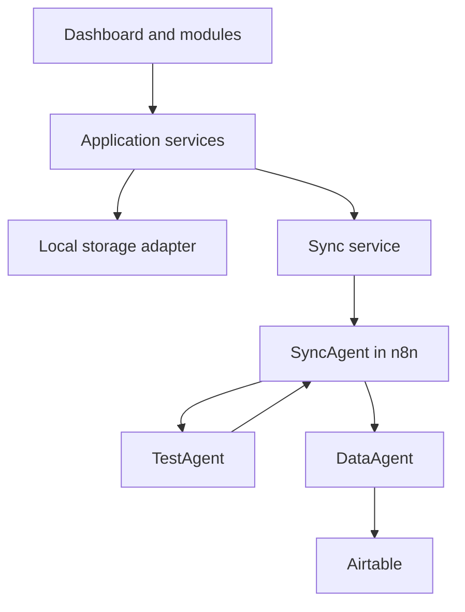

# GoldenDawn OS

## The Jan & Arisa Lichtwaldzentrale

> A personal AI Operations System for learning, projects, prompt engineering,
> automation, reflection, and measurable progress — developed step by step into
> a professional multi-agent portfolio project.

## Project status

**Current release:** `v0.2.1 — LearningHub Local MVP complete, verified, and published`

**Current milestone:** `v0.2.2 — LichtwaldLog Local MVP in progress`

The `v0.2.0` implementation is complete, verified with the automated test
suite and production build, and published as tag `v0.2.0` with its
corresponding GitHub Release. The responsive
Command Center shell is implemented on top of the Vite and Vanilla JavaScript
foundation. PromptVault supports local viewing, creation, editing, permanent
deletion, search, category filters, persistent favorites, immutable version
history, and restoration as a new version. Git actions for future releases
remain entirely manual with Jan.

LearningHub `v0.2.1` is complete, verified, and published. Its Schema 2 content
path, separate chapter and module progress,
LearningArtifact notes and summaries, LearningTest bank, append-only attempts,
deterministic engine, question editor, module test runner, result view,
controlled session cancellation, and redacted attempt history are locally
operable. A completely new browser profile is initialized once with exactly
one clearly marked, fully synthetic demo module containing three chapters,
four LearningNodes, eight LearningArtifacts, and seven questions. The visible
`Lokaler Mock-Test` uses neither AI nor external communication. Existing
browser data remains authoritative and is never supplemented or overwritten
by the initializer. Final release verification passed 552/552 automated tests
and the production build. Tag `v0.2.1` and its corresponding GitHub Release
were published on 2026-07-25, and the repository is publicly visible for
portfolio and evaluation purposes without an open-source license. LichtwaldLog
`v0.2.2` has been in progress since 2026-07-26. Its Contract Foundation and
ADR 0013 are implemented; storage, service, controller, view, CRUD, search, and
filters remain open. The milestone is neither complete nor published. It
remains fully local and includes no external communication, webhooks, agent
logic, or Airtable integration.

## Vision

GoldenDawn OS is designed as a calm, modular command center that connects
personal workflows with professional AI engineering practices. It will combine
a browser-based dashboard, a central SyncAgent, specialized agents, n8n
workflows, and structured data storage.

The project has two complementary goals:

- provide a useful private system for learning, projects, prompts, routines,
  reviews, and automation;
- demonstrate clean architecture, prompt engineering, workflow orchestration,
  data design, and multi-agent collaboration as a portfolio project.

## Target architecture



The dashboard will communicate with external systems through the SyncAgent
instead of accessing Airtable, APIs, or specialized agents directly.
Only the DataAgent communicates with Airtable in Version 1.

See [`docs/architecture.md`](docs/architecture.md) for responsibilities,
boundaries, and end-to-end data flows.

Request, response, error, and agent payload formats are defined in
[`docs/data-contracts.md`](docs/data-contracts.md).

Accepted architecture decisions and their rationale are indexed in
[`docs/decisions/README.md`](docs/decisions/README.md).

## Modules

| Module | Purpose | Delivery target | Status |
| --- | --- | --- | --- |
| Command Center | Central overview, navigation, and system status | `v0.2.0` | Shell implemented; milestone complete |
| PromptVault | Local prompt library with editing, search, category filters, favorites, immutable history, and restoration | `v0.2.0` | Local MVP implemented; milestone complete |
| LearningHub | User-configured modules, trackable chapters, text-based LearningNodes, local notes and summaries, and deterministic local tests | `v0.2.1` | Local MVP complete, verified, and published |
| LichtwaldLog | Local text journal with search and filters | `v0.2.2` | In progress; Contract Foundation and ADR 0013 implemented; remaining Local MVP open |
| Agent Hub | Agent overview, capabilities, and execution status | Later milestone | Planned |
| Automation Hub | Visibility into n8n workflows and results | Later milestone | Planned |
| Weekly Review | Structured summaries, progress, and next actions | Later, after the LichtwaldLog Local MVP | Planned; not part of `v0.2.2` |

### PromptVault local MVP

PromptVault currently uses the local storage key
`goldendawn.promptVault.v1`. If that key is completely missing, the service
initializes exactly three clearly marked synthetic example prompts. The local
MVP displays category metadata and the complete prompt text, lets users create
validated custom prompts with persistent local storage, and permanently deletes
prompts and their complete history only after an accessible inline
confirmation. Every new prompt starts with Version 1. A content-changing edit
appends an immutable `edited` snapshot while preserving prompt identity,
creation metadata, demo provenance, favorite state, and every earlier version.

Each prompt card provides an accessible version history with the newest entry
shown first without changing the stored ascending order. Historical content can
be reviewed in full and restored after an inline confirmation. Restoration
never overwrites history: it appends a new `restored` version that references
the selected source version. Restoring content that already matches the current
state is reported as unchanged and creates no additional version.

The module also provides local full-text search over the current prompt content,
category filters, and persistent favorites. Search text and filter selections
remain transient. Favorite changes are stored outside the content-version
history and do not create a new content version. A deliberately stored empty
list remains empty after a reload.

The implemented local data flow is:

```text
PromptVault view
  → PromptVault controller
  → Prompt service
  → Prompt storage
  → Storage adapter
  → localStorage
```

The UI does not access `localStorage` directly. Create, edit, favorite, delete,
and restore actions use the service and storage flow shown above and persist
within `goldendawn.promptVault.v1`; no second storage key is used. A restore
request passes only the prompt ID and version number to the service, never a
second content copy from the view.

These records exist only in `localStorage` for the current browser profile and
origin. They are not a cloud backup, do not synchronize across browsers or
devices, and can be lost when local browser data is cleared. Import/export,
webhooks, synchronization, Airtable, a backend, agent logic, user accounts, and
automatic cloud backup are not implemented.

## LearningHub Local MVP (released in v0.2.1)

LearningHub is a bounded local learning module, not a general-purpose LMS. Its
implemented Schema 2 foundation uses the hierarchy
`LearningHub → LearningModule → LearningChapter → LearningNode`. A new hub may
contain no modules, while every persisted module contains at least one chapter.
Chapters are implicitly trackable and may contain no LearningNodes;
LearningNodes are user-created text cards. The local UI supports creating and
renaming modules and chapters, creating and editing LearningNodes, marking
chapters complete or open, viewing derived module progress, and maintaining one
current note and one current summary per LearningNode. Content, progress, and
LearningArtifacts use these separate implemented paths:

```text
LearningHubView
  → LearningHubController
      ├→ LearningHubService
      │   → LearningHubStorage
      │   → StorageAdapter
      │   → localStorage
      │
      ├→ LearningProgressService
      │   ├→ LearningHubService
      │   └→ LearningProgressStorage
      │       → StorageAdapter
      │       → localStorage
      │
      └→ LearningArtifactService
          ├→ LearningHubService
          └→ LearningArtifactStorage
              → StorageAdapter
              → localStorage
```

The view and controller never access `localStorage` directly. Selection, open
accordions, and form state remain transient; persistent content stays at
`schemaVersion: 2` under `goldendawn.learningHub.content.v1`, while the
append-only progress log stays at `schemaVersion: 1` under
`goldendawn.learningHub.progress.v1`. Current notes and summaries use their own
`schemaVersion: 1` store under `goldendawn.learningHub.artifacts.v1`. The
controller gives the view validated UI projections instead of raw progress logs
or Artifact IDs, reference chains, and timestamps. If progress or artifacts
cannot be loaded, content management remains available, the affected controls
are marked unavailable, and a non-destructive retry is offered. Creating a
module or chapter refreshes progress without rolling back an already
successful content change if that refresh fails.

Before the regular LearningHub services are used, a small synchronous
coordinator handles the one-time first start. It seeds
`[Demo] KI-Grundlagen – vom Datensatz zum Transformer` only when the content,
Artifact, test-bank, and demo-initialization keys are all absent. The canonical
repository data is deeply frozen and synthetic; its validated local working
copy is persisted through the existing private domain storages. If any domain
key already exists, even as an empty or unreadable value, no demo data is added
or overwritten and a stable marker records that decision. The marker also
prevents edits or a later deletion from being reset on restart. Only clearing
the complete local application storage, including the marker, creates another
first start. The canonical seed contains exactly one module, three chapters,
four LearningNodes, eight LearningArtifacts, and seven questions.

Each domain storage and service still returns its write-free empty state when
its own key is missing. Only the preceding coordinator may initialize the
three domain stores together, and only when all relevant domain keys and the
initialization marker are absent.

All seed contracts and cross-store references are validated before the first
write. The three domain values are written sequentially and the marker last;
on failure, rollback may remove only values still byte-identical to the
prepared seed. Progress and attempt history are not prefilled. This startup
path is fully local and makes no network, AI, agent, or telemetry calls.

User text is rendered through safe DOM text APIs and form-value properties.
Native labeled chapter checkboxes, visible numeric progress, accessible
progress bars, status and alert regions, focus restoration, and isolated busy
states keep the workflows operable without relying on color alone. Note and
summary editors preserve the last valid UI projection on errors. Identical
saves are visible write-free no-ops; clearing uses an accessible inline
confirmation instead of a blocking browser dialog, and an already empty target
remains a write-free no-op. Completed modules remain visible and usable.

Content, progress, notes, summaries, test questions, and completed attempts
remain in the current browser profile without cloud backup or cross-device
synchronization. Local storage is unencrypted and can in principle be read by
other scripts on the same origin; browser quota and real-time or multi-tab
consistency remain limitations. In-progress sessions exist only in the
service instance and are lost on reload. Private learning data and
the canonical independently invented synthetic repository source stay
separate; the local working copy remains visibly marked as `[Demo]`.

The implemented local LearningTest path is:

```text
LearningHubView
  → LearningHubController
      → LearningTestService
          ├→ LearningHubService                reference validation
          ├→ LearningTestBankStorage
          │    → StorageAdapter
          │    → localStorage
          ├→ LearningTestAttemptStorage
          │    → StorageAdapter
          │    → localStorage
          └→ LearningTestEngine                pure determinism
```

The existing controller accepts only defensively validated bank, public
session, completion, and history projections. The authoring view can show the
correct option, while an active runner receives no `correctOptionId`,
explanation, or private bank snapshot before submission. Submission retries
reuse the same frozen answer payload. A safe cancellation removes only an
in-memory session, writes no attempt, and is refused while submission or
post-write reconciliation is pending.

The engine uses the validated user-configured question bank deterministically,
projects no solutions before submission, and does not use AI. The UI is
visibly labeled `Lokaler Mock-Test`; automated tests use independently
invented synthetic content. Free-text evaluation and TestAgent processing are
deferred to `v0.5.0`, using the later path:

```text
LearningTestService
  → SyncService
  → SyncAgent
  → TestAgent
```

## LichtwaldLog Local MVP (in progress for v0.2.2)

The Contract Foundation and ADR 0013 are implemented. The foundation consists
of the Schema 1 contract, the pure `validateLichtwaldLog` validator, and
synthetic contract tests. Storage, service, controller, view, CRUD, local
search, and filters are not yet implemented.

The target Local MVP remains limited to entries with a title, calendar date,
plain text, and tags, plus local search and filters. Private entries and
synthetic demo entries will remain separate. Images will not be stored as
Base64 in `localStorage`. `v0.2.2` remains fully local and includes no
external communication, webhooks, synchronization, agent logic, or Airtable
integration. Weekly Review is later work and is not part of this milestone.
`v0.2.2` is neither complete nor published.

## Development principles

- Build in small, stable, and verifiable steps.
- Follow the sequence: **mock → webhook → Airtable → agent logic**.
- Keep every `v0.2.x` milestone local; external communication starts with
  `v0.3.0`.
- Keep UI components independent from concrete storage technologies.
- Encapsulate local persistence behind storage adapters.
- Route external communication through services and the SyncAgent.
- Never store API keys, access tokens, or other secrets in the frontend.
- Use UTF-8 and native German characters from the beginning.
- Add dependencies only when they solve a documented requirement.
- Keep private data and public portfolio demo data strictly separated.

## Technology

### Current foundation

- Vite
- Vanilla JavaScript
- HTML5
- CSS3
- Git and GitHub

### Planned integrations

- n8n for workflow orchestration and the SyncAgent
- Airtable as the first structured external data layer
- specialized AI agents for bounded domain tasks
- a later database or backend when the requirements justify it
- PWA support and server deployment after the core architecture is stable

## Roadmap

Detailed milestones and acceptance criteria are maintained in
[`docs/roadmap.md`](docs/roadmap.md).

GoldenDawn OS is intended to continue beyond the first complete product and
portfolio phase at `v1.0.0`. Possible long-term themes remain explicitly
non-binding; see the roadmap for details.

| Version | Milestone | Outcome |
| --- | --- | --- |
| v0.1.0 | Project foundation | Documentation, architecture, and clean Vite structure |
| v0.2.0 | Command Center and PromptVault Local MVP | Complete, verified, and published |
| v0.2.1 | LearningHub Local MVP | Complete, verified, and published |
| v0.2.2 | LichtwaldLog Local MVP | In progress; Contract Foundation and ADR 0013 implemented; remaining Local MVP open |
| v0.3.0 | SyncService, webhook, and SyncAgent | Planned first external communication boundary with validated n8n requests |
| v0.4.0 | DataAgent and Airtable | Planned controlled Airtable read and write flow through the DataAgent |
| v0.5.0 | TestAgent and learning tests | Planned routed tests and free-text evaluation through the SyncAgent |
| v0.6.0 | Integration | Planned integration and verification of the previously introduced local and external components |
| v1.0.0 | Portfolio release | Planned secure demo separation, portfolio documentation, and deployment |

The `v0.2.x` line intentionally remains local, and `v0.3.0` begins external
communication. Additional patch or minor versions may be inserted when needed
without reordering these milestones. The architecture sequence remains
**mock → webhook → Airtable → agent logic**.

## Getting started

### Requirements

- Node.js `20.19+` or `22.12+`
- npm
- Git

### Local development

```bash
git clone https://github.com/Varudan/goldendawn-os.git
cd goldendawn-os
npm install
npm run dev
```

Create a production build with:

```bash
npm run build
```

Safe, local PowerShell helpers for the manual commit and merged-branch cleanup
process are documented in [the Git workflow guide](docs/git-workflows.md).

## Verification

The published `v0.2.1` release was finally verified with:

```bash
npm test -- --test-concurrency=1
npm run build
```

Final verification passed 552/552 automated tests and the production build.
The annotated `v0.2.1` tag and its corresponding GitHub Release were published
on 2026-07-25. This repository is publicly visible as a portfolio repository;
that visibility does not grant an open-source license or imply a public
deployment of the application.

## Security and privacy

The repository contains only source code, documentation, and clearly marked
synthetic demo data. Private learning, prompt, reflection, health, or other
personal user content does not belong in the repository. Current user content
remains in the active browser profile and is not synchronized.

`localStorage` is unencrypted browser storage, not a secret store, cloud
backup, or cross-device synchronization mechanism. A public repository must
not contain productive webhooks, credentials, private Airtable identifiers,
or personal data. Public Vite configuration may contain only non-sensitive
values because every `VITE_*` value is exposed to the browser build.

Detailed security rules are maintained in
[`docs/security.md`](docs/security.md).

## Project history

- **2026-07-05:** GoldenDawn began as the shared Jan & Arisa project vision.
- **2026-07-11:** GoldenDawn OS started as a clean, modular repository based on
  lessons learned from the original KI-Manager-Dashboard prototype.
- **2026-07-15:** The `v0.2.0` Local Dashboard MVP was completed and verified
  with its automated tests and production build, and published as tag `v0.2.0`
  with the corresponding GitHub Release.
- **2026-07-25:** The `v0.2.1` LearningHub Local MVP was published with its corresponding GitHub Release, and GoldenDawn OS became publicly visible as a portfolio repository.

## Author and collaboration

**Concept and development:** Jan Slominski

GoldenDawn OS is built as an AI-assisted engineering project in collaboration
with Arisa and OpenAI Codex. Decisions, prompts, experiments, and lessons
learned are documented as part of the portfolio.

## License

Copyright (c) 2026 Jan Slominski. All rights reserved.

This repository is publicly available for portfolio and evaluation purposes.
No open-source license is granted. Except for the rights provided through
GitHub's Terms of Service, permission is required to use, modify, distribute,
or further develop the source code.

For licensing or collaboration inquiries, please contact the author.
