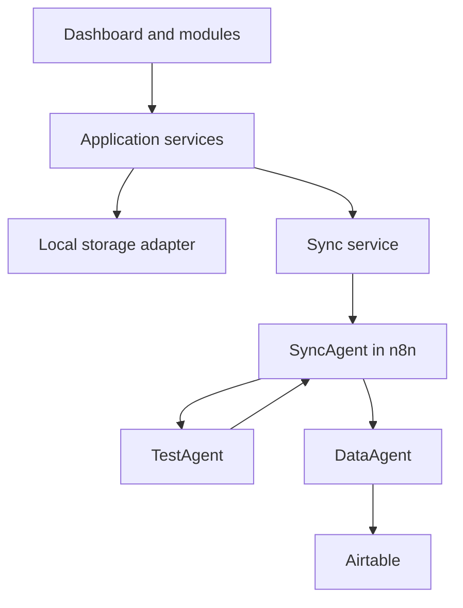

# GoldenDawn OS

## The Jan & Arisa Lichtwaldzentrale

> A personal AI Operations System for learning, projects, prompt engineering,
> automation, reflection, and measurable progress — developed step by step into
> a professional multi-agent portfolio project.

## Project status

**Current release:** `v0.2.2 — LichtwaldLog Local MVP complete, verified, and published`

**Next planned milestone:** `v0.3.0 — SyncAgent and Webhook Foundation; not started`

The `v0.2.0` implementation is complete, verified with the automated test
suite and production build, and published as tag `v0.2.0` with its
corresponding GitHub Release. The responsive
Command Center shell is implemented on top of the Vite and Vanilla JavaScript
foundation. PromptVault supports local viewing, creation, editing, permanent
deletion, search, category filters, persistent favorites, immutable version
history, and restoration as a new version. Git actions for future releases
remain entirely manual with Jan.

LearningHub `v0.2.1` is complete, verified, and published. Its Schema 2 content
path, separate chapter and module progress,
LearningArtifact notes and summaries, LearningTest bank, append-only attempts,
deterministic engine, question editor, module test runner, result view,
controlled session cancellation, and redacted attempt history are locally
operable. A completely new browser profile is initialized once with exactly
one clearly marked, fully synthetic demo module containing three chapters,
four LearningNodes, eight LearningArtifacts, and seven questions. The visible
`Lokaler Mock-Test` uses neither AI nor external communication. Existing
browser data remains authoritative and is never supplemented or overwritten
by the initializer. Final release verification passed 552/552 automated tests
and the production build. Tag `v0.2.1` and its corresponding GitHub Release
were published on 2026-07-25, and the repository is publicly visible for
portfolio and evaluation purposes without an open-source license. LichtwaldLog
`v0.2.2` was started on 2026-07-26 and is now complete, verified, and
published. Its Contract Foundation,
private Storage Foundation, Service Foundation, Controller Foundation, and
isolated View and CSS Foundation, together with ADRs 0013, 0014, and 0015, are
implemented as two explicitly separated stacks in `src/main.js`. Only the
private stack uses the shared `StorageAdapter`; the synthetic demo uses its
own in-memory stack without that adapter.
LichtwaldLog is reachable from the application navigation with the visible
status `Lokales MVP`. Viewing, creating, fully editing, permanently deleting, and
explicitly setting or clearing the featured entry are operable through
GoldenDawn OS. The entry authoritatively referenced by `featuredEntryId` is
presented in both overview and detail as `Besonderer Lichtwaldmoment`. This is
a View/CSS-only projection of the existing focus reference and adds no second
state, API, persistence path, or dashboard-wide redesign. Local text search
across calendar date, title, text, and tags,
together with exact calendar-date and tag filters, is also implemented. These
criteria are combined with logical AND exclusively over the transient
controller projection and are never persisted. Real-browser verification of
the complete navigation, CRUD, focus, dirty-guard, delete, reload, search, and
filter flow passed in fresh isolated temporary Chrome profiles at desktop
`1440 × 1000` and exactly `390 × 844`. A second, strictly separated
runtime now exposes five fully invented entries as a functional synthetic
in-memory demo. Demo mutations survive navigation within the current document
and reset to the canonical seed on reload or a new composition without reading
or changing private browser data. The permanent synthetic origin and reload
behavior remain visible, including in the featured-moment presentation. Final
verification passed 374/374 LichtwaldLog tests and 933/933 tests in the
complete suite with 0 skips and 0 todos; the production build transformed
exactly 46 modules. `v0.2.2` is complete, verified, and published. Its
annotated tag and corresponding GitHub Release were published on 2026-08-02,
making `v0.2.2` the latest published release. `private: true` is package metadata and
does not make this publicly visible repository private. The next milestone,
`v0.3.0 – SyncAgent and Webhook Foundation`, is planned and has not started.
`v0.2.2` remains fully local and includes no external communication, webhooks,
agent logic, or Airtable integration.

## Vision

GoldenDawn OS is designed as a calm, modular command center that connects
personal workflows with professional AI engineering practices. It will combine
a browser-based dashboard, a central SyncAgent, specialized agents, n8n
workflows, and structured data storage.

The project has two complementary goals:

- provide a useful private system for learning, projects, prompts, routines,
  reviews, and automation;
- demonstrate clean architecture, prompt engineering, workflow orchestration,
  data design, and multi-agent collaboration as a portfolio project.

## Target architecture



The dashboard will communicate with external systems through the SyncAgent
instead of accessing Airtable, APIs, or specialized agents directly.
Only the DataAgent communicates with Airtable in Version 1.

See [`docs/architecture.md`](docs/architecture.md) for responsibilities,
boundaries, and end-to-end data flows.

Request, response, error, and agent payload formats are defined in
[`docs/data-contracts.md`](docs/data-contracts.md).

Accepted architecture decisions and their rationale are indexed in
[`docs/decisions/README.md`](docs/decisions/README.md).

## Modules

| Module | Purpose | Delivery target | Status |
| --- | --- | --- | --- |
| Command Center | Central overview, navigation, and system status | `v0.2.0` | Shell implemented; milestone complete |
| PromptVault | Local prompt library with editing, search, category filters, favorites, immutable history, and restoration | `v0.2.0` | Local MVP implemented; milestone complete |
| LearningHub | User-configured modules, trackable chapters, text-based LearningNodes, local notes and summaries, and deterministic local tests | `v0.2.1` | Local MVP complete, verified, and published |
| LichtwaldLog | Local text journal with search and exact calendar-date and tag filters plus a strictly separated synthetic in-memory demo | `v0.2.2` | Local MVP complete, verified, and published |
| Agent Hub | Agent overview, capabilities, and execution status | Later milestone | Planned |
| Automation Hub | Visibility into n8n workflows and results | Later milestone | Planned |
| Weekly Review | Structured summaries, progress, and next actions | Later, after the LichtwaldLog Local MVP | Planned; not part of `v0.2.2` |

### PromptVault local MVP

PromptVault currently uses the local storage key
`goldendawn.promptVault.v1`. If that key is completely missing, the service
initializes exactly three clearly marked synthetic example prompts. The local
MVP displays category metadata and the complete prompt text, lets users create
validated custom prompts with persistent local storage, and permanently deletes
prompts and their complete history only after an accessible inline
confirmation. Every new prompt starts with Version 1. A content-changing edit
appends an immutable `edited` snapshot while preserving prompt identity,
creation metadata, demo provenance, favorite state, and every earlier version.

Each prompt card provides an accessible version history with the newest entry
shown first without changing the stored ascending order. Historical content can
be reviewed in full and restored after an inline confirmation. Restoration
never overwrites history: it appends a new `restored` version that references
the selected source version. Restoring content that already matches the current
state is reported as unchanged and creates no additional version.

The module also provides local full-text search over the current prompt content,
category filters, and persistent favorites. Search text and filter selections
remain transient. Favorite changes are stored outside the content-version
history and do not create a new content version. A deliberately stored empty
list remains empty after a reload.

The implemented local data flow is:

```text
PromptVault view
  → PromptVault controller
  → Prompt service
  → Prompt storage
  → Storage adapter
  → localStorage
```

The UI does not access `localStorage` directly. Create, edit, favorite, delete,
and restore actions use the service and storage flow shown above and persist
within `goldendawn.promptVault.v1`; no second storage key is used. A restore
request passes only the prompt ID and version number to the service, never a
second content copy from the view.

These records exist only in `localStorage` for the current browser profile and
origin. They are not a cloud backup, do not synchronize across browsers or
devices, and can be lost when local browser data is cleared. Import/export,
webhooks, synchronization, Airtable, a backend, agent logic, user accounts, and
automatic cloud backup are not implemented.

## LearningHub Local MVP (released in v0.2.1)

LearningHub is a bounded local learning module, not a general-purpose LMS. Its
implemented Schema 2 foundation uses the hierarchy
`LearningHub → LearningModule → LearningChapter → LearningNode`. A new hub may
contain no modules, while every persisted module contains at least one chapter.
Chapters are implicitly trackable and may contain no LearningNodes;
LearningNodes are user-created text cards. The local UI supports creating and
renaming modules and chapters, creating and editing LearningNodes, marking
chapters complete or open, viewing derived module progress, and maintaining one
current note and one current summary per LearningNode. Content, progress, and
LearningArtifacts use these separate implemented paths:

```text
LearningHubView
  → LearningHubController
      ├→ LearningHubService
      │   → LearningHubStorage
      │   → StorageAdapter
      │   → localStorage
      │
      ├→ LearningProgressService
      │   ├→ LearningHubService
      │   └→ LearningProgressStorage
      │       → StorageAdapter
      │       → localStorage
      │
      └→ LearningArtifactService
          ├→ LearningHubService
          └→ LearningArtifactStorage
              → StorageAdapter
              → localStorage
```

The view and controller never access `localStorage` directly. Selection, open
accordions, and form state remain transient; persistent content stays at
`schemaVersion: 2` under `goldendawn.learningHub.content.v1`, while the
append-only progress log stays at `schemaVersion: 1` under
`goldendawn.learningHub.progress.v1`. Current notes and summaries use their own
`schemaVersion: 1` store under `goldendawn.learningHub.artifacts.v1`. The
controller gives the view validated UI projections instead of raw progress logs
or Artifact IDs, reference chains, and timestamps. If progress or artifacts
cannot be loaded, content management remains available, the affected controls
are marked unavailable, and a non-destructive retry is offered. Creating a
module or chapter refreshes progress without rolling back an already
successful content change if that refresh fails.

Before the regular LearningHub services are used, a small synchronous
coordinator handles the one-time first start. It seeds
`[Demo] KI-Grundlagen – vom Datensatz zum Transformer` only when the content,
Artifact, test-bank, and demo-initialization keys are all absent. The canonical
repository data is deeply frozen and synthetic; its validated local working
copy is persisted through the existing private domain storages. If any domain
key already exists, even as an empty or unreadable value, no demo data is added
or overwritten and a stable marker records that decision. The marker also
prevents edits or a later deletion from being reset on restart. Only clearing
the complete local application storage, including the marker, creates another
first start. The canonical seed contains exactly one module, three chapters,
four LearningNodes, eight LearningArtifacts, and seven questions.

Each domain storage and service still returns its write-free empty state when
its own key is missing. Only the preceding coordinator may initialize the
three domain stores together, and only when all relevant domain keys and the
initialization marker are absent.

All seed contracts and cross-store references are validated before the first
write. The three domain values are written sequentially and the marker last;
on failure, rollback may remove only values still byte-identical to the
prepared seed. Progress and attempt history are not prefilled. This startup
path is fully local and makes no network, AI, agent, or telemetry calls.

User text is rendered through safe DOM text APIs and form-value properties.
Native labeled chapter checkboxes, visible numeric progress, accessible
progress bars, status and alert regions, focus restoration, and isolated busy
states keep the workflows operable without relying on color alone. Note and
summary editors preserve the last valid UI projection on errors. Identical
saves are visible write-free no-ops; clearing uses an accessible inline
confirmation instead of a blocking browser dialog, and an already empty target
remains a write-free no-op. Completed modules remain visible and usable.

Content, progress, notes, summaries, test questions, and completed attempts
remain in the current browser profile without cloud backup or cross-device
synchronization. Local storage is unencrypted and can in principle be read by
other scripts on the same origin; browser quota and real-time or multi-tab
consistency remain limitations. In-progress sessions exist only in the
service instance and are lost on reload. Private learning data and
the canonical independently invented synthetic repository source stay
separate; the local working copy remains visibly marked as `[Demo]`.

The implemented local LearningTest path is:

```text
LearningHubView
  → LearningHubController
      → LearningTestService
          ├→ LearningHubService                reference validation
          ├→ LearningTestBankStorage
          │    → StorageAdapter
          │    → localStorage
          ├→ LearningTestAttemptStorage
          │    → StorageAdapter
          │    → localStorage
          └→ LearningTestEngine                pure determinism
```

The existing controller accepts only defensively validated bank, public
session, completion, and history projections. The authoring view can show the
correct option, while an active runner receives no `correctOptionId`,
explanation, or private bank snapshot before submission. Submission retries
reuse the same frozen answer payload. A safe cancellation removes only an
in-memory session, writes no attempt, and is refused while submission or
post-write reconciliation is pending.

The engine uses the validated user-configured question bank deterministically,
projects no solutions before submission, and does not use AI. The UI is
visibly labeled `Lokaler Mock-Test`; automated tests use independently
invented synthetic content. Free-text evaluation and TestAgent processing are
deferred to `v0.5.0`, using the later path:

```text
LearningTestService
  → SyncService
  → SyncAgent
  → TestAgent
```

## LichtwaldLog Local MVP (released in v0.2.2)

The Contract Foundation, private Storage Foundation, Service Foundation,
Controller Foundation, and isolated View and CSS Foundation are implemented.
ADRs 0013, 0014, and 0015 document the contract, private storage, and strictly
separated demo-runtime decisions. The
contract consists of the Schema 1 model, the pure `validateLichtwaldLog`
validator, and synthetic contract tests. The implemented application path is
composed in `src/main.js` through the shared `StorageAdapter`:

```text
LichtwaldLogView
  → LichtwaldLogController
  → LichtwaldLogService
  → LichtwaldLogStorage
  → StorageAdapter
  → localStorage
```

The demo is composed as a separate stack with no private service, private
storage, shared adapter, or browser-storage port:

```text
Synthetic LichtwaldLogView
  → LichtwaldLogController(expectedDataOrigin: synthetic)
  → LichtwaldLogDemoService
  → LichtwaldLogDemoStorage
  → in-memory full snapshot
  → canonical demo factory
```

The private controller is explicitly composed with
`expectedDataOrigin: private`. Missing or `undefined` keeps that private
default for backwards compatibility; only exact `private` and `synthetic`
configuration is accepted. The controller validates every snapshot against the
fixed expected origin and projects only the transient view value
`runtimeMode: private` or `runtimeMode: syntheticDemo`.

The canonical factory returns a fresh detached Schema 1
`dataOrigin: synthetic` snapshot containing exactly five deterministic,
fully invented `[Demo]` entries and a valid featured-entry reference. The
demo storage keeps one defensively validated full snapshot per application
composition, enforces the same 500,000-UTF-16-code-unit boundary, and exposes
only load and save. The independent demo service exposes the same five domain
operations and business semantics as the private service, but never imports or
calls the private service or storage. It uses a separate demo-prefixed ID
generator lifecycle.

`createLichtwaldLogStorage` exposes only `loadLichtwaldLog` and
`saveLichtwaldLog`. It stores the complete validated private Schema 1 root
directly under `goldendawn.lichtwaldLog.content.v1`, without a second envelope
or separate entry and focus keys. The actual serialized JSON is limited to
500,000 UTF-16 code units according to JavaScript `String.length`; exactly the
limit is accepted. A missing key returns a fresh private empty state without a
write. Full validation, defensive cloning, and a read preflight protect
synthetic, damaged, incompatible, or oversized existing values from automatic
replacement. The preflight is not a transaction or a multi-tab lock, and the
application limit is not a browser-quota guarantee.

`createLichtwaldLogService({ lichtwaldLogStorage, generateLichtwaldLogEntryId })`
accepts the ID generator as an optional dependency and returns a frozen API
containing exactly `loadLog`, `createEntry`, `updateEntry`, `deleteEntry`,
and `setFeaturedEntry`. Passing `null` to `setFeaturedEntry` clears the
focus; there is no additional clear or toggle method.

`createLichtwaldLogController({ lichtwaldLogService, lichtwaldLogView,
scheduleTask, expectedDataOrigin })` returns a frozen API containing exactly
`open` and `close`.
The injected port remains limited to `render(viewModel, actions)` and
`unmount()`. `createLichtwaldLogView(rootElement)` implements it and returns a
frozen API with exactly the own data properties `render` and `unmount`. Every
render receives the same frozen action API with exactly:

```text
onRetryLoad
onSelectEntry
onBackToOverview
onOpenCreateEntryForm
onOpenUpdateEntryForm
onUpdateFormField
onSubmitForm
onCancelForm
onRequestDeleteEntry
onCancelDeleteEntry
onConfirmDeleteEntry
onSetFeaturedEntry
onChangeSearchQuery
onChangeCalendarDateFilter
onChangeTagFilter
onResetFilters
```

`lichtwaldLogSearch.js` is a pure module with exactly the public constants
`ALL_LICHTWALD_LOG_TAGS` and `LICHTWALD_LOG_SEARCH_QUERY_MAX_LENGTH` and the
functions `getLichtwaldLogFilterTags(entries)` and
`filterLichtwaldLogEntries(entries, filters)`. Search trims only outer query
whitespace for comparison, normalizes canonically with NFC, folds case with
`toLowerCase()`, and then performs literal contiguous substring matching only
against `calendarDate`, `title`, `text`, and each tag. Internal spaces, tabs,
and line breaks remain significant. The exact calendar-date filter uses the
existing arithmetic contract validation without `Date` or timezone conversion.
The exact tag filter uses the same NFC and case normalization. Tag options come
from every authoritative entry, preserve first spelling and source order, and
are deduplicated by normalized identity. Query, date, and tag combine with
logical AND without sorting, ranking, or mutating entries.

Each render creates a fresh DOM tree using safe DOM and form-control APIs.
Titles, text, tags, and form values remain unparsed plain text. Entry IDs stay
in closures and render-local maps and never become visible text, DOM or ARIA
IDs, selectors, classes, `data-*` attributes, or view-owned messages. Entry and
tag order and spelling remain unchanged.

The entry matching the authoritative `featuredEntryId` is presented in
overview and detail as `Besonderer Lichtwaldmoment`. The treatment is derived
only in the view from the existing projection and namespaced CSS; it introduces
no second state, controller or service API, persistence path, or dashboard-wide
redesign.

Create and update forms use separate tag controls rather than comma parsing.
Tag edits produce fresh dense arrays without trimming, sorting,
deduplication, or case normalization. Submit payloads remain flat and limited
to the controller contract.

The view renders accessible loading, authoritative-empty, filtered-empty, busy,
success, notice, validation, result-status, and error states and resolves every
controller focus target after replacing the DOM. Its overview filter panel uses
safe form-control APIs and fixed public IDs. Search focus and caret, calendar
date focus, and tag focus are restored without moving focus to a result card.
Focus actions express an entry ID or `null`, and content, deletion, and focus
are never projected optimistically. `unmount()` removes private DOM content and
transient filter, focus, and caret metadata. The namespaced CSS includes
responsive and reduced-motion rules and is imported into the application build
graph through `src/main.js`.

For `runtimeMode: syntheticDemo`, the view is permanently identified in
text as `Synthetische Demo`, `LichtwaldLog Demo`, and
`Demo · nur für diese Sitzung`. It states that every example is fully
invented and that mutations last only until the page reloads. Demo loading,
empty, form, busy, delete, focus, and privacy copy does not claim
`localStorage`, a current browser profile, cloud backup, private journals,
or permanent deletion. The featured presentation does not replace or obscure
these permanent demo-origin and reload/session cues.

The controller coordinates transient loading, empty, selection, form,
confirmation, busy, success, error, search, and filter states. `entries` remains
the complete validated snapshot projection; `visibleEntryIds`, available tags,
the three criteria, active-state flag, and filtered-empty flag are freshly
derived and deeply frozen for the view. Details and forms still resolve from all
entries. These fields are not part of Schema 1 and are never persisted. Every
service snapshot is fully revalidated as Schema 1 data with the exact origin
fixed when the controller is constructed; the raw schema root and service
results are not passed to the view. Storage remains the sole
mutable source of truth, and the service remains the authoritative domain
boundary.

Each accepted load or mutation intention invokes exactly one matching service
operation. Search and filter actions invoke no service, storage, adapter,
generator, or scheduler operation. A mutation triggers no additional controller
load and no optimistic content, delete, or focus change. Selection, form editing
and cancellation, and opening or cancelling delete confirmation remain service-
and write-free. The service alone decides write-free update and focus no-ops.
Overview selection accepts only currently visible entry IDs; detail and form
state may continue to show an authoritative entry that no longer matches until
the user returns to the overview. The filter state survives detail, form, and
mutation flows within one open lifecycle, but resets on open, load retry, close,
and a truly empty snapshot.

Every view model is a fresh defensive projection without the raw Schema 1
root. Entry and tag order remain unchanged. Controller feedback uses only
static allowlisted messages and never copies private values or foreign error
messages. Valid entry text remains opaque, unparsed, untrusted plain text;
the isolated view renders it only through safe DOM and form-control APIs.

Storage remains the sole mutable source of truth. Every valid operation reloads
the current private snapshot, and the service keeps no long-lived cache.
Invalid forms and target IDs are rejected before storage or ID-generator
access. Calendar date, title, text, and tags are trimmed only at their outer
edges while internal whitespace and line breaks are preserved. Calendar dates
are checked without `Date` parsing or timezone conversion. Target IDs are not
trimmed automatically and resolve exactly and case-sensitively.

Creation appends without date sorting. A full update preserves the entry ID,
array position, and any valid focus reference. Deletion preserves the order of
the remaining entries and clears a deleted featured entry atomically in the
same candidate. The default ID is
`lichtwald-entry-${crypto.randomUUID()}`; invalid, colliding, or throwing
generator results share a limit of five attempts. Every real mutation validates
the complete private candidate and calls `saveLichtwaldLog` at most once at
the service boundary. Identical normalized updates, an already selected focus,
and clearing an already empty focus are successful write-free no-ops.

Snapshots, entries, save arguments, and later results are defensively detached.
After a failed save, only the previous trusted snapshot remains authoritative.
Service errors use allowlisted status-code pairs and static redacted messages;
private values and foreign dependency messages are never copied into
`error`, logs, or console output. Serialization, the 500,000-code-unit limit,
and the read preflight remain inside storage and the shared adapter. Browser
quota, unencrypted same-origin access, TOCTOU behavior, and multi-tab races
remain unchanged limitations.

`src/main.js` composes the module through the shared `StorageAdapter` and makes
it reachable through application navigation with the visible status
`Lokales MVP`. The local UI supports viewing, creating, fully editing,
permanently deleting, and explicitly setting or clearing the featured entry
through GoldenDawn OS. Real-browser verification passed in a fresh isolated
temporary Chrome profile at desktop `1440 × 1000` and exactly `390 × 844`.
The complete local navigation, CRUD, explicit-focus, dirty-guard, delete,
reload, literal-search, exact-filter, combined-filter, empty-result, and reset
flow succeeded. Keyboard and caret focus, live regions, `44px` minimum control
heights, the visible `3px` focus ring, and the absence of horizontal page
overflow were verified. The run produced 0 console warnings or errors, 0
runtime exceptions, and 0 external requests. Search and filter actions left the
private snapshot byte-identical and caused no storage write; private service,
private storage, and shared adapter APIs remain unchanged. `src/main.js`
now composes an additional independent demo storage, service, view, and
synthetic-origin controller immediately after the private navigation item.
Dirty guards are enforced in both directions, only one view is mounted, demo
mutations persist only for the current document, and reload restores the
canonical seed while private data remains authoritative and untouched. The
planned implementation scope is complete, verified, and published in
`v0.2.2`.
The target Local MVP remains limited to entries with a title,
calendar date, plain text, and tags, plus local search and filters. Private
entries and synthetic demo entries remain separate.
Images are not stored as Base64 in `localStorage`. The local store is neither
a cloud backup nor cross-device synchronization. Its existing 500,000
UTF-16-code-unit limit, browser quota, read preflight, TOCTOU, and multi-tab
limitations remain unchanged. `v0.2.2` includes no external communication, webhooks,
synchronization, agent logic, or Airtable integration. Weekly Review is later
work and is not part of this milestone. The package remains at version
`v0.2.2`. The annotated `v0.2.2` tag and corresponding GitHub Release were
published on 2026-08-02, and `v0.2.2` is the latest published release.
`v0.3.0` is planned and has not started.

## Development principles

- Build in small, stable, and verifiable steps.
- Follow the sequence: **mock → webhook → Airtable → agent logic**.
- Keep every `v0.2.x` milestone local; external communication starts with
  `v0.3.0`.
- Keep UI components independent from concrete storage technologies.
- Encapsulate local persistence behind storage adapters.
- Route external communication through services and the SyncAgent.
- Never store API keys, access tokens, or other secrets in the frontend.
- Use UTF-8 and native German characters from the beginning.
- Add dependencies only when they solve a documented requirement.
- Keep private data and public portfolio demo data strictly separated.

## Technology

### Current foundation

- Vite
- Vanilla JavaScript
- HTML5
- CSS3
- Git and GitHub

### Planned integrations

- n8n for workflow orchestration and the SyncAgent
- Airtable as the first structured external data layer
- specialized AI agents for bounded domain tasks
- a later database or backend when the requirements justify it
- PWA support and server deployment after the core architecture is stable

## Roadmap

Detailed milestones and acceptance criteria are maintained in
[`docs/roadmap.md`](docs/roadmap.md).

GoldenDawn OS is intended to continue beyond the first complete product and
portfolio phase at `v1.0.0`. Possible long-term themes remain explicitly
non-binding; see the roadmap for details.

| Version | Milestone | Outcome |
| --- | --- | --- |
| v0.1.0 | Project foundation | Documentation, architecture, and clean Vite structure |
| v0.2.0 | Command Center and PromptVault Local MVP | Complete, verified, and published |
| v0.2.1 | LearningHub Local MVP | Complete, verified, and published |
| v0.2.2 | LichtwaldLog Local MVP | Complete, verified, and published |
| v0.3.0 | SyncService, webhook, and SyncAgent | Planned first external communication boundary with validated n8n requests; not started |
| v0.4.0 | DataAgent and Airtable | Planned controlled Airtable read and write flow through the DataAgent |
| v0.5.0 | TestAgent and learning tests | Planned routed tests and free-text evaluation through the SyncAgent |
| v0.6.0 | Integration | Planned integration and verification of the previously introduced local and external components |
| v1.0.0 | Portfolio release | Planned secure demo separation, portfolio documentation, and deployment |

The `v0.2.x` line intentionally remains local, and `v0.3.0` begins external
communication. Additional patch or minor versions may be inserted when needed
without reordering these milestones. The architecture sequence remains
**mock → webhook → Airtable → agent logic**.

## Getting started

### Requirements

- Node.js `20.19+` or `22.12+`
- npm
- Git

### Local development

```bash
git clone https://github.com/Varudan/goldendawn-os.git
cd goldendawn-os
npm install
npm run dev
```

Create a production build with:

```bash
npm run build
```

Safe, local PowerShell helpers for the manual commit and merged-branch cleanup
process are documented in [the Git workflow guide](docs/git-workflows.md).

## Verification

The published `v0.2.2` release was verified with:

```bash
npm test -- --test-concurrency=1
npm run build
```

Verification passed 374/374 LichtwaldLog tests and 933/933 tests in the complete
suite with 0 skips and 0 todos. The production build transformed exactly 46
modules. The annotated `v0.2.2` tag and corresponding GitHub Release were
published on 2026-08-02. `v0.2.2` is the latest published release.

The published `v0.2.1` release was finally verified with:

```bash
npm test -- --test-concurrency=1
npm run build
```

Final verification passed 552/552 automated tests and the production build.
The annotated `v0.2.1` tag and its corresponding GitHub Release were published
on 2026-07-25. This repository is publicly visible as a portfolio repository;
that visibility does not grant an open-source license or imply a public
deployment of the application.

## Security and privacy

The repository contains only source code, documentation, and clearly marked
synthetic demo data. Private learning, prompt, reflection, health, or other
personal user content does not belong in the repository. Current user content
remains in the active browser profile and is not synchronized.

`localStorage` is unencrypted browser storage, not a secret store, cloud
backup, or cross-device synchronization mechanism. A public repository must
not contain productive webhooks, credentials, private Airtable identifiers,
or personal data. Public Vite configuration may contain only non-sensitive
values because every `VITE_*` value is exposed to the browser build.

Detailed security rules are maintained in
[`docs/security.md`](docs/security.md).

## Project history

- **2026-07-05:** GoldenDawn began as the shared Jan & Arisa project vision.
- **2026-07-11:** GoldenDawn OS started as a clean, modular repository based on
  lessons learned from the original KI-Manager-Dashboard prototype.
- **2026-07-15:** The `v0.2.0` Local Dashboard MVP was completed and verified
  with its automated tests and production build, and published as tag `v0.2.0`
  with the corresponding GitHub Release.
- **2026-07-25:** The `v0.2.1` LearningHub Local MVP was published with its corresponding GitHub Release, and GoldenDawn OS became publicly visible as a portfolio repository.
- **2026-08-02:** The `v0.2.2` LichtwaldLog Local MVP was published with its annotated tag and corresponding GitHub Release.

## Author and collaboration

**Concept and development:** Jan Slominski

GoldenDawn OS is built as an AI-assisted engineering project in collaboration
with Arisa and OpenAI Codex. Decisions, prompts, experiments, and lessons
learned are documented as part of the portfolio.

## License

Copyright (c) 2026 Jan Slominski. All rights reserved.

This repository is publicly available for portfolio and evaluation purposes.
No open-source license is granted. Except for the rights provided through
GitHub's Terms of Service, permission is required to use, modify, distribute,
or further develop the source code.

For licensing or collaboration inquiries, please contact the author.
