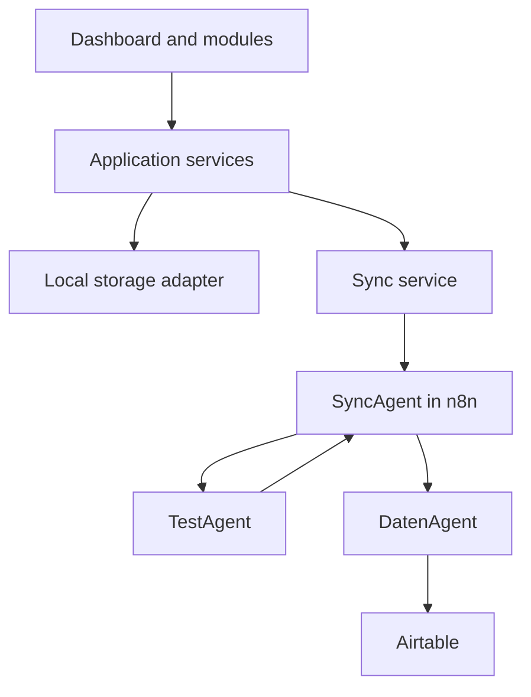

# GoldenDawn OS

## The Jan & Arisa Lichtwaldzentrale

> A personal AI Operations System for learning, projects, prompt engineering,
> automation, reflection, and measurable progress — developed step by step into
> a professional multi-agent portfolio project.

## Project status

**Current phase:** `v0.1.0 — Foundation`

The repository currently contains the initial Vite and Vanilla JavaScript
scaffold, project guidelines, and the first architecture documentation.
Architecture decisions, editor conventions, and the first local module are the
next milestones. Features marked as planned are not implemented yet.

## Vision

GoldenDawn OS is designed as a calm, modular command center that connects
personal workflows with professional AI engineering practices. It will combine
a browser-based dashboard, a central SyncAgent, specialized agents, n8n
workflows, and structured data storage.

The project has two complementary goals:

- provide a useful private system for learning, projects, prompts, routines,
  reviews, and automation;
- demonstrate clean architecture, prompt engineering, workflow orchestration,
  data design, and multi-agent collaboration as a portfolio project.

## Target architecture



The dashboard will communicate with external systems through the SyncAgent
instead of accessing Airtable, APIs, or specialized agents directly.
Only the DatenAgent communicates with Airtable in Version 1.

See [`docs/architecture.md`](docs/architecture.md) for responsibilities,
boundaries, and end-to-end data flows.

Request, response, error, and agent payload formats are defined in
[`docs/data-contracts.md`](docs/data-contracts.md).

## Planned modules

| Module | Purpose | Status |
| --- | --- | --- |
| Command Center | Central overview, navigation, and system status | Planned |
| PromptVault | Versioned prompt library with search and favorites | First MVP module |
| Learning Core | Learning progress, notes, and Arisa Tests | Planned |
| Agent Hub | Agent overview, capabilities, and execution status | Planned |
| Automation Hub | Visibility into n8n workflows and results | Planned |
| Lichtwald Log | Reflection, training, meditation, and nature sessions | Planned |
| Weekly Review | Structured summaries, progress, and next actions | Planned |

## Development principles

- Build in small, stable, and verifiable steps.
- Follow the sequence: **mock → webhook → Airtable → agent logic**.
- Keep UI components independent from concrete storage technologies.
- Encapsulate local persistence behind storage adapters.
- Route external communication through services and the SyncAgent.
- Never store API keys, access tokens, or other secrets in the frontend.
- Use UTF-8 and native German characters from the beginning.
- Add dependencies only when they solve a documented requirement.
- Keep private data and public portfolio demo data strictly separated.

## Technology

### Current foundation

- Vite
- Vanilla JavaScript
- HTML5
- CSS3
- Git and GitHub

### Planned integrations

- n8n for workflow orchestration and the SyncAgent
- Airtable as the first structured external data layer
- specialized AI agents for bounded domain tasks
- a later database or backend when the requirements justify it
- PWA support and server deployment after the core architecture is stable

## Roadmap

Detailed milestones and acceptance criteria are maintained in
[`docs/roadmap.md`](docs/roadmap.md).

| Version | Milestone | Outcome |
| --- | --- | --- |
| v0.1.0 | Project foundation | Documentation, architecture, and clean Vite structure |
| v0.2.0 | Local dashboard MVP | Command Center and PromptVault using local mock data |
| v0.3.0 | SyncAgent connection | Validated webhook communication with n8n |
| v0.4.0 | Structured persistence | DatenAgent with a controlled Airtable read and write flow |
| v0.5.0 | Learning tests | TestAgent routed through the SyncAgent |
| v1.0.0 | Portfolio release | Integrated three-agent flow, secure demo mode, documentation, and deployment |

## Getting started

### Requirements

- Node.js `20.19+` or `22.12+`
- npm
- Git

### Local development

```bash
git clone https://github.com/Varudan/goldendawn-os.git
cd goldendawn-os
npm install
npm run dev
```

Create a production build with:

```bash
npm run build
```

## Security and privacy

GoldenDawn OS is private during the foundation phase. Secrets must never be
committed to Git or exposed through frontend environment variables. The later
portfolio version will use dedicated demo data and a separate configuration
from the private system.

Detailed security rules are maintained in
[`docs/security.md`](docs/security.md).

## Project history

- **2026-07-05:** GoldenDawn began as the shared Jan & Arisa project vision.
- **2026-07-11:** GoldenDawn OS started as a clean, modular repository based on
  lessons learned from the original KI-Manager-Dashboard prototype.

## Author and collaboration

**Concept and development:** Jan Slominski

GoldenDawn OS is built as an AI-assisted engineering project in collaboration
with Arisa and OpenAI Codex. Decisions, prompts, experiments, and lessons
learned are documented as part of the portfolio.

## License

A license will be selected before the repository is released publicly.
