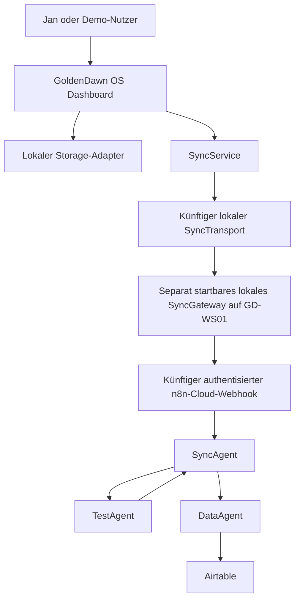
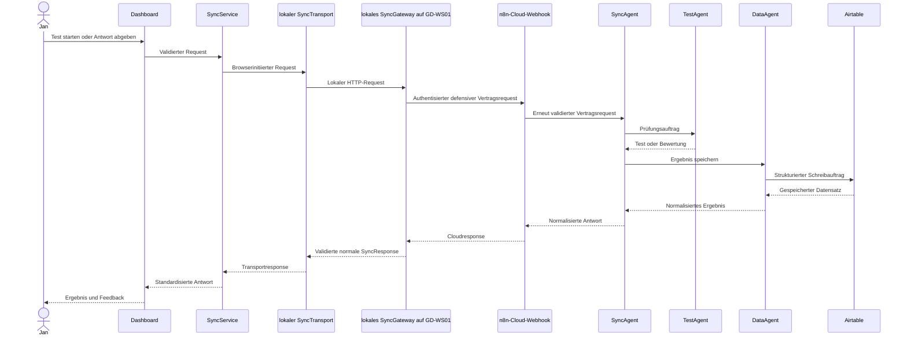

# GoldenDawn OS – Architektur

## Dokumentstatus

| Feld | Wert |
| --- | --- |
| Projektphase | `v0.3.0 – in Arbeit – Local SyncGateway Raw-Wire and HTTP Foundation` |
| Architekturumfang | Zielarchitektur für Version 1 |
| Status | Verbindliche Zielarchitektur; Paketversion `0.2.2`; neuestes veröffentlichtes Release und Tag `v0.2.2`; transportneutrale Sync-Foundations und separat startbare Local SyncGateway Raw-Wire and HTTP Foundation implementiert und verifiziert; kein Browser- oder Cloudtransport |
| Letzte Aktualisierung | 2026-08-16 |

Dieses Dokument beschreibt die verbindliche Zielarchitektur für Version 1 von
GoldenDawn OS. Es konkretisiert die Regeln aus `AGENTS.md` und dient als
Referenz für Frontend, n8n-Workflows, Airtable-Struktur und spätere
Implementierungsentscheidungen.

## Architekturziele

GoldenDawn OS soll:

- lokal früh nutzbar und testbar sein;
- externe Kommunikation über eine einzige kontrollierte Schnittstelle führen;
- Benutzeroberfläche, Speicherung, Routing, Prüfungslogik und Datenzugriff klar
  voneinander trennen;
- ohne Secrets im Frontend auskommen;
- private Daten und öffentliche Demo-Daten getrennt halten;
- durch kleine, überprüfbare Schritte wachsen;
- die Zusammenarbeit spezialisierter Agenten nachvollziehbar demonstrieren.

## Umfang von Version 1

Version 1 verwendet ausschließlich drei Agentenrollen:

| Agent | Verantwortung | Darf nicht |
| --- | --- | --- |
| `SyncAgent` | Requests validieren, klassifizieren und routen | Fachlogik oder Airtable-Zugriffe übernehmen |
| `TestAgent` | Lerntests erstellen, Antworten bewerten und Feedback liefern | Ergebnisse direkt speichern oder Airtable aufrufen |
| `DataAgent` | Strukturierte Daten lesen, schreiben und in Airtable verwalten | Prüfungslogik oder UI-Aufgaben übernehmen |

Weitere Agenten sind nicht Teil von Version 1. Sie werden erst nach einer
Auswertung dieser Architektur geplant.

## Nicht-Ziele von Version 1

Folgende Punkte werden bewusst nicht umgesetzt:

- zusätzliche Agentenrollen;
- ein allgemeines Fachbackend neben n8n; das in ADR 0019 geplante lokale
  SyncGateway bleibt eine schmale Transport- und Sicherheitsgrenze;
- direkte Airtable- oder OpenAI-Aufrufe aus dem Frontend;
- Authentifizierung und Mehrbenutzerverwaltung;
- autonome GitHub-Commits oder Releases durch Coding-Agenten;
- produktive Verarbeitung privater Daten in einer öffentlichen Demo;
- komplexes Event-Sourcing oder eine Microservice-Architektur;
- ein Frontend-Framework wie React ohne neue Architekturentscheidung.

## Systemkontext



Der Pfeil vom `TestAgent` zurück zum `SyncAgent` zeigt, dass Testergebnisse
zunächst an die zentrale Orchestrierung zurückgegeben werden. Wenn sie
gespeichert werden sollen, erstellt der `SyncAgent` daraus einen strukturierten
Auftrag für den `DataAgent`.

## Zentrale Architekturregel

Das Dashboard kommuniziert langfristig ausschließlich über den Sync-Service
mit dem Agentensystem. Innerhalb des Agentensystems ist der `SyncAgent` der
zentrale Einstiegspunkt. Airtable wird ausschließlich durch den `DataAgent`
angesprochen.

```text
Dashboard
  → SyncService
  → künftiger lokaler SyncTransport
  → implementiertes lokales SyncGateway auf GD-WS01
  → authentisierter n8n-Cloud-Webhook
  → SyncAgent
  → TestAgent oder DataAgent
  → Airtable ausschließlich über DataAgent
```

Diese Regel verhindert:

- verteilte und schwer auffindbare externe Datenzugriffe;
- Secrets in UI-Komponenten;
- doppelte Validierungs- und Routinglogik;
- direkte Abhängigkeiten zwischen Benutzeroberfläche und Airtable-Schema;
- vermischte Verantwortlichkeiten der Agenten.

### Aktueller v0.3.0-Slice

Der vorherige, ausschließlich dokumentationsbasierte Slice
`Local SyncGateway before n8n Cloud Decision` hat mit ADR 0019 die
Zieltopologie um einen lokalen Transport- und Sicherheits-Hop auf GD-WS01 vor
n8n Cloud ergänzt. Der aktuelle Slice `Local SyncGateway Raw-Wire and HTTP
Foundation` setzt davon ausschließlich den separat startbaren lokalen
Node-HTTP-Prozess um. Lokaler Browser-SyncTransport, authentisierter
n8n-Cloud-Webhook, generiertes Cloud-Boundary-Artefakt und operativer
`SyncAgent` bleiben geplant und nicht implementiert. ADR 0002, ADR 0005 sowie
ADR 0016 bis ADR 0019 werden nicht ersetzt oder rückwirkend verändert.

Die implementierte **SyncContract Foundation** bleibt der reine,
transportneutrale Vertragskern für `syncTest`. Darauf baut die ebenfalls
implementierte **SyncService Foundation** auf. `createSyncService` liefert eine
eingefrorene API mit exakt der Promise-basierten Methode `runSyncTest`. Sie
akzeptiert keine Argumente, erzeugt den einzigen erlaubten Request aus
kontrollierten Contractwerten und übergibt ihn nach vollständiger Validierung
höchstens einmal an `syncTransport.sendSyncRequest`.

Vor dem Request-Build löst der Service `syncTransport.sendSyncRequest` genau
einmal sicher auf. Bei fehlender, nicht funktionaler oder werfend aufgelöster
Methode werden Generator und Clock nicht ausgewertet. Erst nach erfolgreicher
Methodenauflösung wertet der Builder beide jeweils exakt einmal aus. Nur die
eigentliche Portmethode wird nach vollständiger Requestvalidierung höchstens
einmal aufgerufen.

Der erzeugte Request wird vor dem Transport vollständig validiert. Der
Transport erhält einen tief eingefrorenen Snapshot; eine getrennte ebenfalls
tief eingefrorene Kopie bleibt die unveränderliche Korrelationsgrundlage. Der
einzige Port lautet:

```text
syncTransport.sendSyncRequest(syncRequest)
```

Der Service behandelt den Rückgabewert als unvertrauenswürdig, projiziert nur
die erwarteten gewöhnlichen Datenfelder und akzeptiert ausschließlich eine mit
dem internen Request vollständig validierte normale SyncResponse. Das originale
Transportobjekt wird weder verändert, eingefroren noch zurückgegeben. Frühe
Gateway-Fehler sind kein akzeptiertes Serviceprofil.

Der zuvor abgeschlossene dritte Slice ergänzt daneben die synchrone transportneutrale
**SyncGateway Request Boundary Foundation**. Ihre Factory lautet:

```js
createSyncGatewayRequestBoundary({
  generateGatewayRequestId,
  getCurrentTimestamp,
})
```

Die eingefrorene gewöhnliche API besitzt exakt die synchrone Methode
`processSyncRawBody(rawBody)`. Sie ist kein HTTP-Handler und akzeptiert exakt
einen bereits vollständig materialisierten Raw-Body-Wert. Fehlende oder
zusätzliche Argumente führen ohne Inspektion, Größenprüfung, Parsing, Clock-
oder Generatorzugriff zu einem statischen lokalen `invalidInvocation`-Result.
Bei genau einem Argument wird der unveränderte Wert zuerst mit
`validateSyncRawBodySize` geprüft und nicht konvertiert.

Nur ein bestandener String wird exakt einmal mit nativem
`JSON.parse(rawBody)` und ohne Reviver geparst. Der unveränderte Parsed-Wert
muss zuerst den bestehenden geschlossenen SyncContract vollständig bestehen.
Erst danach entsteht descriptor-basiert eine neue gewöhnliche Projektion aus
exakt `version`, `action`, `source`, `requestId`, `timestamp` und einem
frischen exakt leeren `payload`. Projektion und finaler tief eingefrorener
Snapshot werden mit derselben höchstens einmal erfassten Referenzzeit erneut
validiert. Es gibt keine vorherige Bereinigung zusätzlicher Felder, keine
Normalisierung, Reparatur, Trimmung, keinen Merge und keinen
Stringify-/Parse-Roundtrip. Der Parsed-Wert wird weder verändert, eingefroren,
zurückgegeben, geloggt noch persistiert.

Der synchrone Boundary-Result besitzt exakt:

```js
{
  ok,
  status,
  syncRequest,
  gatewayErrorResponse,
  error
}
```

`syncRequestAccepted` enthält nur die defensive tief eingefrorene
Sechs-Felder-Projektion und bedeutet ausschließlich lokale Contractakzeptanz.
`syncRequestRejected` enthält eine vollständig validierte defensive frühe
Gateway-Fehlerresponse. `invalidInvocation` und `boundaryFailed` sind
getrennte lokale Fehler und keine SyncContract-Responses.

Die statische Zuordnung lautet: `rawBodyTooLarge` zu
`PAYLOAD_TOO_LARGE`, andere reguläre Raw-Body-Fehler zu
`VALIDATION_ERROR`, native Parser-Throws zu `INVALID_JSON`, ein exakt
alleiniger `unsupportedVersion`- oder `unknownAction`-Fehler zum jeweiligen
spezifischen Profil und sonstige oder gemischte Requestfehler zu
`VALIDATION_ERROR`. `invalidReferenceTimestamp` sowie unerwartete Builder-,
Projektions-, Freeze- oder Validatorinkonsistenzen sind lokale
`boundaryFailed`-Pfade. Die Boundary emittiert weder `FORBIDDEN` noch frühe
`SERVICE_UNAVAILABLE`- oder `INTERNAL_ERROR`-Profile.

Jede beherrschte Ablehnung verwendet eine neue kontrollierte `gateway_`-ID,
`action: null`, `handledBy: null`, `data: null`, leere `details`,
`warnings` und `processedBy` sowie statisches `durationMs: 0`. Response,
Error, Meta und Arrays werden pro Aufruf frisch erzeugt und vor sowie nach Deep
Freeze vollständig validiert. Eine eingehende `req_`-ID wird nie gespiegelt
und eine Verarbeitung durch den `SyncAgent` nie behauptet.

Für einen akzeptierten Request oder eine tatsächlich ausgegebene
Gateway-Fehlerresponse wird die Clock exakt einmal ausgewertet. Derselbe Wert
ist Referenzzeit und bei Ablehnung Response-Timestamp. Der Gateway-ID-Generator
wird nur für eine benötigte Ablehnung exakt einmal aufgerufen; sein Default ist
ausschließlich `gateway_ + crypto.randomUUID()` ohne schwächeren Fallback.
Clock und Generator sind vertrauenswürdige ausführbare Same-Realm-Composition-
Dependencies.

Native doppelte JSON-Membernamen folgen bewusst der Last-Key-Wins-Semantik von
`JSON.parse`; die Foundation behauptet weder duplikatfreies noch kanonisches
JSON. Es gibt keinen eigenen Parser, Reviver oder Duplicate-Key-Scanner. Die
spätere reale Komposition darf den Raw Body nicht ein zweites Mal mit
abweichender Semantik parsen.

`validateSyncRawBodySize` prüft ausschließlich die berechnete UTF-8-Länge
eines bereits allozierten JavaScript-Strings. Für sich genommen ist das keine
Raw-Wire-Bytebegrenzung, kein Schutz vor vorheriger Body-Allokation und keine
HTTP-, Webhook- oder DoS-Durchsetzung. Der neue lokale Node-Prozess setzt die
vorgelagerte reale Reihenfolge nun separat um:

```text
rohe Bodybytes am Transport begrenzen
→ kontrolliert in einen String dekodieren
→ diese Boundary genau einmal parsen lassen
→ ausschließlich die defensive Projektion weiterreichen
```

`requestId`, `timestamp` und `source` beweisen trotz syntaktischer
Validierung weder sichere Herkunft, Identität, Berechtigung, Kollisionsfreiheit
noch Replay-Schutz. Der exakt leere Payload beweist nicht die semantische
Privatheit anderer Metadaten. Die Foundations lesen, persistieren oder
exportieren keine Bestände aus PromptVault, LearningHub oder LichtwaldLog.

Es wird weiterhin kein konkreter Transport in `src/` ausgeliefert oder in
`src/main.js` komponiert. Der neue HTTP-Handler liegt ausschließlich unter
`server/`, wird nur explizit als eigener Prozess gestartet und nimmt nur lokale
Loopback-Requests an. Es gibt keinen Webhook, n8n-Workflow, operativen
`SyncAgent`, keine Authentisierung, Autorisierung, Signaturprüfung, Secrets,
Rate Limits, Persistenz, Logs, Telemetrie oder Hub-UI. Der Prozess sendet
nichts an einen externen Port; daher besitzt auch dieser Slice keinen externen
Datenfluss.

Der erste reale Fluss bleibt browserinitiiert und ist noch nicht implementiert:

```text
GoldenDawn-Browser
  → SyncService
  → künftiger lokaler SyncTransport
  → implementiertes lokales SyncGateway auf GD-WS01
  → authentisierter n8n-Cloud-Webhook
  → SyncAgent
  → validierte normale SyncResponse
```

Das Vite-Browserfrontend ist dabei der spätere Client. Es terminiert keinen
eingehenden öffentlichen Webhook und verwendet den lokalen Prozess noch nicht.
Die Loopback-, Raw-Wire-, Decodierungs-, Origin- und frühe HTTP-Policygrenze
ist umgesetzt; die n8n-Header-Authentication- und Cloudgrenze bleibt geplant.
Body-Binding, Replay, Idempotenz und private oder schreibende Aktionen
benötigen vor ihrer Freigabe eine neue Entscheidung.

### Spätere Hub-Verantwortung

Der AgentHub stellt später den `SyncAgent`, seine Fähigkeiten und seinen
Ausführungsstatus dar. Der AutomationHub stellt später Verbindungen, Webhooks
und Workflows dar und ist der einzige vorgesehene Ort, an dem `syncTest`
ausgelöst wird. Der aktuelle Slice dokumentiert diese Zuständigkeit nur; er
implementiert weder AgentHub- noch AutomationHub-UI.

## Frontend-Schichten

### UI-Komponenten

UI-Komponenten übernehmen:

- Darstellung;
- Benutzerinteraktionen;
- zugängliche Lade-, Leer-, Erfolgs- und Fehlerzustände;
- Übergabe von Benutzeraktionen an Modul- oder Anwendungsservices.

UI-Komponenten übernehmen nicht:

- direkten Zugriff auf `localStorage`;
- Aufbau beliebiger Webhook-Payloads;
- Airtable-, n8n- oder OpenAI-Aufrufe;
- fachliche Datenmigrationen;
- Speicherung von Secrets.

### Modul- und Anwendungsservices

Services koordinieren die Anwendungslogik eines Moduls. Sie:

- validieren Eingaben für den lokalen Anwendungsfall;
- rufen Storage-Adapter oder den Sync-Service auf;
- übersetzen technische Fehler in verständliche Anwendungszustände;
- halten UI-Komponenten unabhängig von konkreten Datenquellen;
- verwenden bei persistenten Modulen den Storage als autoritative Quelle und
  führen keine zweite dauerhaft veränderliche In-Memory-Wahrheit.

### Storage-Adapter

Fachliche Storage-Schichten kapseln die lokale Speicherung einer Domäne. Sie
besitzen feste, nicht nutzerkontrollierte `localStorage`-Keys, validieren
Domänenobjekte und stellen fachlich benannte Lade- und Speicherfunktionen
bereit. Der gemeinsame `StorageAdapter` wird per Dependency Injection
bereitgestellt und übernimmt den technischen JSON-Lese- und Schreibzugriff.
`readJson(key, options?)` und `writeJson(key, value, options?)` akzeptieren
optional `maxSerializedLength` als positive sichere Ganzzahl. Ohne diese Option
bleibt das Verhalten aller bestehenden Aufrufer unverändert. Beim Lesen wird
ein vorhandener String vor dem Parsen, beim Schreiben die exakt einmal erzeugte
JSON-Zeichenfolge vor dem eigentlichen Storage-Zugriff begrenzt. Eine ungültige
Limitkonfiguration wird vor Storage- oder Serialisierungszugriffen abgelehnt.
Für den in ADR 0012 begrenzten Multi-Store-Erststart bietet er zusätzlich
`removeJsonIfUnchanged`: Der technische Rollback entfernt einen Wert nur,
wenn dessen aktuelle Serialisierung noch exakt dem erwarteten Seed entspricht.
Dieser Pfad ist keine allgemeine fachliche Löschoperation und seine Semantik
wird durch die optionale Größenbegrenzung nicht verändert. Auch ein
Fehlerobjekt mit nicht sicher lesbarem `name` wird innerhalb des gemeinsamen
Adapters kontrolliert als allgemeiner Lese-, Schreib- oder Entfernungsfehler
behandelt.

Fehlende Daten werden von beschädigtem JSON, ungültigen Domänendaten und
Adapterfehlern unterschieden. Ein fachlicher leerer Initialzustand darf nur für
einen fehlenden Key geliefert werden. Beschädigte oder ungültige gespeicherte
Daten werden nicht stillschweigend gelöscht, überschrieben oder durch
Fallback-Daten ersetzt. Migrationen werden erst nach einer eigenen
dokumentierten Entscheidung eingeführt.

Beispiel:

```js
loadPrompts()
savePrompt(prompt)
loadLearningHub()
saveLearningHub(learningHub)
loadLearningProgress()
saveLearningProgress(progress)
loadLearningArtifacts()
saveLearningArtifacts(artifactStore)
loadLearningTestBank()
saveLearningTestBank(testBank)
loadLearningTestAttempts()
appendLearningTestAttempt(attempt)
loadLichtwaldLog()
saveLichtwaldLog(lichtwaldLog)
```

### Sync-Service

Die implementierte SyncService Foundation ist die transportneutrale
Anwendungsgrenze vor einem späteren konkreten externen Transport. Ihre
öffentliche Factory lautet:

```js
createSyncService({
  syncTransport,
  generateRequestId,
  getCurrentTimestamp,
})
```

Die eingefrorene API besitzt exakt `runSyncTest`. Der Service:

- erstellt einen frischen Request ausschließlich nach dem dokumentierten
  SyncContract und besitzt keinen generischen `execute(action, payload)`-Pfad;
- validiert den Request mit demselben einmal erfassten Clock-Wert als
  Requestzeit und lokale Referenzzeit;
- trennt den tief eingefrorenen Transportrequest von der tief eingefrorenen
  internen Korrelationsgrundlage;
- ruft den injizierten Port pro Serviceaufruf höchstens einmal mit dem
  vorgesehenen Receiver auf;
- projiziert eine Transportantwort defensiv und validiert sie als normale
  korrelierte SyncResponse;
- übersetzt lokale Build-, Dependency-, Transport- und Responsefehler in einen
  getrennten statischen Service-Result.

Der aktuelle Service kennt keinen Endpoint, Client-Modus, konkreten HTTP- oder
n8n-Transport, Timeout, Retry, Backoff, Idempotenzspeicher, Storage oder
Telemetrie. Er enthält keine Prüfungs- oder Airtable-Fachlogik. Ein späterer
Transportadapter bleibt die einzige Stelle, an der konkrete externe
Kommunikation technisch angebunden wird.

### SyncGateway Request Boundary

Die implementierte Request Boundary ist eine synchrone transportneutrale
Objektgrenze zwischen einem später kontrolliert dekodierten String und einem
späteren Gateway- beziehungsweise SyncAgent-Fluss. Sie:

- akzeptiert ausschließlich einen bereits materialisierten Raw-Body-Wert;
- prüft den unveränderten Wert vor jedem Parsing mit dem bestehenden
  Raw-Body-Helper;
- parst einen bestandenen String exakt einmal nativ und ohne Reviver;
- validiert den unveränderten Parsed-Wert vor jeder Projektion;
- erzeugt ausschließlich eine neue Sechs-Felder-Projektion mit frischem exakt
  leerem Payload;
- validiert die Projektion vor und nach Deep Freeze;
- trennt gültigen Request, frühe Gateway-Ablehnung und lokalen Boundary-Fehler
  über den exakten Fünf-Felder-Result;
- liest, loggt, persistiert oder exportiert weder Raw Body noch lokale
  Modulbestände.

Die Boundary selbst verarbeitet weiterhin keine HTTP-Methode, Header,
Statuscodes, Content-Type, Charset, Encoding, Streams, Buffer oder Wire-Bytes.
Der nachfolgend beschriebene separate HTTP-Adapter begrenzt die tatsächlich
empfangenen Bytes vor Stringmaterialisierung und kontrollierter Decodierung;
in diesem Slice leitet er auch einen akzeptierten defensiven Boundary-Snapshot
noch nicht weiter.

### Implementiertes lokales SyncGateway vor n8n Cloud

ADR 0019 trennt drei Vertrauenszonen:

| Zone | Inhalt | Vertrauensannahme |
| --- | --- | --- |
| A | GoldenDawn-Browser und SyncService | kein Secret-Speicher; Caller am Gateway nicht authentisiert und nicht vertrauenswürdig |
| B | separat startbarer lokaler Node-Prozess auf GD-WS01 | Loopback-only, aber Browser-, Origin- und Prozesseigentümerwerte beweisen keine Identität |
| C | n8n Cloud mit authentisiertem Webhook und späterem SyncAgent-Gerüst | externer Dienst; eingehende Daten und Providergrenzen erneut prüfen |

Das lokale SyncGateway ist kein Agent, keine Fachlogik, kein allgemeines
Backend, kein Storage, kein Ersatz für den `SyncAgent` und keine
UI-Komponente. Der `SyncAgent` bleibt der einzige Einstieg in das
Agentensystem; Version 1 bleibt auf `SyncAgent`, `DataAgent` und `TestAgent`
begrenzt. Die Produktionsdateien sind:

- `server/localSyncGatewayRuntimeConfig.js` für die serverseitige
  Runtime-Konfiguration;
- `server/localSyncGatewayHttpServer.js` für Listener, HTTP-Policy,
  Streaminggrenze, Decoder und Boundary-Komposition;
- `server/startLocalSyncGateway.js` als import-inerter Prozesseinstieg.

Das Config-Modul exportiert ausschließlich
`readLocalSyncGatewayRuntimeConfig(environment = process.env)`. Sein tief
eingefrorener Result besitzt exakt `ok`, `status`, `config` und `error`.
Erfolg liefert `runtimeConfigurationAccepted` mit exakt `port` und
`allowedOrigin`; jede fehlende, werfende oder ungültige Konfiguration liefert
statisch redigiert `runtimeConfigurationRejected`. Der Produktionsport stammt
nur aus `GOLDENDAWN_SYNC_GATEWAY_PORT`, ist eine kanonische Dezimalzahl von 1
bis 65.535 und erlaubt niemals `0`. Die einzige erlaubte Origin stammt aus
`GOLDENDAWN_SYNC_GATEWAY_ALLOWED_ORIGIN` und muss exakt eine kanonische
absolute HTTP(S)-Origin für `localhost`, `127.0.0.1` oder `[::1]` ohne
Credentials, Pfad, Query oder Fragment sein. Es gibt keine Default-Origin und
keine `VITE_*`-Konfiguration.

Das HTTP-Modul exportiert ausschließlich die tief eingefrorenen
`LOCAL_SYNC_GATEWAY_HTTP_LIMITS` und:

```js
createLocalSyncGatewayHttpServer({
  port,
  allowedOrigin,
  syncGatewayRequestBoundary,
  createTextDecoder,
  onFatal = () => {},
  useTestTimeoutPolicy,
})
```

Nur die Factory erlaubt Port `0` für temporäre automatisierte Tests. Sie
liefert die eingefrorene API mit exakt den Promise-basierten Methoden `start`
und `stop`. Jeder Lifecycle-Result besitzt exakt `ok`, `status`, `host`,
`port` und `error`. Ein erfolgreicher Start liefert `started` mit der
tatsächlichen Loopbackadresse und dem tatsächlichen Port; doppelter Start,
Startfehler, Stop vor Start, zweiter Stop und Stopfehler bleiben als
`alreadyStarted`, `startFailed`, `notStarted`, `alreadyStopped` und
`stopFailed` eindeutig und statisch redigiert. Eine Instanz wird nach dem Stop
nicht neu gestartet. Der Stop schließt den Listener und zerstört noch
verfolgte Sockets kontrolliert. Jeder Startfehler durchläuft denselben
irreversiblen Cleanup-Pfad: `boundPort` wird verworfen, der Listener defensiv
best effort geschlossen und alle verfolgten Sockets werden zerstört, bevor der
bestehende statische `startFailed`-Result zurückgegeben wird. Nach einem
synchronen Close-Throw folgt genau ein Retry; ein weiterhin werfender Listener
wird dereferenziert, und der Prozesseinstieg versucht zusätzlich `stop`.
Der Listening-Handler schließt den vollständigen Aufruf von `server.address()`
sowie das jeweils einmalige Lesen der Resultfelder `address` und `port` in
diese Fehlerbehandlung ein. Ein werfender Getter führt deshalb vollständig zum
normalen Start-Cleanup und ruft `onFatal` nicht auf.
Ein erfolgreicher Start verlangt außerdem einen gemeldeten Safe-Integer-Port
von `1` bis `65535`. Bei einem angeforderten Produktionsport muss er exakt
übereinstimmen; nur Factory-Port `0` akzeptiert jeden tatsächlich gebundenen
Port in diesem Bereich. `0`, `-1`, `65536` oder ein abweichender gültiger
Produktionsport führen ebenfalls zum statischen `startFailed`-Cleanup ohne
`onFatal`.

Ein Serverfehler nach erfolgreichem Start verwirft `boundPort` sofort und
versetzt die Instanz irreversibel in `failed`. Der Listener wird best effort
geschlossen, alle verfolgten Sockets werden zerstört und der Requestpfad prüft
den Betriebszustand vor weiterer Verarbeitung erneut. Damit erreichen auch
bereits eingeplante Ereignisse im Fehlerzustand weder Decoder noch Boundary;
interne Exceptiontexte werden nicht ausgegeben. Die Factory ruft dafür den
internen Kompositionsport `onFatal = () => {}` ohne Argumente und höchstens
einmal auf. Ein synchroner Throw oder eine zurückgegebene Rejection wird
vollständig konsumiert; die eingefrorene öffentliche API bleibt exakt
`{ start, stop }`.

| Lifecycle-Status | `ok` | Errorcode | Exakte Meldung |
| --- | --- | --- | --- |
| `started` | `true` | – | – |
| `alreadyStarted` | `false` | `localSyncGatewayAlreadyStarted` | `Das lokale SyncGateway wurde bereits gestartet.` |
| `startFailed` | `false` | `localSyncGatewayStartFailed` | `Das lokale SyncGateway konnte nicht gestartet werden.` |
| `stopped` | `true` | – | – |
| `notStarted` | `false` | `localSyncGatewayNotStarted` | `Das lokale SyncGateway wurde noch nicht gestartet.` |
| `alreadyStopped` | `false` | `localSyncGatewayAlreadyStopped` | `Das lokale SyncGateway wurde bereits gestoppt.` |
| `stopFailed` | `false` | `localSyncGatewayStopFailed` | `Das lokale SyncGateway konnte nicht kontrolliert gestoppt werden.` |

`npm run gateway:local` startet den Prozess explizit. Ein Import des
Einstiegspunkts startet keinen Listener; `npm run dev` startet ihn ebenfalls
nicht. Der Listener bindet fest und nicht konfigurierbar an `127.0.0.1`.
`SIGINT` und `SIGTERM` lösen den kontrollierten Stop aus. Start-, Config- und
Stopfehler werden ohne Stack oder eingehenden Wert statisch gemeldet. Nach dem
payloadlosen Fatal-Signal entfernt der Einstiegspunkt beide Signalhandler,
setzt `process.exitCode = 1`, versucht den Cleanup idempotent und schreibt genau
einmal ausschließlich
`Das lokale SyncGateway wurde nach einem internen Serverfehler beendet.`.
Mehrfache Signale sowie fehlschlagende oder werfende Cleanup-Versuche erzeugen
keine zweite Meldung und keine unbehandelte Exception.

Browserwerte bestimmen weder Cloudziel, Umgebung, Handler noch Berechtigungen.
Das Gateway unterstützt ausschließlich HTTP/1.1. Ein als HTTP/1.0 geparster
Request endet statisch als `invalidHttpRequest`, bevor Raw-Header projiziert,
ein Decoder erzeugt oder die Boundary aufgerufen wird.

Eine factory-lokale Request-Admission pro physischem Socket ist vom
Response-Owner getrennt. `request`, `checkContinue` und `checkExpectation`
durchlaufen als ersten Anwendungsschritt dasselbe Gate. Nur der erste Request
eines Sockets wird zugelassen; jeder weitere beansprucht den terminalen
Response-Owner, pausiert und zerstört den Socket ohne zweite Response, bevor
HTTP-Version, Headerprojektion, Decoder oder Boundary ausgewertet werden.
Beim regulären HTTP/1.1-Pipelinepfad erreicht der erste gültige Raw Body
Decoderfactory, Decode und Boundary jeweils exakt einmal. Für jedes zweite
reguläre oder Expect-Ereignis bleibt ein instrumentierter `rawHeaders`-Zugriff
exakt null; Response beziehungsweise Socket ist nach dem Dispatch terminal.

Der lokale Pfad ist exakt `/api/sync-test`; Querystrings, absolute
Request-Targets und andere Pfade werden abgelehnt. Bei tatsächlich gebundenem
Port `80` muss `Host` exakt `127.0.0.1` oder explizit `127.0.0.1:80` sein. Bei
jedem anderen Port ist ausschließlich
`127.0.0.1:<tatsächlicher Port>` zulässig. Fachlich ist nur `POST` erlaubt.
`OPTIONS` beantwortet ausschließlich einen gültigen CORS-Preflight für `POST`
und genau den angeforderten Header `Content-Type`, liefert `204` ohne Body und
führt weder Decoder noch Boundary aus. Andere Methoden liefern `405` mit
`Allow: POST, OPTIONS`; `CONNECT`, Upgrade und `Expect` besitzen getrennte
frühe Abbruchpfade und lösen keinen Syncfluss aus.

Der Server setzt bewusst `requireHostHeader: false`. Damit wird ausschließlich
Nodes automatische HTTP/1.1-`400`-Antwort vor dem Requestevent deaktiviert;
die Hostpflicht wird nicht gelockert. Im ansonsten regulären Requestpfad,
sofern keine frühere fail-closed Target- oder Sonderpfadablehnung greift,
durchläuft jeder regulär parsebare fehlende, doppelte oder falsche Host zuerst
Admission und anschließend unter dem anwendungsseitigen Response-Owner die
bestehende Raw-Header-Prüfung. Er endet im statischen eigenen
`invalidHttpRequest`-Envelope mit kontrolliertem `Content-Length`, ohne
Decoder- oder Boundary-Aufruf. Falsches Target, `CONNECT` und Erwartungen
behalten ihre früheren fail-closed Antworten `404`, `405` beziehungsweise
`417`. Die Option öffnet keinen akzeptierenden Pfad.

Host, Origin, Content-Type, Content-Encoding, Content-Length,
Transfer-Encoding, Connection, Expect, Upgrade, die beiden Preflight-Header
und Trailer werden aus `rawHeaders` beurteilt. Mehrfach vorhandene
sicherheitsrelevante Header werden nicht über zusammengeführte Node-Header
verdeckt, sondern fail-closed abgelehnt. Origin ist genau einmal erforderlich
und wird ohne Normalisierung exakt mit der konfigurierten Origin verglichen.
Nur bei diesem exakten Match stammt `Access-Control-Allow-Origin` aus der
serverseitigen Konfiguration; es gibt weder `*`, unkontrolliertes Echo noch
`Access-Control-Allow-Credentials`. CORS und Loopback sind keine
Authentisierung oder Autorisierung.

POST akzeptiert ausschließlich `application/json`, optional mit genau
`charset=utf-8`; HTTP-Tokens werden case-insensitiv behandelt. Content-Encoding
darf fehlen oder genau `identity` sein. Kompression und andere oder mehrfache
Encodings werden ohne Dekompression mit `415` abgelehnt. Ein vorhandenes
Content-Length muss eindeutig, dezimal, nicht negativ und als Safe Integer
auswertbar sein. Ein Wert über der kanonischen Contractgrenze wird früh mit
`413` abgelehnt; fehlendes Content-Length bleibt für einen kontrollierten
chunked Request zulässig.

Die implementierte lokale Wire-Reihenfolge lautet:

```text
Request am factory-lokalen Socket-Gate zulassen; Folgerequest sofort beenden
→ HTTP/1.1 prüfen; HTTP/1.0 statisch vor Raw-Header-Projektion ablehnen
→ mit `requireHostHeader: false` Nodes Hostantwort umgehen, Hostpflicht behalten
→ frühere Target-/Sonderpfadablehnungen fail-closed anwenden
→ im übrigen regulären Pfad Raw-Header-Struktur und Host exakt selbst prüfen
→ Methode prüfen
→ Origin/CORS prüfen
→ Preflight oder Content-Type, Content-Encoding und Framing prüfen
→ Content-Length dabei nur als frühes Signal behandeln
→ tatsächlich empfangene Bytes beim Streaming auf 65.536 begrenzen
→ bei Byte 65.537 vor vollständiger Bodymaterialisierung abbrechen
→ exakt einmal streng als UTF-8 dekodieren; ungültiges UTF-8 ablehnen
→ eine gültige BOM als U+FEFF erhalten und weder entfernen noch reparieren
→ nicht normalisieren, trimmen oder reparieren
→ materialisierten String genau einmal an die kanonische Boundary geben
→ akzeptierte defensive Projektion in diesem Slice nicht weiterleiten
→ statisch mit 503 enden, weil der Upstream noch nicht implementiert ist
```

Die Streamingzählung verwendet
`SYNC_CONTRACT_MAX_RAW_BODY_BYTES` als einzige kanonische fachliche Wahrheit.
Chunks bleiben Bytes; `request.setEncoding()` und Bodyparser werden nicht
verwendet. Ein Chunk wird nur gehalten, solange die Gesamtlänge höchstens
65.536 Bytes beträgt. Bei Byte 65.537 werden keine weiteren Bytes übernommen,
die gehaltenen Referenzen verworfen, der Request pausiert und Boundary sowie
Decoder nicht aufgerufen. Erst nach einem vollständigen gültigen Empfang wird
ein begrenzter Gesamtpuffer erzeugt. Node und Betriebssystem können den gerade
gelieferten Chunk bereits alloziert haben; zugesagt ist nur die begrenzte
Anwendungspufferung, keine Kernel-, Socket- oder Plattformgarantie.

Danach wird pro vollständig empfangenem Body genau ein Decoder aus
`new TextDecoder('utf-8', { fatal: true, ignoreBOM: true })` verwendet. Seine
beiden Optionen und die Decode-Methode werden vor dem einzigen Decode-Aufruf
fail-closed geprüft. Ungültiges UTF-8 oder eine unvollständige Mehrbytefolge
wird ohne Replacement Character abgelehnt. Es gibt kein per-Chunk-Decoding,
keine Normalisierung, Trimmung, Reparatur oder BOM-Entfernung. Unter Node
bedeutet `ignoreBOM: true`, dass eine gültige BOM als U+FEFF im String bleibt;
sie erreicht die Boundary einmal und ergibt dort nach nativer Parsersemantik
`INVALID_JSON`.

Der primitive unveränderte String wird exakt einmal an
`processSyncRawBody` übergeben. Die HTTP-Schicht besitzt keinen JSON-Parser,
Reviver oder Stringify-/Parse-Roundtrip. Eine kontrollierte Boundary-Ablehnung
serialisiert bei HTTP `400` ausschließlich die erneut validierte frühe
`gatewayErrorResponse`. Ein lokaler oder strukturell ungeeigneter
Boundary-Result wird zum statischen lokalen `500`-Envelope. Als akzeptiert gilt
nur eine Projektion mit exakt sechs kanonischen eigenen Dateneigenschaften, die
den bestehenden Requestvalidator besteht und deren Root sowie leeres Payload
eingefroren sind. Ein solcher Request verwendet die defensive Projektion weder
für einen Upstream noch für die Clientresponse, sondern endet statisch mit
`503`. Es wird keine normale SyncResponse und keine Verarbeitung durch den
`SyncAgent` erfunden.

Selbst erzeugte lokale JSON-Responses besitzen exakt:

```js
{
  ok: false,
  status,
  error: { code, message },
}
```

| HTTP | Status | Errorcode | Exakte Meldung |
| --- | --- | --- | --- |
| `400` | `invalidHttpRequest` | `invalidLocalSyncGatewayHttpRequest` | `Die lokale SyncGateway-HTTP-Anfrage ist ungültig.` |
| `403` | `originRejected` | `localSyncGatewayOriginRejected` | `Die Anfrage ist für diese lokale Origin nicht erlaubt.` |
| `404` | `routeNotFound` | `localSyncGatewayRouteNotFound` | `Die angeforderte lokale SyncGateway-Route ist nicht verfügbar.` |
| `405` | `methodNotAllowed` | `localSyncGatewayMethodNotAllowed` | `Die HTTP-Methode ist für das lokale SyncGateway nicht erlaubt.` |
| `413` | `payloadTooLarge` | `localSyncGatewayPayloadTooLarge` | `Die lokale SyncGateway-Anfrage überschreitet die zulässige Größe.` |
| `415` | `unsupportedMediaType` | `localSyncGatewayUnsupportedMediaType` | `Medientyp oder Inhaltskodierung der lokalen SyncGateway-Anfrage wird nicht unterstützt.` |
| `417` | `expectationRejected` | `localSyncGatewayExpectationRejected` | `Die HTTP-Erwartung wird vom lokalen SyncGateway nicht unterstützt.` |
| `431` | `requestHeadersTooLarge` | `localSyncGatewayRequestHeadersTooLarge` | `Die HTTP-Header der lokalen SyncGateway-Anfrage überschreiten die zulässige Größe.` |
| `500` | `gatewayFailed` | `localSyncGatewayFailed` | `Die lokale SyncGateway-Anfrage konnte nicht sicher verarbeitet werden.` |
| `503` | `upstreamUnavailable` | `localSyncGatewayUpstreamUnavailable` | `Der lokale SyncGateway-Upstream ist noch nicht implementiert.` |

JSON-Responses setzen
`Content-Type: application/json; charset=utf-8`, `Cache-Control: no-store`,
`X-Content-Type-Options: nosniff` und `Connection: close`. CORS wird nur für
die exakt konfigurierte Origin gesetzt. Parserfehler vor dem Handler erhalten
einen kontrollierten statischen Raw-Socket-Fehler ohne CORS oder eingehende
Details.

Pro physischem Socket beansprucht der erste Application- oder Raw-Socket-
Responsepfad vor seinem ersten Write genau einen Response-Owner. Ist der Socket
bereits übernommen, schreibt ein späteres `clientError` keine zweite
Statuszeile und keine zweite Response. Ein Raw-Pfad versucht seine statische
redigierte Response best effort auszugeben und zerstört den Socket danach
zuverlässig. Ist der Owner bereits beansprucht, schreibt der konkurrierende
Raw-Pfad nichts und zerstört den Socket unmittelbar. Ein Parserfehler vor jeder
Anwendungsübernahme kann weiterhin genau eine kontrollierte Raw-Socket-Response
übernehmen. Damit bleiben auch halb offene CONNECT-, Upgrade- und Parserfehler-
Sockets begrenzt, wenn der Client nach Response oder FIN weiter sendet.
Asynchrone Fehler des best-effort Raw-Writes werden redigiert abgefangen und
führen ausschließlich zum idempotenten Destroy.

Die endlichen Node-Grenzen sind 8.192 Headerbytes, höchstens 32 akzeptierte
Headerfelder mit einem Parser-Sentinel von 33, 5.000 ms Header-Timeout,
10.000 ms Request-Timeout, ein festes
`connectionsCheckingInterval` von 100 ms, 10.000 ms Socket-Idle-Timeout,
1.000 ms Keep-Alive-Timeout und höchstens ein Request pro Socket. Header- und
Request-Timeout sind absolute Fristen und werden durch regelmäßig tröpfelnde
Teilbytes nicht zurückgesetzt. Bei responsivem Eventloop werden sie mit
höchstens einem Prüftakt konfigurierter Erkennungstoleranz, also spätestens
nach 5.100 beziehungsweise 10.100 ms, erkannt und fail-closed beendet. Das ist
weder Rate Limiting noch ein vollständiger DoS-Schutz. `insecureHTTPParser`
wird nicht verwendet. Das separate anwendungsseitige Admission-Gate setzt das
Ein-Request-Limit primär durch. `maxRequestsPerSocket: 1` und ein expliziter
synchroner `dropRequest`-Handler dienen zusätzlich als Defense-in-Depth: Der
Handler beansprucht den terminalen Response-Owner, zerstört den Socket und
erzeugt für einen verworfenen pipelinierten Folgerequest keine
zusätzliche Node- oder Gateway-Response.

Nur für Factory-Port `0` kann der primitive boolesche Wert
`useTestTimeoutPolicy: true` die fest verdrahtete Testpolicy mit 250 ms Header-,
500 ms Request-, 500 ms Socket-Idle-Timeout und 25 ms Prüftakt aktivieren. Die
private Naht ist keine Environment- oder Produktionskonfiguration, kann die
festen Produktionswerte nicht abschwächen und verändert die eingefrorene
öffentliche `{ start, stop }`-API nicht.
Ein abgelaufener Parser-, Request- oder Socketpfad wird fail-closed beendet.
Abhängig vom bereits erreichten Node-Parserzustand kann nur ein
Verbindungsabschluss oder eine minimale laufzeiteigene Timeoutantwort möglich
sein; die Architektur behauptet dort keinen stets auslieferbaren lokalen
JSON-Envelope. Blockierte Eventloop-Ausführung sowie Betriebssystem- und
Netzwerkplanung können den tatsächlichen Schließzeitpunkt über die konfigurierte
Erkennungstoleranz hinaus verzögern; diese Grenze ist keine
laufzeitunabhängige Wall-Clock-Garantie.

Das lokale Gateway authentisiert sich später ausschließlich über HTTPS und n8n
Header Authentication mit einem dedizierten hochentropischen gemeinsamen
Bearer-Secret am einzigen `syncTest`-Webhook. Das Secret liegt nur im
n8n-Credential-Store und in vertrauenswürdiger serverseitiger Gateway-
Laufzeitkonfiguration und wird nicht mit anderen Workflows geteilt. Sein
Besitznachweis belegt keine starke Geräte-, Prozess- oder Benutzeridentität und
keinen n8n-RBAC-Principal. Header Authentication ist keine Bodysignatur; TLS
ist kein Replay- oder Idempotenzschutz. Der erste synthetische Flow besitzt
bewusst kein HMAC- oder JWT-Body-Binding und keinen Replay-Nachweis.

Weil n8n Cloud nach dem datierten offiziellen Plattformbefund vom 2026-08-15
keine beliebigen externen npm-Module im Code Node importiert, bleiben
`src/contracts/syncContract.js` und
`src/gateways/syncGatewayRequestBoundary.js` die kanonischen Quellen. Der
Cloudworkflow darf später nur ein reproduzierbar generiertes selbstständiges
Artefakt mit automatisierten Integritäts-, Paritäts- und Mutationsprüfungen
verwenden, keine manuell gepflegte Contractkopie. Die n8n-Option `Raw Body`
beweist weder byteidentische ursprüngliche Wire-Oktette noch die GoldenDawn-
Grenze vor Provider-Allokation. Vor Aktivierung muss ein versions- und
tenantgebundener Laufzeitnachweis tatsächliche Binärdaten vor Decodierung
belegen; andernfalls ist n8n Cloud für diese Boundary-Komposition ungeeignet und
ADR 0019 neu zu bewerten. Erst nach erfolgreichem Nachweis bleibt die erneute
Cloudprüfung Defense-in-Depth; die exakte vorgelagerte Wire-Grenze liegt nun im
separat gestarteten lokalen Prozess.

Der SyncService akzeptiert unverändert nur normale, vollständig korrelierte
SyncResponses. HTTP-, Authentisierungs-, Timeout-, frühe `gateway_`-, lokale
Gateway- und ungeeignete Cloudresponse-Fehler werden nicht zu normalen
SyncAgent-Responses umgeschrieben. Die lokale HTTP-Fehler-API ist oben
festgelegt; das spätere Browsertransport-Fehler-API bleibt getrennt zu
entscheiden.

Dieser Slice implementiert Prozess, lokale HTTP-, Wire-, Decoder-, CORS-,
Timeout- und Boundary-Komposition. Er implementiert weiterhin keine
Authentisierung, Autorisierung, Rate Limits, Replay- oder Idempotenzschicht,
keinen Browsertransport, Cloudworkflow, Bundle, Credential, operativen
Agenten, Logging, Monitoring oder externen Datenfluss.

## Agentenverantwortung

### SyncAgent

Der noch nicht operative `SyncAgent` ist hinter dem authentisierten
n8n-Cloud-Webhook beziehungsweise der Cloudgrenze als Orchestrator vorgesehen.
Er:

1. nimmt einen erneut validierten Request von der n8n-Cloud-Grenze entgegen;
2. prüft Version, Aktion, Quelle, Zeitstempel und Payload;
3. übernimmt die verpflichtende, zuvor von GoldenDawn erzeugte `requestId`;
4. klassifiziert die Anfrage;
5. routet sie an `TestAgent` oder `DataAgent`;
6. normalisiert das Ergebnis;
7. gibt eine standardisierte Antwort an das Dashboard zurück.

Der spätere `SyncAgent` darf keine Airtable-Credentials verwenden und keine
fachspezifische Prüfungsbewertung durchführen.

### TestAgent

Der `TestAgent` ist der Prüfer für Lerninhalte. Er verarbeitet klar abgegrenzte
Aufgaben wie:

- einen Test aus einem freigegebenen Lernkontext erstellen;
- Fragen und erwartete Antwortmerkmale strukturieren;
- eine Antwort nach dokumentierten Kriterien bewerten;
- Punktzahl, Feedback und Wiederholungshinweise zurückgeben.

Der `TestAgent` erhält nur den Lernkontext, der für die konkrete Prüfung nötig
ist. Er schreibt nicht direkt in Airtable und verändert nicht selbstständig den
Lernfortschritt.

### DataAgent

Der `DataAgent` ist Bibliothekar und Datenverwalter. Er:

- validiert strukturierte Datenaufträge;
- ordnet fachliche Entitäten den richtigen Airtable-Tabellen zu;
- liest und schreibt Datensätze;
- normalisiert Airtable-Antworten;
- verhindert, dass Airtable-interne Feldnamen in die UI durchsickern;
- liefert verständliche Fehler an den `SyncAgent` zurück.

Nur der `DataAgent` besitzt in Version 1 Zugriff auf Airtable-Credentials.

## Betriebsmodi

### Lokaler Modus

Der lokale Modus ist der Ausgangspunkt und bleibt als sicherer Fallback
erhalten.

```text
UI → Service → Storage-Adapter → localStorage
```

Eigenschaften:

- keine externe Verbindung erforderlich;
- Mock- oder lokale Daten;
- vollständige lokale Nutzbarkeit des jeweiligen MVP-Moduls;
- keine Fehlermeldung allein wegen einer fehlenden Webhook-Konfiguration.

### Lokale Module der Reihe v0.2.x

Die Reihe `v0.2.x` ist bewusst lokalen GoldenDawn-OS-Modulen vorbehalten.
Alle Datenzugriffe bleiben hinter Modulservices und Storage-Adaptern. Der
erste `v0.3.0`-Slice führt den transportneutralen Vertrag ein, der zweite den
transportneutralen SyncService-Port. Der dritte Slice ergänzt die synchrone
Request Boundary für einen bereits materialisierten Raw-Body-Wert. Der vierte,
historische Dokumentationsslice entscheidet mit ADR 0019 den zusätzlichen
lokalen Sicherheits-Hop vor n8n Cloud. Der aktuelle fünfte Slice implementiert
dessen separat startbare Raw-Wire- und HTTP-Foundation, komponiert sie aber
weder mit Browser noch Cloud. Externe Kommunikation beginnt erst in einem
späteren Slice dieses Meilensteins.

#### LearningHub Local MVP in v0.2.1

LearningHub bleibt ein begrenztes lokales Lernmodul und kein allgemeines
Learning-Management-System. Die verbindliche fachliche Hierarchie von Schema 2
lautet:

```text
LearningHub
  → LearningModule
  → LearningChapter
  → LearningNode
```

Der interne Schema-2-Vertrag unterstützt mehrere nutzerkonfigurierte Module
direkt im `modules`-Array. Ein neuer Hub darf leer sein; jedes persistierbare
LearningModule besitzt mindestens ein LearningChapter. Alle Kapitel sind
implizit trackbar und dürfen noch keine LearningNodes enthalten. LearningNodes
sind selbst erstellte Textkarten innerhalb genau eines Kapitels. Course, Unit,
normalisierte Knotentypen, `parentId` und `isTrackable` gehören nicht zum
Vertrag.

Der implementierte vollständige Pfad für lokale LearningHub-Inhalte lautet:

```text
LearningHubView
  → LearningHubController
  → LearningHubService
  → LearningHubStorage
  → StorageAdapter
  → localStorage
```

`LearningHubView` rendert Lade-, Leer-, Inhalts-, Mutations-, Erfolgs- und
Fehlerzustände mit sicheren DOM-Text-APIs. `LearningHubController` hält
Modulauswahl, geöffnete Kapitel, Node-Auswahl und Formularzustände flüchtig,
fängt Servicefehler kontrolliert ab und reicht persistente Inhaltsmutationen
ausschließlich an `LearningHubService` weiter. Der Service stellt `loadHub`,
`createModule`, `renameModule`, `addChapter`, `renameChapter`,
`addLearningNode` und `updateLearningNode` bereit; `LearningHubStorage`
kapselt `loadLearningHub` und `saveLearningHub`. Fortschrittsmutationen gehen
getrennt an `LearningProgressService`. View und Controller greifen nicht direkt
auf `localStorage` zu.

Der Inhaltsservice verwendet den persistenten Hub als autoritative Quelle. Jede
Mutation lädt den aktuellen Zustand, prüft Ziel und Eingaben, erzeugt einen
neuen Zustand ohne Mutation des geladenen Hubs, validiert den vollständigen
Schema-2-Vertrag und speichert genau einmal. `createModule` legt ein Modul und
sein erstes Kapitel atomar an, weil ein persistierbares LearningModule niemals
ohne Kapitel gespeichert werden darf. Neue IDs entstehen ausschließlich im
Service; neue Positionen werden robust hinter der höchsten vorhandenen
Geschwisterposition vergeben.

LearningNode-Aktionen sind Service-, Controller- und UI-Fähigkeiten, keine
Datenfelder. Der aktuelle Inhaltsservice unterstützt Hinzufügen und Bearbeiten;
Löschen, Archivieren und Umsortieren sind noch nicht implementiert.

Die Schema-2-Foundation definiert weiterhin nur die Inhaltsstruktur und deren
Validierung. Die getrennt implementierten View-, Controller-, Service- und
Storage-Schichten machen private Schema-2-Inhalte bedienbar und persistieren
sie unter dem festen Key
`goldendawn.learningHub.content.v1`. Ein fehlender Key liefert nur im
Arbeitsspeicher einen frischen leeren privaten Hub und löst keinen
Schreibzugriff aus. Dies bleibt das Verhalten der einzelnen Ladeoperation.

Vorgelagert koordiniert `src/main.js` einmalig den vollständig uninitialisierten
Erststart:

```text
LearningHubDemoInitializer
  ├→ LearningHubDemoInitializationStorage → StorageAdapter
  ├→ LearningHubStorage                   → StorageAdapter
  ├→ LearningArtifactStorage              → StorageAdapter
  └→ LearningTestBankStorage              → StorageAdapter
```

Der tief unveränderliche kanonische Demo-Datensatz trägt
`dataOrigin: synthetic` und enthält genau ein Modul, drei Kapitel, vier
LearningNodes, acht LearningArtifacts und sieben Fragen. Erst nach
vollständiger Produktionsvalidierung und
gemeinsamer Referenzprüfung erzeugt der Koordinator defensive private
Arbeitskopien und schreibt sie sequenziell über die drei bestehenden
Fachstorages. Das ist ausschließlich erlaubt, wenn Inhaltsstore,
Artifact-Store, Testbank und der Marker
`goldendawn.learningHub.demoInitialization.v1` sämtlich fehlen. Jeder
vorhandene Fachstore – auch ein leerer oder nicht auswertbarer – verhindert
das Seeding und wird nicht verändert. Der zuletzt geschriebene Marker hält die
Entscheidung `seeded` oder `skippedExistingData` dauerhaft fest.

Bei einem Speicherfehler entfernt der Rollback nur noch bytegenau mit dem
vorbereiteten Seed übereinstimmende Werte; fremde oder zwischenzeitlich
geänderte Daten bleiben unangetastet. Wiederholte Aufrufe sind schreibfrei,
Bearbeitungen bleiben erhalten und ein später gelöschtes Demo kehrt bei
erhaltenem Marker nicht zurück. Progress und Attempt-Historie werden nicht
vorbefüllt. Der Ablauf verwendet weder Netzwerk noch KI. Private Nutzerdaten
werden nie in die synthetische Repository-Quelle übernommen. Die gezielte
Erweiterung der bisherigen Demo-Trennung ist in ADR 0012 dokumentiert.

Kapitelabschluss und daraus abgeleiteter Modulfortschritt sind in einer davon
getrennten, implementierten Progress-Foundation modelliert und über dieselbe
View sowie denselben Controller bedienbar. Sie erweitert den Inhaltsvertrag
nicht um veränderliche `completed`-Felder und verwendet diesen Datenfluss:

```text
LearningProgressService
  ├→ LearningHubService
  │   → LearningHubStorage
  │   → StorageAdapter
  │
  └→ LearningProgressStorage
      → StorageAdapter
      → localStorage
```

Der Progress-Vertrag besitzt `schemaVersion: 1`, `dataOrigin` und ein
`events`-Array. Schema 1 unterstützt ausschließlich `chapter.completed` und
`chapter.reopened`; `chapter.started` ist bewusst noch nicht implementiert und
würde eine versionierte Vertragsänderung erfordern. Die Arrayreihenfolge ist
für den Kapitelstatus autoritativ, das jeweils letzte Ereignis eines Kapitels
gewinnt und `occurredAt` wird niemals zum Sortieren verwendet.

`LearningProgressService` stellt `loadProgress`, `completeChapter` und
`reopenChapter` bereit. Er verwendet `LearningHubService` ausschließlich zum
Laden des aktuellen validen Inhaltsstands und zur Prüfung der Modul-, Kapitel-
und Eigentumsreferenzen; der Inhaltsservice besitzt keine Rückabhängigkeit.
Damit entsteht keine gegenseitige oder zirkuläre Service-Abhängigkeit.
Verwaiste oder falsch zugeordnete gespeicherte Ereignisse werden kontrolliert
abgelehnt und nicht repariert. Eine echte Zustandsänderung hängt genau ein
Ereignis an und speichert den vollständig validierten Log genau einmal. Ein
bereits erreichter Zielzustand ist ein erfolgreicher, schreibfreier No-op mit
`changed: false` und erzeugt weder ID noch Zeitstempel.

Die reine Progress-Projektion kopiert keine Titel oder LearningNode-Inhalte.
Sie folgt der Modul- und Kapitelreihenfolge des aktuellen Inhaltsvertrags und
liefert je Modul Kapitelstatus, abgeschlossene und gesamte Kapitel,
ganzzahligen Prozentfortschritt sowie den abgeleiteten Abschlussstatus. Ein
leerer Hub ergibt eine leere Modulprojektion. Module mit 100 Prozent bleiben
vollständig erhalten. Fortschritt und spätere Testkompetenz bleiben getrennte
Konzepte.

`src/main.js` injiziert `LearningProgressService` zusätzlich zum
`LearningHubService` in den vorhandenen `LearningHubController`; ein eigener
Progress-Controller oder eine Rückabhängigkeit vom Inhaltsservice entsteht
nicht. Beim Öffnen lädt der Controller zuerst den Hub und anschließend den
Fortschritt. Im UI-Zustand hält er nur die defensiv gegen Modul- und
Kapitel-IDs sowie Zähler und Prozentwerte geprüfte Projektion, nie den rohen
Ereignislog. Die View verbindet Inhalt und Projektion ausschließlich über
stabile IDs und berechnet den Prozentwert nicht neu.

Ein isolierter Progress-Ladefehler lässt die Inhaltsverwaltung bedienbar,
kennzeichnet Fortschritt ohne falsche 0-Prozent-Anzeige als nicht verfügbar,
deaktiviert Abschlussfelder und bietet einen nicht destruktiven Retry. Der
Controller löscht, repariert oder überschreibt dabei keine beschädigten oder
verwaisten Progress-Daten. Fehlgeschlagene Progress-Mutationen erhalten die
letzte valide Projektion; es gibt keine dauerhafte optimistische Änderung.
Während einer Mutation werden konkurrierende Inhalts- und Progress-Aktionen
gesperrt. Auswahl, Accordions, LearningNode und Formularwerte bleiben erhalten,
und der Fokus kehrt nach Erfolg oder Fehler zum betroffenen Markierungsfeld
zurück.

Nach `createModule` und `addChapter` lädt der Controller die Projektion neu,
weil sich ihre Modul- und Kapitelmenge geändert hat. Scheitert dieser Refresh
nach einer bereits erfolgreichen Inhaltsmutation, wird die Inhaltsänderung
nicht zurückgerollt; die alte Projektion wird stattdessen als nicht mehr
verfügbar beziehungsweise veraltet behandelt und kann erneut geladen werden.
Umbenennungen und LearningNode-Mutationen erhalten die aktuelle Projektion.

Die View zeigt auf Modulkarten und im Moduldetail den gelieferten Zähler und
Prozentwert, im Detail zusätzlich einen zugänglich benannten Fortschrittsbalken.
Jedes Kapitel besitzt ein natives Markierungsfeld mit sichtbarem Label, getrennt
vom Accordion-Toggle. Fortschritt wird damit nicht nur über Farbe vermittelt.
Erfolgsmeldungen verwenden `role="status"`, Fehler `role="alert"`; Busy- und
Disabled-Zustände verhindern Mehrfachauslösungen. Private Titel und Inhalte
werden weiterhin nur über sichere DOM-Text-APIs gerendert. Abgeschlossene
Module bleiben sichtbar und bedienbar.

`LearningProgressStorage` kapselt `loadLearningProgress` und
`saveLearningProgress` unter dem festen Key
`goldendawn.learningHub.progress.v1`. Das `v1` des Persistenznamespace und
`schemaVersion: 1` des Vertrags sind getrennte Versionen. Der private
Storage-Pfad akzeptiert nur `dataOrigin: private`; ein fehlender Key liefert
ohne Initialisierungsschreibzugriff einen frischen leeren privaten Log.
Synthetische, beschädigte und nicht unterstützte gespeicherte Werte bleiben
unangetastet.

Notizen und Zusammenfassungen besitzen zusätzlich einen getrennten,
implementierten LearningArtifact-Pfad und sind über den vorhandenen Controller
und die View lokal bedienbar. Der vollständige Datenfluss lautet:

```text
LearningHubView
  → LearningHubController
  → LearningArtifactService
      ├→ LearningHubService
      │   → LearningHubStorage
      │   → StorageAdapter
      │
      └→ LearningArtifactStorage
          → StorageAdapter
          → localStorage
```

Der Artifact-Service verwendet den Inhaltsservice nur zum Laden des aktuellen
validen privaten Hubs und zur Prüfung der vollständigen Referenzkette
LearningModule → LearningChapter → LearningNode. Der Inhaltsservice kennt den
Artifact-Service nicht; es entsteht keine Rückabhängigkeit und kein Zyklus.
Vor einer Mutation werden sowohl die Zielreferenz als auch alle gespeicherten
Artefaktreferenzen geprüft. Global vorhandene IDs mit falscher Elternkette und
verwaiste gespeicherte Referenzen werden kontrolliert abgelehnt, ohne Daten zu
reparieren oder zu überschreiben.

Der LearningArtifact-Vertrag verwendet `schemaVersion: 1`, `dataOrigin` und ein
`artifacts`-Array. Zulässige Typen sind ausschließlich `note` und `summary`.
Artefakt-IDs sind im Store global eindeutig; zusätzlich ist die Kombination aus
`learningNodeId` und `type` eindeutig. Pro LearningNode kann somit höchstens ein
aktueller Arbeitsstand je Typ existieren, während Notiz und Zusammenfassung
nebeneinander erlaubt sind. Gespeichert werden stabile Modul-, Kapitel- und
LearningNode-Referenz-IDs, der private Artefakttext sowie Erstellungs- und
Änderungszeitpunkt. Titel und Inhalte des LearningHubs werden nicht kopiert.

LearningArtifacts sind editierbare aktuelle Zustände und kein append-only
Ereignislog. Sie besitzen in Schema 1 keine Versionshistorie. Der
`LearningArtifactService` stellt `loadArtifacts`, `saveNote`, `saveSummary`,
`clearNote` und `clearSummary` bereit. Beim Aktualisieren bleiben ID und
`createdAt` stabil; `updatedAt` darf nicht zurücklaufen. Inhaltlich identische
Speicheraufrufe und das Leeren eines nicht vorhandenen Typs sind schreibfreie
No-ops, die weder ID noch Zeitstempel erzeugen. Eine echte Mutation validiert
den vollständigen neuen Store und speichert genau einmal; das Entfernen eines
Typs erhält das andere Artefakt desselben LearningNodes und die Reihenfolge
aller übrigen Artefakte.

`src/main.js` injiziert den `LearningArtifactService` zusätzlich zu Inhalts-
und Progress-Service in den vorhandenen `LearningHubController`; ein eigener
Artifact-Controller entsteht nicht. Der Controller lädt Artefakte getrennt und
gibt der View ausschließlich eine defensiv geprüfte UI-Projektion der aktuellen
Notiz und Zusammenfassung des ausgewählten LearningNodes. Artefakt-IDs,
Referenzketten und Zeitstempel werden weder gerendert noch als bearbeitbarer
UI-Zustand verwendet.

Ein isolierter Artifact-Ladefehler lässt Inhaltsverwaltung und Fortschritt
bedienbar, deaktiviert nur die Artefaktaktionen und bietet einen nicht
destruktiven Retry. Mutationsfehler erhalten die letzte valide Projektion und
den bearbeitbaren Text. Identische Saves werden als erfolgreiche No-ops
sichtbar, ohne einen Schreibzugriff auszulösen; der Service behandelt weiterhin
auch bereits leere Clear-Ziele schreibfrei. Das Leeren verwendet eine
zugängliche Inline-Bestätigung statt eines blockierenden Browserdialogs;
Busy-Zustände verhindern parallele Artefaktmutationen und der Fokus kehrt nach
Erfolg, No-op oder Fehler zum betroffenen Editor oder Auslöser zurück.

`LearningArtifactStorage` kapselt `loadLearningArtifacts` und
`saveLearningArtifacts` unter dem festen Key
`goldendawn.learningHub.artifacts.v1`. Das `v1` des Persistenznamespace und
`schemaVersion: 1` des Vertrags werden unabhängig versioniert. Der private
Pfad akzeptiert ausschließlich `dataOrigin: private`; ein fehlender Key liefert
ohne Schreibzugriff einen frischen leeren privaten Store. Synthetische,
beschädigte und nicht unterstützte gespeicherte Werte bleiben unangetastet.
Lese- und Schreibwerte werden defensiv geklont, der vollständige Store wird vor
jedem Save validiert und Storage- sowie Quota-Fehler werden kontrolliert
behandelt. Zusätzlich liest der Storage den festen Key unmittelbar vor einem
Save erneut: Ein vorhandener synthetischer, beschädigter, nicht unterstützter
oder nicht sicher lesbarer Wert blockiert den Schreibzugriff. Dieser
Read-Preflight ist keine Transaktion und verhindert keine Multi-Tab-Rennen.

Artefakttexte sind nach dem Trimmen nicht leer und auf 10.000 Zeichen pro
Artefakt begrenzt. Diese Grenze ersetzt keine Gesamtgrößenbegrenzung. Zeitwerte
verwenden das exakte kanonische UTC-Format `YYYY-MM-DDTHH:mm:ss.sssZ`;
`updatedAt` darf nicht vor `createdAt` liegen. Fehlermeldungen und Logs enthalten
keine privaten Texte, IDs, Referenzketten, Rohwerte oder Zeitstempel. Die
implementierte View gibt Artefakttexte ausschließlich mit `textContent`,
Formularwert-Eigenschaften oder gleichwertiger sicherer DOM-Erzeugung aus.

Append-only ist eine Anwendungsregel des Progress-Service. Technisch wird der
vollständige JSON-Log bei einer Änderung als Snapshot in `localStorage`
geschrieben. Es gibt keine kryptografische Verkettung, Signatur oder
Manipulationssperre; andere Skripte derselben Origin könnten den Speicher
verändern. Das Modell ist xAPI-inspiriert, aber nicht xAPI-konform, verwendet
kein LRS und beansprucht kein vollständiges Event Sourcing. Multi-Tab-Rennen,
Browser-Quota, fehlende Verschlüsselung und fehlende Synchronisierung bleiben
bekannte Grenzen.

Die Inhalts-, Progress- und Artifact-UI-Integrationen verändern weder den
Schema-2-Inhaltsvertrag noch die getrennten Schema-1-Verträge oder deren
Storage-Keys. Eine spätere Archivierung muss bestehende Ereignisse,
Artefaktreferenzen, Fragen und Attempts berücksichtigen; dauerhaftes Löschen
benötigt zuvor eine gesonderte Referenz- und Löschrichtlinie. Für die lokalen
LearningHub-Stores werden weder Migration noch garantierte
Multi-Tab-Synchronisierung oder Transaktionssperren eingeführt.

Die implementierte LearningTest-UI verwendet diesen ausschließlich lokalen
Pfad:

```text
LearningHubView
  → LearningHubController
      ├→ LearningHubService
      ├→ LearningProgressService
      ├→ LearningArtifactService
      └→ LearningTestService
          ├→ LearningHubService                Referenzprüfung
          ├→ LearningTestBankStorage
          │    → StorageAdapter
          │    → localStorage
          ├→ LearningTestAttemptStorage
          │    → StorageAdapter
          │    → localStorage
          └→ LearningTestEngine                reine Deterministik
```

Die reine Engine präzisiert und ersetzt in dieser Foundation den früher
geplanten `MockLearningTestProvider`-Platzhalter. Die nutzergesteuerte Testbank
ist nun die getrennte Fragenquelle; die Engine übernimmt ausschließlich
deterministische Auswahl, öffentliche Projektion und Auswertung. Die
UI-Anbindung führt weder Agenten- noch externe Providerlogik ein.

Mit Ausnahme des rein speicherinternen Abbruchs über `cancelModuleTest` lädt
`LearningTestService` für jede fachliche Operation den aktuellen validen
privaten Hub und prüft vollständige Modul-, Kapitel- und
LearningNode-Referenzketten. Der Abbruch prüft ausschließlich den flüchtigen
Sessionzustand und liest keine fachliche Dependency.
Der Inhaltsservice besitzt keine Rückabhängigkeit auf die Testschichten;
Contract, Engine, Storages und Service greifen nicht direkt auf
`localStorage` zu. Der Service stellt `loadTestBank`, `createQuestion`,
`updateQuestion`, `startModuleTest`, `submitModuleTest`,
`cancelModuleTest` und `loadAttemptHistory` bereit. Die Testbank ist ein
veränderbarer aktueller Bestand
nutzergesteuerter Fragen und liegt als `LearningTestBank` mit
`schemaVersion: 1` unter
`goldendawn.learningHub.testBank.v1`. Schema 1 unterstützt ausschließlich
`singleChoice`; jede Frage besitzt zwei bis sechs geordnete Optionen, genau
eine korrekte Option, eine positive Position innerhalb ihres LearningNodes und
eine positive Revision. Fragen verweisen stets auf die vollständige Kette
LearningModule → LearningChapter → LearningNode.

Die reine `LearningTestEngine` bestimmt alle validen Fragen eines Moduls und
ordnet sie ohne Zufall nach Kapitelposition des aktuellen Hubs,
LearningNode-Position und Frageposition. Optionen folgen ausschließlich ihrer
Position. Sie verändert keine Eingabe und besitzt weder Uhr-, ID-, Storage-,
Netzwerk- noch DOM-Zugriff. Vor der Abgabe enthält die defensive öffentliche
Testprojektion Prompt, Schwierigkeitsstufe und Optionen, aber weder
`correctOptionId` noch `explanation`. Single-Choice-Antworten werden mit
strikter ID-Gleichheit bewertet; der Prozentwert wird ausschließlich mit
`Math.round` berechnet.

`startModuleTest` friert nach vollständiger Validierung eine private Session
mit der autoritativen Reihenfolge und dem Antwortschlüssel im Servicezustand
ein, schreibt aber noch keinen Attempt. In-Progress-Sessions bleiben bewusst
flüchtig; nach einem Reload muss der Test neu begonnen werden. Änderungen an
der Bank beeinflussen eine bereits gestartete Session nicht. Bei
`submitModuleTest` werden fehlende, doppelte, zusätzliche und unbekannte
Fragen oder Optionen kontrolliert abgelehnt. Erst eine vollständige gültige
Abgabe erzeugt genau einen konsistenten Attempt; die Session wird erst nach
erfolgreicher Persistenz entfernt und kann danach nicht doppelt gespeichert
werden. `cancelModuleTest` entfernt eine bekannte sicher abbrechbare Session
ohne Attempt, Storage-Schreibzugriff, neue ID oder Uhrzeit. Eine laufende
Submission oder eine für Retry beziehungsweise Reconciliation gehaltene
`pendingSubmission` wird nicht verworfen; unbekannte Sessions werden
kontrolliert als nicht gefunden behandelt. Einmal vergebene Session-IDs bleiben
für die Lebensdauer der Serviceinstanz reserviert.

`src/main.js` erzeugt beide Test-Storages über den vorhandenen
`StorageAdapter`, erzeugt den `LearningTestService` und injiziert ihn in den
bestehenden `LearningHubController`. Der Controller hält Bank, Ziele,
öffentliche Session, Abgabepayload und historische Rohprojektionen in
getrennten defensiven Snapshots. Während einer laufenden Session enthält sein
View-Modell weder `correctOptionId`, `explanation` noch einen internen
Bank-Snapshot. Erst ein gegen Session, Antworten, Options-IDs, Reihenfolge,
Zähler und `Math.round` vollständig validiertes `testCompleted`-Ergebnis
wird als redigierte Ergebnisprojektion übernommen. Die Versuchshistorie gibt
nur Abschlusszeit, Zähler und Prozentwert an die View weiter.

Abgeschlossene Versuche verwenden den getrennten append-only
`LearningTestAttemptLog` mit `schemaVersion: 1` unter
`goldendawn.learningHub.testAttempts.v1`. Die persistierte Arrayreihenfolge ist
autoritativ und wird nicht anhand von Zeitstempeln sortiert. Ein Attempt
speichert Referenz-IDs, Fragenrevisionen, ausgewählte und korrekte Options-ID,
Korrektheitswert sowie konsistente Zähler und Prozentwerte, aber keine Fragen-,
Options- oder LearningNode-Texte. `LearningTestAttemptStorage` darf nur genau
einen neuen Attempt an einen unveränderten gültigen Präfix anhängen und bietet
keinen allgemeinen öffentlichen Überschreibpfad für historische Attempts.

LearningHub-Inhalt, Kapitelprogress, LearningArtifacts, Testbank und Attempts
bleiben getrennte Verträge und Persistenzlebenszyklen. Ein abgeschlossener
Modulfortschritt wird nicht als Testkompetenz interpretiert; die lokale
Foundation leitet noch keinen Kompetenzstand ab. Confidence, Hinweise,
Freitext-Rubriken, semantische Freitextbewertung und Testkompetenz sind nur
mögliche spätere versionierte Erweiterungen. Schema 1 reserviert dafür keine
Felder.

Beide Test-Storages verwenden Read-Preflights und akzeptieren im privaten Pfad
nur `dataOrigin: private`. Fehlende Keys liefern schreibfrei frische private
Leerzustände; synthetische, beschädigte oder nicht unterstützte Bestände werden
nicht überschrieben. Preflights sind keine Transaktionen und verhindern weder
TOCTOU- noch Multi-Tab-Rennen. Browser-Quota, unverschlüsselter
Same-Origin-Zugriff und fehlende Synchronisierung bleiben Grenzen.
Append-only ist eine Service- und Storage-Regel über vollständig neu
geschriebene JSON-Snapshots, keine kryptografische Manipulationssperre.

Die Oberfläche kennzeichnet diesen Ablauf sichtbar als „Lokaler Mock-Test“ und
behauptet weder KI-Auswertung noch Agentenlogik. Fragenverwaltung, laufender
Test, Ergebnis, kontrollierter Abbruch und redigierte Versuchshistorie sind
lokal bedienbar. `v0.2.1` ist vollständig geprüft und veröffentlicht. Der
annotierte Tag `v0.2.1` und das zugehörige GitHub Release wurden am
`2026-07-25` veröffentlicht; GoldenDawn OS ist seitdem als öffentlich
sichtbares Portfolio-Repository ohne Open-Source-Lizenz verfügbar.
`v0.2.2 – LichtwaldLog Local MVP` ist vollständig abgeschlossen, geprüft und
veröffentlicht.
Die Contract Foundation, private Storage-Foundation, Service-Foundation und
Controller-Foundation sowie die isolierte View- und CSS-Foundation sind
implementiert und über den gemeinsamen `StorageAdapter` in `src/main.js`
komponiert. LichtwaldLog ist über die Navigation mit dem sichtbaren Status
`Lokales MVP` erreichbar; der lokale CRUD-, Fokus-, Such- und Filterfluss ist
vollständig über GoldenDawn OS bedienbar und real im Browser auf Desktop mit
`1440 × 1000` sowie bei exakt `390 × 844` geprüft. Die lokale Textsuche sowie exakte Kalenderdatum-
und Tagfilter sind als reine flüchtige Controllerableitung implementiert und
verändern weder Schema 1 noch Service-, Storage- oder Adapter-APIs. Der
autoritativ über `featuredEntryId` fokussierte Eintrag wird in Übersicht und
Detail rein durch View und CSS als `Besonderer Lichtwaldmoment` präsentiert,
ohne einen zweiten Zustand, eine zusätzliche API, Persistenz oder ein
Dashboard-Redesign einzuführen. Zusätzlich ist die strikt getrennte
synthetische In-Memory-Demo als eigener vollständig bedienbarer Runtime-Stack
umgesetzt; Herkunft und Reload-Verhalten bleiben auch bei der Präsentation des
besonderen Moments sichtbar. Der geplante Implementierungsumfang ist damit
vollständig abgeschlossen und geprüft. Der annotierte Tag `v0.2.2` und das
zugehörige GitHub Release wurden am `2026-08-02` veröffentlicht; `v0.2.2` ist
das neueste veröffentlichte Release. `v0.3.0` ist mit der angenommenen Local-
SyncGateway-before-n8n-Cloud-Entscheidung auf Basis der drei implementierten
transportneutralen Foundations in Arbeit. ADR 0013, ADR 0014 und ADR 0015
dokumentieren Contract, private Persistenz und Demo-Trennung.

Der spätere Zielpfad bleibt:

```text
LearningTestService
  → SyncService
  → künftiger lokaler SyncTransport
  → implementiertes lokales SyncGateway auf GD-WS01
  → authentisierter n8n-Cloud-Webhook
  → SyncAgent
  → TestAgent
```

Semantische Freitextbewertung und echte `TestAgent`-Logik beginnen erst in
`v0.5.0`. ADR 0019 autorisiert diese private und fachlich weitergehende
Capability nicht; sie benötigt vor der Implementierung eine neue Contract-,
Identitäts-, Berechtigungs-, Replay-, Idempotenz- und Datenschutzentscheidung.

#### LichtwaldLog Local MVP in v0.2.2

Die implementierte Contract Foundation umfasst den Schema-1-Vertrag, den
reinen Validator, synthetische Contract-Tests und die in ADR 0013 dokumentierte
Architekturentscheidung. Der lokale Vertrag bildet Reflexions- und
Erkenntniseinträge mit Titel, Kalenderdatum, Text und Tags ab.

Service-, Controller- sowie isolierte View- und CSS-Foundation ergänzen die in
ADR 0014 dokumentierte private Storage-Foundation ohne neue Datenquelle oder
Architekturentscheidung. Der nun über den gemeinsamen `StorageAdapter` in
`src/main.js` komponierte lokale Anwendungsdatenfluss lautet:

```text
LichtwaldLogView
  → LichtwaldLogController
  → LichtwaldLogService
  → LichtwaldLogStorage
  → StorageAdapter
  → localStorage
```

ADR 0015 ergänzt daneben ohne Crossover diesen getrennten Demo-Datenfluss:

```text
LichtwaldLogView
  → LichtwaldLogController(expectedDataOrigin: synthetic)
  → LichtwaldLogDemoService
  → LichtwaldLogDemoStorage
  → In-Memory-Full-Snapshot
  → createLichtwaldLogDemoSnapshot
```

Die Demo-Factory liefert bei jedem Aufruf einen frischen, vollständig
entkoppelten, deterministischen Schema-1-Snapshot mit exakt fünf erfundenen
`[Demo]`-Einträgen, `dataOrigin: synthetic` und einer gültigen
Fokusreferenz. Jede Demo-Storage-Instanz hält genau einen defensiv validierten
synthetischen Snapshot für die Lebensdauer der Anwendungskomposition. Sie
verwendet weder `StorageAdapter`, Browser-Storage-Key, `localStorage`,
`sessionStorage` noch Netzwerk. Navigation erhält Demo-Mutationen im selben
Dokument; Reload oder neue Komposition erzeugt wieder den kanonischen Seed.

Der eigenständige `LichtwaldLogDemoService` importiert weder privaten
Service noch privaten Storage. Er besitzt dieselbe exakt fünfteilige fachliche
API und dieselben CRUD-, Fokus-, No-op-, Reihenfolge-, Kapazitäts- und
begrenzten ID-Regeln, akzeptiert aber ausschließlich synthetische Snapshots und
verwendet ein eigenes Demo-ID-Präfix. Private und synthetische Stacks besitzen
eigene Storage-, Service-, View-, Controller- und Generator-Lebenszyklen.
Es gibt keine Konvertierung, kein gemeinsames Seeding und keinen Fallback.

Innerhalb des Controllers ergänzt das reine Modul `lichtwaldLogSearch.js`
diesen Persistenzpfad ausschließlich um eine flüchtige Ableitung:

```text
vollständig validierte private UI-Projektion
  → LichtwaldLogSearch
      → sichtbare Entry-IDs und verfügbare Tagoptionen
```

Das Suchmodul kennt weder Service, Storage, Adapter, DOM, Browserzustand noch
Netzwerkports. Es ist keine zweite fachliche oder persistente Wahrheit.

`createLichtwaldLogService` erhält `lichtwaldLogStorage` und optional
`generateLichtwaldLogEntryId` per Dependency Injection. Die zurückgegebene
eingefrorene API enthält exakt:

```text
loadLog()
createEntry({ calendarDate, title, text, tags })
updateEntry(entryId, { calendarDate, title, text, tags })
deleteEntry(entryId)
setFeaturedEntry(entryIdOrNull)
```

`setFeaturedEntry(null)` entfernt den Fokus. Eine zusätzliche Clear- oder
Toggle-Operation und ein zweiter Fokuszustand werden nicht eingeführt.

`createLichtwaldLogController` erhält Service, View-Port und optionalen
Scheduler per Dependency Injection:

```js
createLichtwaldLogController({
  lichtwaldLogService,
  lichtwaldLogView,
  scheduleTask,
  expectedDataOrigin,
})
```

Die zurückgegebene eingefrorene API enthält exakt `open` und `close`. Der
optionale Herkunftswert ist bei fehlendem oder `undefined` Wert exakt
`private` und akzeptiert ansonsten ausschließlich `private` oder
`synthetic`. Er bleibt für den vollständigen Lifecycle fest. Aus ihm wird
nur `runtimeMode: private` beziehungsweise
`runtimeMode: syntheticDemo` für die View projiziert; der Modus wird nie
aus einem Service-Snapshot abgeleitet und ist kein Schema-1-Feld.
Der View-Port ist auf `render(viewModel, actions)` und `unmount()` begrenzt.
`createLichtwaldLogView(rootElement)` implementiert ihn als isolierte
DOM-Foundation und liefert eine eingefrorene API mit exakt den eigenen
Data-Properties `render` und `unmount`. Jeder Render erhält dieselbe
eingefrorene Action-API mit exakt:

```text
onRetryLoad
onSelectEntry
onBackToOverview
onOpenCreateEntryForm
onOpenUpdateEntryForm
onUpdateFormField
onSubmitForm
onCancelForm
onRequestDeleteEntry
onCancelDeleteEntry
onConfirmDeleteEntry
onSetFeaturedEntry
onChangeSearchQuery
onChangeCalendarDateFilter
onChangeTagFilter
onResetFilters
```

Jeder Render baut ausschließlich aus der defensiven Controller-Projektion und
dieser sechzehnteiligen Action-API einen frischen DOM-Baum. Titel, Texte, Tags und
Formwerte werden über `textContent`, `createTextNode`, Formcontrol-Werte und
feste Attribute als ungeparster Plain Text ausgegeben. Entry-IDs bleiben
unveränderte Ziele in Closures und renderlokalen Maps. Sie werden weder
angezeigt noch in DOM-/ARIA-IDs, Selektoren, Klassen, `data-*`-Attribute oder
View-eigene Meldungen interpoliert. Der Schema-1-Root, Service- und
Storageergebnisse bleiben außerhalb der View.

Übersicht und Detail bewahren Entry- und Tag-Reihenfolge exakt. Create und
Update verwenden eine verlustfreie Mehrfeld-Tag-UI ohne Komma-Parsing,
Trimmen, Sortieren, Deduplizieren oder Case-Normalisierung. Die Submit-Payloads
bleiben flach und auf die bekannten Formularfelder sowie beim Update die
gebundene Entry-ID begrenzt. Die View führt keine zweite fachliche Validierung,
Persistenz- oder Operationswahrheit ein.

Der mit `featuredEntryId` autoritativ fokussierte Eintrag wird in Übersicht
und Detail als `Besonderer Lichtwaldmoment` dargestellt. Diese Hervorhebung
wird ausschließlich in View und CSS aus der vorhandenen Projektion abgeleitet;
sie führt keinen zweiten Zustand, keine neue API, Persistenz oder
dashboardweite Gestaltungsänderung ein.

Die Zustandsprojektion deckt Lade-, echte und gefilterte Leer-, Busy-, Erfolgs-,
Notice-, Validierungs-, Ergebnisstatus- und Fehlerzustände ab. Nach jedem
DOM-Austausch löst die View die
Controller-Fokusziele `heading`, `entry`, `formField`, `formAlert`,
`formTrigger`, `deleteConfirmation`, `deleteAlert`, `featuredAlert` und
`status` sowie `searchInput`, `calendarDateFilter` und `tagFilter` kontrolliert
auf. Fokusaktionen übergeben einen expliziten Endzustand
als Entry-ID oder `null`; Inhalt, Delete und Fokus werden nicht optimistisch
verändert. Ausschließlich flüchtige Fokus- und Caret-Metadaten verbleiben in
der View.

`unmount()` entfernt alle Kinder und den Busy-Zustand des dedizierten Roots und
bildet damit eine DOM-Datenschutzgrenze. Das gekapselte Modul-CSS enthält
Long-Word-, responsive, `focus-visible`- und Reduced-Motion-Regeln und ist über
`src/main.js` in den Buildgraph eingebunden. `src/main.js` komponiert den
privaten Stack über den gemeinsamen `StorageAdapter` und daneben den
synthetischen Stack mit eigenen Demo-Storage-, Service-, View- und
Controller-Instanzen. Das Demo-Navigationselement folgt unmittelbar auf das
private Modul; nur eine View ist montiert und jeder Wechsel respektiert den
Dirty Guard der aktiven Instanz. Die bestehende
`close()`-/`unmount()`-Grenze entfernt Inhalte beim Verlassen des
jeweiligen Moduls.

Im Modus `syntheticDemo` kennzeichnet die View jeden Zustand dauerhaft
textlich als vollständig erfundene Demo nur für diese Seitensitzung. Sie
verwendet dort keine Aussage über private Journale, aktuelles Browserprofil,
`localStorage`, Cloud-Sicherung oder dauerhaftes Löschen. Diese Herkunfts- und
Reload-Hinweise bleiben auch bei der Präsentation als
`Besonderer Lichtwaldmoment` sichtbar.

Der Controller koordiniert ausschließlich flüchtige Lade-, Leer-, Auswahl-,
Formular-, Bestätigungs-, Busy-, Erfolgs-, Fehler-, Such- und Filterzustände.
`entries` bleibt die vollständige autoritative UI-Projektion. `searchQuery`,
`calendarDateFilter`, `selectedTag`, `availableTags`, `visibleEntryIds`,
`hasActiveFilters` und `filteredEmptyState` werden daraus für jeden Render neu,
defensiv entkoppelt und tief eingefroren abgeleitet. Die Übersicht verwendet nur
`visibleEntryIds`; Details und Formulare lösen Einträge weiterhin aus dem
vollständigen Snapshot auf. Null Treffer bleiben `phase: ready`, während nur ein
tatsächlich leerer Snapshot `phase: empty` erzeugt. Keines dieser Filterfelder
gehört zu Schema 1 oder zur Persistenz. Der intern gehaltene Snapshot ist eine
vollständig validierte, tief entkoppelte und eingefrorene UI-Projektion, keine
persistente oder fachlich autoritative Datenquelle. Jeder Service-Snapshot wird
erneut vollständig mit `validateLichtwaldLog` geprüft und nur mit der bei
der Controller-Komposition festgelegten exakten `dataOrigin` akzeptiert.
Der rohe Schema-1-Root, Service- und Storage-Resultate sowie interne Tokens
gelangen nicht in das View-Modell. Storage bleibt die einzige veränderliche
Wahrheit; der Service bleibt die autoritative fachliche Operationsgrenze.

Jede akzeptierte Lade- oder Mutationsintention führt zu exakt einer passenden
Serviceoperation. Such- und Filteraktionen führen dagegen zu keinem Service-,
Storage-, Adapter-, ID-Generator- oder Schedulerzugriff. Nach einer Mutation
ruft der Controller `loadLog` nicht
zusätzlich auf und konstruiert keine optimistische Inhalts-, Delete- oder
Fokusänderung. Auswahl, Übersicht, Öffnen und Ändern eines Formulars,
Formularabbruch sowie Anfordern und Abbrechen einer Löschbestätigung bleiben
service- und schreibfrei. Auch scheinbar identische Updates und Fokusziele
werden an den Service gereicht; nur er entscheidet anhand des autoritativen
Storagezustands über einen schreibfreien No-op.

Ziele werden exakt und case-sensitive im vertrauenswürdigen Snapshot
aufgelöst. Eine Auswahl aus der Übersicht muss zusätzlich in der aktuell
sichtbaren ID-Menge liegen. `onSetFeaturedEntry` übergibt den gewünschten
Endzustand immer als Entry-ID oder `null`; eine Toggle- oder zusätzliche
Clear-Aktion gibt es nicht.
Erfolgreiche Service-Snapshots ersetzen die bisherige Projektion vollständig,
ohne deren Entry- oder Tag-Reihenfolge zu verändern. Jede View-Projektion ist
defensiv entkoppelt und enthält keinen zweiten ausgewählten Entry als
Inhaltskopie. Controllerfehler und Statusmeldungen stammen aus statischen
Allowlists und übernehmen weder private Werte noch fremde Fehlertexte. Gültige
Eintragstexte bleiben ungeparster, nicht vertrauenswürdiger Plain Text. Die
isolierte View gibt sie ausschließlich über sichere DOM- und Formcontrol-APIs
aus.

Filter bleiben innerhalb eines geöffneten Lifecycles bei Detail und Rückkehr,
Formular und Abbruch sowie autoritativen Create-, Update-, Delete- und
Fokusresultaten erhalten. Nach jedem akzeptierten Snapshot werden Ergebnisse
und Tagoptionen neu abgeleitet; ein weiterhin vorhandener normalisierter Tag
wird auf seine aktuelle erste Schreibweise abgebildet, ein verschwundener Tag
auf „Alle Tags“ zurückgesetzt. Ein neuer `open()`-Lifecycle, ein Load-Retry, ein
erfolgreiches `close()` und ein tatsächlich leerer Snapshot setzen alle
Kriterien zurück. Filter allein sind nie dirty und blockieren `close()` nicht.

`createLichtwaldLogStorage` stellt als eingefrorene API ausschließlich
`loadLichtwaldLog` und `saveLichtwaldLog` bereit. Beide Operationen verwenden
den festen Key `goldendawn.lichtwaldLog.content.v1`; frei wählbare Keys oder
weitere Lösch-, Import-, Migrations-, Seed- oder Sync-Operationen gibt es nicht.
Der direkte Schema-1-Root wird ohne zweites Envelope als ein vollständiger
Snapshot gespeichert. Storage-Namespace `v1` und `schemaVersion: 1` werden
unabhängig versioniert. Der private Pfad akzeptiert ausschließlich
`dataOrigin: private`.

Der Storage ist die einzige veränderliche Wahrheit. Der Service hält keinen
langlebigen Cache und lädt für jede gültige Operation den aktuellen Zustand
erneut. Form- und Ziel-ID-Eingaben werden vor dem ersten Storage-Zugriff
validiert. Kalenderdatum, Titel, Text und Tags werden nur an den Rändern
getrimmt; interne Whitespaces und Zeilenumbrüche bleiben erhalten.
Kalenderdaten werden mit der vorhandenen rein arithmetischen Vertragsprüfung
und ohne `Date`-, UTC- oder Zeitzonenumwandlung geprüft. Ziel-IDs werden nicht
automatisch getrimmt, sondern exakt und case-sensitive aufgelöst.

Erstellen hängt den neuen Eintrag ohne implizite Datumssortierung an und lässt
den Fokus unverändert. Ein Update ersetzt Kalenderdatum, Titel, Text und Tags
vollständig an derselben Arrayposition, während Entry-ID und Fokusreferenz
erhalten bleiben. Delete bewahrt die Reihenfolge der übrigen Einträge; beim
Löschen des fokussierten Eintrags wird `featuredEntryId` im selben
vollständigen Kandidaten atomar auf `null` gesetzt. Ein Fokus verweist
ausschließlich über `featuredEntryId` auf eine vorhandene exakte Entry-ID.

Die Standard-ID lautet `lichtwald-entry-${crypto.randomUUID()}`. Ungültige,
überlange, kollidierende oder werfende Generatorresultate teilen sich höchstens
fünf Versuche. Ist die Grenze von 1.000 Einträgen bereits erreicht, werden
weder Generator noch Save aufgerufen; der 1.000. Eintrag darf ausgehend von
999 Einträgen entstehen.

Jede echte Mutation lädt an der Servicegrenze genau einmal, erzeugt ohne
Eingabe- oder Bestandsmutation einen privaten Kandidaten, validiert dessen
vollständigen Schema-1-Vertrag und ruft genau einmal `saveLichtwaldLog` auf.
Der neue Zustand wird erst nach einem bestätigten `status: saved` autoritativ.
Ein normalisiert identisches Update, ein bereits gesetzter Fokus und das
Entfernen eines bereits leeren Fokus sind erfolgreiche schreibfreie No-ops;
Not-found- und Validierungsfälle speichern ebenfalls nicht. Rückgaben,
Einzeleinträge und Save-Argumente sind tief von Eingaben, Dependency-Resultaten
und anderen Rückgaben entkoppelt.

Servicefehler akzeptieren bekannte Dependency-Ergebnisse nur über ausdrückliche
Status-Code-Allowlists und verwenden eigene statische Meldungen. Private
Formwerte, IDs, Tags, Generatorwerte und fremde Storage-, Adapter- oder
Exception-Meldungen werden weder in `error` noch in Logs oder
Console-Ausgaben übernommen. Nach einem fehlgeschlagenen Save wird nur der
vorherige vertrauenswürdige Snapshot, niemals der nicht persistierte Kandidat,
als explizite Nutzlast zurückgegeben.

Die tatsächliche JSON-Zeichenfolge ist gemäß `String.length` auf 500.000
UTF-16-Codeeinheiten begrenzt; der exakte Grenzwert ist erlaubt. Der gemeinsame
`StorageAdapter` prüft die Grenze beim Lesen vor `JSON.parse` und beim Schreiben
vor `setItem`. Diese Anwendungsgrenze ersetzt weder Browser-Quota noch deren
getrennte Fehlerbehandlung.

Ein fehlender Key liefert schreibfrei bei jedem Aufruf einen frischen privaten
Leerzustand. Gefundene und zu speichernde Werte werden vollständig validiert,
defensiv tief geklont und als Clone erneut validiert. Vor jedem Save liest der
Storage denselben Key mit demselben Limit. Synthetische, beschädigte,
inkompatible, übergroße oder nicht sicher lesbare Bestände werden dadurch nicht
automatisch überschrieben, repariert, migriert oder gelöscht. Dieser
Read-Preflight ist keine Transaktion, kein Compare-and-Swap, kein Lock und
verhindert keine TOCTOU- oder Multi-Tab-Rennen. Er bleibt innerhalb des
Storage-Saves bestehen, sodass ein echter Mutationspfad trotz genau eines Loads
und eines Saves an der Servicegrenze auf Adapterebene zusätzliche Reads
ausführen kann. Der Service serialisiert nicht und prüft das Größenlimit nicht
erneut.

`src/main.js`-Anbindung über den gemeinsamen `StorageAdapter`, Navigation und
Anwendungskomposition sowie der vollständig über GoldenDawn OS bedienbare
CRUD-, Fokus-, Such- und Filterfluss sind implementiert. Die bereits
abgeschlossene reale Browser- und
Integrationsprüfung war in einem frischen isolierten temporären Chrome-Profil
auf Desktop mit `1440 × 1000` sowie bei exakt `390 × 844` erfolgreich. Sie
deckte den vollständigen lokalen Navigations-, CRUD-, Fokus-, Dirty-Guard-,
Delete- und Reload-Fluss ab. Tastaturfokus, Live-Regionen, der sichtbare
`3px`-Fokusrahmen und fehlender horizontaler Seitenoverflow wurden bestätigt;
es gab 0 Console-Warnungen oder -Fehler, 0 Runtime-Exceptions und 0 externe
Requests. Die Such- und Filterableitung wurde dabei einschließlich literalem
Matching, exakten und kombinierten Filtern, Leerzustand, Reset, Caretfokus,
gefilterten Mutationsflüssen und ausbleibenden Storage-Schreiboperationen real
im Browser geprüft und ist zusätzlich permanent automatisiert abgedeckt.
Die getrennte synthetische Demo ist über eine unmittelbar auf das private Modul
folgende Navigation vollständig bedienbar. Dirty Guards gelten in beide
Richtungen, nur eine View ist jeweils montiert, private Browserbytes bleiben bei
Demo-Operationen unverändert und Reload stellt ausschließlich den kanonischen
Demo-Seed wieder her. Der geplante Implementierungsumfang ist vollständig
abgeschlossen, geprüft und veröffentlicht. Private lokale Einträge und synthetische
Demo-Daten bleiben technisch getrennt; Bilder werden
nicht als Base64 in `localStorage` abgelegt. Der Storage ist unverschlüsselt
und bietet weder Authentifizierung, Zugriffskontrolle, Integritätsgarantie,
Cloud-Sicherung noch Synchronisierung. Read-Preflight,
500.000-Codeeinheiten-Limit, Browser-Quota, TOCTOU- und Multi-Tab-Verhalten
bleiben durch Anwendungskomposition, Controller und View unverändert.

Für `v0.2.2` existieren keine externe Kommunikation, Webhooks,
Synchronisierung, Agentenlogik oder Airtable-Anbindung. Agentengestützte,
synchronisierte oder automatisierte LichtwaldLog-Prozesse bleiben einer
späteren Phase vorbehalten. Weekly Review ist weiterhin geplant und kein
stillschweigender Bestandteil dieses lokalen MVP. Ein späterer Agentenfluss
benötigt einen eigenen minimierten Vertrag; der private lokale Gesamtsnapshot
darf nicht automatisch oder vollständig weitergegeben werden.

### Verbundener Modus

Der noch nicht implementierte verbundene Modus wird die lokale Anwendung um
kontrollierte externe Verarbeitung ergänzen. Der lokale Gateway-Prozess ist
bereits vorhanden, wird aber noch von keinem Browsertransport verwendet.

```text
UI → Service → SyncService → künftiger lokaler SyncTransport
  → implementiertes lokales SyncGateway auf GD-WS01
  → authentisierter n8n-Cloud-Webhook → SyncAgent
  → validierte normale SyncResponse
```

Ein Modul entscheidet nicht selbst, welcher Fachagent angesprochen wird. Diese
Entscheidung liegt beim `SyncAgent`.

## Sync-Vertrag

Der in `v0.3.0` implementierte transportneutrale Kern akzeptiert aktuell
ausschließlich `syncTest`. Sein Request besitzt exakt diese sechs Felder:

```json
{
  "version": "1.0",
  "action": "syncTest",
  "source": "goldendawn-os",
  "requestId": "req_example_001",
  "timestamp": "2026-08-03T12:00:00.000Z",
  "payload": {}
}
```

`requestId` ist verpflichtend und wird rein syntaktisch geprüft. Der Request-
`timestamp` wird strukturell, kanonisch und zeitlich geprüft und muss gegenüber
der expliziten Referenzzeit innerhalb des inklusiven Fensters von
`±300000 ms` liegen.
`payload` ist exakt `{}`; ein vorgesehenes Inhalts- oder Freitextfeld,
unbekannte Felder, ein Client-Kontext oder ein deklarativer Modus sind nicht
erlaubt.

Die exakt korrelierte Erfolgsantwort lautet:

```json
{
  "version": "1.0",
  "success": true,
  "requestId": "req_example_001",
  "action": "syncTest",
  "handledBy": "SyncAgent",
  "timestamp": "2026-08-03T12:00:00.125Z",
  "data": {
    "status": "ok",
    "dataOrigin": "synthetic"
  },
  "error": null,
  "warnings": [],
  "meta": {
    "durationMs": 125,
    "processedBy": ["SyncAgent"]
  }
}
```

`dataOrigin: "synthetic"` kommt ausschließlich im erlaubten Erfolgsprofil vor
und ist nur eine Vertragsklassifikation. Der Wert beweist weder tatsächliche
Herkunft noch die Abwesenheit privater Daten.

Normale Fehler behalten Version, Aktion und `requestId` exakt bei und erlauben
nur `VALIDATION_ERROR`, `SERVICE_UNAVAILABLE` oder `INTERNAL_ERROR`. Frühe
Gateway-Fehler sind ein getrenntes Profil mit serverseitiger `gateway_`-ID,
`action: null`, `handledBy: null`, `data: null` und leerer
`processedBy`-Kette. Die vollständigen exakten Profile, statischen Meldungen
und die öffentliche Validator-API stehen in `docs/data-contracts.md`.

Der Contract-Kern sendet und empfängt selbst nichts. Insbesondere die reine
Prüfung von maximal 65.536 UTF-8-Bytes für einen bereits vorliegenden String
ist keine Durchsetzung an einem Webhook. Die SyncService Foundation verwendet
diesen Raw-Body-Helper nicht. Sie baut und validiert ausschließlich
JavaScript-Objekte und übergibt sie an den injizierten Port.

Die SyncGateway Request Boundary verwendet den Helper dagegen vor dem Parsing
eines bereits materialisierten Strings. Danach parst sie exakt einmal ohne
Reviver, validiert zuerst den unveränderten Parsed-Wert und gibt ausschließlich
eine erneut validierte defensive Projektion oder eine kontrollierte frühe
Gateway-Fehlerresponse aus. Sie besitzt trotzdem keine Wire-Bytes, HTTP-
Decodierung oder produktive Webhook-Grenze. Native doppelte JSON-Membernamen
folgen Last-Key-Wins; Duplikatfreiheit und kanonisches JSON werden nicht
behauptet.

Der lokale Service-Result besitzt immer exakt `ok`, `status`, `requestId`,
`syncResponse` und `error`. `ok: true` bedeutet ausschließlich, dass eine
vollständig gültige und korrelierte normale SyncResponse empfangen wurde. Der
fachliche Erfolg bleibt `syncResponse.success`. Lokale Servicefehler sind keine
SyncResponses und behaupten weder `handledBy: "SyncAgent"` noch eine
`processedBy`-Kette.

## Späterer verbundener Ablauf eines Lerntests



Falls die Speicherung fehlschlägt, müssen Testergebnis und Speicherstatus
unterscheidbar bleiben. Eine fachlich erfolgreiche Bewertung darf nicht als
fehlgeschlagener Test dargestellt werden, nur weil Airtable vorübergehend nicht
erreichbar ist.

## Fehlerbehandlung

Fehler werden an der Schicht behandelt, die genügend Kontext dafür besitzt:

| Fehlerart | Verantwortliche Schicht |
| --- | --- |
| Ungültige Formulareingabe | UI oder Modulservice |
| Beschädigte lokale JSON-Daten oder Browser-Storage-Fehler | StorageAdapter |
| Ungültige lokale Domänendaten oder falsche Datenherkunft | fachliche Storage-Schicht und Modulservice |
| Ungültiger materialisierter Raw Body oder ungültiger geparster Request | SyncGateway Request Boundary als statische frühe Gateway-Ablehnung |
| Ungültige Invocation, Clock, Gateway-ID oder interne Boundary-Inkonsistenz | SyncGateway Request Boundary als statischer lokaler Fehler ohne Gateway-Response |
| Lokaler Request-Build, Transport-Throw/-Rejection oder ungültige Transportantwort | SyncService Foundation mit statischen redigierten lokalen Fehlern |
| Falscher Pfad oder Host, falsche Methode, ungeeigneter Content-Type/-Encoding, Origin, Preflight, Expect oder Upgrade | implementiertes lokales SyncGateway als frühe statisch redigierte HTTP-/Policyablehnung |
| Übergroße Wire-Bytes oder ungültiges UTF-8 | implementierte lokale Streaming- beziehungsweise Decodierungsgrenze vor der Request Boundary |
| Startfehler | lokales SyncGateway verwirft den gebundenen Port, schließt den Listener best effort, zerstört Sockets und liefert ausschließlich den bestehenden statischen `startFailed`-Result; dies gilt auch für gemeldete Ports außerhalb `1` bis `65535` oder einen nicht exakt passenden Produktionsport |
| Serverfehler nach erfolgreichem Start | lokales SyncGateway verwirft den gebundenen Port, schließt den Listener best effort, zerstört Sockets, sperrt Request-, Decoder- und Boundary-Verarbeitung irreversibel und signalisiert den Prozess payloadlos höchstens einmal |
| Von der Boundary akzeptierter Request ohne Upstream | lokales SyncGateway als statischer `503 upstreamUnavailable`-Transportfehler; keine normale SyncResponse |
| Cloud-Authentisierungsfehler, Netzwerkfehler oder Timeout | späterer konkreter lokaler Cloudtransport; der aktuelle Service implementiert keinen Timeout |
| Frühe `gateway_`- oder ungeeignete Cloudresponse | späterer Clienttransport als statisch redigierter lokaler Fehler; keine normale SyncResponse erfinden |
| Ungültiger Request-Vertrag | aktuell SyncService und SyncGateway Request Boundary mit SyncContract-Validator; später defense-in-depth erneut an der n8n-Cloud-Grenze |
| Fehlerhafte Prüfungsantwort | TestAgent |
| Airtable- oder Mappingfehler | DataAgent |

Grundregeln:

- Fehler dürfen die Anwendung nicht unkontrolliert zum Absturz bringen.
- Nutzer erhalten verständliche Meldungen ohne Secrets oder interne Details.
- Technische Fehler enthalten für die Diagnose eine stabile Fehlerkennung.
- Ein Agent gibt Fehler strukturiert an den `SyncAgent` zurück.
- Wiederholungen müssen begrenzt sein und dürfen keine doppelten Datensätze
  erzeugen.

## Sicherheit

- Airtable- und Modell-Credentials liegen ausschließlich in n8n oder einer
  späteren serverseitigen Umgebung.
- `VITE_*`-Variablen gelten als öffentlich und dürfen keine Secrets enthalten.
- Eine Webhook-URL wird nicht als alleiniger Schutzmechanismus betrachtet.
- Das implementierte lokale SyncGateway bindet nur an `127.0.0.1`, behandelt den lokalen
  Caller aber weiterhin als nicht authentisiert und unvertrauenswürdig. CORS,
  Origin und Loopback sind keine Identitätsnachweise.
- Das geplante Bearer-Secret für n8n Header Authentication liegt ausschließlich
  im n8n-Credential-Store und vertrauenswürdiger serverseitiger Gateway-
  Laufzeitkonfiguration und wird nur für den `syncTest`-Webhook verwendet. Es
  darf nie in Browser, Repository, Vault, Workflow-Export oder Logs gelangen;
  dies wird vor Aktivierung auch für n8n-Ausführungsdaten nachgewiesen.
- Die SyncService Foundation validiert jeden kontrolliert aufgebauten Request
  vor dem Aufruf der Portmethode und jede defensive normale Response-Projektion
  gegen ihre unveränderte Korrelation.
- Die SyncGateway Request Boundary validiert den unveränderten Parsed-Wert vor
  jeder Projektion, anschließend die neue Projektion vor und nach Deep Freeze.
  Der lokale HTTP-Prozess begrenzt Bytes und dekodiert strikt davor. Eine frühe
  Ablehnung oder lokale `503`-Response behauptet keine SyncAgent-Verarbeitung. Eine spätere
  n8n-Cloud-Grenze validiert über das generierte kanonische Boundary-Artefakt
  erneut, bevor der `SyncAgent`
  verarbeitet.
- Header Authentication ist keine Bodysignatur, und TLS ist kein Replay- oder
  Idempotenzschutz. Diese Mechanismen bleiben vor privaten oder schreibenden
  Aktionen neu zu entscheiden.
- Payload-Größe, erlaubte Aktionen und Datentypen werden begrenzt.
- Lokale und Cloudlogs dürfen keine Tokens oder unnötigen personenbezogenen
  Daten enthalten; Retention und verfügbare Redaction werden vor Aktivierung
  tenant-, plan- und versionsgebunden geprüft.
- Private und öffentliche Daten verwenden getrennte Airtable-Bases,
  Konfigurationen und Deployments.
- Die öffentliche Demo verwendet ausschließlich synthetische Daten.
- Diese Zielarchitektur ist kein vollständiger DSGVO-, AI-Act-, Zero-Trust-
  oder sonstiger Compliance-Nachweis.

Weitere Details werden in `docs/security.md` dokumentiert.

## Vorgesehene Projektstruktur

```text
src/
├── app/
├── components/
├── modules/
│   ├── learning-hub/
│   │   ├── learningArtifactContract.js
│   │   ├── learningProgressContract.js
│   │   ├── learningProgressProjection.js
│   │   ├── learningTestAttemptContract.js
│   │   ├── learningTestBankContract.js
│   │   └── learningTestEngine.js
│   └── lichtwald-log/
│       ├── lichtwaldLogContract.js
│       ├── lichtwaldLogSearch.js
│       ├── lichtwaldLogController.js
│       ├── lichtwaldLogView.js
│       └── lichtwaldLog.css
├── services/
│   ├── learningArtifactService.js
│   ├── learningHubService.js
│   ├── learningProgressService.js
│   ├── learningTestService.js
│   ├── lichtwaldLogService.js
│   └── syncService.js
├── gateways/
│   └── syncGatewayRequestBoundary.js
├── storage/
│   ├── learningArtifactStorage.js
│   ├── learningHubStorage.js
│   ├── learningProgressStorage.js
│   ├── learningTestAttemptStorage.js
│   ├── learningTestBankStorage.js
│   ├── lichtwaldLogStorage.js
│   └── storageAdapter.js
├── contracts/
│   └── syncContract.js
├── data/
│   └── mock/
├── utils/
└── styles/

server/
├── localSyncGatewayRuntimeConfig.js
├── localSyncGatewayHttpServer.js
└── startLocalSyncGateway.js

automation/
└── n8n/
    └── workflows/

schemas/
└── airtable/

docs/
├── architecture.md
├── roadmap.md
├── security.md
├── data-contracts.md
└── decisions/
```

Die Struktur wird nur angelegt, wenn die zugehörigen Dateien tatsächlich
benötigt werden. Leere Architekturordner werden vermieden.

## Implementierungsreihenfolge

| Version | Ergebnis |
| --- | --- |
| `v0.1.0` | Dokumentation, Vite-Grundlage und Architekturregeln |
| `v0.2.0` | Local Dashboard MVP abgeschlossen |
| `v0.2.1` | LearningHub Local MVP vollständig geprüft und veröffentlicht |
| `v0.2.2` | Vollständig geprüft und veröffentlicht; keine externe Kommunikation |
| `v0.3.0` | In Arbeit: drei transportneutrale Foundations sowie separat startbare Local SyncGateway Raw-Wire and HTTP Foundation implementiert und verifiziert; Cloudworkflow, Browsertransport und operativer SyncAgent folgen |
| `v0.4.0` | DataAgent mit minimalem Airtable-Lese- und Schreibfluss |
| `v0.5.0` | TestAgent für Erstellung und Bewertung von Lerntests |
| `v0.6.0` | Integrierter Drei-Agenten-Fluss |
| `v1.0.0` | Sichere Portfolio-Demo, getrennte Deployments und Dokumentation |

Die technische Reihenfolge bleibt **Mock → Webhook → Airtable →
Agentenlogik**. Jede Version muss überprüfbar und dokumentiert sein, bevor die
nächste begonnen wird. Weitere Unterversionen dürfen für neue, klar
abgegrenzte Arbeitspakete ergänzt werden.

Die Local-SyncGateway-Foundation wurde mit 50/50 gezielten Tests, 192/192
kombinierten Sync-Tests und 1125/1125 Tests der vollständigen seriellen Suite
verifiziert; alle Läufe hatten 0 Fehlschläge, 0 Skips und 0 Todos. Der
Produktions-Build blieb erfolgreich bei exakt 46 transformierten
Browsermodulen.

## Architekturentscheidungen

Wesentliche Entscheidungen werden als Architecture Decision Records unter
`docs/decisions/` festgehalten:

| ADR | Entscheidung | Status |
| --- | --- | --- |
| [0001](decisions/0001-vite-vanilla-js.md) | Vite und Vanilla JavaScript als Frontend-Grundlage | Angenommen |
| [0002](decisions/0002-syncagent-gateway.md) | SyncAgent als einziges Gateway des Dashboards | Angenommen |
| [0003](decisions/0003-dataagent-airtable-boundary.md) | DataAgent als einzige Airtable-Schnittstelle | Angenommen |
| [0004](decisions/0004-private-demo-separation.md) | Trennung von privaten und öffentlichen Daten | Angenommen |
| [0005](decisions/0005-v1-three-agent-scope.md) | Begrenzung von Version 1 auf drei Agenten | Angenommen |
| [0006](decisions/0006-learning-catalog-hierarchy-and-nodes.md) | Feste LearningHub-Hierarchie mit normalisierten LearningNodes | Ersetzt |
| [0007](decisions/0007-user-configured-learning-modules.md) | Nutzerkonfigurierte LearningModules mit trackbaren Kapiteln und LearningNodes | Angenommen |
| [0008](decisions/0008-learning-hub-local-content-persistence.md) | Lokale LearningHub-Inhaltsverwaltung und -Persistenz | Angenommen |
| [0009](decisions/0009-append-only-learning-progress-events.md) | Separater Lernfortschritt als append-only Ereignislog | Angenommen |
| [0010](decisions/0010-learning-artifacts-for-notes-and-summaries.md) | Getrennte LearningArtifacts für Notizen und Zusammenfassungen | Angenommen |
| [0011](decisions/0011-local-deterministic-learning-test-foundation.md) | Lokale deterministische LearningTest-Foundation | Angenommen |
| [0012](decisions/0012-one-time-learning-hub-demo-seed.md) | Einmaliger koordinierter LearningHub-Demo-Erststart | Angenommen |
| [0013](decisions/0013-lichtwald-log-local-contract.md) | Lokaler LichtwaldLog-Vertrag mit einzelner Fokusreferenz | Angenommen |
| [0014](decisions/0014-lichtwald-log-private-storage-foundation.md) | Begrenzte private LichtwaldLog-Full-Snapshot-Persistenz | Angenommen |
| [0015](decisions/0015-separated-lichtwald-log-demo-runtime.md) | Getrennte synthetische LichtwaldLog-Demo-Runtime | Angenommen |
| [0016](decisions/0016-transport-neutral-sync-contract-foundation.md) | Transportneutraler Sync-v1-Kern und künftige Transport- und Hub-Grenze | Angenommen |
| [0017](decisions/0017-transport-neutral-sync-service-foundation.md) | Transportneutrale SyncService Foundation mit kontrollierter Korrelation | Angenommen |
| [0018](decisions/0018-transport-neutral-sync-gateway-request-boundary-foundation.md) | Transportneutrale SyncGateway Request Boundary für materialisierte Raw Bodies | Angenommen |
| [0019](decisions/0019-local-sync-gateway-before-n8n-cloud.md) | Lokales SyncGateway als Sicherheitsgrenze vor n8n Cloud | Angenommen |
| [0020](decisions/0020-local-sync-gateway-raw-wire-http-foundation.md) | Lokale SyncGateway Raw-Wire and HTTP Foundation | Angenommen |

Der vollständige Index und die Regeln für neue Entscheidungen stehen in
[`docs/decisions/README.md`](decisions/README.md).

## Änderungsregel

Eine Änderung an Agentenrollen, Datenfluss, Systemgrenzen, Sync-Vertrag oder
Sicherheitsmodell erfordert:

1. Aktualisierung dieses Dokuments;
2. gegebenenfalls einen neuen ADR;
3. Abgleich mit `AGENTS.md`, `README.md`, `docs/security.md` und
   `docs/data-contracts.md`;
4. einen manuellen Pull Request mit nachvollziehbarer Begründung.
