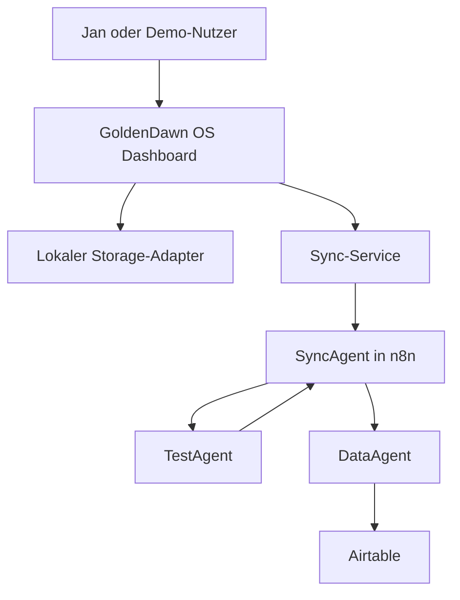
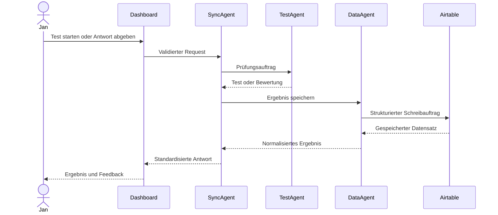

# GoldenDawn OS – Architektur

## Dokumentstatus

| Feld | Wert |
| --- | --- |
| Projektphase | `v0.2.1 – LearningHub Local MVP in Arbeit` |
| Architekturumfang | Zielarchitektur für Version 1 |
| Status | Verbindliche Zielarchitektur; lokaler LearningHub-Inhaltsfluss bis zur UI implementiert, MVP noch nicht vollständig |
| Letzte Aktualisierung | 2026-07-18 |

Dieses Dokument beschreibt die verbindliche Zielarchitektur für Version 1 von
GoldenDawn OS. Es konkretisiert die Regeln aus `AGENTS.md` und dient als
Referenz für Frontend, n8n-Workflows, Airtable-Struktur und spätere
Implementierungsentscheidungen.

## Architekturziele

GoldenDawn OS soll:

- lokal früh nutzbar und testbar sein;
- externe Kommunikation über eine einzige kontrollierte Schnittstelle führen;
- Benutzeroberfläche, Speicherung, Routing, Prüfungslogik und Datenzugriff klar
  voneinander trennen;
- ohne Secrets im Frontend auskommen;
- private Daten und öffentliche Demo-Daten getrennt halten;
- durch kleine, überprüfbare Schritte wachsen;
- die Zusammenarbeit spezialisierter Agenten nachvollziehbar demonstrieren.

## Umfang von Version 1

Version 1 verwendet ausschließlich drei Agentenrollen:

| Agent | Verantwortung | Darf nicht |
| --- | --- | --- |
| `SyncAgent` | Requests validieren, klassifizieren und routen | Fachlogik oder Airtable-Zugriffe übernehmen |
| `TestAgent` | Lerntests erstellen, Antworten bewerten und Feedback liefern | Ergebnisse direkt speichern oder Airtable aufrufen |
| `DataAgent` | Strukturierte Daten lesen, schreiben und in Airtable verwalten | Prüfungslogik oder UI-Aufgaben übernehmen |

Weitere Agenten sind nicht Teil von Version 1. Sie werden erst nach einer
Auswertung dieser Architektur geplant.

## Nicht-Ziele von Version 1

Folgende Punkte werden bewusst nicht umgesetzt:

- zusätzliche Agentenrollen;
- ein eigenes Backend neben n8n;
- direkte Airtable- oder OpenAI-Aufrufe aus dem Frontend;
- Authentifizierung und Mehrbenutzerverwaltung;
- autonome GitHub-Commits oder Releases durch Coding-Agenten;
- produktive Verarbeitung privater Daten in einer öffentlichen Demo;
- komplexes Event-Sourcing oder eine Microservice-Architektur;
- ein Frontend-Framework wie React ohne neue Architekturentscheidung.

## Systemkontext



Der Pfeil vom `TestAgent` zurück zum `SyncAgent` zeigt, dass Testergebnisse
zunächst an die zentrale Orchestrierung zurückgegeben werden. Wenn sie
gespeichert werden sollen, erstellt der `SyncAgent` daraus einen strukturierten
Auftrag für den `DataAgent`.

## Zentrale Architekturregel

Das Dashboard kommuniziert langfristig ausschließlich über den Sync-Service
mit dem Agentensystem. Innerhalb des Agentensystems ist der `SyncAgent` der
zentrale Einstiegspunkt. Airtable wird ausschließlich durch den `DataAgent`
angesprochen.

```text
Dashboard
  → Sync-Service
  → SyncAgent
  → TestAgent oder DataAgent
  → Airtable ausschließlich über DataAgent
```

Diese Regel verhindert:

- verteilte und schwer auffindbare externe Datenzugriffe;
- Secrets in UI-Komponenten;
- doppelte Validierungs- und Routinglogik;
- direkte Abhängigkeiten zwischen Benutzeroberfläche und Airtable-Schema;
- vermischte Verantwortlichkeiten der Agenten.

## Frontend-Schichten

### UI-Komponenten

UI-Komponenten übernehmen:

- Darstellung;
- Benutzerinteraktionen;
- zugängliche Lade-, Leer-, Erfolgs- und Fehlerzustände;
- Übergabe von Benutzeraktionen an Modul- oder Anwendungsservices.

UI-Komponenten übernehmen nicht:

- direkten Zugriff auf `localStorage`;
- Aufbau beliebiger Webhook-Payloads;
- Airtable-, n8n- oder OpenAI-Aufrufe;
- fachliche Datenmigrationen;
- Speicherung von Secrets.

### Modul- und Anwendungsservices

Services koordinieren die Anwendungslogik eines Moduls. Sie:

- validieren Eingaben für den lokalen Anwendungsfall;
- rufen Storage-Adapter oder den Sync-Service auf;
- übersetzen technische Fehler in verständliche Anwendungszustände;
- halten UI-Komponenten unabhängig von konkreten Datenquellen;
- verwenden bei persistenten Modulen den Storage als autoritative Quelle und
  führen keine zweite dauerhaft veränderliche In-Memory-Wahrheit.

### Storage-Adapter

Fachliche Storage-Schichten kapseln die lokale Speicherung einer Domäne. Sie
besitzen feste, nicht nutzerkontrollierte `localStorage`-Keys, validieren
Domänenobjekte und stellen fachlich benannte Lade- und Speicherfunktionen
bereit. Der gemeinsame `StorageAdapter` wird per Dependency Injection
bereitgestellt und übernimmt ausschließlich den technischen JSON-Lese- und
Schreibzugriff.

Fehlende Daten werden von beschädigtem JSON, ungültigen Domänendaten und
Adapterfehlern unterschieden. Ein fachlicher leerer Initialzustand darf nur für
einen fehlenden Key geliefert werden. Beschädigte oder ungültige gespeicherte
Daten werden nicht stillschweigend gelöscht, überschrieben oder durch
Fallback-Daten ersetzt. Migrationen werden erst nach einer eigenen
dokumentierten Entscheidung eingeführt.

Beispiel:

```js
loadPrompts()
savePrompt(prompt)
loadLearningHub()
saveLearningHub(learningHub)
loadLearningProgress()
saveLearningProgress(progress)
```

### Sync-Service

Der Sync-Service ist die einzige externe Kommunikationsschicht des Frontends.
Er:

- erstellt Requests nach dem dokumentierten Sync-Vertrag;
- sendet Requests an den n8n-Webhook;
- verarbeitet standardisierte Antworten;
- behandelt Timeouts, Netzwerkfehler und ungültige Antworten kontrolliert;
- unterstützt einen lokalen Modus ohne konfigurierte Webhook-Verbindung.

Der Sync-Service enthält keine Prüfungs- oder Airtable-Fachlogik.

## Agentenverantwortung

### SyncAgent

Der `SyncAgent` ist Gateway und Orchestrator. Er:

1. nimmt einen Request vom Sync-Service entgegen;
2. prüft Version, Aktion, Quelle, Zeitstempel und Payload;
3. erzeugt oder übernimmt eine `requestId`;
4. klassifiziert die Anfrage;
5. routet sie an `TestAgent` oder `DataAgent`;
6. normalisiert das Ergebnis;
7. gibt eine standardisierte Antwort an das Dashboard zurück.

Der `SyncAgent` darf keine Airtable-Credentials verwenden und keine
fachspezifische Prüfungsbewertung durchführen.

### TestAgent

Der `TestAgent` ist der Prüfer für Lerninhalte. Er verarbeitet klar abgegrenzte
Aufgaben wie:

- einen Test aus einem freigegebenen Lernkontext erstellen;
- Fragen und erwartete Antwortmerkmale strukturieren;
- eine Antwort nach dokumentierten Kriterien bewerten;
- Punktzahl, Feedback und Wiederholungshinweise zurückgeben.

Der `TestAgent` erhält nur den Lernkontext, der für die konkrete Prüfung nötig
ist. Er schreibt nicht direkt in Airtable und verändert nicht selbstständig den
Lernfortschritt.

### DataAgent

Der `DataAgent` ist Bibliothekar und Datenverwalter. Er:

- validiert strukturierte Datenaufträge;
- ordnet fachliche Entitäten den richtigen Airtable-Tabellen zu;
- liest und schreibt Datensätze;
- normalisiert Airtable-Antworten;
- verhindert, dass Airtable-interne Feldnamen in die UI durchsickern;
- liefert verständliche Fehler an den `SyncAgent` zurück.

Nur der `DataAgent` besitzt in Version 1 Zugriff auf Airtable-Credentials.

## Betriebsmodi

### Lokaler Modus

Der lokale Modus ist der Ausgangspunkt und bleibt als sicherer Fallback
erhalten.

```text
UI → Service → Storage-Adapter → localStorage
```

Eigenschaften:

- keine externe Verbindung erforderlich;
- Mock- oder lokale Daten;
- vollständige lokale Nutzbarkeit des jeweiligen MVP-Moduls;
- keine Fehlermeldung allein wegen einer fehlenden Webhook-Konfiguration.

### Lokale Module der Reihe v0.2.x

Die Reihe `v0.2.x` ist bewusst lokalen GoldenDawn-OS-Modulen vorbehalten.
Alle Datenzugriffe bleiben hinter Modulservices und Storage-Adaptern. Erst
`v0.3.0` beginnt mit externer Kommunikation über den Sync-Service.

#### LearningHub Local MVP in v0.2.1

LearningHub bleibt ein begrenztes lokales Lernmodul und kein allgemeines
Learning-Management-System. Die verbindliche fachliche Hierarchie von Schema 2
lautet:

```text
LearningHub
  → LearningModule
  → LearningChapter
  → LearningNode
```

Der interne Schema-2-Vertrag unterstützt mehrere nutzerkonfigurierte Module
direkt im `modules`-Array. Ein neuer Hub darf leer sein; jedes persistierbare
LearningModule besitzt mindestens ein LearningChapter. Alle Kapitel sind
implizit trackbar und dürfen noch keine LearningNodes enthalten. LearningNodes
sind selbst erstellte Textkarten innerhalb genau eines Kapitels. Course, Unit,
normalisierte Knotentypen, `parentId` und `isTrackable` gehören nicht zum
Vertrag.

Der implementierte vollständige Pfad für lokale LearningHub-Inhalte lautet:

```text
LearningHubView
  → LearningHubController
  → LearningHubService
  → LearningHubStorage
  → StorageAdapter
  → localStorage
```

`LearningHubView` rendert Lade-, Leer-, Inhalts-, Mutations-, Erfolgs- und
Fehlerzustände mit sicheren DOM-Text-APIs. `LearningHubController` hält
Modulauswahl, geöffnete Kapitel, Node-Auswahl und Formularzustände flüchtig,
fängt Servicefehler kontrolliert ab und reicht persistente Mutationen
ausschließlich an `LearningHubService` weiter. Der Service stellt `loadHub`,
`createModule`, `renameModule`, `addChapter`, `renameChapter`,
`addLearningNode` und `updateLearningNode` bereit; `LearningHubStorage`
kapselt `loadLearningHub` und `saveLearningHub`. View und Controller greifen
nicht direkt auf `localStorage` zu.

Der Service verwendet den persistenten Hub als autoritative Quelle. Jede
Mutation lädt den aktuellen Zustand, prüft Ziel und Eingaben, erzeugt einen
neuen Zustand ohne Mutation des geladenen Hubs, validiert den vollständigen
Schema-2-Vertrag und speichert genau einmal. `createModule` legt ein Modul und
sein erstes Kapitel atomar an, weil ein persistierbares LearningModule niemals
ohne Kapitel gespeichert werden darf. Neue IDs entstehen ausschließlich im
Service; neue Positionen werden robust hinter der höchsten vorhandenen
Geschwisterposition vergeben.

Kapitelabschluss und Fortschritt werden später getrennt von der Inhaltsstruktur
modelliert. Modulfortschritt wird dann aus abgeschlossenen Kapiteln abgeleitet;
auch zu 100 Prozent abgeschlossene Module bleiben erhalten und später testbar.
Fortschritt und Testkompetenz sind getrennte Konzepte. LearningNode-Aktionen
sind Service-, Controller- und UI-Fähigkeiten, keine Datenfelder. Der aktuelle
Service unterstützt Hinzufügen und Bearbeiten; Löschen, Archivieren und
Umsortieren sind noch nicht implementiert.

Die Schema-2-Foundation definiert weiterhin nur die Inhaltsstruktur und deren
Validierung. Die getrennt implementierten View-, Controller-, Service- und
Storage-Schichten machen private Schema-2-Inhalte bedienbar und persistieren
sie unter dem festen Key
`goldendawn.learningHub.content.v1`. Ein fehlender Key liefert nur im
Arbeitsspeicher einen frischen leeren privaten Hub und löst keinen
Schreibzugriff aus. Der öffentliche Demo-Hub trägt `dataOrigin: synthetic`, ist
tief unveränderlich und wird weder automatisch importiert noch als privater
Initialzustand gespeichert. Private Nutzerdaten tragen `dataOrigin: private`
und bleiben von Repository-Demos und deren Datenquellen getrennt.

Fortschritt, Notizen und spätere Testversuche benötigen eigene Verträge und
Storage-Keys. Für LearningHub-Inhalte werden in diesem Schritt weder Löschung,
Migration noch garantierte Multi-Tab-Synchronisierung oder Transaktionssperren
eingeführt.

Der weiterhin geplante Testmodus soll diesen ausschließlich lokalen Pfad
verwenden:

```text
LearningHubView
  → LearningHubController
  → LearningTestService
  → MockLearningTestProvider
```

Der noch nicht implementierte `MockLearningTestProvider` soll vorbereitete
synthetische Fragen deterministisch und testbar liefern. Die spätere Oberfläche
soll den Ablauf sichtbar als „Lokaler Mock-Test“ kennzeichnen und weder
KI-Auswertung noch Agentenlogik behaupten. Zunächst sind Single-Choice-,
Selbstkontroll- oder andere eindeutig auswertbare Aufgaben vorgesehen. Lokale
Testversuche dürfen nach ihrer späteren Einführung nur über die vorgesehenen
Service- und Storage-Grenzen gespeichert werden.

Der spätere Zielpfad bleibt:

```text
LearningTestService
  → SyncService
  → SyncAgent
  → TestAgent
```

Semantische Freitextbewertung und echte `TestAgent`-Logik beginnen erst in
`v0.5.0`.

#### LichtwaldLog Local MVP in v0.2.2

LichtwaldLog umfasst lokal Reflexions- und Erkenntniseinträge mit Titel,
Kalenderdatum, Text und Tags. Geplant sind Erstellen, Anzeigen, Bearbeiten,
Löschen sowie lokale Suche und Filterung. Private lokale Einträge und
synthetische Demo-Daten bleiben getrennt. Bilder werden nicht als Base64 in
`localStorage` abgelegt.

Für `v0.2.2` werden weder Synchronisierung noch Agentenlogik eingeführt.
Agentengestützte, synchronisierte oder automatisierte LichtwaldLog-Prozesse
bleiben einer späteren Phase vorbehalten. Weekly Review ist weiterhin geplant
und kein stillschweigender Bestandteil dieses lokalen MVP. Auch für
LichtwaldLog wird in diesem Schritt kein Storage-Key oder Storage-Schema
festgelegt.

### Verbundener Modus

Der verbundene Modus ergänzt die lokale Anwendung um kontrollierte externe
Verarbeitung.

```text
UI → Service → Sync-Service → SyncAgent → Fachagent
```

Ein Modul entscheidet nicht selbst, welcher Fachagent angesprochen wird. Diese
Entscheidung liegt beim `SyncAgent`.

## Sync-Vertrag

Der grundlegende Request-Umschlag lautet:

```json
{
  "version": "1.0",
  "action": "syncTest",
  "source": "goldendawn-os",
  "requestId": "req_example_001",
  "timestamp": "2026-07-11T12:00:00.000Z",
  "payload": {}
}
```

Eine standardisierte Antwort soll mindestens folgende Struktur unterstützen:

```json
{
  "version": "1.0",
  "success": true,
  "requestId": "req_example_001",
  "handledBy": "SyncAgent",
  "action": "syncTest",
  "data": {},
  "error": null
}
```

Die konkreten Aktionen, Payloads und Antwortdaten werden verbindlich in
`docs/data-contracts.md` definiert. Dieses Dokument legt nur den gemeinsamen
Umschlag und die Verantwortungsgrenzen fest.

## Ablauf eines Lerntests



Falls die Speicherung fehlschlägt, müssen Testergebnis und Speicherstatus
unterscheidbar bleiben. Eine fachlich erfolgreiche Bewertung darf nicht als
fehlgeschlagener Test dargestellt werden, nur weil Airtable vorübergehend nicht
erreichbar ist.

## Fehlerbehandlung

Fehler werden an der Schicht behandelt, die genügend Kontext dafür besitzt:

| Fehlerart | Verantwortliche Schicht |
| --- | --- |
| Ungültige Formulareingabe | UI oder Modulservice |
| Beschädigte lokale JSON-Daten oder Browser-Storage-Fehler | StorageAdapter |
| Ungültige lokale Domänendaten oder falsche Datenherkunft | fachliche Storage-Schicht und Modulservice |
| Netzwerkfehler oder Timeout | Sync-Service |
| Ungültiger Request-Vertrag | SyncAgent |
| Fehlerhafte Prüfungsantwort | TestAgent |
| Airtable- oder Mappingfehler | DataAgent |

Grundregeln:

- Fehler dürfen die Anwendung nicht unkontrolliert zum Absturz bringen.
- Nutzer erhalten verständliche Meldungen ohne Secrets oder interne Details.
- Technische Fehler enthalten für die Diagnose eine stabile Fehlerkennung.
- Ein Agent gibt Fehler strukturiert an den `SyncAgent` zurück.
- Wiederholungen müssen begrenzt sein und dürfen keine doppelten Datensätze
  erzeugen.

## Sicherheit

- Airtable- und Modell-Credentials liegen ausschließlich in n8n oder einer
  späteren serverseitigen Umgebung.
- `VITE_*`-Variablen gelten als öffentlich und dürfen keine Secrets enthalten.
- Eine Webhook-URL wird nicht als alleiniger Schutzmechanismus betrachtet.
- Requests werden im Frontend und erneut im `SyncAgent` validiert.
- Payload-Größe, erlaubte Aktionen und Datentypen werden begrenzt.
- Logs enthalten keine Tokens oder unnötigen personenbezogenen Daten.
- Private und öffentliche Daten verwenden getrennte Airtable-Bases,
  Konfigurationen und Deployments.
- Die öffentliche Demo verwendet ausschließlich synthetische Daten.

Weitere Details werden in `docs/security.md` dokumentiert.

## Vorgesehene Projektstruktur

```text
src/
├── app/
├── components/
├── modules/
├── services/
│   ├── learningHubService.js
│   └── syncService.js
├── storage/
│   ├── learningHubStorage.js
│   └── storageAdapter.js
├── contracts/
├── data/
│   └── mock/
├── utils/
└── styles/

automation/
└── n8n/
    └── workflows/

schemas/
└── airtable/

docs/
├── architecture.md
├── roadmap.md
├── security.md
├── data-contracts.md
└── decisions/
```

Die Struktur wird nur angelegt, wenn die zugehörigen Dateien tatsächlich
benötigt werden. Leere Architekturordner werden vermieden.

## Implementierungsreihenfolge

| Version | Ergebnis |
| --- | --- |
| `v0.1.0` | Dokumentation, Vite-Grundlage und Architekturregeln |
| `v0.2.0` | Local Dashboard MVP abgeschlossen |
| `v0.2.1` | In Arbeit: Schema 2, lokaler Inhaltsservice, Persistenz, Controller und Inhalts-UI umgesetzt; weitere MVP-Bausteine geplant |
| `v0.2.2` | LichtwaldLog Local MVP ohne Synchronisierung oder Agentenlogik |
| `v0.3.0` | SyncService, Webhook und SyncAgent als Beginn externer Kommunikation |
| `v0.4.0` | DataAgent mit minimalem Airtable-Lese- und Schreibfluss |
| `v0.5.0` | TestAgent für Erstellung und Bewertung von Lerntests |
| `v0.6.0` | Integrierter Drei-Agenten-Fluss |
| `v1.0.0` | Sichere Portfolio-Demo, getrennte Deployments und Dokumentation |

Die technische Reihenfolge bleibt **Mock → Webhook → Airtable →
Agentenlogik**. Jede Version muss überprüfbar und dokumentiert sein, bevor die
nächste begonnen wird. Weitere Unterversionen dürfen für neue, klar
abgegrenzte Arbeitspakete ergänzt werden.

## Architekturentscheidungen

Wesentliche Entscheidungen werden als Architecture Decision Records unter
`docs/decisions/` festgehalten:

| ADR | Entscheidung | Status |
| --- | --- | --- |
| [0001](decisions/0001-vite-vanilla-js.md) | Vite und Vanilla JavaScript als Frontend-Grundlage | Angenommen |
| [0002](decisions/0002-syncagent-gateway.md) | SyncAgent als einziges Gateway des Dashboards | Angenommen |
| [0003](decisions/0003-dataagent-airtable-boundary.md) | DataAgent als einzige Airtable-Schnittstelle | Angenommen |
| [0004](decisions/0004-private-demo-separation.md) | Trennung von privaten und öffentlichen Daten | Angenommen |
| [0005](decisions/0005-v1-three-agent-scope.md) | Begrenzung von Version 1 auf drei Agenten | Angenommen |
| [0006](decisions/0006-learning-catalog-hierarchy-and-nodes.md) | Feste LearningHub-Hierarchie mit normalisierten LearningNodes | Ersetzt |
| [0007](decisions/0007-user-configured-learning-modules.md) | Nutzerkonfigurierte LearningModules mit trackbaren Kapiteln und LearningNodes | Angenommen |
| [0008](decisions/0008-learning-hub-local-content-persistence.md) | Lokale LearningHub-Inhaltsverwaltung und -Persistenz | Angenommen |

Der vollständige Index und die Regeln für neue Entscheidungen stehen in
[`docs/decisions/README.md`](decisions/README.md).

## Änderungsregel

Eine Änderung an Agentenrollen, Datenfluss, Systemgrenzen, Sync-Vertrag oder
Sicherheitsmodell erfordert:

1. Aktualisierung dieses Dokuments;
2. gegebenenfalls einen neuen ADR;
3. Abgleich mit `AGENTS.md`, `README.md`, `docs/security.md` und
   `docs/data-contracts.md`;
4. einen manuellen Pull Request mit nachvollziehbarer Begründung.
