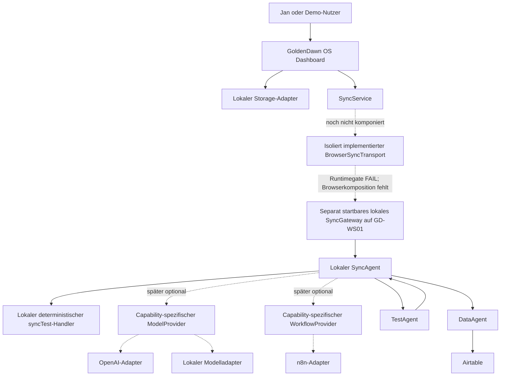
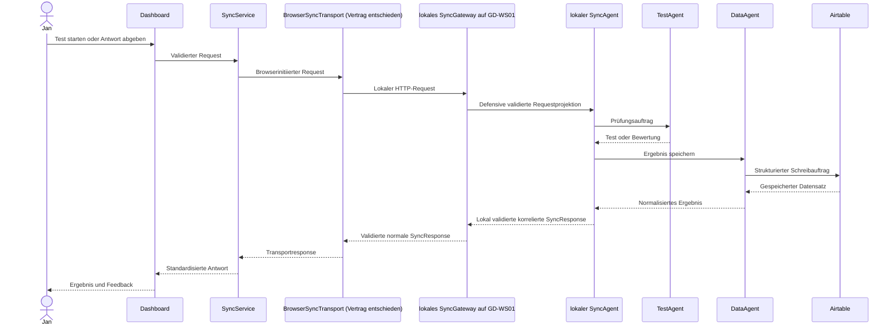

# GoldenDawn OS – Architektur

## Dokumentstatus

| Feld | Wert |
| --- | --- |
| Projektphase | `v0.3.0 – gebundenes Chrome-151-Runtimegate FAIL; nächster Slice: Architekturentscheidung zur positiven BrowserSyncTransport-Laufzeitabweichung` |
| Architekturumfang | Zielarchitektur für Version 1 |
| Status | Verbindliche Zielarchitektur nach ADR 0023 bis ADR 0025, ADR 0028 und ADR 0029; Paketversion `0.2.2`; neuestes veröffentlichtes Release und Tag `v0.2.2`; lokale Foundations, modellfreier SyncAgent-Kern, kontrollierte lokale In-Process-Gateway-/SyncAgent-Komposition, isolierter BrowserSyncTransport und feste transportlokale v1-Wire-Policy implementiert; der einmalige an `chrome-stable-win-t0-01` gebundene Lauf ist wegen des Widerspruchs zwischen vollständig beobachteter HTTP-200-Response und statisch zurückgewiesenem Transport-Promise mit `overallGate: FAIL` dokumentiert; PNA/LNA und nicht ausgeführte Negativkontrollen bleiben `UNPROVEN`, Cleanup ist `PASS`; Browserkomposition und Browser-End-to-End-Fluss fehlen; öffentliche stabile OSS-Kompatibilität `FAIL`, Tenant-, Provider-/Execution- und Production-Evidenz `UNPROVEN`, Aktivierung geschlossen; Provideradapter nicht implementiert |
| Letzte Aktualisierung | 2026-08-30 |

Dieses Dokument beschreibt die verbindliche Zielarchitektur für Version 1 von
GoldenDawn OS. Es konkretisiert die Regeln aus `AGENTS.md` und dient als
Referenz für Frontend, lokale Agentenkomposition, optionale Provider,
Airtable-Struktur und spätere Implementierungsentscheidungen.

## Architekturziele

GoldenDawn OS soll:

- lokal früh nutzbar und testbar sein;
- externe Kommunikation über eine einzige kontrollierte Schnittstelle führen;
- Benutzeroberfläche, Speicherung, Routing, Prüfungslogik und Datenzugriff klar
  voneinander trennen;
- ohne Secrets im Frontend auskommen;
- private Daten und öffentliche Demo-Daten getrennt halten;
- durch kleine, überprüfbare Schritte wachsen;
- die Zusammenarbeit spezialisierter Agenten nachvollziehbar demonstrieren.

## Umfang von Version 1

Version 1 verwendet ausschließlich drei Agentenrollen:

| Agent | Verantwortung | Darf nicht |
| --- | --- | --- |
| `SyncAgent` | Lokal Policy durchsetzen, Requests defense-in-depth validieren, klassifizieren und routen sowie normale Responses erzeugen und validieren | Test-/DataAgent-Fachlogik oder Airtable-Zugriffe übernehmen |
| `TestAgent` | Lerntests erstellen, Antworten bewerten und Feedback liefern | Ergebnisse direkt speichern oder Airtable aufrufen |
| `DataAgent` | Strukturierte Daten lesen, schreiben und in Airtable verwalten | Prüfungslogik oder UI-Aufgaben übernehmen |

Weitere Agenten sind nicht Teil von Version 1. Sie werden erst nach einer
Auswertung dieser Architektur geplant.

## Nicht-Ziele von Version 1

Folgende Punkte werden bewusst nicht umgesetzt:

- zusätzliche Agentenrollen;
- ein allgemeines Fachbackend oder eine Microservice-Topologie; das lokale
  SyncGateway bleibt eine schmale Transport- und Sicherheitsgrenze, der lokale
  SyncAgent eine davon logisch getrennte injizierte serverseitige Komponente;
- ein zweiter Listener, eine neue IPC-Grenze oder ein zusätzlicher lokaler
  Netzwerkdienst für den ersten SyncAgent-Slice;
- direkte Airtable- oder OpenAI-Aufrufe aus dem Frontend;
- Authentifizierung und Mehrbenutzerverwaltung;
- autonome GitHub-Commits oder Releases durch Coding-Agenten;
- produktive Verarbeitung privater Daten in einer öffentlichen Demo;
- komplexes Event-Sourcing oder eine Microservice-Architektur;
- ein Frontend-Framework wie React ohne neue Architekturentscheidung.

## Systemkontext



Der Pfeil vom `TestAgent` zurück zum `SyncAgent` zeigt, dass Testergebnisse
zunächst an die zentrale Orchestrierung zurückgegeben werden. Wenn sie
gespeichert werden sollen, erstellt der `SyncAgent` daraus einen strukturierten
Auftrag für den `DataAgent`.

Die Zielarchitektur trennt vier Vertrauenszonen:

| Zone | Inhalt | Verbindliche Grenze |
| --- | --- | --- |
| A | GoldenDawn-Browser, SyncService und isoliert implementierter, noch nicht komponierter BrowserSyncTransport | unvertrauenswürdig, ohne Secrets; erzeugt nur den geschlossenen `syncTest`; Browser-, UI-, Caller- und Requestwerte wählen weder Provider, Modell, Workflow, Endpoint noch Umgebung; ADR 0028 übernimmt das einzige feste Transportziel und die geschlossene Vier-Seam-Komposition über ADR 0027 unverändert aus ADR 0026; die implementierte feste v1-Policy schließt die bestätigte Validator-Integritätslücke vor der Wirefreigabe mutationswirksam, ist aber weder Browser-Runtime- noch End-to-End-Nachweis |
| B | lokales SyncGateway auf GD-WS01 | autoritative Raw-Wire-, HTTP-, UTF-8- und Boundary-Grenze ohne Agenten-, Modell- oder Fachlogik; gibt ausschließlich die validierte defensive Projektion weiter |
| C | lokaler SyncAgent | autoritative lokale Policy-, Defense-in-depth-Validierungs-, Routing- und Responsegrenze mit fester Aktions-Allowlist |
| D | optionale externe oder lokale Provider | standardmäßig deaktiviert, nicht Bestandteil des aktuellen `syncTest`, ausschließlich über capability-spezifische Adapter erreichbar |

Provider sind keine zusätzlichen Agentenrollen. Version 1 bleibt unverändert
auf `SyncAgent`, `TestAgent` und `DataAgent` begrenzt.

## Zentrale Architekturregel

Das Dashboard kommuniziert langfristig ausschließlich über den Sync-Service
mit dem Agentensystem. Innerhalb des Agentensystems ist der lokale `SyncAgent`
der zentrale Einstiegspunkt sowie die verbindliche Policy-, Validierungs-,
Routing- und Responsegrenze. Airtable wird ausschließlich durch den `DataAgent`
angesprochen.

```text
Dashboard
  → SyncService
  ⇢ isoliert implementierter, noch nicht komponierter BrowserSyncTransport
  → implementiertes lokales SyncGateway auf GD-WS01
  → lokaler SyncAgent
      ├→ zunächst lokaler deterministischer syncTest-Handler
      ├→ später optional capability-spezifischer ModelProvider
      ├→ später optional capability-spezifischer WorkflowProvider
      └→ später TestAgent oder DataAgent
          → Airtable ausschließlich über DataAgent
```

Diese Regel verhindert:

- verteilte und schwer auffindbare externe Datenzugriffe;
- Secrets in UI-Komponenten;
- doppelte Validierungs- und Routinglogik;
- direkte Abhängigkeiten zwischen Benutzeroberfläche und Airtable-Schema;
- vom Browser oder Modelloutput bestimmte Provider, Modelle, Workflows,
  Endpoints, Umgebungen, Berechtigungen oder Tools;
- vermischte Verantwortlichkeiten der Agenten.

### Aktueller v0.3.0-Slice

Der historische Dokumentationsslice `Local SyncGateway before n8n Cloud
Decision` hatte mit ADR 0019 die damalige Zieltopologie um einen lokalen
Transport- und Sicherheits-Hop auf GD-WS01 vor n8n Cloud ergänzt. ADR 0023
ersetzt ADR 0002 und ADR 0019 nun formal und entscheidet stattdessen den lokalen
`SyncAgent` vor optionalen Providern. Der weiterhin gültige Kern bleibt
erhalten: `SyncService` ist die einzige Browser-Kommunikationsschicht, der
`SyncAgent` der einzige Einstieg und Router des Agentensystems, UI und Browser
wählen weder Fachagent noch Provider direkt und Version 1 bleibt auf drei
Agenten begrenzt. ADR 0020 setzt unverändert den separat startbaren lokalen
Node-HTTP-Prozess um. ADR 0021 erzeugt unverändert aus einem unveränderlichen
Snapshot der kanonischen Contract- und Boundary-Quellen sowie des gepflegten
nichtfachlichen Entry ein direkt bindbares Expression-IIFE, ein
deterministisches SHA-256-Manifest und die dazugehörigen Integritäts-, Paritäts-
und Mutationstests.

Der abgeschlossene Slice `n8n Cloud Ingress & Runtime Evidence Gate Foundation`
ergänzt nach ADR 0022 ausschließlich ein lokal verifiziertes, importseitig und
standardmäßig netzwerkinaktives Messwerkzeug, einen menschenprüfbaren
Code-Node-Observer und eine geschlossene sanitierte Evidenzvorlage. Er trennt
dokumentierte Plattformgarantien, commitgebundene Beobachtungen im offiziellen
öffentlichen n8n-Quellcode, spätere Messungen in einem konkret gebundenen
Cloud-Tenant und workflowseitig nicht beobachtbare Provider-/Ingress-
Eigenschaften. Dieser Slice hat weder einen n8n-Tenant kontaktiert noch einen
Workflow oder ein Credential angelegt.

Der auf [`n8n@2.35.4`](https://github.com/n8n-io/n8n/releases/tag/n8n%402.35.4)
und Commit
`d2ce3c084c228622c2ffe7c245d25870430e18a9` gebundene öffentliche
Quellcodebefund ist mit den notwendigen GoldenDawn-Eigenschaften nicht
kompatibel und erhält deshalb `FAIL`. Der getrennte konkrete Tenantnachweis
bleibt mangels Cloudmessung `UNPROVEN`. Beide Ergebnisse halten die
Produktaktivierung geschlossen. Der vollständig lokale, synchrone, modell- und
providerfreie SyncAgent-Kern aus ADR 0024 ist implementiert und importinaktiv.
Die durch ADR 0025 entschiedene kontrollierte In-Process-Komposition mit dem
lokalen SyncGateway ist ebenfalls implementiert; nur der Browserpfad fehlt:

```text
lokaler HTTP-/Wire-Pfad
→ SyncGateway Request Boundary
→ defensive Sechs-Felder-SyncRequest-Projektion
→ lokaler SyncAgent
→ defensiv projizierte und erneut validierte normale SyncResponse
→ lokales SyncGateway als alleiniger HTTP-Response-Owner
```

Der Produktions-Kompositionsroot bleibt ausschließlich
`server/startLocalSyncGateway.js`. Nach gültiger Runtime-Konfiguration erzeugt
er im bestehenden Prozess genau eine SyncAgent-Instanz pro HTTP-Server-Factory
und injiziert sie als erforderliche Dependency; die Komposition führt
keinen zweiten Listener, Dienst, IPC-, Worker-, Queue-, Browser- oder
Providerpfad ein. Ein exakt erfolgreicher leerer synthetischer `syncTest` wird
lokal mit HTTP `200` beantwortet. Der erste Versuch, den durch ADR 0026
beschriebenen BrowserSyncTransport zu implementieren, wurde vor jeder
Dateiänderung hart gestoppt: Working Tree, Index und die beiden geplanten
Zielpfade blieben unverändert; Browser, Netzwerk und Gateway wurden nicht
aufgerufen. Ursache waren zwei widersprüchliche beziehungsweise mit
öffentlichen JavaScript-Mitteln nicht erfüllbare Nachweisforderungen, keine
festgestellte Produktlücke. ADR 0027 ersetzt deshalb ADR 0026, übernimmt alle
nicht ausdrücklich korrigierten Regeln unverändert und begrenzt die Aussagen
zu fremden nativen Promise-/Bufferwerten auf ihr beobachtbares Profil sowie
die öffentliche Requestgrößenprobe auf die aktuell erreichbaren 193 Bytes.
Eine zusätzliche API, Dependency oder Produktionsseam entstand nicht. Nach dem
Merge von ADR 0027 ist der korrigierte BrowserSyncTransport inzwischen
ausschließlich in `src/transports/browserSyncTransport.js` implementiert und
durch `tests/browserSyncTransport.test.js` ohne reale Browser-, Netzwerk- oder
Gatewayzugriffe geprüft. Er bleibt weder mit dem SyncService noch in
`src/main.js` komponiert; der lokale Browser-End-to-End-Fluss fehlt. Der
danach einmalig ausgeführte, kontext- und versionsgebundene Chrome-
Runtime-Evidence-Lauf endete mit Gesamt-`FAIL`; als nächster Slice folgt die
gesonderte Architekturentscheidung zur positiven Transportabweichung. OpenAI-, lokaler Modell- und n8n-Adapter sind weder
autorisiert noch implementiert. ADR 0020,
ADR 0021 und ADR 0022 bleiben angenommen und inhaltlich unverändert; deren
historische Evidenz wird nicht rückwirkend verändert.

ADR 0028 ersetzt ADR 0027 formal und übernimmt dessen beide Korrekturen sowie
alle nicht ausdrücklich geänderten ADR-0026-/ADR-0027-Regeln. Die Entscheidung
bestätigte einen damals noch nicht behobenen Produktfehler: Beide erforderlichen
`validateSyncRequest`-Aufrufe verwenden live manipulierbare
Laufzeitoberflächen, während die bestehende terminale Prüfung Shape, Freeze und
Snapshotidentität, aber keine davon unabhängigen festen v1-Werte bestätigt.
Kontrollierte netzwerkfreie Proben ließen dadurch vertragswidrige Werte bis zum
Fetch-Seam gelangen; die damalige grüne Suite bewies die Schließung dieser
Lücke nicht. Die private feste v1-Wire-Policy und ihre kausale
mutationswirksame Testmatrix sind nun implementiert und schließen die
Transportlücke, ohne den Contractvalidator selbst zu härten. Der getrennte
Chrome-151-Runtime-Lauf hat danach den positiven Normalpfad nicht vollständig
bestätigt und endete mit Gesamt-`FAIL`; Browserkomposition und Browser-End-to-
End-Fluss bleiben gesperrte spätere Slices.

Die implementierte **SyncContract Foundation** bleibt der reine,
transportneutrale Vertragskern für `syncTest`. Darauf baut die ebenfalls
implementierte **SyncService Foundation** auf. `createSyncService` liefert eine
eingefrorene API mit exakt der Promise-basierten Methode `runSyncTest`. Sie
akzeptiert keine Argumente, erzeugt den einzigen erlaubten Request aus
kontrollierten Contractwerten und übergibt ihn nach vollständiger Validierung
höchstens einmal an `syncTransport.sendSyncRequest`.

Vor dem Request-Build löst der Service `syncTransport.sendSyncRequest` genau
einmal sicher auf. Bei fehlender, nicht funktionaler oder werfend aufgelöster
Methode werden Generator und Clock nicht ausgewertet. Erst nach erfolgreicher
Methodenauflösung wertet der Builder beide jeweils exakt einmal aus. Nur die
eigentliche Portmethode wird nach vollständiger Requestvalidierung höchstens
einmal aufgerufen.

Der erzeugte Request wird vor dem Transport vollständig validiert. Der
Transport erhält einen tief eingefrorenen Snapshot; eine getrennte ebenfalls
tief eingefrorene Kopie bleibt die unveränderliche Korrelationsgrundlage. Der
einzige Port lautet:

```text
syncTransport.sendSyncRequest(syncRequest)
```

Der Service behandelt den Rückgabewert als unvertrauenswürdig, projiziert nur
die erwarteten gewöhnlichen Datenfelder und akzeptiert ausschließlich eine mit
dem internen Request vollständig validierte normale SyncResponse. Das originale
Transportobjekt wird weder verändert, eingefroren noch zurückgegeben. Frühe
Gateway-Fehler sind kein akzeptiertes Serviceprofil.

Der zuvor abgeschlossene dritte Slice ergänzt daneben die synchrone transportneutrale
**SyncGateway Request Boundary Foundation**. Ihre Factory lautet:

```js
createSyncGatewayRequestBoundary({
  generateGatewayRequestId,
  getCurrentTimestamp,
})
```

Die eingefrorene gewöhnliche API besitzt exakt die synchrone Methode
`processSyncRawBody(rawBody)`. Sie ist kein HTTP-Handler und akzeptiert exakt
einen bereits vollständig materialisierten Raw-Body-Wert. Fehlende oder
zusätzliche Argumente führen ohne Inspektion, Größenprüfung, Parsing, Clock-
oder Generatorzugriff zu einem statischen lokalen `invalidInvocation`-Result.
Bei genau einem Argument wird der unveränderte Wert zuerst mit
`validateSyncRawBodySize` geprüft und nicht konvertiert.

Nur ein bestandener String wird exakt einmal mit nativem
`JSON.parse(rawBody)` und ohne Reviver geparst. Der unveränderte Parsed-Wert
muss zuerst den bestehenden geschlossenen SyncContract vollständig bestehen.
Erst danach entsteht descriptor-basiert eine neue gewöhnliche Projektion aus
exakt `version`, `action`, `source`, `requestId`, `timestamp` und einem
frischen exakt leeren `payload`. Projektion und finaler tief eingefrorener
Snapshot werden mit derselben höchstens einmal erfassten Referenzzeit erneut
validiert. Es gibt keine vorherige Bereinigung zusätzlicher Felder, keine
Normalisierung, Reparatur, Trimmung, keinen Merge und keinen
Stringify-/Parse-Roundtrip. Der Parsed-Wert wird weder verändert, eingefroren,
zurückgegeben, geloggt noch persistiert.

Der synchrone Boundary-Result besitzt exakt:

```js
{
  ok,
  status,
  syncRequest,
  gatewayErrorResponse,
  error
}
```

`syncRequestAccepted` enthält nur die defensive tief eingefrorene
Sechs-Felder-Projektion und bedeutet ausschließlich lokale Contractakzeptanz.
`syncRequestRejected` enthält eine vollständig validierte defensive frühe
Gateway-Fehlerresponse. `invalidInvocation` und `boundaryFailed` sind
getrennte lokale Fehler und keine SyncContract-Responses.

Die statische Zuordnung lautet: `rawBodyTooLarge` zu
`PAYLOAD_TOO_LARGE`, andere reguläre Raw-Body-Fehler zu
`VALIDATION_ERROR`, native Parser-Throws zu `INVALID_JSON`, ein exakt
alleiniger `unsupportedVersion`- oder `unknownAction`-Fehler zum jeweiligen
spezifischen Profil und sonstige oder gemischte Requestfehler zu
`VALIDATION_ERROR`. `invalidReferenceTimestamp` sowie unerwartete Builder-,
Projektions-, Freeze- oder Validatorinkonsistenzen sind lokale
`boundaryFailed`-Pfade. Die Boundary emittiert weder `FORBIDDEN` noch frühe
`SERVICE_UNAVAILABLE`- oder `INTERNAL_ERROR`-Profile.

Jede beherrschte Ablehnung verwendet eine neue kontrollierte `gateway_`-ID,
`action: null`, `handledBy: null`, `data: null`, leere `details`,
`warnings` und `processedBy` sowie statisches `durationMs: 0`. Response,
Error, Meta und Arrays werden pro Aufruf frisch erzeugt und vor sowie nach Deep
Freeze vollständig validiert. Eine eingehende `req_`-ID wird nie gespiegelt
und eine Verarbeitung durch den `SyncAgent` nie behauptet.

Für einen akzeptierten Request oder eine tatsächlich ausgegebene
Gateway-Fehlerresponse wird die Clock exakt einmal ausgewertet. Derselbe Wert
ist Referenzzeit und bei Ablehnung Response-Timestamp. Der Gateway-ID-Generator
wird nur für eine benötigte Ablehnung exakt einmal aufgerufen; sein Default ist
ausschließlich `gateway_ + crypto.randomUUID()` ohne schwächeren Fallback.
Clock und Generator sind vertrauenswürdige ausführbare Same-Realm-Composition-
Dependencies.

Native doppelte JSON-Membernamen folgen bewusst der Last-Key-Wins-Semantik von
`JSON.parse`; die Foundation behauptet weder duplikatfreies noch kanonisches
JSON. Es gibt keinen eigenen Parser, Reviver oder Duplicate-Key-Scanner. Die
reale Komposition parst den Raw Body nicht ein zweites Mal mit abweichender
Semantik.

`validateSyncRawBodySize` prüft ausschließlich die berechnete UTF-8-Länge
eines bereits allozierten JavaScript-Strings. Für sich genommen ist das keine
Raw-Wire-Bytebegrenzung, kein Schutz vor vorheriger Body-Allokation und keine
HTTP-, Webhook- oder DoS-Durchsetzung. Der neue lokale Node-Prozess setzt die
vorgelagerte reale Reihenfolge nun separat um:

```text
rohe Bodybytes am Transport begrenzen
→ kontrolliert in einen String dekodieren
→ diese Boundary genau einmal parsen lassen
→ ausschließlich die defensive Projektion weiterreichen
```

`requestId`, `timestamp` und `source` beweisen trotz syntaktischer
Validierung weder sichere Herkunft, Identität, Berechtigung, Kollisionsfreiheit
noch Replay-Schutz. Der exakt leere Payload entfernt das vorgesehene
Inhaltsfeld; die Metadaten können dennoch private Bedeutung codieren. Contract
und leeres Payload beweisen weder semantische Nicht-Privatheit noch
Datenschutz. Die Foundations lesen, persistieren oder exportieren keine
Bestände aus PromptVault, LearningHub oder LichtwaldLog.

Der konkrete BrowserSyncTransport wird inzwischen isoliert in `src/`
ausgeliefert, aber weiterhin weder mit dem SyncService noch in `src/main.js`
komponiert. Der neue HTTP-Handler liegt ausschließlich unter
`server/`, wird nur explizit als eigener Prozess gestartet und nimmt nur lokale
Loopback-Requests an. Der lokale `SyncAgent` ist ausschließlich in diesem
explizit gestarteten Gateway-Prozess für den leeren synthetischen `syncTest`
operativ erreichbar. Es gibt keinen Webhook, n8n-Workflow, keine
Authentisierung, Autorisierung, Signaturprüfung, Secrets,
Rate Limits, Persistenz, Logs, Telemetrie oder Hub-UI. Der Prozess sendet
nichts an einen externen Port; daher besitzt auch dieser Slice keinen externen
Datenfluss.

Der erste browserinitiierte End-to-End-Fluss bleibt vollständig lokal und ist
noch nicht implementiert:

```text
GoldenDawn-Browser
  → SyncService
  ⇢ isoliert implementierter, noch nicht komponierter BrowserSyncTransport
  → implementiertes lokales SyncGateway auf GD-WS01
  → lokaler SyncAgent
  → validierte normale SyncResponse
```

Das Vite-Browserfrontend ist dabei der spätere Client. Es terminiert keinen
eingehenden öffentlichen Webhook und verwendet den lokalen Prozess noch nicht.
Die Loopback-, Raw-Wire-, Decodierungs-, Origin- und frühe HTTP-Policygrenze
und der lokale SyncAgent-Kern sind umgesetzt; der durch ADR 0025 entschiedene
kontrollierte Kompositionscode ist ebenfalls implementiert. Ein direkt an das
Gateway gesendeter exakter `syncTest` wird ohne Provider lokal beantwortet. Ein
n8n-Adapter bleibt als optionaler `WorkflowProvider` durch ADR 0022 gesperrt.
Body-Binding, Replay, Idempotenz und private oder schreibende Aktionen benötigen
vor ihrer Freigabe eine neue Entscheidung.

### Spätere Hub-Verantwortung

Der AgentHub stellt später den `SyncAgent`, seine Fähigkeiten und seinen
Ausführungsstatus dar. Der AutomationHub stellt später Verbindungen, Webhooks
und Workflows dar und ist der einzige vorgesehene Ort, an dem `syncTest`
ausgelöst wird. Der aktuelle Slice dokumentiert diese Zuständigkeit nur; er
implementiert weder AgentHub- noch AutomationHub-UI.

## Frontend-Schichten

### UI-Komponenten

UI-Komponenten übernehmen:

- Darstellung;
- Benutzerinteraktionen;
- zugängliche Lade-, Leer-, Erfolgs- und Fehlerzustände;
- Übergabe von Benutzeraktionen an Modul- oder Anwendungsservices.

UI-Komponenten übernehmen nicht:

- direkten Zugriff auf `localStorage`;
- Aufbau beliebiger Webhook-Payloads;
- Airtable-, n8n- oder OpenAI-Aufrufe;
- fachliche Datenmigrationen;
- Speicherung von Secrets.

### Modul- und Anwendungsservices

Services koordinieren die Anwendungslogik eines Moduls. Sie:

- validieren Eingaben für den lokalen Anwendungsfall;
- rufen Storage-Adapter oder den Sync-Service auf;
- übersetzen technische Fehler in verständliche Anwendungszustände;
- halten UI-Komponenten unabhängig von konkreten Datenquellen;
- verwenden bei persistenten Modulen den Storage als autoritative Quelle und
  führen keine zweite dauerhaft veränderliche In-Memory-Wahrheit.

### Storage-Adapter

Fachliche Storage-Schichten kapseln die lokale Speicherung einer Domäne. Sie
besitzen feste, nicht nutzerkontrollierte `localStorage`-Keys, validieren
Domänenobjekte und stellen fachlich benannte Lade- und Speicherfunktionen
bereit. Der gemeinsame `StorageAdapter` wird per Dependency Injection
bereitgestellt und übernimmt den technischen JSON-Lese- und Schreibzugriff.
`readJson(key, options?)` und `writeJson(key, value, options?)` akzeptieren
optional `maxSerializedLength` als positive sichere Ganzzahl. Ohne diese Option
bleibt das Verhalten aller bestehenden Aufrufer unverändert. Beim Lesen wird
ein vorhandener String vor dem Parsen, beim Schreiben die exakt einmal erzeugte
JSON-Zeichenfolge vor dem eigentlichen Storage-Zugriff begrenzt. Eine ungültige
Limitkonfiguration wird vor Storage- oder Serialisierungszugriffen abgelehnt.
Für den in ADR 0012 begrenzten Multi-Store-Erststart bietet er zusätzlich
`removeJsonIfUnchanged`: Der technische Rollback entfernt einen Wert nur,
wenn dessen aktuelle Serialisierung noch exakt dem erwarteten Seed entspricht.
Dieser Pfad ist keine allgemeine fachliche Löschoperation und seine Semantik
wird durch die optionale Größenbegrenzung nicht verändert. Auch ein
Fehlerobjekt mit nicht sicher lesbarem `name` wird innerhalb des gemeinsamen
Adapters kontrolliert als allgemeiner Lese-, Schreib- oder Entfernungsfehler
behandelt.

Fehlende Daten werden von beschädigtem JSON, ungültigen Domänendaten und
Adapterfehlern unterschieden. Ein fachlicher leerer Initialzustand darf nur für
einen fehlenden Key geliefert werden. Beschädigte oder ungültige gespeicherte
Daten werden nicht stillschweigend gelöscht, überschrieben oder durch
Fallback-Daten ersetzt. Migrationen werden erst nach einer eigenen
dokumentierten Entscheidung eingeführt.

Beispiel:

```js
loadPrompts()
savePrompt(prompt)
loadLearningHub()
saveLearningHub(learningHub)
loadLearningProgress()
saveLearningProgress(progress)
loadLearningArtifacts()
saveLearningArtifacts(artifactStore)
loadLearningTestBank()
saveLearningTestBank(testBank)
loadLearningTestAttempts()
appendLearningTestAttempt(attempt)
loadLichtwaldLog()
saveLichtwaldLog(lichtwaldLog)
```

### Sync-Service

Die implementierte SyncService Foundation ist die transportneutrale
Anwendungsgrenze vor dem durch ADR 0027 entschiedenen und inzwischen isoliert
implementierten konkreten lokalen Browsertransport. Beide Module sind noch
nicht miteinander komponiert. Ihre
öffentliche Factory lautet:

```js
createSyncService({
  syncTransport,
  generateRequestId,
  getCurrentTimestamp,
})
```

Die eingefrorene API besitzt exakt `runSyncTest`. Der Service:

- erstellt einen frischen Request ausschließlich nach dem dokumentierten
  SyncContract und besitzt keinen generischen `execute(action, payload)`-Pfad;
- validiert den Request mit demselben einmal erfassten Clock-Wert als
  Requestzeit und lokale Referenzzeit;
- trennt den tief eingefrorenen Transportrequest von der tief eingefrorenen
  internen Korrelationsgrundlage;
- ruft den injizierten Port pro Serviceaufruf höchstens einmal mit dem
  vorgesehenen Receiver auf;
- projiziert eine Transportantwort defensiv und validiert sie als normale
  korrelierte SyncResponse;
- übersetzt lokale Build-, Dependency-, Transport- und Responsefehler in einen
  getrennten statischen Service-Result.

Der aktuelle Service kennt keinen Endpoint, Client-Modus, konkreten HTTP- oder
n8n-Transport, Timeout, Retry, Backoff, Idempotenzspeicher, Storage oder
Telemetrie. Er enthält keine Prüfungs- oder Airtable-Fachlogik. Der
implementierte BrowserSyncTransport bleibt die einzige
Browser-Kommunikationsschicht zum lokalen Gateway. Externe oder lokale
Providerkommunikation darf ausschließlich über capability-spezifische Adapter
hinter dem lokalen `SyncAgent` erfolgen und ist keine Aufgabe dieses
Browsertransports.

### Aktuell implementierter isolierter BrowserSyncTransport

`src/transports/browserSyncTransport.js` implementiert den durch ADR 0027
korrigierten und im Übrigen aus ADR 0026 übernommenen Vertrag. Das Modul
exportiert ausschließlich `createBrowserSyncTransport`. Jede bestandene Factory
liefert eine frische eingefrorene API exakt mit `sendSyncRequest`; die
produktive Defaultkomposition und eine explizite Komposition bleiben auf die
vier geschlossenen Seams `fetchRequest`, `createAbortController`,
`setDeadlineTimer` und `clearDeadlineTimer` begrenzt. Import und Factory führen
keinen Request aus.

Der Transport projiziert den descriptorbasiert einmal erfassten Callerrequest
in einen frischen disjunkten Sechs-Felder-Graphen, validiert exakt diesen Graphen
vor und nach seinem Deep Freeze, prüft danach die feste v1-Wire-Policy exakt
einmal und serialisiert ihn geschlossen genau einmal. Der Contractvalidator
selbst bleibt unverändert.
Der feste Endpoint, die eingefrorenen Null-Prototyp-Records für Header und
RequestInit, der private Requestcap, höchstens ein Fetch, die 5.000-ms-
First-Terminal-Owner-Deadline, statische Redaction sowie die fail-closed
Response-, Header-, Promise-, Reader-, Buffer-, Kopier-, UTF-8- und JSON-Grenzen
sind implementiert. Die öffentlich erreichbare v1-Requestprobe erreicht exakt
193 Bytes; die private Capverdrahtung wird kausal mit bereinigten temporären
193-/192-Quellkopien geprüft. Die Responsegrenze bleibt öffentlich bei
16.384/16.385 Bytes erreichbar.

Die netzwerkfreie Suite bestätigt 423/423 fokussierte Tests, 466/466 Tests mit
dem SyncService, 735/735 Tests der sechs seriellen Sync-Suites und 1755/1755
Tests der vollständigen seriellen Gesamtsuite. Der ausschließlich aus den
Transporttests stammende Zuwachs beträgt `Δ = 151`; alle Läufe besitzen
0 Fehlschläge, Abbrüche, Skips oder Todos. Der Produktions-Build transformiert
exakt 46 Browsermodule; der schreibfreie n8n-Bundle-Check ist driftfrei.

Der anhand der tatsächlichen ADR-0028-Implementierung erneut eng geprüfte
Phase-0-/Tor-A-Befund
bleibt auf diesen deterministischen Transport-Slice begrenzt: kein Modell,
keine statistische Inferenz, kein Provider oder Workflow, keine Credentials,
keine privaten Inhalts-Payloads, kein Logging, Storage oder Telemetrie und
keine Rechts- oder Complianceklassifikation. Test und Implementierung nutzten
keinen echten Browser-, externen Netzwerk-, Gateway-, Cloud-, n8n-, Provider-,
Credential- oder Vaultpfad. Das ist kein Runtime- oder Datenschutzbeweis.

Der Transport ist weiterhin nicht mit `createSyncService` oder `src/main.js`
komponiert; ein Browser-End-to-End-Fluss existiert nicht.

### Aktuelles Local Browser Runtime Evidence Gate / ADR 0029

[ADR 0029](decisions/0029-browser-runtime-evidence-gate.md) ergänzt ADR 0020
und ADR 0028, operationalisiert die fortgeltenden ADR-0026-/ADR-0027-
Runtimeanforderungen und ersetzt keinen ADR. Es ist ausschließlich eine
Dokumentationsentscheidung und kein Runtime-`PASS`.

Alle positiven Pflichtbeobachtungen sind an ein vor dem ersten Request
vollständig gebundenes unveränderliches Basistupel `T₀` aus Repository-, OS-,
Browser-, Profil-, Policy-, Permission-, Top-Level-Origin-, Endpoint- und
Gatewaykontext gebunden. Die Origin- und Redirect-Negativkontrollen verwenden
jeweils nur ihr geschlossen allowlistetes Tupel `Tᵥ = T₀ + Δᵥ`. Andere oder
unbeabsichtigte Abweichungen ergeben `UNPROVEN`, bei beobachteter
Grenzverletzung `FAIL`. Nach jedem Negativvektor sind Restore auf `T₀` und
Cleanup separat nachzuweisen.

Das Gate trennt gewöhnliches CORS, historisches PNA und aktuelles
permissionbasiertes LNA sowie JavaScript-, Browsernetzwerk-, Gateway- und
Benutzerbeobachtungen. Ein Gesamt-`PASS` verlangt alle zehn Pflichtgates unter
den vorab gebundenen Tupeln, beide erfolgreichen Negativkontrollen, jeden
vollständigen Restore und den abschließenden Cleanup. ADR 0029 selbst blieb ein
reiner Dokumentationsslice ohne Runtimeoperation.

Der danach einmalig autorisierte Lauf band Chrome Stable `151.0.7922.174`,
Windows 11 Home 25H2 Build `26200.9168`, Node `24.19.0`, die Top-Level-Origin
`http://127.0.0.1:5173` und den festen Gatewayendpoint in
`chrome-stable-win-t0-01`. Im einzigen gestarteten Vektor
`positive-default` wurden genau ein gewöhnlicher `OPTIONS 204`, danach ein
vollständig beantworteter `POST 200` und die erwarteten JavaScript-sichtbaren
Responsewerte beobachtet. Das öffentliche BrowserSyncTransport-Promise wies
dennoch statisch redigiert zurück. Der Widerspruch zwischen JavaScript-,
Browsernetzwerk- und Gatewayebene setzt `normalSyntheticTransport` und das
Gesamtgate auf `FAIL`; die Korrelation sowie der positive Vektor bleiben nach
Schema 1 `UNPROVEN`. `pnaLnaPermission` bleibt wegen unbekanntem
Zieladressraum `UNPROVEN`. Die beiden Negativvektoren wurden ohne Retry nicht
mehr ausgeführt und bleiben einschließlich Restore `UNPROVEN`. Jan
beobachtete keinen Permissiondialog und interagierte nicht mit Chrome; der
vollständige Cleanup ist `PASS`.

Browserkomposition und Browser-End-to-End-Fluss bleiben geschlossen. Als
nächster Slice folgt eine gesonderte Architekturentscheidung zur beobachteten
Laufzeitabweichung der ADR-0020-/ADR-0028-Vertragskette und danach
gegebenenfalls ein eigener Implementierungsslice. Ein neuer Runtime-Evidence-
Lauf benötigt eine neue ausdrückliche Autorisierung; erst ein späteres an
`T₀` gebundenes Gesamt-`PASS` kann einen Browserkompositions-
Entscheidungsslice öffnen.

### Aktuelle BrowserSyncTransport Validator Integrity Boundary / ADR 0028

[ADR 0028](decisions/0028-browser-sync-transport-validator-integrity-boundary.md)
ersetzt ADR 0027 formal, übernimmt dessen zwei Korrekturen vollständig und
lässt alle nicht ausdrücklich geänderten ADR-0026-/ADR-0027-Regeln fortgelten.
ADR 0028 ist angenommen und implementiert. BrowserSyncTransport-API, Seams,
Dependencies, Endpoint und Caps sowie SyncContract, n8n-Bundle, Manifest und
Generator bleiben unverändert.

Die erneute defensive Prüfung bestätigte einen Produktfehler an der damaligen
Requestfreigabe. Der Transport führte die zwei erforderlichen
`validateSyncRequest`-Aufrufe auf demselben frischen internen Graphen aus; beide
verwenden jedoch live manipulierbare Laufzeitfunktionen. Die anschließende
terminale Prüfung bestätigt exakte Shape, normale Prototypketten, Freeze und
Snapshotidentität, aber nicht unabhängig die festen v1-Werte. Kontrollierte,
netzwerkfreie Proben konnten daher vertragswidrige Versionen, Aktionen,
Quellen und Request-IDs bis zu Serialisierung, Controller, Timer und Fetch-Seam
gelangen lassen. Die damalige Suite mit 1604/1604 grünen Tests bewies die
Schließung dieser Lücke nicht. Die implementierte feste v1-Wire-Policy schließt
die Transportlücke; der Contractvalidator selbst wurde nicht gehärtet. Ein
realer Browser-, externer Netzwerk- oder Gatewaypfad
und private oder produktive Daten waren an dem Befund nicht beteiligt.

Die implementierte Requestfreigabe besitzt verbindlich diese Reihenfolge:

```text
descriptorbasierter Snapshot → frischer interner Graph → validateSyncRequest #1 → Deep Freeze → validateSyncRequest #2 → bestehende terminale Shape-/Freeze-Prüfung → neue feste v1-Wire-Policy → Stringify → UTF-8-Encoding → Controller → Timer → Fetch
```

Derselbe frische Graph bleibt exakt zweimal Validatorinput; ein dritter
`validateSyncRequest`-Aufruf sowie jeder weitere generische oder alternative
Validatorpfad bleiben verboten. Beide Contractvalidierungen und ihre
Resultprofile bleiben notwendig, sind allein aber nicht mehr hinreichend für
die Wirefreigabe. Genau eine private, nicht exportierte feste v1-Wire-Policy
muss unmittelbar vor `JSON.stringify` den tief eingefrorenen internen Graphen
über bei Modulevaluation erfasste Intrinsics prüfen. Callerroot und
Callerpayload werden nicht erneut gelesen.

Die Policy ist ausschließlich auf `version === "1.0"`,
`action === "syncTest"`, `source === "goldendawn-os"`, die feste ASCII-
`requestId`-Grammatik mit 5 bis 64 UTF-16-Codeeinheiten, den kanonischen und
tatsächlich gültigen 24-Zeichen-UTC-Timestamp innerhalb der bestehenden
300.000-ms-Konsistenzgrenze sowie den exakt normalen, eingefrorenen
Sechs-Felder-Root mit leerem normalem eingefrorenem Payload geschlossen. Sie
verwendet keine live aufgelösten oder importierten Regex-, Collection-,
Iterator-, String-, Date-, Number-, Math-, Object-, Reflect- oder Validator-
Allowlists. Eine Abweichung endet mit dem bestehenden statischen
Transportfehler vor transportgesteuertem Stringify, Encoding, Controller,
Timer und Fetch. Die Policy verhindert keine bereits ausgeführten
Same-Realm-Nebenwirkungen eines kompromittierten Validator-Hooks; Same-Realm
und Deep Freeze sind keine Sandbox.

Die kausale Matrix weist nach, dass die aktive Policy denselben erfolgreichen
Validatorbypass vor Stringify und Fetch stoppt, der bei gezielt neutralisiertem
Policy-Callsite exakt einen Fetch erreicht. Die Verifikation besteht mit
423/423, 466/466, 735/735 und 1755/1755 Tests bei `Δ = 151` und jeweils
0 Fehlschlägen, Abbrüchen, Skips und Todos. Build und Bundlecheck bestätigen
weiterhin exakt 46 Browsermodule und keinen n8n-Bundle-Drift.

Factory- und Methoden-API, Arityregeln, vier Composition-Seams, fester
Loopbackendpoint, einmaliger Callersnapshot, zwei Contractvalidatoraufrufe,
einmalige Serialisierung, privater 65.536-Byte-Requestcap, ADR-0027-Nachweis mit
193/192, höchstens ein Fetch, Promise-/Bufferprofile, Deadline,
First-Terminal-Owner, Abort, Cleanup, Response-, Header-, Stream-, UTF-8-,
JSON-, Redaction- und SyncService-Regeln bleiben unverändert. Das gilt
insbesondere für die inklusive sichtbare `Content-Length`-Grenze 16.384, den
Bodyzugriff erst nach bestandenen Headerprüfungen und die Responsekante
16.384/16.385. Die statische Methodenfehler-Redaction verhindert außerdem
nicht, dass ein bereits abgelehntes, ungültig profiliertes Fetch-, Read- oder
Cleanup-Promise später einen getrennten hostabhängigen `unhandled*`-Kanal
auslösen kann; Eintritt und Zeitpunkt werden nicht garantiert.

Phase 0/Tor A ist anhand der tatsächlichen Implementierung erneut bestätigt;
Modelle, Inferenz, Provider, Credentials, private Inhalts-Payloads, Logs,
Storage und Telemetrie blieben außerhalb. Es erfolgte kein realer Browser-,
externer Netzwerk-, Gateway-, Cloud-, n8n-, Provider-, Credential- oder
Vaultzugriff.

Als nächster Slice folgt ausschließlich der weiterhin getrennte reale,
kontext- und versionsgebundene Browser-Runtimenachweis für PNA/LNA, Mixed
Content, CORS/Preflight und lokale Netzwerkberechtigung.
Browserkomposition und lokaler Browser-End-to-End-`syncTest` folgen erst nach
dessen gebundenem `PASS` als weitere getrennte Slices. Provider, Credentials,
private Daten und globale Betriebsgrenzen bleiben geschlossen.

Die folgenden ADR-0027- und ADR-0026-Abschnitte bewahren den damaligen
Entscheidungs- und Vorimplementierungsstand historisch unverändert.

### Aktuelle BrowserSyncTransport-Nachweisgrenzen / ADR 0027

ADR 0027 ersetzt ADR 0026. Der nachfolgende ADR-0026-Block bleibt als
historischer Stand unverändert erhalten. Sämtliche dort getroffenen
Architektur-, API-, Transport-, Fehler-, Größen-, Deadline-, Streaming-,
CORS-, Datenschutz- und Aktivierungsentscheidungen gelten über ADR 0027
normativ fort, soweit die folgenden zwei Nachweisgrenzen sie nicht ausdrücklich
ersetzen:

1. Für fremd gelieferte native Promises, `Uint8Array`-Views und
   `ArrayBuffer` wird keine Erzeugungsrealm oder historische
   Constructor-/Subclass-Provenienz behauptet. Maßgeblich ist ausschließlich
   ihr zum Prüfzeitpunkt geschlossen beobachtbares natives Brand-, Prototyp-,
   Descriptor- und Zustandsprofil.
2. Die private Browser-Requestgrenze bleibt 65.536 UTF-8-Bytes, ist unter dem
   geschlossenen SyncContract v1 über `sendSyncRequest` aber nicht bis zu
   diesem realen Grenzwert erreichbar. Der größte gültige frisch projizierte
   und serialisierte Request umfasst derzeit exakt 193 UTF-8-Bytes.

Unverändert fort gelten insbesondere Modulort und einziger Export, Factory-,
API- und Arityvertrag, die exakt vier Composition-Seams, die feste URL
`http://127.0.0.1:8787/api/sync-test`, der einmalige descriptor-basierte
Requestsnapshot, der frische disjunkte Requestgraph, dessen zweimalige
Validierung, einmalige Serialisierung und UTF-8-Messung, die private
65.536-Byte-Grenze, die geschlossene RequestInit-/Headerpolicy, höchstens ein
Fetch ohne Retry oder Fallback, Constructor-/Species-Prüfungen, die
5.000-ms-Deadline mit First-Terminal-Owner, Abort- und Cleanupgrenzen, die
fail-fast Response-/Headerreihenfolge, die erreichbare Responsegrenze von
16.384/16.385 Bytes, Nullchunk-, EOF- und Kopierregeln, strikte UTF-8-
Decodierung mit sichtbarer BOM, einmaliges JSON-Parsing, statische Redaction
und die unveränderte SyncService-Verantwortung.

Für Fetch-, Read- und zulässige Cleanup-Promise-Kandidaten bleibt nur ein
echtes natives Promise mit exakt dem erfassten lokalen `Promise.prototype`,
vollständig passender lokaler Prototypkette, leerer Own-Key-Menge ohne eigene
`constructor`-Property sowie unveränderten erfassten Constructor- und Species-
Descriptoren zulässig. Es wird ausschließlich über die erfasste native
`Promise.prototype.then`-Referenz verarbeitet. Ein unverändertes Cross-Realm-
Promise scheitert an der Prototypidentität. Ein echtes fremdes Promise, dessen
Prototyp vor der Übergabe vollständig an das lokale Profil angepasst wurde,
ist mit den erlaubten öffentlichen Prüfungen historisch nicht mehr von einem
lokalen Kandidaten unterscheidbar und darf bei vollständig bestandenem Profil
nicht wegen einer unbeweisbaren Realmherkunft abgelehnt werden. Fremde
Thenables, Proxies, Fakes, Zusatzkeys, Symbole, Accessors, sichtbar gebliebene
Subclassprototypen und mutierte Constructor-/Species-Descriptoren bleiben
unzulässig. Der Transport verändert niemals fremde Prototypen. Das von ihm
selbst über den erfassten lokalen Konstruktor erzeugte äußere Promise bleibt
dagegen tatsächlich transport-eigen und lokal erzeugt.

Für Readerchunks gilt dieselbe Beweisgrenze getrennt für View und Backing-
Buffer. Zulässig sind nur ein echtes natives `Uint8Array`-Brandprofil, ein
echtes natives `ArrayBuffer`-Brandprofil, für beide exakt die erfassten lokalen
Prototypidentitäten und -ketten, ein fester nicht geteilter, nicht detached und
– sofern prüfbar – nicht resizable Buffer sowie eine sichere positive
ByteLength innerhalb aller bisherigen Restlängen- und Responsecaps. Eine
unveränderte fremde View oder eine nur auf View beziehungsweise nur auf Buffer
angepasste Kombination scheitert. Sind eine echte fremde View und ihr echter
fester Backing-Buffer bereits vor Übergabe vollständig passend
umprototypisiert, ist ihre historische Realm nicht mehr öffentlich beweisbar.
Akzeptierte Bytes werden weiterhin ohne fremden Zwischenhook sofort in den
wirklich transport-eigenen lokalen Zielbuffer kopiert; spätere Mutation oder
Wiederverwendung der Quelle kann die Kopie nicht verändern. Shared, growable,
resizable, detached oder malformed Memory, Proxies, Fakes, Nullchunks und
Capüberschreitungen bleiben ausgeschlossen.

Der geschlossene v1-Request besitzt feste ASCII-Werte für Version, Aktion und
Quelle, einen kanonischen 24-Zeichen-Timestamp, exakt leeres Payload und eine
höchstens 64 ASCII-Zeichen lange `requestId` einschließlich des Präfixes
`req_`. Daher ergeben 129 feste JSON-
Bytes plus höchstens 64 Request-ID-Bytes exakt 193 UTF-8-Bytes. Eine insgesamt
65 Zeichen lange `requestId` scheitert bereits am Vertrag vor Stringify,
Encoding, Controller, Timer und Fetch. Die 193 Bytes ersetzen den privaten
Produktionscap nicht. Dessen spätere kausale Prüfung verwendet zusätzlich zu
dem öffentlichen 193-Byte-Kontrollpfad ausschließlich temporäre
Transportmodulkopien: Cap `193` lässt den maximal gültigen Request bis zu genau
einem Fetch gelangen, Cap `192` stoppt denselben Request vor Controller, Timer
und Fetch. Entfernung, Umgehung oder falscher Vergleich der Capprüfung muss
mindestens eine Gegenprobe rot machen. Die temporären Kopien werden vollständig
bereinigt; Contract, Produktionsmodul, API und Composition bleiben unverändert.
Dieser Harness beweist nur aktive Verdrahtung, inklusive Vergleichssemantik und
Position der privaten Prüfung, keinen öffentlich erreichbaren
65.536/65.537-Requestgrenzfall. Die echte Gateway-Raw-Wire-Grenze von
65.536/65.537 Bytes und die öffentlich erreichbare Response-Streaminggrenze
von 16.384/16.385 Bytes bleiben davon getrennte unveränderte Grenzen.

Der erste Implementierungsversuch wurde aufgrund der beiden falschen
Nachweisforderungen vor jeder Dateiänderung hart gestoppt. ADR 0027 selbst
implementiert weder Transport noch Test, Browserrequest, Gatewayaufruf,
Browserkomposition oder End-to-End-Fluss. Als nächster Slice ist nur die
isolierte, netzwerkfreie Implementierung mit `node:vm`-Regressionen und dem
193/192-Source-Mutationsnachweis freigegeben. Erst danach darf ein eigener
realer, kontext- und versionsgebundener Runtime-Slice CORS/Preflight, PNA/LNA,
lokale Netzwerkberechtigung, Secure Context/Mixed Content, Loopbackziel,
Redirect, sichtbare und blockierte Header, finale URL und Response-Typ prüfen.
Nur dessen `PASS` kann die weiterhin getrennte Browserkomposition öffnen;
Provider, Modelle, Credentials, private Datenpfade und globale Betriebsgrenzen
bleiben spätere gesperrte Slices.

Der folgende Abschnitt dokumentiert ausschließlich den inzwischen ersetzten
ADR-0026-Stand und wird nicht als aktuelle Realm- oder Cap-Provenienzaussage
gelesen.

### Entschiedener, noch nicht implementierter Browser SyncTransport Contract

ADR 0026 ergänzt ADR 0017, ADR 0020, ADR 0023 und ADR 0025 und ersetzt keine
bestehende Entscheidung. Es entscheidet ausschließlich die spätere
Zone-A-Clienttransportgrenze hinter
`syncTransport.sendSyncRequest(syncRequest)`. SyncContract, SyncService,
Gateway und SyncAgent bleiben unverändert; dieser Dokumentationsslice erzeugt
weder Modul, Test, Fetch-Aufruf noch Browserkomposition.

Das geplante Modul `src/transports/browserSyncTransport.js` exportiert nur
`createBrowserSyncTransport`. Seine Factory liefert eine frische gewöhnliche
eingefrorene API exakt mit `{ sendSyncRequest }`. Die Methode besitzt einen
formalen Parameter, akzeptiert exakt ein Argument und liefert auf jedem
Methodenpfad sofort ein echtes natives Promise. Falsche Arity wird vor
Argumentinspektion, Dependencyzugriff oder -aufruf, Timer oder Netzwerk mit dem
einheitlichen redigierten Methodenfehler abgelehnt.

Das Modul erfasst unmittelbar nach seinen Imports private Referenzen auf die
benötigten Reflection-, Apply-, Freeze-/Frozen-, JSON-, Encoder-/Decoder-,
Typed-Array- und ArrayBuffer-Funktionen sowie seine nativen Browserdefaults.
Für Promise werden der Same-Realm-Konstruktor, `Promise.prototype`, das native
`then`, `Symbol.species`, die ursprünglichen Own-Deskriptoren von
`Promise.prototype.constructor` und `Promise[Symbol.species]`, die
Species-Getteridentität sowie die Promise-/Object-Ketten bis `null` erfasst.
Object-, Array-, Uint8Array- und ArrayBuffer-Prototypidentitäten und die
benötigten Buffer-/ByteLength-/Kopier-/optionalen Resizable-Intrinsics werden
ebenfalls erfasst.
Nur ein wirklich argumentloser `createBrowserSyncTransport()`-Aufruf wählt
private Wrapper um diese Defaults. Explizites `undefined`, zusätzliche
Argumente oder leere, partielle, accessor-, symbol-, zusatzfeldhaltige oder
nichtgewöhnliche Container sind unzulässig. Ein expliziter Container besitzt
exakt die vier aufzählbaren Own-Data-Funktionen `fetchRequest`,
`createAbortController`, `setDeadlineTimer` und `clearDeadlineTimer`; ihre
vollständige Own-Key-Menge wird exakt einmal und ihre Deskriptoren danach in
fester Reihenfolge jeweils exakt einmal erfasst. Keine Composition-Property wird
danach erneut gelesen; die Funktionen werden dabei nicht aufgerufen. Fehlende oder
ungeeignete Browserdefaults scheitern schon an der Factory mit einem statischen
`TypeError("Ungültige BrowserSyncTransport-Komposition.")`. JSON, Encoding,
Reflection, Promise und Typed Arrays bleiben
nicht injizierbar. Alle vier erlaubten Seams werden nur mit der festgelegten
Arity und `undefined` als Receiver aufgerufen. „Höchstens einmal“ begrenzt den
Transportaufruf der Seam, nicht mögliche interne Nebenwirkungen einer
bösartigen injizierten Funktion.

Die lokale Zieltopologie wird dadurch konkret:

```text
GoldenDawn-Browser
→ SyncService
→ geplanter BrowserSyncTransport
→ http://127.0.0.1:8787/api/sync-test
→ explizit gestartetes Local SyncGateway
→ lokaler SyncAgent
```

Scheme, IPv4-Literal, Port und Pfad sind feste private Modulwerte. Es gibt
keinen `localhost`-, IPv6-, relativen, DNS-, Discovery-, Redirect-, Fallback-
oder browserkonfigurierbaren Zielpfad. ADR 0020 behält trotzdem seine
serverseitig variable und defaultlose Runtimekonfiguration: Der spätere
Browserfluss verlangt ausdrücklich Port `8787`; die tatsächliche Frontend-
Origin muss separat und exakt als
`GOLDENDAWN_SYNC_GATEWAY_ALLOWED_ORIGIN` gesetzt werden. Der Transport setzt
keine Origin. Browser und Gateway verwalten beziehungsweise prüfen `Origin`,
`Host` und `Content-Length` an ihren bestehenden Grenzen.

Nach bestandener Arity entsteht zuerst ein autoritativer Snapshot des
unveränderten Callerrequests in exakt derselben beobachtbaren Reihenfolge: Die
Root-Own-Keys werden einmal erfasst, danach der Rootprototyp einmal, danach die
Deskriptoren `version`, `action`, `source`, `requestId`, `timestamp`, `payload`
je einmal. Die Payloadidentität wird nur aus dem erfassten `payload`-Descriptor
übernommen; anschließend werden Payload-Own-Keys einmal und Payloadprototyp
einmal erfasst. Danach wird kein Caller- oder Payload-Key, -Prototyp,
-Descriptor oder -Wert erneut gelesen.

Die Rootkeys müssen exakt die sechs Vertragsstrings und die Rootdeskriptoren
aufzählbare Own-Data-Properties belegen; Payloadkeys müssen leer und beide
Prototypen gewöhnlich sein. Symbole, Extras, Accessors und Inkonsistenzen
scheitern fail-closed.

Der Snapshot ist ausschließlich die interne Menge der Reflectionergebnisse,
fünf primitiven Strings und der belegten exakt leeren Payload, kein zweites
Requestobjekt. Daraus entsteht genau ein frischer disjunkter gewöhnlicher
Sechs-Felder-Graph mit neuer exakt leerer Payload. Ausschließlich derselbe Graph
mit identischen Root-/Payloadidentitäten ist Validatorinput: genau einmal vor
seinem Freeze und genau einmal danach mit derselben Timestampreferenz. Caller,
Callerpayload und ein separates Snapshotobjekt werden nie validiert; es gibt
keinen dritten oder alternativen Validatorpfad. Damit entfallen Validate-then-
Reread-/ABA-Pfade.

Der erfasste primitive `timestamp` dient als selbstkorrelierte
Validatorreferenz mit Differenz null. Das belegt nur Form und interne
Snapshotkonsistenz, weder unabhängige Frische noch Zeitvertrauen oder Replay-
Schutz. Die operative Frischeprüfung verbleibt beim Gateway; der Transport
benötigt keine Browserclock.

Erste Validierung, Deep Freeze, zweite Validierung und terminale Prüfung des
einen frischen Graphen gehen der Serialisierung voraus. Root und Payload müssen exakt die erwarteten
aufzählbaren Own-Data-Properties, tatsächlichen Frozen-Zustand und jeweils die
Prototypkette `erfasster Object.prototype → null` besitzen; weder Root,
Payload noch der erfasste Object-Prototyp dürfen eine eigene `toJSON`-
Eigenschaft besitzen. Es bleiben keine fremden verschachtelten Identitäten.
Die erfasste native JSON-Funktion serialisiert danach exakt einmal ohne
Replacer und muss einen primitiven String liefern. Das erfasste
`TextEncoder.prototype.encode` wird exakt einmal mit dem richtigen erfassten
Encoderreceiver aufgerufen. Sein Ergebnis muss ein echter brand-geprüfter,
nicht abgeleiteter `Uint8Array` mit exakt erfasstem Prototyp sein. Höchstens
65.536 Bytes sind zulässig; Byte 65.537 scheitert vor Timer und Fetch.

Erst danach wird pro Aufruf über die Controller-Seam genau ein frischer
AbortController erzeugt. Seine Signalproperty und Abortmethode werden jeweils
genau einmal erfasst und zusammen mit dem Controller als richtigem Receiver
gespeichert. Danach wird ein frischer eingefrorener Null-Prototyp-`RequestInit` gebaut.
Dieser besitzt exakt die zehn aufzählbaren Own-Data-Eigenschaften `method`,
`mode`, `credentials`, `cache`, `redirect`, `referrerPolicy`, `keepalive`,
`headers`, `body`, `signal`. Sein frischer eingefrorener Null-Prototyp-
Headerrecord besitzt ausschließlich
`Content-Type: application/json; charset=utf-8`. Das Signal wird nur als die
interne Controlleridentität weitergereicht; Eigentum oder Frozen-Zustand des
Signals wird nicht behauptet.

Erst danach ist höchstens ein Fetch-Aufruf mit exakt `POST`, CORS,
ausgelassenen Credentials, `no-store`, Redirectfehler, keiner
Referrerinformation, keinem Keepalive, ausschließlich dem anwendungsseitigen
JSON-/UTF-8-Content-Type, exakt dem einmal serialisierten Body und einem
frischen internen AbortSignal zulässig. Es gibt keinen Authorization-, Cookie-,
Secret-, Caller-Signal-, Retry-, Backoff-, alternativen Ziel- oder zweiten
Versuchspfad. Der einzelne Fetch-Aufruf kann dennoch CORS-Preflight,
Retransmission oder bereits begonnene Serververarbeitung auslösen.

Mit diesen bereits erfassten Controllerwerten wird nach bestandener synchroner
Requestvorbereitung die 5.000-ms-Deadline vor Timer und Fetch gesetzt. Sie ist
eine Eventloop-Deadline nur für
asynchrones Fetch- und Response-Streaming-Warten. Sie ist keine harte Echtzeit-
oder CPU-Grenze und umfasst die nach Timerbereinigung folgende synchrone
Decodierung und JSON-Verarbeitung ausdrücklich nicht. Ein expliziter
First-Terminal-Owner wechselt nur von `active` zu `success`,
`transportFailure` oder `deadline`. Ruft eine Timer-Seam den Callback synchron
auf, gewinnt die Deadline, Fetch bleibt nullmal aufgerufen und ein erst danach
zurückkehrender Handle wird dennoch genau einmal bereinigt. Timer- oder Fetch-
Throw gewinnen `transportFailure` nur aus dem noch aktiven Zustand; ein
Timer-Throw überschreibt insbesondere keine bereits synchron gewonnene
Deadline. `fetchStarted` wird unmittelbar vor dem tatsächlichen Fetchaufruf
gesetzt. Jeder danach gewinnende `transportFailure`- oder `deadline`-Pfad
abortiert den Controller höchstens einmal nicht blockierend mit richtigem
Receiver, ausdrücklich auch bei synchronem Fetchthrow, ungültigem
Promiseprofil, Rejection, Non-200, Redirect, falscher finaler URL, falschem
Response-Typ sowie jedem späteren Responsegetter-/Snapshot-, Header-, Body-,
`getReader`-/Methodenauflösungs-, Reader-, Chunk-, Cap-, EOF-, Release-, UTF-8-,
JSON- oder Handoff-Fehler. Vor Fetch und bei Erfolg bleibt Abort nullmal; nach
Readerübernahme kommen Cancel und Release je höchstens einmal hinzu.

Unmittelbar vor jedem erfassten `Promise.prototype.then` auf Fetch-, Read- oder
Cleanup-Promise prüft der Transport ohne fremden Zwischenhook exakten
Same-Realm-Promiseprototyp, leere Own-Keys ohne eigene `constructor`,
unveränderte Kette, den ursprünglichen Constructor-Datendescriptor mit nativer
Konstruktoridentität sowie den ursprünglichen Species-Accessordescriptor mit
Getteridentität. Erst dann wird `then` mit richtigem Receiver angewendet.
Nichtnative Promises, Constructor-/Species-/Brand-/Applyfehler und fremde
Thenables scheitern redigiert; `Promise.resolve` und freie `.then`-Reads fehlen.
Alle kontrollierten Fulfillment-/Rejectionhandler fangen beherrschte Throws,
prüfen bei spätem Settlement zuerst den Owner und geben immer ausschließlich
primitives `undefined` zurück. Die Deadline-Rejection wartet auf kein Cleanup;
Abort bleibt keine Rücknahme- oder Exactly-once-Garantie und ersetzt keine
globalen Betriebsgrenzen.

Ein Responsekandidat wird fail-fast verarbeitet: `status`, `redirected`, `url`,
`type`, `headers`, `body` werden in dieser Reihenfolge jeweils genau einmal
gelesen und sofort geprüft; nach einem Fehler werden alle späteren Felder
nullmal gelesen. Non-200 stoppt direkt nach `status`, abortiert höchstens einmal
und liest weder Header noch Bodymethode oder Bodyinhalt. Nach einem geeigneten
`headers` wird dessen `get`-Funktion einmal aufgelöst. `content-type`,
`content-length`, `content-encoding` werden jeweils erst nach bestandener
Vorprüfung gelesen und sofort geprüft; erst danach wird `body` gelesen. Nur
HTTP exakt `200`, `redirected === false`, exakte finale URL, Typ `cors`, exakter
JSON-/UTF-8-Type, browserexponierte kanonische Content-Length bis 16.384 und
browserexponiertes Content-Encoding exakt `null` öffnen den Stream.

`Content-Encoding` ist nicht automatisch CORS-safelisted und wird vom aktuellen
Gateway nicht zusätzlich exponiert. `null` bedeutet deshalb nur gefilterte
Unsichtbarkeit, nicht Wire-Abwesenheit oder fehlende Browserdekompression; ein
exponierter Nicht-null-Wert scheitert. Das Cap zählt browserexponierte,
möglicherweise bereits decodierte Bytes; die Gleichheit von exponierter Länge
und Kopie ist nur ein enger Gateway-Kompatibilitätscheck, kein allgemeiner
Kompressions- oder Wire-Oktett-Beweis. Der aktuelle Gateway und seine CORS-
Header bleiben unverändert. Ein beweiskräftiger sichtbarer Nachweis erfordert
einen neuen Gateway-/CORS-Entscheidungsslice.

`getReader` wird exakt einmal über die erfasste sichere Anwendung mit dem Body
als richtigem Receiver aufgerufen; `read`, `cancel` und `releaseLock` werden am
Reader jeweils exakt einmal aufgelöst und nur mit dem Reader als richtigem
Receiver angewendet. Auch `abort` verwendet ausschließlich den gespeicherten
Controllerreceiver. Reads bleiben streng seriell. Für jedes Result werden
Prototyp und Own-Keys einmal erfasst; die Own-Key-Sequenz muss exakt `value`,
`done` sein. Danach folgen die Deskriptoren je einmal in der festen Reihenfolge
`done`, `value`; anschließend zählen nur Snapshotwerte.
Beobachtbare Proxy-Traps und Inkonsistenzen scheitern, ohne eine universelle
Erkennung transparenter Record-Proxies zu behaupten. Zulässig sind nur
gewöhnliche exakte Zwei-Felder-Records. `done: false`
verlangt einen echten brand-geprüften, nicht abgeleiteten `Uint8Array` mit
exaktem erfasstem Prototyp und sicherer positiver Ganzzahl-ByteLength. Ein
Nullchunk scheitert nach genau diesem Read ohne Kopie oder zweiten Read und
führt zu Abort und Cleanup; daher sind höchstens 16.384 akzeptierte Nicht-EOF-
Reads möglich. `done: true` verlangt `value: undefined`.

Die backing-buffer-Identität wird nur über die erfasste Intrinsic gelesen und
muss ein echter fester Same-Realm-`ArrayBuffer` mit exakt erfasstem
`ArrayBuffer.prototype` sein. SharedArrayBuffer, Growable SharedArrayBuffer,
Proxy, fremder Buffer, detached Buffer, malformed Buffer, falscher
Bufferprototyp und, sofern prüfbar, resizable Buffer scheitern. Genau ein fester,
nicht geteilter transport-eigener Zielbuffer der deklarierten Länge wird
angelegt. ByteLength und Kopie verwenden nur erfasste Intrinsics; zwischen
letzter Prüfung und sofortiger Kopie liegt kein fremder Hook. Byte 16.385
scheitert vor Kopie, weiterer Allokation oder weiterem Read; Erfolg verlangt EOF und exakte deklarierte/
tatsächliche Längengleichheit. Der Erfolgspfad cancelt nullmal und gibt den
Lock genau einmal
erfolgreich frei; ein Release-Throw verhindert Erfolg. Fehler und Deadline
versuchen aktiven Reader-Cancel und Lockfreigabe jeweils höchstens einmal best
effort.

Vor der synchronen Terminalphase wird die Deadline disarmed und ihr Timer
genau einmal bereinigt. Das erfasste `TextDecoder.prototype.decode` läuft mit
korrektem Decoderreceiver, `fatal: true` und `ignoreBOM: true`; eine BOM bleibt
dadurch als U+FEFF im Text erhalten und kann natives JSON-Parsing scheitern
lassen. Genau ein erfasstes natives `JSON.parse` folgt ohne Reviver, Trim,
Reparatur oder Normalisierung. Primitive Parsed-Werte sind zulässig. Objekte
und Arrays müssen ihre exakten erfassten Object-/Array-Prototypidentitäten und
vollständigen Ketten bis `null` besitzen. Die erfassten Object- und Array-
Prototypen dürfen keine eigene `then`-Property besitzen. Der Top-Level-Wert darf
keine eigene aufrufbare oder Accessor-`then`-Eigenschaft tragen; eine eigene
nicht aufrufbare Dateneigenschaft ist zulässig. Erst der geschlossene Parsed-Wert
erfüllt unmittelbar das bereits erzeugte native Methoden-Promise.

Responsevalidierung, Korrelation und defensive Projektion bleiben beim
bestehenden SyncService. Alle beherrschten Methodenfehler rejecten mit
demselben gewöhnlichen tief eingefrorenen exakten Datenrecord
`{ code: "BROWSER_SYNC_TRANSPORT_FAILED", message: "Der lokale Browser-SyncTransport ist fehlgeschlagen." }`
ohne URL, StatusText, Header, Raw Body, Request-ID, Dependency-, Browser-,
Validator- oder Exceptiondetails und ohne Logging. Der synchrone statische
Factory-`TypeError` bleibt getrennt. Netzwerk-/HTTP-/Wire-/Decode-/Parsefehler
werden im Service `transportFailed`; parsebare ungeeignete oder falsch
korrelierte HTTP-200-Werte und frühe Gatewayresponses werden `invalidResponse`.

Die Grenze verarbeitet bestimmungsgemäß ausschließlich das exakt leere
synthetische `syncTest`-Payload und liest keine Bestände aus PromptVault,
LearningHub, LichtwaldLog oder GoldenDawn-Vault. Sie besitzt weder Storage,
Logging, Telemetrie, Background Sync, Provider, Modell, Workflow noch
Cloudziel. Browser, Same-Origin-Code, Fetch- und Responsewerte sowie lokale
Prozesse bleiben unvertrauenswürdig. Loopback, Host, Origin und CORS sind keine
Authentisierung, Autorisierung oder Calleridentität; ein fremder lokaler
Prozess kann Port 8787 belegen. Die Anwendung setzt keine Cookies, Credentials,
Authorization, Referrer, privaten Payload oder Provider-Secrets. Der Browser
kann dennoch Origin, User-Agent, Accept/Accept-Language, Fetch Metadata,
Client Hints und Private-/Local-Network-Access-Metadaten an den lokalen Port
senden. `credentials: "omit"` und `no-referrer` sind daher weder Anonymitäts-
noch Datenschutzbeweise.

Die isolierte Implementierung und ihre mutationswirksame Unit-Suite unter
`tests/browserSyncTransport.test.js` verwenden ausschließlich Doubles und kein
reales Netzwerk. Die Matrix prüft ausdrücklich die Reflectionreihenfolge und
genau zwei Validatoraufrufe auf demselben frischen Graphen,
Promise-Constructor/Species samt `undefined`-Handlern, Nullchunks,
Iterator-Keyfolge, feste ArrayBuffer, Post-Fetch-Abort, fail-fast Getterzahlen
und die CORS-gefilterte Content-Encoding-Semantik. Vor Browserkomposition oder End-to-End-`syncTest` ist ein
getrennter realer Gate-Slice erforderlich, dessen `PASS` an Betriebssystem,
Browser und Version, tatsächliche Frontend-Origin und ihren Secure-Context-
Status sowie den exakten Loopbackendpoint gebunden ist. Er prüft mindestens
CORS/Preflight, PNA/LNA, Browser-/Benutzerberechtigungen, Secure Context und
Mixed Content, Ziel `127.0.0.1`, Redirectverhalten, sichtbare und blockierte
Responseheader, finale URL, `response.type`, Browserunterschiede und nötige
Benutzerfreigaben. Das `PASS` bleibt kontext- und versionsgebunden und ist keine
allgemeine Browsergarantie. Wenn dafür neue Header, Berechtigungen oder
CORS-Regeln nötig sind, bleiben Komposition und End-to-End-Pfad geschlossen,
bis ADR 0020/0026 in einem neuen Slice entschieden sind; Fallbacks sind
unzulässig.

Der enge Tor-A-Befund beschränkt sich auf den aktuellen Dokumentationsslice und
seinen fest regelbasierten, modell-, lern- und statistikfreien Vertragsentwurf.
Vor Merge der isolierten Implementierung müssen ihr tatsächlicher Code, ihre
Browser-APIs, Dependencies und Datenflüsse erneut auf fehlende Modelle,
modell-, lern- oder statistikbasierte Inferenz, Training, Lernen oder
Adaptieren, Provider, Workflows, private Payloads, Telemetrie, Persistenz und
fachliche Nebenwirkungen geprüft werden. Der spätere
Browserkompositionsslice mit realer menschlicher Interaktion erhält ein eigenes
vollständiges scopegebundenes Gate. Jeder Befund ist nur eine vorläufige Nicht-
KI-Arbeitshypothese, keine Rechtsberatung, Gesamtprojektklassifikation oder
Compliancegarantie.

### SyncGateway Request Boundary

Die implementierte Request Boundary ist eine synchrone transportneutrale
Objektgrenze zwischen einem später kontrolliert dekodierten String und einem
späteren Gateway- beziehungsweise SyncAgent-Fluss. Sie:

- akzeptiert ausschließlich einen bereits materialisierten Raw-Body-Wert;
- prüft den unveränderten Wert vor jedem Parsing mit dem bestehenden
  Raw-Body-Helper;
- parst einen bestandenen String exakt einmal nativ und ohne Reviver;
- validiert den unveränderten Parsed-Wert vor jeder Projektion;
- erzeugt ausschließlich eine neue Sechs-Felder-Projektion mit frischem exakt
  leerem Payload;
- validiert die Projektion vor und nach Deep Freeze;
- trennt gültigen Request, frühe Gateway-Ablehnung und lokalen Boundary-Fehler
  über den exakten Fünf-Felder-Result;
- liest, loggt, persistiert oder exportiert weder Raw Body noch lokale
  Modulbestände.

Die Boundary selbst verarbeitet weiterhin keine HTTP-Methode, Header,
Statuscodes, Content-Type, Charset, Encoding, Streams, Buffer oder Wire-Bytes.
Der nachfolgend beschriebene separate HTTP-Adapter begrenzt die tatsächlich
empfangenen Bytes vor Stringmaterialisierung und kontrollierter Decodierung;
nach ADR 0025 übergibt er einen akzeptierten defensiven Boundary-Snapshot
synchron höchstens einmal und identisch an den injizierten lokalen SyncAgent.

### Implementiertes lokales SyncGateway vor dem lokalen SyncAgent

ADR 0023 trennt vier Vertrauenszonen:

| Zone | Inhalt | Vertrauensannahme |
| --- | --- | --- |
| A | GoldenDawn-Browser, SyncService und isoliert implementierter, produktiv noch nicht mit dem SyncService oder in `src/main.js` komponierter BrowserSyncTransport | kein Secret-Speicher; Caller am Gateway nicht authentisiert und nicht vertrauenswürdig; Browser-, UI-, Caller- und Requestwerte wählen keinen Provider, kein Modell, keinen Workflow, Endpoint oder Umgebung; ADR 0027 übernimmt das einzige feste Transportziel als privaten Modulwert unverändert aus ADR 0026; die netzwerkfreie Unit-Suite ist kein Browser-Runtime- oder End-to-End-Nachweis |
| B | separat startbarer lokaler Node-Prozess auf GD-WS01 | Loopback-only; autoritative Wire-, HTTP-, UTF-8- und Boundary-Grenze; Browser-, Origin- und Prozesseigentümerwerte beweisen keine Identität |
| C | lokaler SyncAgent | autoritative lokale Policy-, Defense-in-depth-Validierungs-, Routing- und Responsegrenze; feste Aktions-Allowlist |
| D | optionale externe oder lokale Provider | standardmäßig deaktiviert; nur über capability-spezifische Adapter hinter dem SyncAgent; Output bleibt unvertrauenswürdig |

Das lokale SyncGateway ist kein Agent, keine Fachlogik, kein allgemeines
Backend, kein Storage, kein Ersatz für den `SyncAgent` und keine
UI-Komponente. Der `SyncAgent` bleibt der einzige Einstieg in das
Agentensystem; Version 1 bleibt auf `SyncAgent`, `DataAgent` und `TestAgent`
begrenzt. Provider sind keine Agentenrollen. ADR 0025 entscheidet den lokalen
SyncAgent als logisch getrennte injizierte serverseitige Komponente im
bestehenden Prozess; diese Komposition ist umgesetzt. Ein zweiter
Listener, eine IPC-Grenze und ein zusätzlicher lokaler Netzwerkdienst bleiben
ausgeschlossen. Die
Produktionsdateien des bereits implementierten Gateways sind:

- `server/localSyncGatewayRuntimeConfig.js` für die serverseitige
  Runtime-Konfiguration;
- `server/localSyncGatewayHttpServer.js` für Listener, HTTP-Policy,
  Streaminggrenze, Decoder und Boundary-Komposition;
- `server/startLocalSyncGateway.js` als import-inerter Prozesseinstieg.

Das Config-Modul exportiert ausschließlich
`readLocalSyncGatewayRuntimeConfig(environment = process.env)`. Sein tief
eingefrorener Result besitzt exakt `ok`, `status`, `config` und `error`.
Erfolg liefert `runtimeConfigurationAccepted` mit exakt `port` und
`allowedOrigin`; jede fehlende, werfende oder ungültige Konfiguration liefert
statisch redigiert `runtimeConfigurationRejected`. Der Produktionsport stammt
nur aus `GOLDENDAWN_SYNC_GATEWAY_PORT`, ist eine kanonische Dezimalzahl von 1
bis 65.535 und erlaubt niemals `0`. Die einzige erlaubte Origin stammt aus
`GOLDENDAWN_SYNC_GATEWAY_ALLOWED_ORIGIN` und muss exakt eine kanonische
absolute HTTP(S)-Origin für `localhost`, `127.0.0.1` oder `[::1]` ohne
Credentials, Pfad, Query oder Fragment sein. Es gibt keine Default-Origin und
keine `VITE_*`-Konfiguration.

Das HTTP-Modul exportiert ausschließlich die tief eingefrorenen
`LOCAL_SYNC_GATEWAY_HTTP_LIMITS` und:

```js
createLocalSyncGatewayHttpServer({
  port,
  allowedOrigin,
  syncAgent,
  syncGatewayRequestBoundary,
  createTextDecoder,
  onFatal = () => {},
  useTestTimeoutPolicy,
})
```

`syncAgent` ist eine erforderliche Dependency ohne HTTP-Factory-Default.
Ausschließlich `server/startLocalSyncGateway.js` erzeugt nach gültiger
Runtime-Konfiguration genau eine Instanz über `createSyncAgent()` und injiziert
sie. `syncAgent.processSyncRequest` wird bei der
Factory-Komposition genau einmal sicher aufgelöst; ungeeignete oder werfend
aufgelöste Methoden verhindern den Serveraufbau vor dem Listener. Boundary-
Default und öffentliche `{ start, stop }`-API bleiben unverändert. Der
Requestpfad übergibt nur die exakte defensive Boundary-Requestidentität
synchron, mit einem Argument und höchstens einmal. Das Gateway verwendet weder
`await` noch `Promise.resolve` und assimiliert keine Promises oder Thenables.
Ein echter Promise, ein Result mit zusätzlicher eigener `then`-Property oder
ein anderweitig malformed Result scheitert an der exakten Resultform; eine
geerbte oder per Proxy-`get` virtuell angebotene `then`-Property wird nicht
eigens gelesen, und eine universelle Proxy-/Thenable-Erkennung wird nicht
behauptet.

Das Agentenresultat wird descriptor-basiert als unvertrauenswürdig geprüft.
Zulässig ist ausschließlich der exakte tief eingefrorene ADR-0024-Erfolg
`{ ok: true, status: "syncResponseCreated", syncResponse, error: null }`.
Dessen unveränderte Response wird gegen denselben Boundary-Request validiert;
erst danach darf eine frisch descriptor-basiert projizierte, disjunkte,
korrelierte, tief eingefrorene und final revalidierte Zehn-Felder-
SyncResponse nach erfolgreicher Vorabserialisierung als HTTP `200` ausgegeben
werden. Dafür erfasst
`server/localSyncGatewayHttpServer.js` bei Modulevaluation mindestens die
Object-/Array-Prototypidentitäten, die benötigten Reflection-, Freeze- und
Frozen-Funktionen, `Array.isArray` und `JSON.stringify`. Nach der letzten
untrusted Reflection werden exakte Prototypen, Own-Data-Properties und Freeze
bestätigt. Danach muss die erfasste `Object.getPrototypeOf`-Referenz exakt
`capturedGetPrototypeOf(capturedArrayPrototype) === capturedObjectPrototype`
und anschließend
`capturedGetPrototypeOf(capturedObjectPrototype) === null` bestätigen.
Terminal zulässig sind nur `Response-Record → capturedObjectPrototype → null`
und `Response-Array → capturedArrayPrototype → capturedObjectPrototype → null`;
eine allgemeinere oder dynamisch erweiterbare Kette ist ausgeschlossen. Erst
nach beiden Identitätsprüfungen werden der erfasste Array- und danach der
erfasste Object-Prototyp auf eine eigene `toJSON`-Property geprüft; erst dann
wird ohne weiteren absichtlichen untrusted Hook die erfasste Serialisierung
exakt einmal aufgerufen.

Eine Kettenabweichung ergibt vor Responsebesitz das bereits materialisierte
statische HTTP `500 gatewayFailed`, ruft die erfasste Erfolgsserialisierung
nullmal auf und serialisiert den kompromittierten Graphen nicht. Fremder Body,
Sentinel und Exceptiontext werden ebenso wenig ausgegeben wie eine zweite
Response. Terminale Inkonsistenz, Throw oder Nicht-String bleibt demselben
statischen Fehlerprofil zugeordnet. Post-import Ersetzungen der erfassten
terminalen Serialisierungs-, Reflection-, Freeze-/Frozen- oder Array-
Erkennungsfunktionen ändern nicht, welche erfasste Funktion diese Grenze
verwendet. Die mutationswirksamen Regressionen schieben unter anderem
zwischen beide erfassten Prototypen ein `toJSON`-Objekt mit privatem
Test-Sentinel ein, während die bisherigen direkten Prototyp- und Own-`toJSON`-
Prüfungen bestehen. Sie verlangt `concurrency: false`, vollständigen
`finally`-Restore der ursprünglichen Prototypkette, globalen Funktionen und
Descriptoren sowie eine saubere Kontrollprobe der exakten Kette mit genau einem
erfassten Erfolgsserialisierungsaufruf.

Vor Modulevaluation kompromittierte Primordials oder Modulcode,
Enginekompromittierung, OOM und Prozessabbruch bleiben außerhalb der Garantie;
Same-Realm und Deep Freeze sind keine Sandbox.
Der Gateway bleibt alleiniger HTTP-, CORS-, Socket- und Cleanup-Owner.
Agenten-Throws, Fehlerresults, echte Promises, Results mit eigener zusätzlicher
`then`-Property, malformed oder ungeeignete Responses sowie Projektions-,
Freeze-, Revalidierungs-, terminale Shape-/Prototype-/Prototypketten-/
`toJSON`- und Vorabserialisierungsfehler ergeben vor Responsebesitz
ausschließlich das bereits materialisierte statische HTTP `500 gatewayFailed`.
Sie lösen weder `onFatal` noch einen Serverstop aus und erzeugen keine neuen
`400`-, `502`-, `503`- oder `504`-Profile.

Die Phase-0-Einordnung bleibt ausschließlich eine enge vorläufige Nicht-KI-
Arbeitshypothese für diesen deterministischen, modellfreien lokalen Slice. Sie
ist weder Rechtsberatung noch Gesamtklassifikation oder Compliance-Siegel.
Die fokussierte Local-SyncGateway-Suite besteht mit 67/67 Tests, die kombinierte
serielle Suite aus SyncContract, SyncService, Request Boundary, SyncAgent und
Local SyncGateway mit 312/312 Tests und die vollständige serielle Gesamtsuite
mit 1332/1332 Tests. Alle Läufe besitzen 0 Fehlschläge, 0 Skips und 0 Todos;
der Produktions-Build transformiert weiterhin exakt 46 Browsermodule und der
schreibfreie Bundle-Check meldet keinen Drift.

Nur die Factory erlaubt Port `0` für temporäre automatisierte Tests. Sie
liefert die eingefrorene API mit exakt den Promise-basierten Methoden `start`
und `stop`. Jeder Lifecycle-Result besitzt exakt `ok`, `status`, `host`,
`port` und `error`. Ein erfolgreicher Start liefert `started` mit der
tatsächlichen Loopbackadresse und dem tatsächlichen Port; doppelter Start,
Startfehler, Stop vor Start, zweiter Stop und Stopfehler bleiben als
`alreadyStarted`, `startFailed`, `notStarted`, `alreadyStopped` und
`stopFailed` eindeutig und statisch redigiert. Eine Instanz wird nach dem Stop
nicht neu gestartet. Der Stop schließt den Listener und zerstört noch
verfolgte Sockets kontrolliert. Jeder Startfehler durchläuft denselben
irreversiblen Cleanup-Pfad: `boundPort` wird verworfen, der Listener defensiv
best effort geschlossen und alle verfolgten Sockets werden zerstört, bevor der
bestehende statische `startFailed`-Result zurückgegeben wird. Nach einem
synchronen Close-Throw folgt genau ein Retry; ein weiterhin werfender Listener
wird dereferenziert, und der Prozesseinstieg versucht zusätzlich `stop`.
Der Listening-Handler schließt den vollständigen Aufruf von `server.address()`
sowie das jeweils einmalige Lesen der Resultfelder `address` und `port` in
diese Fehlerbehandlung ein. Ein werfender Getter führt deshalb vollständig zum
normalen Start-Cleanup und ruft `onFatal` nicht auf.
Ein erfolgreicher Start verlangt außerdem einen gemeldeten Safe-Integer-Port
von `1` bis `65535`. Bei einem angeforderten Produktionsport muss er exakt
übereinstimmen; nur Factory-Port `0` akzeptiert jeden tatsächlich gebundenen
Port in diesem Bereich. `0`, `-1`, `65536` oder ein abweichender gültiger
Produktionsport führen ebenfalls zum statischen `startFailed`-Cleanup ohne
`onFatal`.

Ein Serverfehler nach erfolgreichem Start verwirft `boundPort` sofort und
versetzt die Instanz irreversibel in `failed`. Der Listener wird best effort
geschlossen, alle verfolgten Sockets werden zerstört und der Requestpfad prüft
den Betriebszustand vor weiterer Verarbeitung erneut. Damit erreichen auch
bereits eingeplante Ereignisse im Fehlerzustand weder Decoder noch Boundary;
interne Exceptiontexte werden nicht ausgegeben. Die Factory ruft dafür den
internen Kompositionsport `onFatal = () => {}` ohne Argumente und höchstens
einmal auf. Ein synchroner Throw oder eine zurückgegebene Rejection wird
vollständig konsumiert; die eingefrorene öffentliche API bleibt exakt
`{ start, stop }`.

| Lifecycle-Status | `ok` | Errorcode | Exakte Meldung |
| --- | --- | --- | --- |
| `started` | `true` | – | – |
| `alreadyStarted` | `false` | `localSyncGatewayAlreadyStarted` | `Das lokale SyncGateway wurde bereits gestartet.` |
| `startFailed` | `false` | `localSyncGatewayStartFailed` | `Das lokale SyncGateway konnte nicht gestartet werden.` |
| `stopped` | `true` | – | – |
| `notStarted` | `false` | `localSyncGatewayNotStarted` | `Das lokale SyncGateway wurde noch nicht gestartet.` |
| `alreadyStopped` | `false` | `localSyncGatewayAlreadyStopped` | `Das lokale SyncGateway wurde bereits gestoppt.` |
| `stopFailed` | `false` | `localSyncGatewayStopFailed` | `Das lokale SyncGateway konnte nicht kontrolliert gestoppt werden.` |

`npm run gateway:local` startet den Prozess explizit. Ein Import des
Einstiegspunkts startet keinen Listener; `npm run dev` startet ihn ebenfalls
nicht. Der Listener bindet fest und nicht konfigurierbar an `127.0.0.1`.
`SIGINT` und `SIGTERM` lösen den kontrollierten Stop aus. Start-, Config- und
Stopfehler werden ohne Stack oder eingehenden Wert statisch gemeldet. Nach dem
payloadlosen Fatal-Signal entfernt der Einstiegspunkt beide Signalhandler,
setzt `process.exitCode = 1`, versucht den Cleanup idempotent und schreibt genau
einmal ausschließlich
`Das lokale SyncGateway wurde nach einem internen Serverfehler beendet.`.
Mehrfache Signale sowie fehlschlagende oder werfende Cleanup-Versuche erzeugen
keine zweite Meldung und keine unbehandelte Exception.

Browserwerte bestimmen weder Cloudziel, Umgebung, Handler noch Berechtigungen.
Das Gateway unterstützt ausschließlich HTTP/1.1. Ein als HTTP/1.0 geparster
Request endet statisch als `invalidHttpRequest`, bevor Raw-Header projiziert,
ein Decoder erzeugt oder die Boundary aufgerufen wird.

Eine factory-lokale Request-Admission pro physischem Socket ist vom
Response-Owner getrennt. `request`, `checkContinue` und `checkExpectation`
durchlaufen als ersten Anwendungsschritt dasselbe Gate. Nur der erste Request
eines Sockets wird zugelassen; jeder weitere beansprucht den terminalen
Response-Owner, pausiert und zerstört den Socket ohne zweite Response, bevor
HTTP-Version, Headerprojektion, Decoder oder Boundary ausgewertet werden.
Beim regulären HTTP/1.1-Pipelinepfad erreicht der erste gültige Raw Body
Decoderfactory, Decode und Boundary jeweils exakt einmal. Für jedes zweite
reguläre oder Expect-Ereignis bleibt ein instrumentierter `rawHeaders`-Zugriff
exakt null; Response beziehungsweise Socket ist nach dem Dispatch terminal.

Der lokale Pfad ist exakt `/api/sync-test`; Querystrings, absolute
Request-Targets und andere Pfade werden abgelehnt. Bei tatsächlich gebundenem
Port `80` muss `Host` exakt `127.0.0.1` oder explizit `127.0.0.1:80` sein. Bei
jedem anderen Port ist ausschließlich
`127.0.0.1:<tatsächlicher Port>` zulässig. Fachlich ist nur `POST` erlaubt.
`OPTIONS` beantwortet ausschließlich einen gültigen CORS-Preflight für `POST`
und genau den angeforderten Header `Content-Type`, liefert `204` ohne Body und
führt weder Decoder noch Boundary aus. Andere Methoden liefern `405` mit
`Allow: POST, OPTIONS`; `CONNECT`, Upgrade und `Expect` besitzen getrennte
frühe Abbruchpfade und lösen keinen Syncfluss aus.

Der Server setzt bewusst `requireHostHeader: false`. Damit wird ausschließlich
Nodes automatische HTTP/1.1-`400`-Antwort vor dem Requestevent deaktiviert;
die Hostpflicht wird nicht gelockert. Im ansonsten regulären Requestpfad,
sofern keine frühere fail-closed Target- oder Sonderpfadablehnung greift,
durchläuft jeder regulär parsebare fehlende, doppelte oder falsche Host zuerst
Admission und anschließend unter dem anwendungsseitigen Response-Owner die
bestehende Raw-Header-Prüfung. Er endet im statischen eigenen
`invalidHttpRequest`-Envelope mit kontrolliertem `Content-Length`, ohne
Decoder- oder Boundary-Aufruf. Falsches Target, `CONNECT` und Erwartungen
behalten ihre früheren fail-closed Antworten `404`, `405` beziehungsweise
`417`. Die Option öffnet keinen akzeptierenden Pfad.

Host, Origin, Content-Type, Content-Encoding, Content-Length,
Transfer-Encoding, Connection, Expect, Upgrade, die beiden Preflight-Header
und Trailer werden aus `rawHeaders` beurteilt. Mehrfach vorhandene
sicherheitsrelevante Header werden nicht über zusammengeführte Node-Header
verdeckt, sondern fail-closed abgelehnt. Origin ist genau einmal erforderlich
und wird ohne Normalisierung exakt mit der konfigurierten Origin verglichen.
Nur bei diesem exakten Match stammt `Access-Control-Allow-Origin` aus der
serverseitigen Konfiguration; es gibt weder `*`, unkontrolliertes Echo noch
`Access-Control-Allow-Credentials`. CORS und Loopback sind keine
Authentisierung oder Autorisierung.

POST akzeptiert ausschließlich `application/json`, optional mit genau
`charset=utf-8`; HTTP-Tokens werden case-insensitiv behandelt. Content-Encoding
darf fehlen oder genau `identity` sein. Kompression und andere oder mehrfache
Encodings werden ohne Dekompression mit `415` abgelehnt. Ein vorhandenes
Content-Length muss eindeutig, dezimal, nicht negativ und als Safe Integer
auswertbar sein. Ein Wert über der kanonischen Contractgrenze wird früh mit
`413` abgelehnt; fehlendes Content-Length bleibt für einen kontrollierten
chunked Request zulässig.

Die implementierte lokale Wire-Reihenfolge lautet:

```text
Request am factory-lokalen Socket-Gate zulassen; Folgerequest sofort beenden
→ HTTP/1.1 prüfen; HTTP/1.0 statisch vor Raw-Header-Projektion ablehnen
→ mit `requireHostHeader: false` Nodes Hostantwort umgehen, Hostpflicht behalten
→ frühere Target-/Sonderpfadablehnungen fail-closed anwenden
→ im übrigen regulären Pfad Raw-Header-Struktur und Host exakt selbst prüfen
→ Methode prüfen
→ Origin/CORS prüfen
→ Preflight oder Content-Type, Content-Encoding und Framing prüfen
→ Content-Length dabei nur als frühes Signal behandeln
→ tatsächlich empfangene Bytes beim Streaming auf 65.536 begrenzen
→ bei Byte 65.537 vor vollständiger Bodymaterialisierung abbrechen
→ exakt einmal streng als UTF-8 dekodieren; ungültiges UTF-8 ablehnen
→ eine gültige BOM als U+FEFF erhalten und weder entfernen noch reparieren
→ nicht normalisieren, trimmen oder reparieren
→ materialisierten String genau einmal an die kanonische Boundary geben
→ akzeptierte defensive Projektion synchron exakt einmal an den injizierten
  SyncAgent übergeben
→ nur den exakten tief eingefrorenen ADR-0024-Erfolg gegen denselben Request
  prüfen
→ frischen disjunkten Zehn-Felder-Responsegraphen projizieren, validieren,
  tief einfrieren, terminal prüfen und exakt einmal vorab serialisieren
→ bei Erfolg ausschließlich die defensive normale SyncResponse mit HTTP 200
  ausgeben; jede beherrschte Agent-/Responseinkonsistenz statisch mit HTTP 500
  beenden
```

Die Streamingzählung verwendet
`SYNC_CONTRACT_MAX_RAW_BODY_BYTES` als einzige kanonische fachliche Wahrheit.
Chunks bleiben Bytes; `request.setEncoding()` und Bodyparser werden nicht
verwendet. Ein Chunk wird nur gehalten, solange die Gesamtlänge höchstens
65.536 Bytes beträgt. Bei Byte 65.537 werden keine weiteren Bytes übernommen,
die gehaltenen Referenzen verworfen, der Request pausiert und Boundary sowie
Decoder nicht aufgerufen. Erst nach einem vollständigen gültigen Empfang wird
ein begrenzter Gesamtpuffer erzeugt. Node und Betriebssystem können den gerade
gelieferten Chunk bereits alloziert haben; zugesagt ist nur die begrenzte
Anwendungspufferung, keine Kernel-, Socket- oder Plattformgarantie.

Danach wird pro vollständig empfangenem Body genau ein Decoder aus
`new TextDecoder('utf-8', { fatal: true, ignoreBOM: true })` verwendet. Seine
beiden Optionen und die Decode-Methode werden vor dem einzigen Decode-Aufruf
fail-closed geprüft. Ungültiges UTF-8 oder eine unvollständige Mehrbytefolge
wird ohne Replacement Character abgelehnt. Es gibt kein per-Chunk-Decoding,
keine Normalisierung, Trimmung, Reparatur oder BOM-Entfernung. Unter Node
bedeutet `ignoreBOM: true`, dass eine gültige BOM als U+FEFF im String bleibt;
sie erreicht die Boundary einmal und ergibt dort nach nativer Parsersemantik
`INVALID_JSON`.

Der primitive unveränderte String wird exakt einmal an
`processSyncRawBody` übergeben. Die HTTP-Schicht besitzt keinen JSON-Parser,
Reviver oder Stringify-/Parse-Roundtrip. Eine kontrollierte Boundary-Ablehnung
serialisiert bei HTTP `400` ausschließlich die erneut validierte frühe
`gatewayErrorResponse`. Ein lokaler oder strukturell ungeeigneter
Boundary-Result wird zum statischen lokalen `500`-Envelope. Als akzeptiert gilt
nur eine Projektion mit exakt sechs kanonischen eigenen Dateneigenschaften, die
den bestehenden Requestvalidator besteht und deren Root sowie leeres Payload
eingefroren sind. Ausschließlich diese Identität wird synchron und höchstens
einmal an den injizierten `SyncAgent` übergeben. Nur dessen exakt geeigneter
ADR-0024-Erfolg wird als frische disjunkte normale SyncResponse projiziert und
nach vollständiger Absicherung mit HTTP `200` ausgegeben.

Selbst erzeugte lokale JSON-Responses besitzen exakt:

```js
{
  ok: false,
  status,
  error: { code, message },
}
```

| HTTP | Status | Errorcode | Exakte Meldung |
| --- | --- | --- | --- |
| `400` | `invalidHttpRequest` | `invalidLocalSyncGatewayHttpRequest` | `Die lokale SyncGateway-HTTP-Anfrage ist ungültig.` |
| `403` | `originRejected` | `localSyncGatewayOriginRejected` | `Die Anfrage ist für diese lokale Origin nicht erlaubt.` |
| `404` | `routeNotFound` | `localSyncGatewayRouteNotFound` | `Die angeforderte lokale SyncGateway-Route ist nicht verfügbar.` |
| `405` | `methodNotAllowed` | `localSyncGatewayMethodNotAllowed` | `Die HTTP-Methode ist für das lokale SyncGateway nicht erlaubt.` |
| `413` | `payloadTooLarge` | `localSyncGatewayPayloadTooLarge` | `Die lokale SyncGateway-Anfrage überschreitet die zulässige Größe.` |
| `415` | `unsupportedMediaType` | `localSyncGatewayUnsupportedMediaType` | `Medientyp oder Inhaltskodierung der lokalen SyncGateway-Anfrage wird nicht unterstützt.` |
| `417` | `expectationRejected` | `localSyncGatewayExpectationRejected` | `Die HTTP-Erwartung wird vom lokalen SyncGateway nicht unterstützt.` |
| `431` | `requestHeadersTooLarge` | `localSyncGatewayRequestHeadersTooLarge` | `Die HTTP-Header der lokalen SyncGateway-Anfrage überschreiten die zulässige Größe.` |
| `500` | `gatewayFailed` | `localSyncGatewayFailed` | `Die lokale SyncGateway-Anfrage konnte nicht sicher verarbeitet werden.` |

JSON-Responses setzen
`Content-Type: application/json; charset=utf-8`, `Cache-Control: no-store`,
`X-Content-Type-Options: nosniff` und `Connection: close`. CORS wird nur für
die exakt konfigurierte Origin gesetzt. Parserfehler vor dem Handler erhalten
einen kontrollierten statischen Raw-Socket-Fehler ohne CORS oder eingehende
Details.

Pro physischem Socket beansprucht der erste Application- oder Raw-Socket-
Responsepfad vor seinem ersten Write genau einen Response-Owner. Ist der Socket
bereits übernommen, schreibt ein späteres `clientError` keine zweite
Statuszeile und keine zweite Response. Ein Raw-Pfad versucht seine statische
redigierte Response best effort auszugeben und zerstört den Socket danach
zuverlässig. Ist der Owner bereits beansprucht, schreibt der konkurrierende
Raw-Pfad nichts und zerstört den Socket unmittelbar. Ein Parserfehler vor jeder
Anwendungsübernahme kann weiterhin genau eine kontrollierte Raw-Socket-Response
übernehmen. Damit bleiben auch halb offene CONNECT-, Upgrade- und Parserfehler-
Sockets begrenzt, wenn der Client nach Response oder FIN weiter sendet.
Asynchrone Fehler des best-effort Raw-Writes werden redigiert abgefangen und
führen ausschließlich zum idempotenten Destroy.

Die endlichen Node-Grenzen sind 8.192 Headerbytes, höchstens 32 akzeptierte
Headerfelder mit einem Parser-Sentinel von 33, 5.000 ms Header-Timeout,
10.000 ms Request-Timeout, ein festes
`connectionsCheckingInterval` von 100 ms, 10.000 ms Socket-Idle-Timeout,
1.000 ms Keep-Alive-Timeout und höchstens ein Request pro Socket. Header- und
Request-Timeout sind absolute Fristen und werden durch regelmäßig tröpfelnde
Teilbytes nicht zurückgesetzt. Bei responsivem Eventloop werden sie mit
höchstens einem Prüftakt konfigurierter Erkennungstoleranz, also spätestens
nach 5.100 beziehungsweise 10.100 ms, erkannt und fail-closed beendet. Das ist
weder Rate Limiting noch ein vollständiger DoS-Schutz. `insecureHTTPParser`
wird nicht verwendet. Das separate anwendungsseitige Admission-Gate setzt das
Ein-Request-Limit primär durch. `maxRequestsPerSocket: 1` und ein expliziter
synchroner `dropRequest`-Handler dienen zusätzlich als Defense-in-Depth: Der
Handler beansprucht den terminalen Response-Owner, zerstört den Socket und
erzeugt für einen verworfenen pipelinierten Folgerequest keine
zusätzliche Node- oder Gateway-Response.

Nur für Factory-Port `0` kann der primitive boolesche Wert
`useTestTimeoutPolicy: true` die fest verdrahtete Testpolicy mit 250 ms Header-,
500 ms Request-, 500 ms Socket-Idle-Timeout und 25 ms Prüftakt aktivieren. Die
private Naht ist keine Environment- oder Produktionskonfiguration, kann die
festen Produktionswerte nicht abschwächen und verändert die eingefrorene
öffentliche `{ start, stop }`-API nicht.
Ein abgelaufener Parser-, Request- oder Socketpfad wird fail-closed beendet.
Abhängig vom bereits erreichten Node-Parserzustand kann nur ein
Verbindungsabschluss oder eine minimale laufzeiteigene Timeoutantwort möglich
sein; die Architektur behauptet dort keinen stets auslieferbaren lokalen
JSON-Envelope. Blockierte Eventloop-Ausführung sowie Betriebssystem- und
Netzwerkplanung können den tatsächlichen Schließzeitpunkt über die konfigurierte
Erkennungstoleranz hinaus verzögern; diese Grenze ist keine
laufzeitunabhängige Wall-Clock-Garantie.

ADR 0023 nimmt die durch ADR 0022 verlangte Neubewertung vor und behält den von
ADR 0019 vorgesehenen direkten Cloudpfad des lokalen Gateways nicht als
Zieltopologie bei. Das Gateway darf ausschließlich die validierte defensive
Requestprojektion an den lokalen `SyncAgent` geben. Browser-Raw-Body,
Browserheader, URL, Query und ursprüngliche Serialisierung werden niemals an
einen Provider weitergeleitet.

Hinter dem lokalen `SyncAgent` sind nur zwei konzeptionelle Klassen späterer
capability-spezifischer Ports vorgesehen: `ModelProvider` und
`WorkflowProvider`. ADR 0023 definiert dafür keine JavaScript-Signaturen,
Methoden, Schemas oder Dateien. Ein gemeinsamer generischer Port wie `execute`,
frei wählbare Endpoints oder Requestpfade für beliebige Modelle, Prompts,
Workflows, Tools oder Agenten sind ausgeschlossen. Provider, Modell, Workflow,
Endpoint und Umgebung stammen ausschließlich aus vertrauenswürdiger lokaler
Composition, niemals aus Browserwerten, Requestfeldern oder Modelloutput.
Die GoldenDawn-seitige Kopie späteren Credentialmaterials liegt ausschließlich
in der vertrauenswürdigen Laufzeitkonfiguration oder Secretverwaltung des
konkreten serverseitigen Adapters auf GD-WS01 und ist kein SyncRequest-,
SyncResponse- oder Agentenresultat-Bestandteil. Benötigt eine später gesondert
entschiedene Authentisierung providerseitiges Prüf- oder Credentialmaterial,
liegt dieses ausschließlich im Credential-/Secret-Store des Providers. Lokale
Adapterkopie und providerseitiges Prüfmaterial sind getrennte Vertrauens- und
Betriebsgrenzen. Eine Providerablage beweist weder Redaction noch Retention
oder Nichtweitergabe. Same-Realm-Komposition ist keine Sandbox und keine
technische Secret-Isolation.

Der erste lokale `syncTest`-Handler bleibt vollständig deterministisch,
synthetisch, nebenwirkungsfrei, modellfrei und providerfrei. Er ruft keinen
`ModelProvider`, `WorkflowProvider`, n8n-, OpenAI- oder sonstigen externen
Adapter auf und setzt keinen davon als Dependency voraus. Provideroutputs
bleiben unvertrauenswürdig und werden lokal begrenzt, defensiv projiziert,
validiert und mit der ursprünglichen Anfrage korreliert. Modelloutput darf nie
Berechtigungen, Routing, Providerwahl oder Toolausführung bestimmen.

Ein OpenAI-Adapter verlangt vor Aktivierung einen eigenen Adapter- und
Datenschutzslice, eine dedizierte GoldenDawn-seitige Credentialkopie in seiner
vertrauenswürdigen Laufzeitkonfiguration oder Secretverwaltung auf GD-WS01,
feste Modell- und Endpoint-Allowlists, explizite Datenminimierung, einen endlichen
Timeout sowie Request-, Response- und Kostenlimits. Redirects, automatische
Retries, Tools und autonome Aktionen bleiben im ersten Modellslice aus; Output,
externe Verarbeitung und Retention werden lokal beziehungsweise ausdrücklich
geprüft. Ein lokaler Modelladapter verlangt eine kontrollierte Modellquelle und
Integritätsbindung, keine automatischen Downloads oder Telemetrie, Ressourcen-,
Zeit- und Antwortgrenzen sowie dieselbe lokale Outputvalidierung. Keiner dieser
Adapter ist durch ADR 0023 autorisiert.

Ein n8n-Adapter bleibt ebenfalls gesperrt. Er wäre ausschließlich ein späterer
`WorkflowProvider` und dürfte nur einen vom lokalen `SyncAgent` neu erzeugten,
sanitisierten und minimierten Request erhalten. Eine GoldenDawn-seitige
Credentialkopie dürfte nur in der vertrauenswürdigen Laufzeitkonfiguration oder
Secretverwaltung dieses konkreten Adapters auf GD-WS01 liegen. Falls die später
gesondert entschiedene n8n-Authentisierung providerseitiges Prüfmaterial
benötigt, verbliebe dieses ausschließlich im n8n-Credential-/Secret-Store.
Beide Seiten sind getrennte Material-, Vertrauens- und Betriebsgrenzen. n8n
verwahrt nicht transitiv Credentials für OpenAI, Airtable oder ein lokales
Modell. Ein
erfolgreicher Besitznachweis wäre keine starke Geräte-, Prozess- oder
Benutzeridentität und kein n8n-RBAC-Principal.

Weil n8n Cloud nach dem datierten offiziellen Plattformbefund vom 2026-08-17
keine beliebigen externen npm-Module im Code Node importiert und die dokumentierte
Modul-Allowlist nur eine Self-Hosted-Konfiguration ist, bleiben
`src/contracts/syncContract.js` und
`src/gateways/syncGatewayRequestBoundary.js` die kanonischen Quellen. Der
dafür vorbereitete Generator erzeugt nun ein selbstständiges Expression-IIFE
mit automatisierten Integritäts-, Paritäts- und Mutationsprüfungen. Bundle und
Manifest bleiben korrekte, aber derzeit nicht komponierte und nicht aktivierte
n8n-Derivate. `Raw Body` ist in der neuen Topologie kein erforderlicher Beweis
für ursprüngliche Browserbytes und darf nicht nachträglich als solcher
dargestellt werden. Der bekannte Header-Authentication-/Execution-Data-Befund
aus ADR 0022 bleibt dennoch ein Blocker für jeden späteren n8n-Adapter, wählt
aber keine Authentisierungslösung. ADR 0023 entscheidet weder Header
Authentication, Bearer-Secret, konkreten Headernamen, JWT, HMAC,
asymmetrisches Verfahren, Credentialformat noch Rotationsmechanismus. Ein
langlebiges wiederverwendbares Header-Secret darf ohne neue positive
Authentisierungs- und Execution-Data-Entscheidung nicht aktiviert werden.

ADR 0023 autorisiert weder Cloudzugriff noch Tenantmessung. Vor jeglicher
Vorbereitung oder Ausführung einer neuen n8n-Tenantmessung müssen ein neuer
n8n-Adapter-ADR angenommen und eine neue adapterbezogene Evidenz-Schemaversion
festgelegt sein. Erst danach benötigen die Anlage eines temporären Workflows,
ein Wegwerfcredential, jeder einzelne synthetische Test-URL-One-shot sowie der
vorab definierte Cleanup und die Entfernung der Cloudartefakte jeweils eine
eigene ausdrückliche Freigabe. Jede Supportanfrage ist unabhängig davon separat
freizugeben; sie darf eine spätere Entscheidung vorbereiten, autorisiert aber
weder Workflow, Credential, Tenantvorbereitung oder -ausführung,
Adapteraktivierung noch Productionlauf. Ohne angenommenen neuen ADR und
festgelegte neue Schemaversion gibt es keinen Workflow, kein Credential und
keinen Test-URL-Verkehr. Ein Production-URL-Runner oder -Messpfad existiert
nicht. Test- oder Production-Webhook, Credential, Workflow und Tenantmessung
bleiben außerhalb dieses Slices. Auch ein späterer Test-URL-
Tenantmessstatus `PASS` ändert Evidence-Schema 1 nicht:
`stableOssCompatibility: FAIL`,
`productionUrlMeasurementStatus: UNPROVEN`, `activationDecision: FAIL` und das
Fehlen eines `overallGate` bleiben unverändert. Die exakte vorgelagerte Wire-
Grenze bleibt im separat gestarteten lokalen Prozess.

#### Generated n8n Boundary Bundle Foundation

Die generierte Cloud-Boundary-Vorbereitung besitzt exakt diese
Repositorygrenze:

```text
src/contracts/syncContract.js                         fachlich kanonisch
src/gateways/syncGatewayRequestBoundary.js           fachlich kanonisch
scripts/n8n/syncGatewayBoundaryBundleEntry.js        gepflegte manifestierte Glue-Quelle
scripts/n8n/generateSyncGatewayBoundaryBundle.js     gepflegtes Repository-Tooling
        ↓
artifacts/n8n/syncGatewayRequestBoundary.bundle.js
artifacts/n8n/syncGatewayRequestBoundary.bundle.manifest.json
```

Nur Bundle und Manifest sind reproduzierbar generierte Derivate. Contract und
Boundary bleiben die einzigen fachlich kanonischen Quellen; Entry und Generator
sind kleine explizit gepflegte Teile der Buildgrenze und keine fachliche
Zweitimplementierung.

Nach seinem statischen Header besteht das Bundle vollständig aus einem
seiteneffektfreien, direkt bindbaren Expression-IIFE ohne Top-Level-`var`,
Globalmutation oder Laufzeitimports. `"use strict";` ist der erste Prolog im
IIFE-Body, kein Top-Level-Statement; nach dem Ausdruck folgt kein separates
Semikolon-Statement. Die unveränderten Artefaktbytes können unmittelbar hinter
`const boundaryBundle =` stehen. Ihre Auswertung liefert ausschließlich die
eingefrorene gewöhnliche API `{ createSyncGatewayRequestBoundary }`. Die
Factory behält die bestehende Clock- und Gateway-ID-Injektion und liefert
ausschließlich die eingefrorene gewöhnliche API `{ processSyncRawBody }`. Das
Auswerten allein verarbeitet keinen Request, erzeugt keine n8n-Inputstruktur
und greift weder auf Netzwerk, Dateisystem, Prozess, Environment, Credentials
noch Secrets zu.

`npm run bundle:n8n:generate` aktualisiert Artefakt und Manifest;
`npm run bundle:n8n:check` berechnet die erwarteten Bytes im Speicher und
schreibt keine Projektdatei. Das Manifest verwendet SHA-256 über die exakten
Artefaktbytes und die feste geordnete Quellenfolge Contract, Boundary und
Entry. Beide Ausgaben sind unabhängig von Zeit, Locale und absolutem
Arbeitsverzeichnis. Sie sind abgeleitete Prüfartefakte, keine neue kanonische
Quelle. Die lockfile-gebundene Vite-/Rolldown-Generierung verwendet
`strict: true` und `attachDebugInfo: "none"`; dadurch entstehen keine
potenziell pfadabhängigen `//#region …`-/`//#endregion`-Direktiven. Der
Generator validiert den exakten Modulgraphen und die vollständige bekannte
Wrapperform, entfernt fail-closed nur den deklarativen Wrapper und bearbeitet
keinen fachlichen Code textuell. Contract, Boundary und Entry werden jeweils
exakt einmal über sichere FileHandles gelesen. Ihre Hashes und die
Vite-Virtualmodule entstehen aus demselben danach unveränderlichen
In-Memory-Snapshot; der Build liest die Live-Quellen nicht erneut. Ein
ABA-Wechsel kann deshalb nicht verschiedene Build- und Manifestbytes
unbemerkt miteinander verbinden.

Der Generate-Modus prüft kanonischen Repository-Root, Zielordner und beide
festen Outputpfade vor jedem Write auf Containment, von Node erkannte
symbolische Links und Junctions sowie `realpath`-Abweichungen. Er erzeugt
unvorhersagbar benannte exklusive Tempdateien im verifizierten Zielordner,
prüft Identität und Bytes, ersetzt zuerst das Artefakt und zuletzt das Manifest
und bereinigt weiterhin identitätsgleich zuordenbare Tempdateien. Ein
kontrollierter Abbruch zwischen den individuellen Replaces hinterlässt ein vom
Checkmodus abgelehntes Mischpaar. Das ist keine atomare Paartransaktion und
keine Power-Loss- oder Single-Writer-Garantie. Die portable Node-API attestiert
nicht jeden Windows-Reparse-Tag; ebenso wird kein Schutz gegen einen
bösartigen gleichzeitigen Reparse-Austausch behauptet.

Diese Foundation beginnt ausschließlich an der bereits materialisierten
Stringgrenze der Boundary. Sie enthält weder Wire-Byte-Zählung noch UTF-8-
Decoder oder Webhookadapter. Sie bleibt ein korrektes, aber nicht komponiertes
oder aktiviertes n8n-Derivat. Eine spätere Verwendung in einem nachgelagerten
n8n-Adapter erfordert einen neuen ADR und eine neue adapterbezogene Evidenz-
Schemaversion; sie würde keinen Erhalt ursprünglicher Browserbytes beweisen.

Der SyncService akzeptiert unverändert nur normale, vollständig korrelierte
SyncResponses. HTTP-, Authentisierungs-, Timeout-, frühe `gateway_`-, lokale
Gateway- und ungeeignete Providerresponse-Fehler werden nicht zu normalen
SyncAgent-Responses umgeschrieben. Die lokale HTTP-Fehler-API ist oben
festgelegt; das spätere Browsertransport-Fehler-API bleibt getrennt zu
entscheiden.

Dieser Slice implementiert Generator, Entry, Bundle, Manifest und deren lokale
Prüfgrenzen. Er verändert weder Prozess noch lokale HTTP-, Wire-, Decoder-,
CORS-, Timeout- oder Boundary-Komposition. Er implementiert weiterhin keine
Authentisierung, Autorisierung, Rate Limits, Replay- oder Idempotenzschicht,
keinen Browsertransport, Cloudworkflow, Webhook, Credential, operativen
Agenten, Logging, Monitoring oder externen Datenfluss.

#### n8n Cloud Ingress & Runtime Evidence Gate Foundation

Die neue Foundation ist ein ausdrücklich nichtproduktiver, standardmäßig
netzwerkinaktiver manueller One-shot-Messpfad und kein Teil des GoldenDawn-
Produktflusses. Das folgende Diagramm beschreibt nur die technische Mechanik
hinter dem vollständigen ADR-/Schema- und Einzelfreigabegate; es erteilt keine
Ausführungsfreigabe:

```text
manuelle erneute Registrierung/Listening des temporären Test-Webhooks
  → explizites lokales Probe-CLI mit genau einer allowlist-validierten probeId
  → genau ein HTTPS-Request an /webhook-test/
  → temporärer Webhook mit Header Authentication und Raw Body
  → menschenprüfbarer Code-Node-Observer
  → geschlossene allowlist-basierte Beobachtungsresponse
  → Stopp ohne Retry oder zweiten Versuch
```

Nur die lokale Vorbereitung dieses Pfads ist implementiert. Die realen Dateien
sind:

| Datei | Verantwortung |
| --- | --- |
| `scripts/n8n/n8nCloudIngressProbe.js` | deterministische 32-Vektor-Registry, Test-URL-One-shot-Konfiguration, injizierbarer Transport, defensive Responseprojektion, Gate-Aggregation und Evidence-Validierung |
| `scripts/n8n/n8nCloudIngressProbeObserver.js` | direkt bindbares Expression-IIFE für den späteren Code Node; exakter Byte- und strikter UTF-8-Vergleich |
| `tests/n8nCloudIngressProbe.test.js` | lokale deterministische Transport-, Redaction-, Schema-, Observer- und Netzwerkinaktivitätsprüfungen |
| `docs/evidence/n8n-cloud-ingress-runtime-evidence.template.json` | geschlossene, sanitierte Schema-1-Vorlage mit getrennten Statusfeldern, Test-URL-/Providerstatus `UNPROVEN` und unveränderlicher `activationDecision: "FAIL"` |
| `docs/decisions/0022-n8n-cloud-ingress-runtime-evidence-gate.md` | verbindliche Evidence- und Aktivierungsentscheidung |

`n8nCloudIngressProbe.js` exportiert exakt die Konstanten
`N8N_CLOUD_INGRESS_PROBE_ENV`, `N8N_CLOUD_INGRESS_PROBE_LIMITS`,
`N8N_CLOUD_INGRESS_PROBE_GATES`,
`N8N_CLOUD_INGRESS_PROBE_STRICT_UTF8_OUTCOMES`,
`N8N_CLOUD_INGRESS_PROBE_AUTHORIZATION_HEADER_PRESENCES`,
`N8N_CLOUD_INGRESS_PROBE_CONTENT_ENCODING_OUTCOMES` und
`N8N_CLOUD_INGRESS_PROBE_VECTOR_IDS` sowie die Funktionen
`getN8nCloudIngressProbeVectors`,
`readN8nCloudIngressProbeRuntimeConfig`,
`aggregateN8nCloudIngressProbeGates`,
`createN8nCloudIngressEvidenceTemplate`, `createN8nCloudIngressProbe`,
`validateN8nCloudIngressEvidence` und `runN8nCloudIngressProbeCli`. Die
Factory erhält ausschließlich einen explizit injizierten Transport und darf
keinen Real-HTTPS-Fallback besitzen. Nur der CLI-Adapter bindet Real-HTTPS,
nachdem Argumentform, Runtimekonfiguration und ausgewählte Vektor-ID
vollständig validiert wurden. Ein One-shot-Result trägt nur die sanitierte
Beobachtung des ausgewählten Vektors bei und ist kein Tenantgesamtstatus.

Der Observer wird später unverändert als Expression-IIFE gebunden und mit
`return await observeProbe.call(this, $input)` aufgerufen. Er verwendet nur die
offizielle n8n-Buffer-API, ruft weder Contract noch Boundary oder Bundle auf
und gibt ausschließlich die geschlossene Projektion aus `probeId`,
`exactMatch`, `receivedByteLength`, `strictUtf8Outcome`,
`authorizationHeaderPresence` und `contentEncodingOutcome` aus. Die
geschlossenen UTF-8-Outcomes sind
`validExact`, `invalidRejected`, `validMismatch`, `invalidAccepted` und
`unavailable`; Headerpräsenz ist `absent | present | unavailable`, und das
Encoding-Outcome ist `match | mismatch | unavailable`.

Der kanonische und vorgesehene technische Operator-Laufweg für einen One-shot ist
`npm run probe:n8n:cloud:test -- --vector <probeId>`; das Paket-Script bindet
`node scripts/n8n/n8nCloudIngressProbe.js --run`. Import, bloße Factory-
Erzeugung, Tests, Dev-Server, Produktions-Build und Bundle-Check binden keinen
Real-HTTPS-Transport. Das Vorhandensein dieses Kommandos autorisiert keinen
Lauf; es darf erst nach dem vollständigen Vorabgate und der eigenen Freigabe
genau dieses einzelnen One-shots verwendet werden.
Endpoint und Wegwerfsecret werden ausschließlich aus
`GOLDENDAWN_N8N_CLOUD_PROBE_ENDPOINT` und
`GOLDENDAWN_N8N_CLOUD_PROBE_SECRET` gelesen. Das Tool erlaubt nur HTTPS ohne
Userinfo, Query oder Fragment und ausschließlich kanonische Test-URL-Pfade der
Form `/webhook-test/<segment>[/<segment>…]`. Jedes nicht leere Suffixsegment
besteht nur aus ASCII-Buchstaben, Ziffern, Bindestrich oder Unterstrich.
Prozentkodierungen, rohe oder kodierte Backslashes, Steuerzeichen, leere
Segmente sowie `.` und `..` werden vor der Transportauflösung abgelehnt. Das
Tool folgt keinen Redirects und wiederholt keinen Request. Es validiert genau
eine allowlist-basierte Vektor-ID, sendet genau einen Request, verwendet
5.000 ms Deadline, begrenzt eine Response auf 16.384 Bytes und stoppt danach.
Vor jedem weiteren Vektor muss der Operator den Test-Webhook manuell neu
registrieren beziehungsweise in Listening versetzen. Sweep, Autoregister und
ein Production-URL-Runner oder -Messpfad existieren nicht.

Der alte Vektor `auth-duplicate-conflicting` entfällt. Die 32er-Registry
enthält stattdessen beide ordergebundenen IDs
`auth-duplicate-conflicting-correct-first-wrong-last` und
`auth-duplicate-conflicting-wrong-first-correct-last`. Alle Auth-Bodies sind
identisch; absent/identity und `Content-Length`/Chunked teilen jeweils exakt
denselben Body; die Größenfixtures sind A-Präfix-kompatibel; und die
`gzip`-/`deflate`-/`br`-Encoding-Payloads besitzen denselben dekomprimierten
Sentinel; der Expansionsvektor bleibt die getrennte 65.537-Byte-Grenzprobe.

Jedes Vektorgate und jeder variable Messstatus verwendet ausschließlich
`PASS`, `FAIL` oder `UNPROVEN`: mindestens ein `FAIL` ergibt für den
zugehörigen Messstatus `FAIL`; ausschließlich vollständige `PASS`-Evidenz
ergibt `PASS`; jedes übrige Bild ergibt `UNPROVEN`. Ein vollständiger
`testUrlTenantMeasurementStatus: PASS` erfordert alle 32 getrennt manuell
registrierten One-shots sowie die vollständige Bindung an nicht ableitbaren
Tenant-Alias, Zeitpunkt und Zeitzone, Plan und Region soweit veröffentlichbar,
n8n-Build, Webhook-Node-`typeVersion` und SHA-256 des secretfreien Workflows. Ein
einzelnes Vektor-`PASS` kann diesen Gesamtstatus nie setzen.
`executionDataSettings` besitzt exakt `saveDataErrorExecution`,
`saveDataSuccessExecution`, `saveManualExecutions`, `executionDataPruning` und
`readTimeRedaction`. Ein vollständiger `providerExecutionEvidenceStatus: PASS`
verlangt effektiv `none`/`none`/`false`/`enabled`/`enabled`, auf jedem
erfolgreichen eindeutig zugeordneten Observerpfad einen abwesenden
Authorization-Header, den gebundenen `auth-correct`-Pfad zusätzlich mit Counts
`1`/`1` und eindeutiger Attribution, passende Providerattestierung,
bestätigten Cleanup sowie
nicht-nullische `tenantAlias`, `observedAt`, `timezone`, `n8nBuild`,
`webhookNodeTypeVersion` und `secretFreeWorkflowSha256`. `plan` und `region`
dürfen `null` bleiben. Fehlt eine der sechs Pflichtbindungen, ist der
Providerstatus ohne bekannten Widerspruch `UNPROVEN`; ein bekannter unsicherer
Setting-, Header-, Count- oder Attributionswert bleibt mit `FAIL` vorrangig.
`readTimeRedaction: enabled` beweist ausdrücklich nicht, dass keine Daten
gespeichert wurden.

Schema 1 besitzt exakt die Top-Level-Felder `schemaVersion`, `endpointKind`,
`tenantAlias`, `observedAt`, `timezone`, `plan`, `region`, `n8nBuild`,
`webhookNodeTypeVersion`, `secretFreeWorkflowSha256`,
`executionDataSettings`, `vectors`, `testUrlTenantMeasurementStatus`,
`stableOssCompatibility`, `providerExecutionEvidenceStatus`,
`productionUrlMeasurementStatus`, `activationDecision`,
`redactedProviderReference` und `cleanupConfirmed`. `endpointKind` ist exakt
`test`; `stableOssCompatibility: FAIL`,
`productionUrlMeasurementStatus: UNPROVEN` und `activationDecision: FAIL` sind
unveränderlich. Ein Feld `overallGate` existiert nicht, und
`activationDecision: PASS` wird in Schema 1 immer abgelehnt. Ohne Messlauf sind
Test-URL-Tenant- und Providerstatus `UNPROVEN`. Jede Änderung der festen Werte
benötigt einen neuen ADR und eine neue Evidenz-Schemaversion.

Jedes der 32 Vektorergebnisse besitzt exakt `probeId`,
`expectedByteLength`, `observedByteLength`, `expectedSha256`, `httpStatus`,
`observerCallCount`, `workflowExecutionCount`, `uniqueVectorAttribution`,
`exactMatch`, `strictUtf8Outcome`, `authorizationHeaderPresence`,
`contentEncodingOutcome` und `gate`. Counts und Beobachtungswerte sind nullable
und werden niemals aus HTTP-Antworten erfunden. Bei einer übernommenen
geschlossenen erfolgreichen `2xx`-Observerresponse muss jeder nicht-nullische
Count exakt `1` sein; bekannte `0` oder Werte größer als `1` sind `FAIL`.
`null` bleibt bei normalen und komprimierten Erfolgswegen als „noch nicht
separat gebunden“ zulässig. Frühe Auth-Ablehnungen mit `400`, `401` oder `403`
und Encoding-Ablehnungen mit `400` oder `415` dürfen bei eindeutiger Bindung
unverändert 0/0 verwenden. Auf jedem übernommenen erfolgreichen und eindeutig
zugeordneten `2xx`-Observerpfad kann nur `authorizationHeaderPresence: absent`
das Header-Teilgate bestehen lassen; `present` ist `FAIL`, `null` oder
`unavailable` ist mindestens `UNPROVEN`. Der korrekte Auth-Vektor verlangt
zusätzlich unverändert Counts 1/1. Ein exakter Body allein genügt nie.

Der separate Quellcodebefund für das stabile
[`n8n@2.35.4`](https://github.com/n8n-io/n8n/releases/tag/n8n%402.35.4) am Commit
`d2ce3c084c228622c2ffe7c245d25870430e18a9` zeigt:

- [`body-parser.ts`](https://github.com/n8n-io/n8n/blob/d2ce3c084c228622c2ffe7c245d25870430e18a9/packages/cli/src/middlewares/body-parser.ts)
  schaltet für `gzip` und `deflate` Dekompressionsstreams vor die
  `rawBody`-Materialisierung;
- [`webhook-helpers.ts`](https://github.com/n8n-io/n8n/blob/d2ce3c084c228622c2ffe7c245d25870430e18a9/packages/cli/src/webhooks/webhook-helpers.ts)
  ruft `parseRequestBody` vor dem Webhook-Node auf; für Node-Versionen größer
  als 1 liegt `application/octet-stream` außerhalb der dort vorgeparsten
  JSON-, Text-, Form- und XML-Typen;
- der [`Webhook`-Node](https://github.com/n8n-io/n8n/blob/d2ce3c084c228622c2ffe7c245d25870430e18a9/packages/nodes-base/nodes/Webhook/Webhook.node.ts)
  validiert in diesem Octet-Stream-Pfad zuerst die Authentisierung, liest dann
  bei aktivem Raw Body den Buffer und gibt zugleich `req.headers` sowie den
  binären Raw Body in den Workflowoutput;
- die [Header-Auth-Prüfung](https://github.com/n8n-io/n8n/blob/d2ce3c084c228622c2ffe7c245d25870430e18a9/packages/nodes-base/nodes/Webhook/utils.ts)
  vergleicht den konsumierten Headerwert, entfernt ihn aber nicht aus den
  später ausgegebenen Requestheadern;
- die [Execution-Redaction](https://github.com/n8n-io/n8n/blob/d2ce3c084c228622c2ffe7c245d25870430e18a9/packages/cli/src/modules/redaction/executions/execution-redaction.service.ts)
  arbeitet bei `keepOriginal` auf einer Darstellungskopie. Redaction beim
  Lesen belegt daher keine Löschung bereits gespeicherter Datenbankwerte.
- [`test-webhooks.ts`](https://github.com/n8n-io/n8n/blob/d2ce3c084c228622c2ffe7c245d25870430e18a9/packages/cli/src/webhooks/test-webhooks.ts)
  ist der commitgebundene Quellanker für den getrennten Test-Webhook-
  Lifecycle. Daraus werden keine nicht dokumentierten Symbol-, Zeilen- oder
  Tenantgarantien erfunden.

Das sind commitgebundene Beobachtungen im öffentlichen offiziellen Quellcode,
keine dokumentierten Plattformgarantien und keine Messung in GoldenDawns
Cloud-Tenant. Wegen Dekomprimierung und möglicher Credential-/Execution-Data-
Exposition steht die öffentliche stabile OSS-Kompatibilität auf `FAIL`.
Mangels Cloudzugriff steht die konkrete Tenantmessung unabhängig davon auf
`UNPROVEN`. Workflowseitig nicht sichtbare Providerallokation, Edge-Buffering
und Providerlogs können auch ein späterer Probe nicht beweisen. Die Aktivierung
bleibt geschlossen. ADR 0023 hat die verlangte Neubewertung vorgenommen und
den ursprünglichen n8n-Ingress nicht als Zielpfad beibehalten; ein `FAIL` oder
`UNPROVEN` verlangt weiterhin Cleanup und verhindert jede n8n-Aktivierung. Nach
Build-, Tenant-, Plan-, Regions-, Node-,
Workflow-, Execution-Settings- oder relevanter Plattformänderung ist eine
vollständige Revalidierung Pflicht.
ADR 0023 autorisiert keine Cloud- oder Tenantmessung. Vor jeglicher Vorbereitung
oder Ausführung einer neuen n8n-Tenantmessung müssen ein neuer n8n-Adapter-ADR
angenommen und eine neue adapterbezogene Evidenz-Schemaversion festgelegt sein.
Erst danach benötigen die Anlage des temporären Workflows, das
Wegwerfcredential, jeder einzelne synthetische Test-URL-One-shot sowie der
vorab definierte Cleanup und die Entfernung der Cloudartefakte jeweils eine
eigene ausdrückliche Freigabe. Ohne angenommenen ADR und festgelegte
Schemaversion gibt es keinen Workflow, kein Credential und keinen Test-URL-
Verkehr. Vor jedem einzeln freigegebenen Vektor ist die manuelle erneute Test-
Webhook-Registrierung Pflicht. Ein Production-URL-Runner oder -Messpfad
existiert nicht. Jede Supportanfrage ist unabhängig davon separat freizugeben;
die vorbereiteten Fragen einschließlich der Frage nach Test-/Production-URL-
Unterschieden dürfen nur eine spätere Entscheidung vorbereiten und autorisieren
weder Workflow, Credential, Tenantvorbereitung oder -ausführung,
Adapteraktivierung noch Productionlauf. Nach eigener Cleanup-Freigabe werden
Workflow und Credential entfernt beziehungsweise widerrufen, Ausführungsdaten
soweit möglich gelöscht, Test-URL-Nichtausführbarkeit geprüft und erst dann
`cleanupConfirmed` gesetzt.

Die gezielte Evidence-Suite besteht mit 26/26 Tests. Bundle und Boundary
bestehen unverändert mit 115/115 Tests; die kombinierte Sync-Suite
einschließlich der Evidence-Foundation besteht mit 279/279 Tests und die
vollständige serielle Gesamtsuite mit 1212/1212 Tests. Alle vier Läufe besitzen
0 Fehlschläge, 0 Skips und 0 Todos. Beide neuen Skripte bestehen die
Syntaxprüfung, der Produktions-Build transformiert weiterhin exakt 46
Browsermodule und der schreibfreie Bundle-Check meldet keinen Drift.

## Agentenverantwortung

### SyncAgent

Der lokale `SyncAgent` ist als isolierter Kern in `src/agents/syncAgent.js`
implementiert und durch den explizit gestarteten lokalen Gateway-Prozess für
den leeren synthetischen `syncTest` operativ erreichbar; der Browserpfad fehlt
weiterhin. Seine Factory
`createSyncAgent({ getCurrentTimestamp = defaultUtcClock } = {})` liefert eine
frische gewöhnliche, eingefrorene API mit exakt `{ processSyncRequest }`. Die
Methode arbeitet synchron, besitzt genau einen formalen Parameter, akzeptiert
exakt ein Argument und gibt einen frischen tief eingefrorenen Result mit exakt
`{ ok, status, syncResponse, error }` zurück. Als logisch getrennte Komponente
hinter dem lokalen SyncGateway ist er die autoritative lokale Policy-,
Validierungs-, Routing- und Responsegrenze. Der aktuelle Kern:

1. nimmt ausschließlich die begrenzte und validierte defensive Projektion des
   lokalen SyncGateways entgegen;
2. prüft Version, Aktion, Quelle, Zeitstempel und Payload defense-in-depth
   erneut;
3. übernimmt die verpflichtende, zuvor von GoldenDawn erzeugte `requestId`;
4. klassifiziert die Anfrage gegen eine feste Aktions-Allowlist;
5. beantwortet den aktuellen `syncTest` vollständig lokal, deterministisch,
   synthetisch, nebenwirkungsfrei, modellfrei und providerfrei;
6. erzeugt eine normale, mit dem stabilen internen Request korrelierte
   SyncResponse, validiert sie vor und nach dem Deep Freeze und liefert sie im
   lokalen Result zurück.

Er verwendet dieselbe exakt einmal erfasste Clock für alle drei
Requestvalidierungen und den Response-Zeitstempel. `durationMs: 0` ist statisch
und ungemessen. Reguläre Requestablehnungen und interne Fehler bleiben
getrennte statische lokale Resultprofile; sie werden nicht in normale
Contract-Fehlerresponses umgeschrieben.

Erst spätere getrennte Slices dürfen weitere autorisierte Aktionen an
`TestAgent`, `DataAgent` oder eine capability-spezifische Providergrenze
routen sowie Provideroutput begrenzen, projizieren und validieren. Diese
Routing- und Providerpfade sind nicht Bestandteil des aktuellen Kerns.

Der `SyncAgent` darf keine Airtable-Credentials verwenden und keine
fachspezifische Prüfungsbewertung durchführen. Der erste `syncTest`-Slice setzt
keinen ModelProvider, WorkflowProvider oder Adapter als Dependency voraus.
Modelloutput darf niemals Berechtigungen, Routing, Providerwahl oder
Toolausführung bestimmen. Die Same-Realm-Komposition ist keine Sandbox. ADR
0023 autorisiert für den Agent keine eigene Listener-, IPC- oder
Netzwerkdienstgrenze.

### TestAgent

Der `TestAgent` ist der Prüfer für Lerninhalte. Er verarbeitet klar abgegrenzte
Aufgaben wie:

- einen Test aus einem freigegebenen Lernkontext erstellen;
- Fragen und erwartete Antwortmerkmale strukturieren;
- eine Antwort nach dokumentierten Kriterien bewerten;
- Punktzahl, Feedback und Wiederholungshinweise zurückgeben.

Der `TestAgent` erhält nur den Lernkontext, der für die konkrete Prüfung nötig
ist. Er schreibt nicht direkt in Airtable und verändert nicht selbstständig den
Lernfortschritt.

### DataAgent

Der `DataAgent` ist Bibliothekar und Datenverwalter. Er:

- validiert strukturierte Datenaufträge;
- ordnet fachliche Entitäten den richtigen Airtable-Tabellen zu;
- liest und schreibt Datensätze;
- normalisiert Airtable-Antworten;
- verhindert, dass Airtable-interne Feldnamen in die UI durchsickern;
- liefert verständliche Fehler an den `SyncAgent` zurück.

In Version 1 besitzt ausschließlich der `DataAgent` die fachliche Zuständigkeit
für Airtable-Zugriffe; er hält selbst kein Airtable-Credential. Die
GoldenDawn-seitige Credentialkopie liegt nur in der vertrauenswürdigen
Laufzeitkonfiguration oder Secretverwaltung des konkreten Airtable-Adapters auf
GD-WS01, providerseitiges Prüfmaterial nur bei Airtable.

## Betriebsmodi

### Lokaler Modus

Der lokale Modus ist der Ausgangspunkt und bleibt als sicherer Fallback
erhalten.

```text
UI → Service → Storage-Adapter → localStorage
```

Eigenschaften:

- keine externe Verbindung erforderlich;
- Mock- oder lokale Daten;
- vollständige lokale Nutzbarkeit des jeweiligen MVP-Moduls;
- keine Fehlermeldung allein wegen einer fehlenden Webhook-Konfiguration.

### Lokale Module der Reihe v0.2.x

Die Reihe `v0.2.x` ist bewusst lokalen GoldenDawn-OS-Modulen vorbehalten.
Alle Datenzugriffe bleiben hinter Modulservices und Storage-Adaptern. Der
erste `v0.3.0`-Slice führt den transportneutralen Vertrag ein, der zweite den
transportneutralen SyncService-Port. Der dritte Slice ergänzt die synchrone
Request Boundary für einen bereits materialisierten Raw-Body-Wert. Der vierte,
historische Dokumentationsslice entschied mit ADR 0019 den zusätzlichen
lokalen Sicherheits-Hop vor n8n Cloud. Der fünfte Slice implementiert dessen
separat startbare Raw-Wire- und HTTP-Foundation; ADR 0020 bleibt dafür die
verbindliche Grundlage. Der sechste Slice ergänzt das generierte eigenständige
Boundary-Artefakt und dessen Integritätsgate. Der siebte Slice ergänzt die
lokal netzwerkinaktive n8n-Evidence-Foundation aus ADR 0022. ADR 0023 bildet
den achten dokumentarischen Entscheidungsslice und ersetzt die damalige
Zieltopologie durch den lokalen SyncAgent vor optionalen Providern. ADR 0024
implementiert danach den vollständig lokalen modellfreien SyncAgent-Kern; ADR
0025 komponiert ihn kontrolliert mit dem lokalen Gateway. ADR 0026 entschied
historisch den Browser-SyncTransport-Vertrag. Sein erster
Implementierungsversuch wurde vor jeder Dateiänderung hart gestoppt; ADR 0027
ersetzt ADR 0026, korrigiert ausschließlich dessen Realm- und
Requestcap-Nachweisgrenzen und übernimmt alle übrigen Entscheidungen
unverändert. Transportimplementierung, Komposition und alle Provider bleiben
weiterhin ausstehend.

#### LearningHub Local MVP in v0.2.1

LearningHub bleibt ein begrenztes lokales Lernmodul und kein allgemeines
Learning-Management-System. Die verbindliche fachliche Hierarchie von Schema 2
lautet:

```text
LearningHub
  → LearningModule
  → LearningChapter
  → LearningNode
```

Der interne Schema-2-Vertrag unterstützt mehrere nutzerkonfigurierte Module
direkt im `modules`-Array. Ein neuer Hub darf leer sein; jedes persistierbare
LearningModule besitzt mindestens ein LearningChapter. Alle Kapitel sind
implizit trackbar und dürfen noch keine LearningNodes enthalten. LearningNodes
sind selbst erstellte Textkarten innerhalb genau eines Kapitels. Course, Unit,
normalisierte Knotentypen, `parentId` und `isTrackable` gehören nicht zum
Vertrag.

Der implementierte vollständige Pfad für lokale LearningHub-Inhalte lautet:

```text
LearningHubView
  → LearningHubController
  → LearningHubService
  → LearningHubStorage
  → StorageAdapter
  → localStorage
```

`LearningHubView` rendert Lade-, Leer-, Inhalts-, Mutations-, Erfolgs- und
Fehlerzustände mit sicheren DOM-Text-APIs. `LearningHubController` hält
Modulauswahl, geöffnete Kapitel, Node-Auswahl und Formularzustände flüchtig,
fängt Servicefehler kontrolliert ab und reicht persistente Inhaltsmutationen
ausschließlich an `LearningHubService` weiter. Der Service stellt `loadHub`,
`createModule`, `renameModule`, `addChapter`, `renameChapter`,
`addLearningNode` und `updateLearningNode` bereit; `LearningHubStorage`
kapselt `loadLearningHub` und `saveLearningHub`. Fortschrittsmutationen gehen
getrennt an `LearningProgressService`. View und Controller greifen nicht direkt
auf `localStorage` zu.

Der Inhaltsservice verwendet den persistenten Hub als autoritative Quelle. Jede
Mutation lädt den aktuellen Zustand, prüft Ziel und Eingaben, erzeugt einen
neuen Zustand ohne Mutation des geladenen Hubs, validiert den vollständigen
Schema-2-Vertrag und speichert genau einmal. `createModule` legt ein Modul und
sein erstes Kapitel atomar an, weil ein persistierbares LearningModule niemals
ohne Kapitel gespeichert werden darf. Neue IDs entstehen ausschließlich im
Service; neue Positionen werden robust hinter der höchsten vorhandenen
Geschwisterposition vergeben.

LearningNode-Aktionen sind Service-, Controller- und UI-Fähigkeiten, keine
Datenfelder. Der aktuelle Inhaltsservice unterstützt Hinzufügen und Bearbeiten;
Löschen, Archivieren und Umsortieren sind noch nicht implementiert.

Die Schema-2-Foundation definiert weiterhin nur die Inhaltsstruktur und deren
Validierung. Die getrennt implementierten View-, Controller-, Service- und
Storage-Schichten machen private Schema-2-Inhalte bedienbar und persistieren
sie unter dem festen Key
`goldendawn.learningHub.content.v1`. Ein fehlender Key liefert nur im
Arbeitsspeicher einen frischen leeren privaten Hub und löst keinen
Schreibzugriff aus. Dies bleibt das Verhalten der einzelnen Ladeoperation.

Vorgelagert koordiniert `src/main.js` einmalig den vollständig uninitialisierten
Erststart:

```text
LearningHubDemoInitializer
  ├→ LearningHubDemoInitializationStorage → StorageAdapter
  ├→ LearningHubStorage                   → StorageAdapter
  ├→ LearningArtifactStorage              → StorageAdapter
  └→ LearningTestBankStorage              → StorageAdapter
```

Der tief unveränderliche kanonische Demo-Datensatz trägt
`dataOrigin: synthetic` und enthält genau ein Modul, drei Kapitel, vier
LearningNodes, acht LearningArtifacts und sieben Fragen. Erst nach
vollständiger Produktionsvalidierung und
gemeinsamer Referenzprüfung erzeugt der Koordinator defensive private
Arbeitskopien und schreibt sie sequenziell über die drei bestehenden
Fachstorages. Das ist ausschließlich erlaubt, wenn Inhaltsstore,
Artifact-Store, Testbank und der Marker
`goldendawn.learningHub.demoInitialization.v1` sämtlich fehlen. Jeder
vorhandene Fachstore – auch ein leerer oder nicht auswertbarer – verhindert
das Seeding und wird nicht verändert. Der zuletzt geschriebene Marker hält die
Entscheidung `seeded` oder `skippedExistingData` dauerhaft fest.

Bei einem Speicherfehler entfernt der Rollback nur noch bytegenau mit dem
vorbereiteten Seed übereinstimmende Werte; fremde oder zwischenzeitlich
geänderte Daten bleiben unangetastet. Wiederholte Aufrufe sind schreibfrei,
Bearbeitungen bleiben erhalten und ein später gelöschtes Demo kehrt bei
erhaltenem Marker nicht zurück. Progress und Attempt-Historie werden nicht
vorbefüllt. Der Ablauf verwendet weder Netzwerk noch KI. Private Nutzerdaten
werden nie in die synthetische Repository-Quelle übernommen. Die gezielte
Erweiterung der bisherigen Demo-Trennung ist in ADR 0012 dokumentiert.

Kapitelabschluss und daraus abgeleiteter Modulfortschritt sind in einer davon
getrennten, implementierten Progress-Foundation modelliert und über dieselbe
View sowie denselben Controller bedienbar. Sie erweitert den Inhaltsvertrag
nicht um veränderliche `completed`-Felder und verwendet diesen Datenfluss:

```text
LearningProgressService
  ├→ LearningHubService
  │   → LearningHubStorage
  │   → StorageAdapter
  │
  └→ LearningProgressStorage
      → StorageAdapter
      → localStorage
```

Der Progress-Vertrag besitzt `schemaVersion: 1`, `dataOrigin` und ein
`events`-Array. Schema 1 unterstützt ausschließlich `chapter.completed` und
`chapter.reopened`; `chapter.started` ist bewusst noch nicht implementiert und
würde eine versionierte Vertragsänderung erfordern. Die Arrayreihenfolge ist
für den Kapitelstatus autoritativ, das jeweils letzte Ereignis eines Kapitels
gewinnt und `occurredAt` wird niemals zum Sortieren verwendet.

`LearningProgressService` stellt `loadProgress`, `completeChapter` und
`reopenChapter` bereit. Er verwendet `LearningHubService` ausschließlich zum
Laden des aktuellen validen Inhaltsstands und zur Prüfung der Modul-, Kapitel-
und Eigentumsreferenzen; der Inhaltsservice besitzt keine Rückabhängigkeit.
Damit entsteht keine gegenseitige oder zirkuläre Service-Abhängigkeit.
Verwaiste oder falsch zugeordnete gespeicherte Ereignisse werden kontrolliert
abgelehnt und nicht repariert. Eine echte Zustandsänderung hängt genau ein
Ereignis an und speichert den vollständig validierten Log genau einmal. Ein
bereits erreichter Zielzustand ist ein erfolgreicher, schreibfreier No-op mit
`changed: false` und erzeugt weder ID noch Zeitstempel.

Die reine Progress-Projektion kopiert keine Titel oder LearningNode-Inhalte.
Sie folgt der Modul- und Kapitelreihenfolge des aktuellen Inhaltsvertrags und
liefert je Modul Kapitelstatus, abgeschlossene und gesamte Kapitel,
ganzzahligen Prozentfortschritt sowie den abgeleiteten Abschlussstatus. Ein
leerer Hub ergibt eine leere Modulprojektion. Module mit 100 Prozent bleiben
vollständig erhalten. Fortschritt und spätere Testkompetenz bleiben getrennte
Konzepte.

`src/main.js` injiziert `LearningProgressService` zusätzlich zum
`LearningHubService` in den vorhandenen `LearningHubController`; ein eigener
Progress-Controller oder eine Rückabhängigkeit vom Inhaltsservice entsteht
nicht. Beim Öffnen lädt der Controller zuerst den Hub und anschließend den
Fortschritt. Im UI-Zustand hält er nur die defensiv gegen Modul- und
Kapitel-IDs sowie Zähler und Prozentwerte geprüfte Projektion, nie den rohen
Ereignislog. Die View verbindet Inhalt und Projektion ausschließlich über
stabile IDs und berechnet den Prozentwert nicht neu.

Ein isolierter Progress-Ladefehler lässt die Inhaltsverwaltung bedienbar,
kennzeichnet Fortschritt ohne falsche 0-Prozent-Anzeige als nicht verfügbar,
deaktiviert Abschlussfelder und bietet einen nicht destruktiven Retry. Der
Controller löscht, repariert oder überschreibt dabei keine beschädigten oder
verwaisten Progress-Daten. Fehlgeschlagene Progress-Mutationen erhalten die
letzte valide Projektion; es gibt keine dauerhafte optimistische Änderung.
Während einer Mutation werden konkurrierende Inhalts- und Progress-Aktionen
gesperrt. Auswahl, Accordions, LearningNode und Formularwerte bleiben erhalten,
und der Fokus kehrt nach Erfolg oder Fehler zum betroffenen Markierungsfeld
zurück.

Nach `createModule` und `addChapter` lädt der Controller die Projektion neu,
weil sich ihre Modul- und Kapitelmenge geändert hat. Scheitert dieser Refresh
nach einer bereits erfolgreichen Inhaltsmutation, wird die Inhaltsänderung
nicht zurückgerollt; die alte Projektion wird stattdessen als nicht mehr
verfügbar beziehungsweise veraltet behandelt und kann erneut geladen werden.
Umbenennungen und LearningNode-Mutationen erhalten die aktuelle Projektion.

Die View zeigt auf Modulkarten und im Moduldetail den gelieferten Zähler und
Prozentwert, im Detail zusätzlich einen zugänglich benannten Fortschrittsbalken.
Jedes Kapitel besitzt ein natives Markierungsfeld mit sichtbarem Label, getrennt
vom Accordion-Toggle. Fortschritt wird damit nicht nur über Farbe vermittelt.
Erfolgsmeldungen verwenden `role="status"`, Fehler `role="alert"`; Busy- und
Disabled-Zustände verhindern Mehrfachauslösungen. Private Titel und Inhalte
werden weiterhin nur über sichere DOM-Text-APIs gerendert. Abgeschlossene
Module bleiben sichtbar und bedienbar.

`LearningProgressStorage` kapselt `loadLearningProgress` und
`saveLearningProgress` unter dem festen Key
`goldendawn.learningHub.progress.v1`. Das `v1` des Persistenznamespace und
`schemaVersion: 1` des Vertrags sind getrennte Versionen. Der private
Storage-Pfad akzeptiert nur `dataOrigin: private`; ein fehlender Key liefert
ohne Initialisierungsschreibzugriff einen frischen leeren privaten Log.
Synthetische, beschädigte und nicht unterstützte gespeicherte Werte bleiben
unangetastet.

Notizen und Zusammenfassungen besitzen zusätzlich einen getrennten,
implementierten LearningArtifact-Pfad und sind über den vorhandenen Controller
und die View lokal bedienbar. Der vollständige Datenfluss lautet:

```text
LearningHubView
  → LearningHubController
  → LearningArtifactService
      ├→ LearningHubService
      │   → LearningHubStorage
      │   → StorageAdapter
      │
      └→ LearningArtifactStorage
          → StorageAdapter
          → localStorage
```

Der Artifact-Service verwendet den Inhaltsservice nur zum Laden des aktuellen
validen privaten Hubs und zur Prüfung der vollständigen Referenzkette
LearningModule → LearningChapter → LearningNode. Der Inhaltsservice kennt den
Artifact-Service nicht; es entsteht keine Rückabhängigkeit und kein Zyklus.
Vor einer Mutation werden sowohl die Zielreferenz als auch alle gespeicherten
Artefaktreferenzen geprüft. Global vorhandene IDs mit falscher Elternkette und
verwaiste gespeicherte Referenzen werden kontrolliert abgelehnt, ohne Daten zu
reparieren oder zu überschreiben.

Der LearningArtifact-Vertrag verwendet `schemaVersion: 1`, `dataOrigin` und ein
`artifacts`-Array. Zulässige Typen sind ausschließlich `note` und `summary`.
Artefakt-IDs sind im Store global eindeutig; zusätzlich ist die Kombination aus
`learningNodeId` und `type` eindeutig. Pro LearningNode kann somit höchstens ein
aktueller Arbeitsstand je Typ existieren, während Notiz und Zusammenfassung
nebeneinander erlaubt sind. Gespeichert werden stabile Modul-, Kapitel- und
LearningNode-Referenz-IDs, der private Artefakttext sowie Erstellungs- und
Änderungszeitpunkt. Titel und Inhalte des LearningHubs werden nicht kopiert.

LearningArtifacts sind editierbare aktuelle Zustände und kein append-only
Ereignislog. Sie besitzen in Schema 1 keine Versionshistorie. Der
`LearningArtifactService` stellt `loadArtifacts`, `saveNote`, `saveSummary`,
`clearNote` und `clearSummary` bereit. Beim Aktualisieren bleiben ID und
`createdAt` stabil; `updatedAt` darf nicht zurücklaufen. Inhaltlich identische
Speicheraufrufe und das Leeren eines nicht vorhandenen Typs sind schreibfreie
No-ops, die weder ID noch Zeitstempel erzeugen. Eine echte Mutation validiert
den vollständigen neuen Store und speichert genau einmal; das Entfernen eines
Typs erhält das andere Artefakt desselben LearningNodes und die Reihenfolge
aller übrigen Artefakte.

`src/main.js` injiziert den `LearningArtifactService` zusätzlich zu Inhalts-
und Progress-Service in den vorhandenen `LearningHubController`; ein eigener
Artifact-Controller entsteht nicht. Der Controller lädt Artefakte getrennt und
gibt der View ausschließlich eine defensiv geprüfte UI-Projektion der aktuellen
Notiz und Zusammenfassung des ausgewählten LearningNodes. Artefakt-IDs,
Referenzketten und Zeitstempel werden weder gerendert noch als bearbeitbarer
UI-Zustand verwendet.

Ein isolierter Artifact-Ladefehler lässt Inhaltsverwaltung und Fortschritt
bedienbar, deaktiviert nur die Artefaktaktionen und bietet einen nicht
destruktiven Retry. Mutationsfehler erhalten die letzte valide Projektion und
den bearbeitbaren Text. Identische Saves werden als erfolgreiche No-ops
sichtbar, ohne einen Schreibzugriff auszulösen; der Service behandelt weiterhin
auch bereits leere Clear-Ziele schreibfrei. Das Leeren verwendet eine
zugängliche Inline-Bestätigung statt eines blockierenden Browserdialogs;
Busy-Zustände verhindern parallele Artefaktmutationen und der Fokus kehrt nach
Erfolg, No-op oder Fehler zum betroffenen Editor oder Auslöser zurück.

`LearningArtifactStorage` kapselt `loadLearningArtifacts` und
`saveLearningArtifacts` unter dem festen Key
`goldendawn.learningHub.artifacts.v1`. Das `v1` des Persistenznamespace und
`schemaVersion: 1` des Vertrags werden unabhängig versioniert. Der private
Pfad akzeptiert ausschließlich `dataOrigin: private`; ein fehlender Key liefert
ohne Schreibzugriff einen frischen leeren privaten Store. Synthetische,
beschädigte und nicht unterstützte gespeicherte Werte bleiben unangetastet.
Lese- und Schreibwerte werden defensiv geklont, der vollständige Store wird vor
jedem Save validiert und Storage- sowie Quota-Fehler werden kontrolliert
behandelt. Zusätzlich liest der Storage den festen Key unmittelbar vor einem
Save erneut: Ein vorhandener synthetischer, beschädigter, nicht unterstützter
oder nicht sicher lesbarer Wert blockiert den Schreibzugriff. Dieser
Read-Preflight ist keine Transaktion und verhindert keine Multi-Tab-Rennen.

Artefakttexte sind nach dem Trimmen nicht leer und auf 10.000 Zeichen pro
Artefakt begrenzt. Diese Grenze ersetzt keine Gesamtgrößenbegrenzung. Zeitwerte
verwenden das exakte kanonische UTC-Format `YYYY-MM-DDTHH:mm:ss.sssZ`;
`updatedAt` darf nicht vor `createdAt` liegen. Fehlermeldungen und Logs enthalten
keine privaten Texte, IDs, Referenzketten, Rohwerte oder Zeitstempel. Die
implementierte View gibt Artefakttexte ausschließlich mit `textContent`,
Formularwert-Eigenschaften oder gleichwertiger sicherer DOM-Erzeugung aus.

Append-only ist eine Anwendungsregel des Progress-Service. Technisch wird der
vollständige JSON-Log bei einer Änderung als Snapshot in `localStorage`
geschrieben. Es gibt keine kryptografische Verkettung, Signatur oder
Manipulationssperre; andere Skripte derselben Origin könnten den Speicher
verändern. Das Modell ist xAPI-inspiriert, aber nicht xAPI-konform, verwendet
kein LRS und beansprucht kein vollständiges Event Sourcing. Multi-Tab-Rennen,
Browser-Quota, fehlende Verschlüsselung und fehlende Synchronisierung bleiben
bekannte Grenzen.

Die Inhalts-, Progress- und Artifact-UI-Integrationen verändern weder den
Schema-2-Inhaltsvertrag noch die getrennten Schema-1-Verträge oder deren
Storage-Keys. Eine spätere Archivierung muss bestehende Ereignisse,
Artefaktreferenzen, Fragen und Attempts berücksichtigen; dauerhaftes Löschen
benötigt zuvor eine gesonderte Referenz- und Löschrichtlinie. Für die lokalen
LearningHub-Stores werden weder Migration noch garantierte
Multi-Tab-Synchronisierung oder Transaktionssperren eingeführt.

Die implementierte LearningTest-UI verwendet diesen ausschließlich lokalen
Pfad:

```text
LearningHubView
  → LearningHubController
      ├→ LearningHubService
      ├→ LearningProgressService
      ├→ LearningArtifactService
      └→ LearningTestService
          ├→ LearningHubService                Referenzprüfung
          ├→ LearningTestBankStorage
          │    → StorageAdapter
          │    → localStorage
          ├→ LearningTestAttemptStorage
          │    → StorageAdapter
          │    → localStorage
          └→ LearningTestEngine                reine Deterministik
```

Die reine Engine präzisiert und ersetzt in dieser Foundation den früher
geplanten `MockLearningTestProvider`-Platzhalter. Die nutzergesteuerte Testbank
ist nun die getrennte Fragenquelle; die Engine übernimmt ausschließlich
deterministische Auswahl, öffentliche Projektion und Auswertung. Die
UI-Anbindung führt weder Agenten- noch externe Providerlogik ein.

Mit Ausnahme des rein speicherinternen Abbruchs über `cancelModuleTest` lädt
`LearningTestService` für jede fachliche Operation den aktuellen validen
privaten Hub und prüft vollständige Modul-, Kapitel- und
LearningNode-Referenzketten. Der Abbruch prüft ausschließlich den flüchtigen
Sessionzustand und liest keine fachliche Dependency.
Der Inhaltsservice besitzt keine Rückabhängigkeit auf die Testschichten;
Contract, Engine, Storages und Service greifen nicht direkt auf
`localStorage` zu. Der Service stellt `loadTestBank`, `createQuestion`,
`updateQuestion`, `startModuleTest`, `submitModuleTest`,
`cancelModuleTest` und `loadAttemptHistory` bereit. Die Testbank ist ein
veränderbarer aktueller Bestand
nutzergesteuerter Fragen und liegt als `LearningTestBank` mit
`schemaVersion: 1` unter
`goldendawn.learningHub.testBank.v1`. Schema 1 unterstützt ausschließlich
`singleChoice`; jede Frage besitzt zwei bis sechs geordnete Optionen, genau
eine korrekte Option, eine positive Position innerhalb ihres LearningNodes und
eine positive Revision. Fragen verweisen stets auf die vollständige Kette
LearningModule → LearningChapter → LearningNode.

Die reine `LearningTestEngine` bestimmt alle validen Fragen eines Moduls und
ordnet sie ohne Zufall nach Kapitelposition des aktuellen Hubs,
LearningNode-Position und Frageposition. Optionen folgen ausschließlich ihrer
Position. Sie verändert keine Eingabe und besitzt weder Uhr-, ID-, Storage-,
Netzwerk- noch DOM-Zugriff. Vor der Abgabe enthält die defensive öffentliche
Testprojektion Prompt, Schwierigkeitsstufe und Optionen, aber weder
`correctOptionId` noch `explanation`. Single-Choice-Antworten werden mit
strikter ID-Gleichheit bewertet; der Prozentwert wird ausschließlich mit
`Math.round` berechnet.

`startModuleTest` friert nach vollständiger Validierung eine private Session
mit der autoritativen Reihenfolge und dem Antwortschlüssel im Servicezustand
ein, schreibt aber noch keinen Attempt. In-Progress-Sessions bleiben bewusst
flüchtig; nach einem Reload muss der Test neu begonnen werden. Änderungen an
der Bank beeinflussen eine bereits gestartete Session nicht. Bei
`submitModuleTest` werden fehlende, doppelte, zusätzliche und unbekannte
Fragen oder Optionen kontrolliert abgelehnt. Erst eine vollständige gültige
Abgabe erzeugt genau einen konsistenten Attempt; die Session wird erst nach
erfolgreicher Persistenz entfernt und kann danach nicht doppelt gespeichert
werden. `cancelModuleTest` entfernt eine bekannte sicher abbrechbare Session
ohne Attempt, Storage-Schreibzugriff, neue ID oder Uhrzeit. Eine laufende
Submission oder eine für Retry beziehungsweise Reconciliation gehaltene
`pendingSubmission` wird nicht verworfen; unbekannte Sessions werden
kontrolliert als nicht gefunden behandelt. Einmal vergebene Session-IDs bleiben
für die Lebensdauer der Serviceinstanz reserviert.

`src/main.js` erzeugt beide Test-Storages über den vorhandenen
`StorageAdapter`, erzeugt den `LearningTestService` und injiziert ihn in den
bestehenden `LearningHubController`. Der Controller hält Bank, Ziele,
öffentliche Session, Abgabepayload und historische Rohprojektionen in
getrennten defensiven Snapshots. Während einer laufenden Session enthält sein
View-Modell weder `correctOptionId`, `explanation` noch einen internen
Bank-Snapshot. Erst ein gegen Session, Antworten, Options-IDs, Reihenfolge,
Zähler und `Math.round` vollständig validiertes `testCompleted`-Ergebnis
wird als redigierte Ergebnisprojektion übernommen. Die Versuchshistorie gibt
nur Abschlusszeit, Zähler und Prozentwert an die View weiter.

Abgeschlossene Versuche verwenden den getrennten append-only
`LearningTestAttemptLog` mit `schemaVersion: 1` unter
`goldendawn.learningHub.testAttempts.v1`. Die persistierte Arrayreihenfolge ist
autoritativ und wird nicht anhand von Zeitstempeln sortiert. Ein Attempt
speichert Referenz-IDs, Fragenrevisionen, ausgewählte und korrekte Options-ID,
Korrektheitswert sowie konsistente Zähler und Prozentwerte, aber keine Fragen-,
Options- oder LearningNode-Texte. `LearningTestAttemptStorage` darf nur genau
einen neuen Attempt an einen unveränderten gültigen Präfix anhängen und bietet
keinen allgemeinen öffentlichen Überschreibpfad für historische Attempts.

LearningHub-Inhalt, Kapitelprogress, LearningArtifacts, Testbank und Attempts
bleiben getrennte Verträge und Persistenzlebenszyklen. Ein abgeschlossener
Modulfortschritt wird nicht als Testkompetenz interpretiert; die lokale
Foundation leitet noch keinen Kompetenzstand ab. Confidence, Hinweise,
Freitext-Rubriken, semantische Freitextbewertung und Testkompetenz sind nur
mögliche spätere versionierte Erweiterungen. Schema 1 reserviert dafür keine
Felder.

Beide Test-Storages verwenden Read-Preflights und akzeptieren im privaten Pfad
nur `dataOrigin: private`. Fehlende Keys liefern schreibfrei frische private
Leerzustände; synthetische, beschädigte oder nicht unterstützte Bestände werden
nicht überschrieben. Preflights sind keine Transaktionen und verhindern weder
TOCTOU- noch Multi-Tab-Rennen. Browser-Quota, unverschlüsselter
Same-Origin-Zugriff und fehlende Synchronisierung bleiben Grenzen.
Append-only ist eine Service- und Storage-Regel über vollständig neu
geschriebene JSON-Snapshots, keine kryptografische Manipulationssperre.

Die Oberfläche kennzeichnet diesen Ablauf sichtbar als „Lokaler Mock-Test“ und
behauptet weder KI-Auswertung noch Agentenlogik. Fragenverwaltung, laufender
Test, Ergebnis, kontrollierter Abbruch und redigierte Versuchshistorie sind
lokal bedienbar. `v0.2.1` ist vollständig geprüft und veröffentlicht. Der
annotierte Tag `v0.2.1` und das zugehörige GitHub Release wurden am
`2026-07-25` veröffentlicht; GoldenDawn OS ist seitdem als öffentlich
sichtbares Portfolio-Repository ohne Open-Source-Lizenz verfügbar.
`v0.2.2 – LichtwaldLog Local MVP` ist vollständig abgeschlossen, geprüft und
veröffentlicht.
Die Contract Foundation, private Storage-Foundation, Service-Foundation und
Controller-Foundation sowie die isolierte View- und CSS-Foundation sind
implementiert und über den gemeinsamen `StorageAdapter` in `src/main.js`
komponiert. LichtwaldLog ist über die Navigation mit dem sichtbaren Status
`Lokales MVP` erreichbar; der lokale CRUD-, Fokus-, Such- und Filterfluss ist
vollständig über GoldenDawn OS bedienbar und real im Browser auf Desktop mit
`1440 × 1000` sowie bei exakt `390 × 844` geprüft. Die lokale Textsuche sowie exakte Kalenderdatum-
und Tagfilter sind als reine flüchtige Controllerableitung implementiert und
verändern weder Schema 1 noch Service-, Storage- oder Adapter-APIs. Der
autoritativ über `featuredEntryId` fokussierte Eintrag wird in Übersicht und
Detail rein durch View und CSS als `Besonderer Lichtwaldmoment` präsentiert,
ohne einen zweiten Zustand, eine zusätzliche API, Persistenz oder ein
Dashboard-Redesign einzuführen. Zusätzlich ist die strikt getrennte
synthetische In-Memory-Demo als eigener vollständig bedienbarer Runtime-Stack
umgesetzt; Herkunft und Reload-Verhalten bleiben auch bei der Präsentation des
besonderen Moments sichtbar. Der geplante Implementierungsumfang ist damit
vollständig abgeschlossen und geprüft. Der annotierte Tag `v0.2.2` und das
zugehörige GitHub Release wurden am `2026-08-02` veröffentlicht; `v0.2.2` ist
das neueste veröffentlichte Release. `v0.3.0` ist nach ADR 0023 mit dem lokalen
SyncAgent vor optionalen Providern auf Basis der drei implementierten
transportneutralen Foundations und der lokalen Gateway-Foundation in Arbeit.
ADR 0013, ADR 0014 und ADR 0015 dokumentieren Contract, private Persistenz und
Demo-Trennung.

Der spätere Zielpfad bleibt:

```text
LearningTestService
  → SyncService
  ⇢ isoliert implementierter, produktiv noch nicht komponierter BrowserSyncTransport
  → implementiertes lokales SyncGateway auf GD-WS01
  → lokaler SyncAgent
  → TestAgent
```

Semantische Freitextbewertung und echte `TestAgent`-Logik beginnen erst in
`v0.5.0`. ADR 0023 autorisiert diese private und fachlich weitergehende
Capability ebenso wenig wie einen Model- oder WorkflowProvider dafür. Sie
benötigt vor der Implementierung eine neue Contract-, Identitäts-,
Berechtigungs-, Replay-, Idempotenz- und Datenschutzentscheidung.

#### LichtwaldLog Local MVP in v0.2.2

Die implementierte Contract Foundation umfasst den Schema-1-Vertrag, den
reinen Validator, synthetische Contract-Tests und die in ADR 0013 dokumentierte
Architekturentscheidung. Der lokale Vertrag bildet Reflexions- und
Erkenntniseinträge mit Titel, Kalenderdatum, Text und Tags ab.

Service-, Controller- sowie isolierte View- und CSS-Foundation ergänzen die in
ADR 0014 dokumentierte private Storage-Foundation ohne neue Datenquelle oder
Architekturentscheidung. Der nun über den gemeinsamen `StorageAdapter` in
`src/main.js` komponierte lokale Anwendungsdatenfluss lautet:

```text
LichtwaldLogView
  → LichtwaldLogController
  → LichtwaldLogService
  → LichtwaldLogStorage
  → StorageAdapter
  → localStorage
```

ADR 0015 ergänzt daneben ohne Crossover diesen getrennten Demo-Datenfluss:

```text
LichtwaldLogView
  → LichtwaldLogController(expectedDataOrigin: synthetic)
  → LichtwaldLogDemoService
  → LichtwaldLogDemoStorage
  → In-Memory-Full-Snapshot
  → createLichtwaldLogDemoSnapshot
```

Die Demo-Factory liefert bei jedem Aufruf einen frischen, vollständig
entkoppelten, deterministischen Schema-1-Snapshot mit exakt fünf erfundenen
`[Demo]`-Einträgen, `dataOrigin: synthetic` und einer gültigen
Fokusreferenz. Jede Demo-Storage-Instanz hält genau einen defensiv validierten
synthetischen Snapshot für die Lebensdauer der Anwendungskomposition. Sie
verwendet weder `StorageAdapter`, Browser-Storage-Key, `localStorage`,
`sessionStorage` noch Netzwerk. Navigation erhält Demo-Mutationen im selben
Dokument; Reload oder neue Komposition erzeugt wieder den kanonischen Seed.

Der eigenständige `LichtwaldLogDemoService` importiert weder privaten
Service noch privaten Storage. Er besitzt dieselbe exakt fünfteilige fachliche
API und dieselben CRUD-, Fokus-, No-op-, Reihenfolge-, Kapazitäts- und
begrenzten ID-Regeln, akzeptiert aber ausschließlich synthetische Snapshots und
verwendet ein eigenes Demo-ID-Präfix. Private und synthetische Stacks besitzen
eigene Storage-, Service-, View-, Controller- und Generator-Lebenszyklen.
Es gibt keine Konvertierung, kein gemeinsames Seeding und keinen Fallback.

Innerhalb des Controllers ergänzt das reine Modul `lichtwaldLogSearch.js`
diesen Persistenzpfad ausschließlich um eine flüchtige Ableitung:

```text
vollständig validierte private UI-Projektion
  → LichtwaldLogSearch
      → sichtbare Entry-IDs und verfügbare Tagoptionen
```

Das Suchmodul kennt weder Service, Storage, Adapter, DOM, Browserzustand noch
Netzwerkports. Es ist keine zweite fachliche oder persistente Wahrheit.

`createLichtwaldLogService` erhält `lichtwaldLogStorage` und optional
`generateLichtwaldLogEntryId` per Dependency Injection. Die zurückgegebene
eingefrorene API enthält exakt:

```text
loadLog()
createEntry({ calendarDate, title, text, tags })
updateEntry(entryId, { calendarDate, title, text, tags })
deleteEntry(entryId)
setFeaturedEntry(entryIdOrNull)
```

`setFeaturedEntry(null)` entfernt den Fokus. Eine zusätzliche Clear- oder
Toggle-Operation und ein zweiter Fokuszustand werden nicht eingeführt.

`createLichtwaldLogController` erhält Service, View-Port und optionalen
Scheduler per Dependency Injection:

```js
createLichtwaldLogController({
  lichtwaldLogService,
  lichtwaldLogView,
  scheduleTask,
  expectedDataOrigin,
})
```

Die zurückgegebene eingefrorene API enthält exakt `open` und `close`. Der
optionale Herkunftswert ist bei fehlendem oder `undefined` Wert exakt
`private` und akzeptiert ansonsten ausschließlich `private` oder
`synthetic`. Er bleibt für den vollständigen Lifecycle fest. Aus ihm wird
nur `runtimeMode: private` beziehungsweise
`runtimeMode: syntheticDemo` für die View projiziert; der Modus wird nie
aus einem Service-Snapshot abgeleitet und ist kein Schema-1-Feld.
Der View-Port ist auf `render(viewModel, actions)` und `unmount()` begrenzt.
`createLichtwaldLogView(rootElement)` implementiert ihn als isolierte
DOM-Foundation und liefert eine eingefrorene API mit exakt den eigenen
Data-Properties `render` und `unmount`. Jeder Render erhält dieselbe
eingefrorene Action-API mit exakt:

```text
onRetryLoad
onSelectEntry
onBackToOverview
onOpenCreateEntryForm
onOpenUpdateEntryForm
onUpdateFormField
onSubmitForm
onCancelForm
onRequestDeleteEntry
onCancelDeleteEntry
onConfirmDeleteEntry
onSetFeaturedEntry
onChangeSearchQuery
onChangeCalendarDateFilter
onChangeTagFilter
onResetFilters
```

Jeder Render baut ausschließlich aus der defensiven Controller-Projektion und
dieser sechzehnteiligen Action-API einen frischen DOM-Baum. Titel, Texte, Tags und
Formwerte werden über `textContent`, `createTextNode`, Formcontrol-Werte und
feste Attribute als ungeparster Plain Text ausgegeben. Entry-IDs bleiben
unveränderte Ziele in Closures und renderlokalen Maps. Sie werden weder
angezeigt noch in DOM-/ARIA-IDs, Selektoren, Klassen, `data-*`-Attribute oder
View-eigene Meldungen interpoliert. Der Schema-1-Root, Service- und
Storageergebnisse bleiben außerhalb der View.

Übersicht und Detail bewahren Entry- und Tag-Reihenfolge exakt. Create und
Update verwenden eine verlustfreie Mehrfeld-Tag-UI ohne Komma-Parsing,
Trimmen, Sortieren, Deduplizieren oder Case-Normalisierung. Die Submit-Payloads
bleiben flach und auf die bekannten Formularfelder sowie beim Update die
gebundene Entry-ID begrenzt. Die View führt keine zweite fachliche Validierung,
Persistenz- oder Operationswahrheit ein.

Der mit `featuredEntryId` autoritativ fokussierte Eintrag wird in Übersicht
und Detail als `Besonderer Lichtwaldmoment` dargestellt. Diese Hervorhebung
wird ausschließlich in View und CSS aus der vorhandenen Projektion abgeleitet;
sie führt keinen zweiten Zustand, keine neue API, Persistenz oder
dashboardweite Gestaltungsänderung ein.

Die Zustandsprojektion deckt Lade-, echte und gefilterte Leer-, Busy-, Erfolgs-,
Notice-, Validierungs-, Ergebnisstatus- und Fehlerzustände ab. Nach jedem
DOM-Austausch löst die View die
Controller-Fokusziele `heading`, `entry`, `formField`, `formAlert`,
`formTrigger`, `deleteConfirmation`, `deleteAlert`, `featuredAlert` und
`status` sowie `searchInput`, `calendarDateFilter` und `tagFilter` kontrolliert
auf. Fokusaktionen übergeben einen expliziten Endzustand
als Entry-ID oder `null`; Inhalt, Delete und Fokus werden nicht optimistisch
verändert. Ausschließlich flüchtige Fokus- und Caret-Metadaten verbleiben in
der View.

`unmount()` entfernt alle Kinder und den Busy-Zustand des dedizierten Roots und
bildet damit eine DOM-Datenschutzgrenze. Das gekapselte Modul-CSS enthält
Long-Word-, responsive, `focus-visible`- und Reduced-Motion-Regeln und ist über
`src/main.js` in den Buildgraph eingebunden. `src/main.js` komponiert den
privaten Stack über den gemeinsamen `StorageAdapter` und daneben den
synthetischen Stack mit eigenen Demo-Storage-, Service-, View- und
Controller-Instanzen. Das Demo-Navigationselement folgt unmittelbar auf das
private Modul; nur eine View ist montiert und jeder Wechsel respektiert den
Dirty Guard der aktiven Instanz. Die bestehende
`close()`-/`unmount()`-Grenze entfernt Inhalte beim Verlassen des
jeweiligen Moduls.

Im Modus `syntheticDemo` kennzeichnet die View jeden Zustand dauerhaft
textlich als vollständig erfundene Demo nur für diese Seitensitzung. Sie
verwendet dort keine Aussage über private Journale, aktuelles Browserprofil,
`localStorage`, Cloud-Sicherung oder dauerhaftes Löschen. Diese Herkunfts- und
Reload-Hinweise bleiben auch bei der Präsentation als
`Besonderer Lichtwaldmoment` sichtbar.

Der Controller koordiniert ausschließlich flüchtige Lade-, Leer-, Auswahl-,
Formular-, Bestätigungs-, Busy-, Erfolgs-, Fehler-, Such- und Filterzustände.
`entries` bleibt die vollständige autoritative UI-Projektion. `searchQuery`,
`calendarDateFilter`, `selectedTag`, `availableTags`, `visibleEntryIds`,
`hasActiveFilters` und `filteredEmptyState` werden daraus für jeden Render neu,
defensiv entkoppelt und tief eingefroren abgeleitet. Die Übersicht verwendet nur
`visibleEntryIds`; Details und Formulare lösen Einträge weiterhin aus dem
vollständigen Snapshot auf. Null Treffer bleiben `phase: ready`, während nur ein
tatsächlich leerer Snapshot `phase: empty` erzeugt. Keines dieser Filterfelder
gehört zu Schema 1 oder zur Persistenz. Der intern gehaltene Snapshot ist eine
vollständig validierte, tief entkoppelte und eingefrorene UI-Projektion, keine
persistente oder fachlich autoritative Datenquelle. Jeder Service-Snapshot wird
erneut vollständig mit `validateLichtwaldLog` geprüft und nur mit der bei
der Controller-Komposition festgelegten exakten `dataOrigin` akzeptiert.
Der rohe Schema-1-Root, Service- und Storage-Resultate sowie interne Tokens
gelangen nicht in das View-Modell. Storage bleibt die einzige veränderliche
Wahrheit; der Service bleibt die autoritative fachliche Operationsgrenze.

Jede akzeptierte Lade- oder Mutationsintention führt zu exakt einer passenden
Serviceoperation. Such- und Filteraktionen führen dagegen zu keinem Service-,
Storage-, Adapter-, ID-Generator- oder Schedulerzugriff. Nach einer Mutation
ruft der Controller `loadLog` nicht
zusätzlich auf und konstruiert keine optimistische Inhalts-, Delete- oder
Fokusänderung. Auswahl, Übersicht, Öffnen und Ändern eines Formulars,
Formularabbruch sowie Anfordern und Abbrechen einer Löschbestätigung bleiben
service- und schreibfrei. Auch scheinbar identische Updates und Fokusziele
werden an den Service gereicht; nur er entscheidet anhand des autoritativen
Storagezustands über einen schreibfreien No-op.

Ziele werden exakt und case-sensitive im vertrauenswürdigen Snapshot
aufgelöst. Eine Auswahl aus der Übersicht muss zusätzlich in der aktuell
sichtbaren ID-Menge liegen. `onSetFeaturedEntry` übergibt den gewünschten
Endzustand immer als Entry-ID oder `null`; eine Toggle- oder zusätzliche
Clear-Aktion gibt es nicht.
Erfolgreiche Service-Snapshots ersetzen die bisherige Projektion vollständig,
ohne deren Entry- oder Tag-Reihenfolge zu verändern. Jede View-Projektion ist
defensiv entkoppelt und enthält keinen zweiten ausgewählten Entry als
Inhaltskopie. Controllerfehler und Statusmeldungen stammen aus statischen
Allowlists und übernehmen weder private Werte noch fremde Fehlertexte. Gültige
Eintragstexte bleiben ungeparster, nicht vertrauenswürdiger Plain Text. Die
isolierte View gibt sie ausschließlich über sichere DOM- und Formcontrol-APIs
aus.

Filter bleiben innerhalb eines geöffneten Lifecycles bei Detail und Rückkehr,
Formular und Abbruch sowie autoritativen Create-, Update-, Delete- und
Fokusresultaten erhalten. Nach jedem akzeptierten Snapshot werden Ergebnisse
und Tagoptionen neu abgeleitet; ein weiterhin vorhandener normalisierter Tag
wird auf seine aktuelle erste Schreibweise abgebildet, ein verschwundener Tag
auf „Alle Tags“ zurückgesetzt. Ein neuer `open()`-Lifecycle, ein Load-Retry, ein
erfolgreiches `close()` und ein tatsächlich leerer Snapshot setzen alle
Kriterien zurück. Filter allein sind nie dirty und blockieren `close()` nicht.

`createLichtwaldLogStorage` stellt als eingefrorene API ausschließlich
`loadLichtwaldLog` und `saveLichtwaldLog` bereit. Beide Operationen verwenden
den festen Key `goldendawn.lichtwaldLog.content.v1`; frei wählbare Keys oder
weitere Lösch-, Import-, Migrations-, Seed- oder Sync-Operationen gibt es nicht.
Der direkte Schema-1-Root wird ohne zweites Envelope als ein vollständiger
Snapshot gespeichert. Storage-Namespace `v1` und `schemaVersion: 1` werden
unabhängig versioniert. Der private Pfad akzeptiert ausschließlich
`dataOrigin: private`.

Der Storage ist die einzige veränderliche Wahrheit. Der Service hält keinen
langlebigen Cache und lädt für jede gültige Operation den aktuellen Zustand
erneut. Form- und Ziel-ID-Eingaben werden vor dem ersten Storage-Zugriff
validiert. Kalenderdatum, Titel, Text und Tags werden nur an den Rändern
getrimmt; interne Whitespaces und Zeilenumbrüche bleiben erhalten.
Kalenderdaten werden mit der vorhandenen rein arithmetischen Vertragsprüfung
und ohne `Date`-, UTC- oder Zeitzonenumwandlung geprüft. Ziel-IDs werden nicht
automatisch getrimmt, sondern exakt und case-sensitive aufgelöst.

Erstellen hängt den neuen Eintrag ohne implizite Datumssortierung an und lässt
den Fokus unverändert. Ein Update ersetzt Kalenderdatum, Titel, Text und Tags
vollständig an derselben Arrayposition, während Entry-ID und Fokusreferenz
erhalten bleiben. Delete bewahrt die Reihenfolge der übrigen Einträge; beim
Löschen des fokussierten Eintrags wird `featuredEntryId` im selben
vollständigen Kandidaten atomar auf `null` gesetzt. Ein Fokus verweist
ausschließlich über `featuredEntryId` auf eine vorhandene exakte Entry-ID.

Die Standard-ID lautet `lichtwald-entry-${crypto.randomUUID()}`. Ungültige,
überlange, kollidierende oder werfende Generatorresultate teilen sich höchstens
fünf Versuche. Ist die Grenze von 1.000 Einträgen bereits erreicht, werden
weder Generator noch Save aufgerufen; der 1.000. Eintrag darf ausgehend von
999 Einträgen entstehen.

Jede echte Mutation lädt an der Servicegrenze genau einmal, erzeugt ohne
Eingabe- oder Bestandsmutation einen privaten Kandidaten, validiert dessen
vollständigen Schema-1-Vertrag und ruft genau einmal `saveLichtwaldLog` auf.
Der neue Zustand wird erst nach einem bestätigten `status: saved` autoritativ.
Ein normalisiert identisches Update, ein bereits gesetzter Fokus und das
Entfernen eines bereits leeren Fokus sind erfolgreiche schreibfreie No-ops;
Not-found- und Validierungsfälle speichern ebenfalls nicht. Rückgaben,
Einzeleinträge und Save-Argumente sind tief von Eingaben, Dependency-Resultaten
und anderen Rückgaben entkoppelt.

Servicefehler akzeptieren bekannte Dependency-Ergebnisse nur über ausdrückliche
Status-Code-Allowlists und verwenden eigene statische Meldungen. Private
Formwerte, IDs, Tags, Generatorwerte und fremde Storage-, Adapter- oder
Exception-Meldungen werden weder in `error` noch in Logs oder
Console-Ausgaben übernommen. Nach einem fehlgeschlagenen Save wird nur der
vorherige vertrauenswürdige Snapshot, niemals der nicht persistierte Kandidat,
als explizite Nutzlast zurückgegeben.

Die tatsächliche JSON-Zeichenfolge ist gemäß `String.length` auf 500.000
UTF-16-Codeeinheiten begrenzt; der exakte Grenzwert ist erlaubt. Der gemeinsame
`StorageAdapter` prüft die Grenze beim Lesen vor `JSON.parse` und beim Schreiben
vor `setItem`. Diese Anwendungsgrenze ersetzt weder Browser-Quota noch deren
getrennte Fehlerbehandlung.

Ein fehlender Key liefert schreibfrei bei jedem Aufruf einen frischen privaten
Leerzustand. Gefundene und zu speichernde Werte werden vollständig validiert,
defensiv tief geklont und als Clone erneut validiert. Vor jedem Save liest der
Storage denselben Key mit demselben Limit. Synthetische, beschädigte,
inkompatible, übergroße oder nicht sicher lesbare Bestände werden dadurch nicht
automatisch überschrieben, repariert, migriert oder gelöscht. Dieser
Read-Preflight ist keine Transaktion, kein Compare-and-Swap, kein Lock und
verhindert keine TOCTOU- oder Multi-Tab-Rennen. Er bleibt innerhalb des
Storage-Saves bestehen, sodass ein echter Mutationspfad trotz genau eines Loads
und eines Saves an der Servicegrenze auf Adapterebene zusätzliche Reads
ausführen kann. Der Service serialisiert nicht und prüft das Größenlimit nicht
erneut.

`src/main.js`-Anbindung über den gemeinsamen `StorageAdapter`, Navigation und
Anwendungskomposition sowie der vollständig über GoldenDawn OS bedienbare
CRUD-, Fokus-, Such- und Filterfluss sind implementiert. Die bereits
abgeschlossene reale Browser- und
Integrationsprüfung war in einem frischen isolierten temporären Chrome-Profil
auf Desktop mit `1440 × 1000` sowie bei exakt `390 × 844` erfolgreich. Sie
deckte den vollständigen lokalen Navigations-, CRUD-, Fokus-, Dirty-Guard-,
Delete- und Reload-Fluss ab. Tastaturfokus, Live-Regionen, der sichtbare
`3px`-Fokusrahmen und fehlender horizontaler Seitenoverflow wurden bestätigt;
es gab 0 Console-Warnungen oder -Fehler, 0 Runtime-Exceptions und 0 externe
Requests. Die Such- und Filterableitung wurde dabei einschließlich literalem
Matching, exakten und kombinierten Filtern, Leerzustand, Reset, Caretfokus,
gefilterten Mutationsflüssen und ausbleibenden Storage-Schreiboperationen real
im Browser geprüft und ist zusätzlich permanent automatisiert abgedeckt.
Die getrennte synthetische Demo ist über eine unmittelbar auf das private Modul
folgende Navigation vollständig bedienbar. Dirty Guards gelten in beide
Richtungen, nur eine View ist jeweils montiert, private Browserbytes bleiben bei
Demo-Operationen unverändert und Reload stellt ausschließlich den kanonischen
Demo-Seed wieder her. Der geplante Implementierungsumfang ist vollständig
abgeschlossen, geprüft und veröffentlicht. Private lokale Einträge und synthetische
Demo-Daten bleiben technisch getrennt; Bilder werden
nicht als Base64 in `localStorage` abgelegt. Der Storage ist unverschlüsselt
und bietet weder Authentifizierung, Zugriffskontrolle, Integritätsgarantie,
Cloud-Sicherung noch Synchronisierung. Read-Preflight,
500.000-Codeeinheiten-Limit, Browser-Quota, TOCTOU- und Multi-Tab-Verhalten
bleiben durch Anwendungskomposition, Controller und View unverändert.

Für `v0.2.2` existieren keine externe Kommunikation, Webhooks,
Synchronisierung, Agentenlogik oder Airtable-Anbindung. Agentengestützte,
synchronisierte oder automatisierte LichtwaldLog-Prozesse bleiben einer
späteren Phase vorbehalten. Weekly Review ist weiterhin geplant und kein
stillschweigender Bestandteil dieses lokalen MVP. Ein späterer Agentenfluss
benötigt einen eigenen minimierten Vertrag; der private lokale Gesamtsnapshot
darf nicht automatisch oder vollständig weitergegeben werden.

### Verbundener Modus

Der verbundene Browsermodus ist noch nicht implementiert. Der
BrowserSyncTransport ist isoliert implementiert und netzwerkfrei geprüft, aber
weder produktiv mit dem SyncService noch in `src/main.js` komponiert und
verwendet deshalb keinen Gateway-Prozess. Gateway-Prozess und lokaler
SyncAgent-Kern sind inzwischen ausschließlich für den leeren synthetischen
`syncTest` kontrolliert miteinander komponiert. Die Evidence-
Foundation ist davon getrennt. Ihr öffentlicher
stabiler OSS-Kompatibilitätsbefund `FAIL`, der konkrete Tenantstatus
`UNPROVEN` und `activationDecision: FAIL` halten ausschließlich eine spätere
n8n-Adapteraktivierung geschlossen; sie blockieren nicht den bereits
umgesetzten providerfreien lokalen Gateway-/Agentenpfad.

```text
UI → Service → SyncService ⇢ isoliert implementierter, produktiv noch nicht komponierter BrowserSyncTransport
  → implementiertes lokales SyncGateway auf GD-WS01
  → lokaler SyncAgent
  → validierte normale SyncResponse
```

Ein Modul entscheidet nicht selbst, welcher Fachagent angesprochen wird. Diese
Entscheidung liegt beim lokalen `SyncAgent`. Derselbe Grundsatz gilt für
Provider, Modell, Workflow, Endpoint und Umgebung. Der aktuelle `syncTest`
verwendet keinen Provider.

## Sync-Vertrag

Der in `v0.3.0` implementierte transportneutrale Kern akzeptiert aktuell
ausschließlich `syncTest`. Sein Request besitzt exakt diese sechs Felder:

```json
{
  "version": "1.0",
  "action": "syncTest",
  "source": "goldendawn-os",
  "requestId": "req_example_001",
  "timestamp": "2026-08-03T12:00:00.000Z",
  "payload": {}
}
```

`requestId` ist verpflichtend und wird rein syntaktisch geprüft. Der Request-
`timestamp` wird strukturell, kanonisch und zeitlich geprüft und muss gegenüber
der expliziten Referenzzeit innerhalb des inklusiven Fensters von
`±300000 ms` liegen.
`payload` ist exakt `{}`; ein vorgesehenes Inhalts- oder Freitextfeld,
unbekannte Felder, ein Client-Kontext oder ein deklarativer Modus sind nicht
erlaubt.

Die exakt korrelierte Erfolgsantwort lautet:

```json
{
  "version": "1.0",
  "success": true,
  "requestId": "req_example_001",
  "action": "syncTest",
  "handledBy": "SyncAgent",
  "timestamp": "2026-08-03T12:00:00.125Z",
  "data": {
    "status": "ok",
    "dataOrigin": "synthetic"
  },
  "error": null,
  "warnings": [],
  "meta": {
    "durationMs": 125,
    "processedBy": ["SyncAgent"]
  }
}
```

`dataOrigin: "synthetic"` kommt ausschließlich im erlaubten Erfolgsprofil vor
und ist nur eine Vertragsklassifikation. Der Wert beweist weder tatsächliche
Herkunft noch die Abwesenheit privater Daten.

Normale Fehler behalten Version, Aktion und `requestId` exakt bei und erlauben
nur `VALIDATION_ERROR`, `SERVICE_UNAVAILABLE` oder `INTERNAL_ERROR`. Frühe
Gateway-Fehler sind ein getrenntes Profil mit serverseitiger `gateway_`-ID,
`action: null`, `handledBy: null`, `data: null` und leerer
`processedBy`-Kette. Die vollständigen exakten Profile, statischen Meldungen
und die öffentliche Validator-API stehen in `docs/data-contracts.md`.

Der Contract-Kern sendet und empfängt selbst nichts. Insbesondere die reine
Prüfung von maximal 65.536 UTF-8-Bytes für einen bereits vorliegenden String
ist keine Durchsetzung an einem Webhook. Die SyncService Foundation verwendet
diesen Raw-Body-Helper nicht. Sie baut und validiert ausschließlich
JavaScript-Objekte und übergibt sie an den injizierten Port.

Die SyncGateway Request Boundary verwendet den Helper dagegen vor dem Parsing
eines bereits materialisierten Strings. Danach parst sie exakt einmal ohne
Reviver, validiert zuerst den unveränderten Parsed-Wert und gibt ausschließlich
eine erneut validierte defensive Projektion oder eine kontrollierte frühe
Gateway-Fehlerresponse aus. Sie besitzt trotzdem keine Wire-Bytes, HTTP-
Decodierung oder produktive Webhook-Grenze. Native doppelte JSON-Membernamen
folgen Last-Key-Wins; Duplikatfreiheit und kanonisches JSON werden nicht
behauptet.

Der lokale Service-Result besitzt immer exakt `ok`, `status`, `requestId`,
`syncResponse` und `error`. `ok: true` bedeutet ausschließlich, dass eine
vollständig gültige und korrelierte normale SyncResponse empfangen wurde. Der
fachliche Erfolg bleibt `syncResponse.success`. Lokale Servicefehler sind keine
SyncResponses und behaupten weder `handledBy: "SyncAgent"` noch eine
`processedBy`-Kette.

## Späterer verbundener Ablauf eines Lerntests



Falls die Speicherung fehlschlägt, müssen Testergebnis und Speicherstatus
unterscheidbar bleiben. Eine fachlich erfolgreiche Bewertung darf nicht als
fehlgeschlagener Test dargestellt werden, nur weil Airtable vorübergehend nicht
erreichbar ist.

## Fehlerbehandlung

Fehler werden an der Schicht behandelt, die genügend Kontext dafür besitzt:

| Fehlerart | Verantwortliche Schicht |
| --- | --- |
| Ungültige Formulareingabe | UI oder Modulservice |
| Beschädigte lokale JSON-Daten oder Browser-Storage-Fehler | StorageAdapter |
| Ungültige lokale Domänendaten oder falsche Datenherkunft | fachliche Storage-Schicht und Modulservice |
| Ungültiger materialisierter Raw Body oder ungültiger geparster Request | SyncGateway Request Boundary als statische frühe Gateway-Ablehnung |
| Ungültige Invocation, Clock, Gateway-ID oder interne Boundary-Inkonsistenz | SyncGateway Request Boundary als statischer lokaler Fehler ohne Gateway-Response |
| Lokaler Request-Build, Transport-Throw/-Rejection oder ungültige Transportantwort | SyncService Foundation mit statischen redigierten lokalen Fehlern |
| Falsche SyncAgent-Aufrufzahl | isolierter SyncAgent-Kern als tief eingefrorener statischer `invalidInvocation`-Result ohne Input- oder Clockinspektion |
| Regulär ungültiger SyncRequest | isolierter SyncAgent-Kern als statischer `syncRequestRejected`-Result; keine normale Contract-Fehlerresponse |
| Ungültige Clock, Proxy-/Projektions-/Freeze-/Validator- oder Revalidierungsinkonsistenz | isolierter SyncAgent-Kern als statischer `agentFailed`-Result ohne fremde Details oder behauptete externe Verarbeitung |
| Falscher Pfad oder Host, falsche Methode, ungeeigneter Content-Type/-Encoding, Origin, Preflight, Expect oder Upgrade | implementiertes lokales SyncGateway als frühe statisch redigierte HTTP-/Policyablehnung |
| Übergroße Wire-Bytes oder ungültiges UTF-8 | implementierte lokale Streaming- beziehungsweise Decodierungsgrenze vor der Request Boundary |
| Startfehler | lokales SyncGateway verwirft den gebundenen Port, schließt den Listener best effort, zerstört Sockets und liefert ausschließlich den bestehenden statischen `startFailed`-Result; dies gilt auch für gemeldete Ports außerhalb `1` bis `65535` oder einen nicht exakt passenden Produktionsport |
| Serverfehler nach erfolgreichem Start | lokales SyncGateway verwirft den gebundenen Port, schließt den Listener best effort, zerstört Sockets, sperrt Request-, Decoder- und Boundary-Verarbeitung irreversibel und signalisiert den Prozess payloadlos höchstens einmal |
| Von der Boundary akzeptierter Request mit exaktem ADR-0024-Erfolg | lokales SyncGateway validiert das Original gegen denselben Request, projiziert einen frischen disjunkten Zehn-Felder-Responsegraphen, friert und verifiziert ihn terminal, serialisiert ihn exakt einmal vorab und gibt nur diesen mit HTTP `200` aus |
| Agenten-Throw, Fehlerresult, Promise, Result mit zusätzlicher eigener `then`-Property, malformed oder ungeeignete Response sowie Projektions-, Freeze-, Revalidierungs-, terminale Shape-/Prototype-/Prototypketten-/`toJSON`- oder Vorabserialisierungsinkonsistenz | lokales SyncGateway als statisches `500 gatewayFailed`; kein `onFatal`, kein Serverstop, kein fremdes Detail und keine zweite Response |
| Ungültige Probe-Konfiguration oder interner lokaler Probe-Fehler | Evidence-Tooling mit ausschließlich `invalidRuntimeConfig` beziehungsweise `probeFailed` und statisch redigierter Meldung |
| Timeout, unbekannte Runtimeantwort oder unvollständige Cloudbeobachtung | betroffenes Evidence-Gate `UNPROVEN`; keine Teilannahme und keine Aktivierung |
| Beobachtete Byteveränderung, automatische Dekomprimierung, unsichere Auth- oder Execution-Data-Semantik | betroffenes Evidence-Gate `FAIL`; Cleanup und keine n8n-Adapteraktivierung |
| Provider-Authentisierungsfehler, Netzwerkfehler oder Timeout | späterer capability-spezifischer serverseitiger Provideradapter; der aktuelle `syncTest` verwendet keinen Provider |
| Frühe `gateway_`- oder ungeeignete Providerresponse | früher Fehler im lokalen Transport beziehungsweise statisch redigierter lokaler SyncAgent-Fehler; keine normale SyncResponse erfinden |
| Ungültiger Request-Vertrag | SyncService und SyncGateway Request Boundary mit SyncContract-Validator; nach Boundary-Akzeptanz defense-in-depth erneut am lokalen SyncAgent |
| Unbegrenzter oder ungeeigneter Provideroutput | lokaler SyncAgent begrenzt, projiziert, validiert und korreliert ihn als unvertrauenswürdige Eingabe; keine direkte Antwort an Browser oder SyncService |
| Fehlerhafte Prüfungsantwort | TestAgent |
| Airtable- oder Mappingfehler | DataAgent |

Grundregeln:

- Fehler dürfen die Anwendung nicht unkontrolliert zum Absturz bringen.
- Nutzer erhalten verständliche Meldungen ohne Secrets oder interne Details.
- Technische Fehler enthalten für die Diagnose eine stabile Fehlerkennung.
- Ein Agent gibt Fehler strukturiert an den `SyncAgent` zurück.
- Wiederholungen müssen begrenzt sein und dürfen keine doppelten Datensätze
  erzeugen.

## Sicherheit

- GoldenDawn-seitige Airtable- und Provider-Credentialkopien liegen
  ausschließlich in der vertrauenswürdigen Laufzeitkonfiguration oder
  Secretverwaltung des jeweiligen konkreten serverseitigen Adapters auf
  GD-WS01. Providerseitiges Prüf- oder Credentialmaterial liegt ausschließlich
  im Credential-/Secret-Store des Providers. Beide Seiten sind getrennte
  Vertrauens- und Betriebsgrenzen; Providerablage beweist weder Redaction,
  Retention noch Nichtweitergabe. Credentialmaterial wird niemals zu
  SyncRequest, SyncResponse, Agentenresultat oder Browserkonfiguration.
- `VITE_*`-Variablen gelten als öffentlich und dürfen keine Secrets enthalten.
- Eine Webhook-URL wird nicht als alleiniger Schutzmechanismus betrachtet.
- Das implementierte lokale SyncGateway bindet nur an `127.0.0.1`, behandelt den lokalen
  Caller aber weiterhin als nicht authentisiert und unvertrauenswürdig. CORS,
  Origin und Loopback sind keine Identitätsnachweise.
- Für einen späteren n8n-`WorkflowProvider` ist kein Authentisierungsverfahren
  entschieden. Header Authentication, Bearer-Secret, konkreter Headername,
  JWT, HMAC, asymmetrisches Verfahren, Credentialformat und
  Rotationsmechanismus bleiben offen. Eine spätere GoldenDawn-seitige Kopie und
  etwaiges providerseitiges Prüfmaterial unterliegen den getrennten Ablagen
  oben. Der bekannte Header-Authentication-/Execution-Data-Befund hält diesen
  Adapter aktuell gesperrt und ist keine gewählte Lösung.
- Das getrennte Evidence-CLI verwendet ausschließlich ein Wegwerfsecret aus
  `GOLDENDAWN_N8N_CLOUD_PROBE_SECRET` und einen HTTPS-Endpoint aus
  `GOLDENDAWN_N8N_CLOUD_PROBE_ENDPOINT`. Beide Werte bleiben aus Argumenten,
  Ausgaben, Evidenz, Workflowexport und Repository ausgeschlossen.
- Die SyncService Foundation validiert jeden kontrolliert aufgebauten Request
  vor dem Aufruf der Portmethode und jede defensive normale Response-Projektion
  gegen ihre unveränderte Korrelation.
- Die SyncGateway Request Boundary validiert den unveränderten Parsed-Wert vor
  jeder Projektion, anschließend die neue Projektion vor und nach Deep Freeze.
  Der lokale HTTP-Prozess begrenzt Bytes und dekodiert strikt davor. Eine frühe
  Ablehnung oder lokale `500 gatewayFailed`-Response behauptet keinen
  Agentenerfolg. Nach Boundary-Akzeptanz verarbeitet ausschließlich der lokale
  `SyncAgent` die defensive Projektion und validiert sie defense-in-depth
  erneut.
- Der aktuelle `syncTest` bleibt lokal, deterministisch, synthetisch,
  nebenwirkungsfrei, modellfrei und providerfrei.
- Provideroutput wird lokal begrenzt, defensiv projiziert, validiert und
  korreliert. Modelloutput bestimmt weder Berechtigungen noch Routing,
  Providerwahl oder Toolausführung.
- Das generierte n8n-Boundary-Artefakt bleibt ein geprüftes Derivat der
  kanonischen Quellen, aber nicht komponiert oder aktiviert. Ein späterer
  n8n-Adapter erfordert einen neuen ADR, eine neue adapterbezogene Evidenz-
  Schemaversion und separat freigegebene Spezifikations- und
  Kompositionsslices. Die Statuswerte aus ADR 0022 bleiben unverändert.
- ADR 0023 wählt weder Header Authentication noch einen anderen
  Authentisierungsmechanismus. Falls Header Authentication später gesondert
  entschieden würde, wäre sie keine Bodysignatur; TLS ist kein Replay- oder
  Idempotenzschutz. Body-Binding und diese Schutzmechanismen bleiben vor
  privaten oder schreibenden Aktionen neu zu entscheiden.
- Payload-Größe, erlaubte Aktionen und Datentypen werden begrenzt.
- Lokale Anwendungslogs müssen frei von Tokens und unnötigen personenbezogenen
  Daten bleiben. Provider-/Cloud-Logging, Redaction und Retention müssen vor
  Aktivierung tenant-, plan- und versionsgebunden nachgewiesen werden;
  andernfalls bleibt die Aktivierung geschlossen.
- Private und öffentliche Daten verwenden getrennte Airtable-Bases,
  Konfigurationen und Deployments.
- Die öffentliche Demo verwendet ausschließlich synthetische Daten.
- Diese Zielarchitektur ist kein vollständiger DSGVO-, AI-Act-, Zero-Trust-
  oder sonstiger Compliance-Nachweis.

Weitere Details werden in `docs/security.md` dokumentiert.

## Vorgesehene Projektstruktur

```text
src/
├── app/
├── agents/
│   └── syncAgent.js
├── components/
├── modules/
│   ├── learning-hub/
│   │   ├── learningArtifactContract.js
│   │   ├── learningProgressContract.js
│   │   ├── learningProgressProjection.js
│   │   ├── learningTestAttemptContract.js
│   │   ├── learningTestBankContract.js
│   │   └── learningTestEngine.js
│   └── lichtwald-log/
│       ├── lichtwaldLogContract.js
│       ├── lichtwaldLogSearch.js
│       ├── lichtwaldLogController.js
│       ├── lichtwaldLogView.js
│       └── lichtwaldLog.css
├── services/
│   ├── learningArtifactService.js
│   ├── learningHubService.js
│   ├── learningProgressService.js
│   ├── learningTestService.js
│   ├── lichtwaldLogService.js
│   └── syncService.js
├── transports/                  # isoliert implementiert, noch nicht komponiert
│   └── browserSyncTransport.js
├── gateways/
│   └── syncGatewayRequestBoundary.js
├── storage/
│   ├── learningArtifactStorage.js
│   ├── learningHubStorage.js
│   ├── learningProgressStorage.js
│   ├── learningTestAttemptStorage.js
│   ├── learningTestBankStorage.js
│   ├── lichtwaldLogStorage.js
│   └── storageAdapter.js
├── contracts/
│   └── syncContract.js
├── data/
│   └── mock/
├── utils/
└── styles/

server/
├── localSyncGatewayRuntimeConfig.js
├── localSyncGatewayHttpServer.js
└── startLocalSyncGateway.js

scripts/
└── n8n/
    ├── generateSyncGatewayBoundaryBundle.js
    ├── n8nCloudIngressProbe.js
    ├── n8nCloudIngressProbeObserver.js
    └── syncGatewayBoundaryBundleEntry.js

artifacts/
└── n8n/
    ├── syncGatewayRequestBoundary.bundle.js
    └── syncGatewayRequestBoundary.bundle.manifest.json

automation/
└── n8n/
    └── workflows/

schemas/
└── airtable/

docs/
├── architecture.md
├── roadmap.md
├── security.md
├── data-contracts.md
├── evidence/
│   └── n8n-cloud-ingress-runtime-evidence.template.json
└── decisions/
    ├── 0022-n8n-cloud-ingress-runtime-evidence-gate.md
    ├── 0023-local-syncagent-before-optional-external-providers.md
    ├── 0024-local-model-free-syncagent-core-foundation.md
    ├── 0025-local-syncgateway-syncagent-composition.md
    ├── 0026-browser-sync-transport-contract.md
    ├── 0027-browser-sync-transport-proof-boundaries.md
    ├── 0028-browser-sync-transport-validator-integrity-boundary.md
    └── 0029-browser-runtime-evidence-gate.md

tests/
├── n8nCloudIngressProbe.test.js
├── syncAgent.test.js
└── browserSyncTransport.test.js  # netzwerkfreie mutationswirksame Unit-Suite
```

Die Struktur wird nur angelegt, wenn die zugehörigen Dateien tatsächlich
benötigt werden. Leere Architekturordner werden vermieden.

## Implementierungsreihenfolge

| Version | Ergebnis |
| --- | --- |
| `v0.1.0` | Dokumentation, Vite-Grundlage und Architekturregeln |
| `v0.2.0` | Local Dashboard MVP abgeschlossen |
| `v0.2.1` | LearningHub Local MVP vollständig geprüft und veröffentlicht |
| `v0.2.2` | Vollständig geprüft und veröffentlicht; keine externe Kommunikation |
| `v0.3.0` | In Arbeit: lokale Foundations, isolierter modellfreier SyncAgent-Kern, ADR-0025-In-Process-Gateway-/SyncAgent-Komposition, isolierter BrowserSyncTransport und feste v1-Wire-Policy samt mutationswirksamer ADR-0028-Matrix implementiert; der einmalige Chrome-151-Runtime-Evidence-Lauf ist mit Gesamt-`FAIL`, PNA/LNA und Negativkontrollen `UNPROVEN` sowie Cleanup `PASS` dokumentiert; öffentliche stabile OSS-Kompatibilität und Aktivierung bleiben `FAIL`, Tenant-, Provider-/Execution- und Production-Evidenz `UNPROVEN`; als Nächstes folgt die Architekturentscheidung zur positiven Transportabweichung; Browserkomposition und End-to-End-Fluss fehlen weiterhin |
| `v0.4.0` | DataAgent mit minimalem Airtable-Lese- und Schreibfluss |
| `v0.5.0` | TestAgent für Erstellung und Bewertung von Lerntests |
| `v0.6.0` | Integrierter Drei-Agenten-Fluss |
| `v1.0.0` | Sichere Portfolio-Demo, getrennte Deployments und Dokumentation |

Die technische Reihenfolge lautet verbindlich:

1. ADR 0023 entscheidet „lokaler SyncAgent, optionale Provider“;
2. ein vollständig lokaler, modellfreier und importinaktiver SyncAgent-Kern
   implementiert ausschließlich `syncTest`;
3. lokales SyncGateway und lokaler SyncAgent werden getrennt und kontrolliert
   nach dem durch ADR 0025 entschiedenen Vertrag komponiert;
4. ADR 0026 legte den konkreten browserseitigen SyncTransport zunächst fest;
5. ADR 0027 ersetzt nach dem dateilosen harten Stop des ersten
   Implementierungsversuchs ADR 0026 mit korrigierten beobachtbaren Promise-/
   Buffer- und Requestcap-Nachweisgrenzen, während alle übrigen Regeln
   fortgelten;
6. der gemäß ADR 0027 entschiedene BrowserSyncTransport ist isoliert mit der
   netzwerkfreien mutationswirksamen Unit-Suite
   `tests/browserSyncTransport.test.js` implementiert, weiterhin ohne
   `src/main.js`-Komposition; Tor A ist anhand des tatsächlichen
   Implementierungsslices erneut eng geprüft;
7. ADR 0028 ersetzt ADR 0027 formal, übernimmt beide ADR-0027-Korrekturen und
   alle nicht ausdrücklich geänderten Regeln, bestätigt die damalige
   Validator-Integritätslücke und entscheidet die feste
   v1-Wire-Policy;
8. die private feste v1-Wire-Policy und die netzwerkfreie mutationswirksame
   ADR-0028-Testmatrix sind implementiert und vollständig mit `PASS`
   nachgewiesen;
9. ADR 0029 entscheidet das geschlossene, an `T₀` und allowlistete
   Negativdeltas gebundene Local Browser Runtime Evidence Gate, ohne einen
   Runtimevorgang auszuführen oder zu autorisieren;
10. der einmalig autorisierte, reale, kontext- und versionsgebundene Chrome-
   Runtime-Evidence-Lauf wurde nach dem positiven Vektor mit Gesamt-`FAIL`
   stopregelkonform beendet; PNA/LNA und die nicht ausgeführten
   Negativkontrollen bleiben `UNPROVEN`, Cleanup ist `PASS`;
11. vor einem neuen Lauf folgt eine gesonderte Architekturentscheidung zur
   beobachteten positiven Transportabweichung und danach gegebenenfalls ein
   eigener Implementierungsslice; jeder neue Lauf benötigt erneut eine
   ausdrückliche Autorisierung;
12. erst nach einem späteren gebundenen Runtime-`PASS` wird die
    Browserkomposition in einem weiteren getrennten Slice umgesetzt;
13. der lokale Browser-End-to-End-`syncTest` wird danach getrennt
    nachgewiesen;
14. globale/systemweite Missbrauchs-, Parallelitäts-, Zeit- und
   Ressourcenbegrenzung für den lokalen Pfad wird ergänzt;
15. erst danach werden Provider gesondert entschieden;
16. OpenAI-, lokaler Modell- und n8n-Adapter folgen jeweils als getrennte
   Slices;
17. private Daten, weitere Aktionen, Tools und Nebenwirkungen folgen nur nach
   neuen Contract-, Identitäts-, Berechtigungs-, Replay-, Idempotenz- und
   Datenschutzentscheidungen.

Die Schritte 1 bis 9 sind abgeschlossen; das zusätzliche Entscheidungsgate vor
Schritt 3 ist mit ADR 0025 erfüllt und der entschiedene Vertrag implementiert.
ADR 0027 ersetzt ADR 0026; der korrigierte BrowserSyncTransport ist isoliert
und netzwerkfrei geprüft umgesetzt. ADR 0028 ersetzt ADR 0027 formal; die
feste transportlokale v1-Wire-Policy samt mutationswirksamer Testmatrix ist
implementiert. ADR 0029 ist als rein dokumentarisches, an `T₀` und die zwei
allowlisteten Negativdeltas gebundenes Runtime-Evidence-Gate angenommen. Der
danach einmalig ausgeführte Chrome-151-Lauf endete mit Gesamt-`FAIL`; nur der
positive Vektor lief, PNA/LNA und beide Negativvektoren bleiben `UNPROVEN`,
Cleanup ist `PASS`. Als Nächstes folgt ausschließlich die gesonderte
Architekturentscheidung zur positiven Transportabweichung. Produktive SyncService-/
`src/main.js`-Komposition, Browser-End-to-End-Fluss, Betriebsgrenzen und
Provider bleiben davon getrennte spätere Slices.

Jede Stufe muss überprüfbar und dokumentiert sein, bevor die nächste begonnen
wird. Weitere Unterversionen dürfen für neue, klar abgegrenzte Arbeitspakete
ergänzt werden. Der implementierte lokale Gatewaypfad beantwortet nur den
exakten leeren synthetischen `syncTest` mit HTTP `200`; der unkomponierte
Produktbrowserpfad nutzt ihn weiterhin nicht. Der isolierte Evidence-Lauf ist
keine Produktkomposition.

Die Local-SyncGateway-Foundation wurde mit 50/50 gezielten Tests, 192/192
kombinierten Sync-Tests und 1125/1125 Tests der vollständigen seriellen Suite
verifiziert; alle Läufe hatten 0 Fehlschläge, 0 Skips und 0 Todos. Der
Produktions-Build blieb erfolgreich bei exakt 46 transformierten
Browsermodulen.

Die Generated n8n Boundary Bundle Foundation wird zusätzlich mit Syntax-,
Generator-, Reproduzierbarkeits-, Integritäts-, Paritäts-, Snapshot-/ABA-,
Outputpfad- und Mutationstests, dem schreibfreien `bundle:n8n:check` sowie den
bestehenden Sync-Suites geprüft. Die erneute gezielte Bundle-Suite besteht mit
61/61 Tests; Bundle zusammen mit der SyncGateway Request Boundary besteht mit
115/115 Tests. Die kombinierte Suite aus SyncContract, SyncService, Boundary,
Local SyncGateway und Bundle besteht mit 253/253 Tests; die vollständige
serielle Suite besteht mit 1186/1186 Tests. Alle vier Läufe besitzen 0
Fehlschläge, 0 Skips und 0 Todos. Der Produktions-Build transformiert weiterhin
exakt 46 Browsermodule; der Bundle-Check meldet keinen Drift.

## Architekturentscheidungen

Wesentliche Entscheidungen werden als Architecture Decision Records unter
`docs/decisions/` festgehalten:

| ADR | Entscheidung | Status |
| --- | --- | --- |
| [0001](decisions/0001-vite-vanilla-js.md) | Vite und Vanilla JavaScript als Frontend-Grundlage | Angenommen |
| [0002](decisions/0002-syncagent-gateway.md) | SyncAgent als einziges Gateway des Dashboards | Ersetzt durch ADR 0023 |
| [0003](decisions/0003-dataagent-airtable-boundary.md) | DataAgent als einzige Airtable-Schnittstelle | Angenommen |
| [0004](decisions/0004-private-demo-separation.md) | Trennung von privaten und öffentlichen Daten | Angenommen |
| [0005](decisions/0005-v1-three-agent-scope.md) | Begrenzung von Version 1 auf drei Agenten | Angenommen |
| [0006](decisions/0006-learning-catalog-hierarchy-and-nodes.md) | Feste LearningHub-Hierarchie mit normalisierten LearningNodes | Ersetzt |
| [0007](decisions/0007-user-configured-learning-modules.md) | Nutzerkonfigurierte LearningModules mit trackbaren Kapiteln und LearningNodes | Angenommen |
| [0008](decisions/0008-learning-hub-local-content-persistence.md) | Lokale LearningHub-Inhaltsverwaltung und -Persistenz | Angenommen |
| [0009](decisions/0009-append-only-learning-progress-events.md) | Separater Lernfortschritt als append-only Ereignislog | Angenommen |
| [0010](decisions/0010-learning-artifacts-for-notes-and-summaries.md) | Getrennte LearningArtifacts für Notizen und Zusammenfassungen | Angenommen |
| [0011](decisions/0011-local-deterministic-learning-test-foundation.md) | Lokale deterministische LearningTest-Foundation | Angenommen |
| [0012](decisions/0012-one-time-learning-hub-demo-seed.md) | Einmaliger koordinierter LearningHub-Demo-Erststart | Angenommen |
| [0013](decisions/0013-lichtwald-log-local-contract.md) | Lokaler LichtwaldLog-Vertrag mit einzelner Fokusreferenz | Angenommen |
| [0014](decisions/0014-lichtwald-log-private-storage-foundation.md) | Begrenzte private LichtwaldLog-Full-Snapshot-Persistenz | Angenommen |
| [0015](decisions/0015-separated-lichtwald-log-demo-runtime.md) | Getrennte synthetische LichtwaldLog-Demo-Runtime | Angenommen |
| [0016](decisions/0016-transport-neutral-sync-contract-foundation.md) | Transportneutraler Sync-v1-Kern und künftige Transport- und Hub-Grenze | Angenommen |
| [0017](decisions/0017-transport-neutral-sync-service-foundation.md) | Transportneutrale SyncService Foundation mit kontrollierter Korrelation | Angenommen |
| [0018](decisions/0018-transport-neutral-sync-gateway-request-boundary-foundation.md) | Transportneutrale SyncGateway Request Boundary für materialisierte Raw Bodies | Angenommen |
| [0019](decisions/0019-local-sync-gateway-before-n8n-cloud.md) | Lokales SyncGateway als Sicherheitsgrenze vor n8n Cloud | Ersetzt durch ADR 0023 |
| [0020](decisions/0020-local-sync-gateway-raw-wire-http-foundation.md) | Lokale SyncGateway Raw-Wire and HTTP Foundation | Angenommen |
| [0021](decisions/0021-generated-n8n-boundary-bundle-foundation.md) | Reproduzierbares eigenständiges n8n-Boundary-Bundle aus den kanonischen Quellen | Angenommen |
| [0022](decisions/0022-n8n-cloud-ingress-runtime-evidence-gate.md) | Tenant- und versionsgebundenes n8n Cloud Ingress & Runtime Evidence Gate | Angenommen |
| [0023](decisions/0023-local-syncagent-before-optional-external-providers.md) | Lokaler SyncAgent vor optionalen externen Providern | Angenommen |
| [0024](decisions/0024-local-model-free-syncagent-core-foundation.md) | Local Model-free SyncAgent Core Foundation | Angenommen |
| [0025](decisions/0025-local-syncgateway-syncagent-composition.md) | Local SyncGateway–SyncAgent Composition | Angenommen |
| [0026](decisions/0026-browser-sync-transport-contract.md) | Browser SyncTransport Contract | Ersetzt durch ADR 0027 |
| [0027](decisions/0027-browser-sync-transport-proof-boundaries.md) | Beobachtbare Browser-SyncTransport-Nachweisgrenzen | Ersetzt durch ADR 0028 |
| [0028](decisions/0028-browser-sync-transport-validator-integrity-boundary.md) | Browser SyncTransport Validator Integrity Boundary | Angenommen |
| [0029](decisions/0029-browser-runtime-evidence-gate.md) | Local Browser Runtime Evidence Gate | Angenommen |

Der vollständige Index und die Regeln für neue Entscheidungen stehen in
[`docs/decisions/README.md`](decisions/README.md).

## Änderungsregel

Eine Änderung an Agentenrollen, Datenfluss, Systemgrenzen, Sync-Vertrag oder
Sicherheitsmodell erfordert:

1. Aktualisierung dieses Dokuments;
2. gegebenenfalls einen neuen ADR;
3. Abgleich mit `AGENTS.md`, `README.md`, `docs/security.md` und
   `docs/data-contracts.md`;
4. einen manuellen Pull Request mit nachvollziehbarer Begründung.
