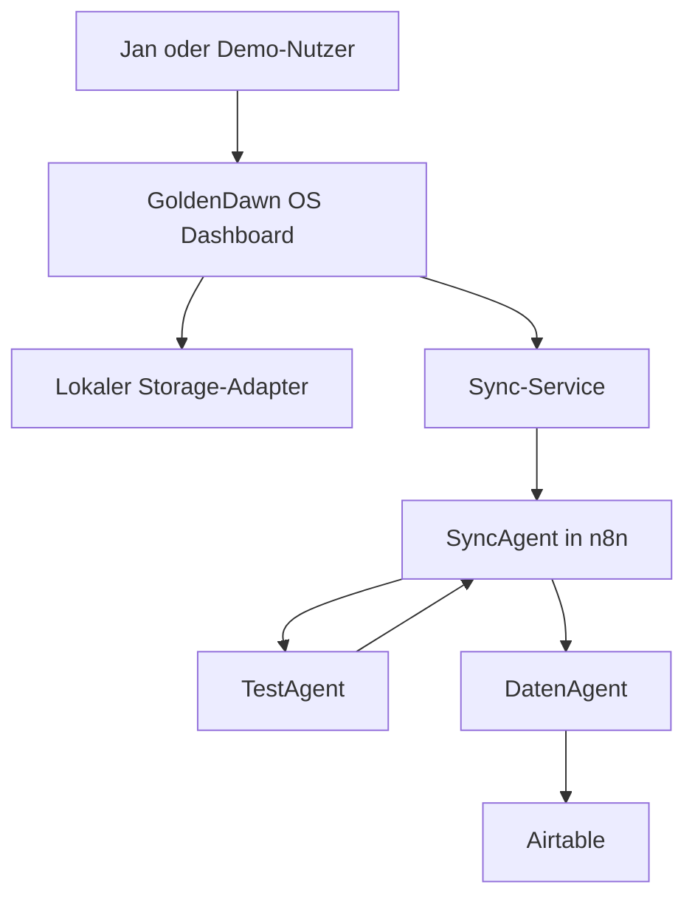
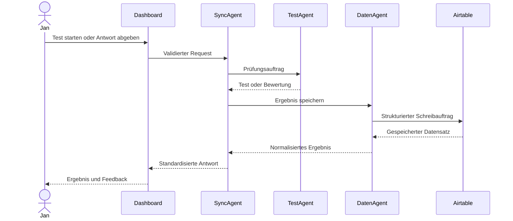

# GoldenDawn OS – Architektur

## Dokumentstatus

| Feld | Wert |
| --- | --- |
| Projektphase | `v0.1.0 – Foundation` |
| Architekturumfang | Zielarchitektur für Version 1 |
| Status | Initiale Entscheidung |
| Letzte Aktualisierung | 2026-07-11 |

Dieses Dokument beschreibt die verbindliche Zielarchitektur für Version 1 von
GoldenDawn OS. Es konkretisiert die Regeln aus `AGENTS.md` und dient als
Referenz für Frontend, n8n-Workflows, Airtable-Struktur und spätere
Implementierungsentscheidungen.

## Architekturziele

GoldenDawn OS soll:

- lokal früh nutzbar und testbar sein;
- externe Kommunikation über eine einzige kontrollierte Schnittstelle führen;
- Benutzeroberfläche, Speicherung, Routing, Prüfungslogik und Datenzugriff klar
  voneinander trennen;
- ohne Secrets im Frontend auskommen;
- private Daten und öffentliche Demo-Daten getrennt halten;
- durch kleine, überprüfbare Schritte wachsen;
- die Zusammenarbeit spezialisierter Agenten nachvollziehbar demonstrieren.

## Umfang von Version 1

Version 1 verwendet ausschließlich drei Agentenrollen:

| Agent | Verantwortung | Darf nicht |
| --- | --- | --- |
| `SyncAgent` | Requests validieren, klassifizieren und routen | Fachlogik oder Airtable-Zugriffe übernehmen |
| `TestAgent` | Lerntests erstellen, Antworten bewerten und Feedback liefern | Ergebnisse direkt speichern oder Airtable aufrufen |
| `DatenAgent` | Strukturierte Daten lesen, schreiben und in Airtable verwalten | Prüfungslogik oder UI-Aufgaben übernehmen |

Weitere Agenten sind nicht Teil von Version 1. Sie werden erst nach einer
Auswertung dieser Architektur geplant.

## Nicht-Ziele von Version 1

Folgende Punkte werden bewusst nicht umgesetzt:

- zusätzliche Agentenrollen;
- ein eigenes Backend neben n8n;
- direkte Airtable- oder OpenAI-Aufrufe aus dem Frontend;
- Authentifizierung und Mehrbenutzerverwaltung;
- autonome GitHub-Commits oder Releases durch Coding-Agenten;
- produktive Verarbeitung privater Daten in einer öffentlichen Demo;
- komplexes Event-Sourcing oder eine Microservice-Architektur;
- ein Frontend-Framework wie React ohne neue Architekturentscheidung.

## Systemkontext



Der Pfeil vom `TestAgent` zurück zum `SyncAgent` zeigt, dass Testergebnisse
zunächst an die zentrale Orchestrierung zurückgegeben werden. Wenn sie
gespeichert werden sollen, erstellt der `SyncAgent` daraus einen strukturierten
Auftrag für den `DatenAgent`.

## Zentrale Architekturregel

Das Dashboard kommuniziert langfristig ausschließlich über den Sync-Service
mit dem Agentensystem. Innerhalb des Agentensystems ist der `SyncAgent` der
zentrale Einstiegspunkt. Airtable wird ausschließlich durch den `DatenAgent`
angesprochen.

```text
Dashboard
  → Sync-Service
  → SyncAgent
  → TestAgent oder DatenAgent
  → Airtable ausschließlich über DatenAgent
```

Diese Regel verhindert:

- verteilte und schwer auffindbare externe Datenzugriffe;
- Secrets in UI-Komponenten;
- doppelte Validierungs- und Routinglogik;
- direkte Abhängigkeiten zwischen Benutzeroberfläche und Airtable-Schema;
- vermischte Verantwortlichkeiten der Agenten.

## Frontend-Schichten

### UI-Komponenten

UI-Komponenten übernehmen:

- Darstellung;
- Benutzerinteraktionen;
- zugängliche Lade-, Leer-, Erfolgs- und Fehlerzustände;
- Übergabe von Benutzeraktionen an Modul- oder Anwendungsservices.

UI-Komponenten übernehmen nicht:

- direkten Zugriff auf `localStorage`;
- Aufbau beliebiger Webhook-Payloads;
- Airtable-, n8n- oder OpenAI-Aufrufe;
- fachliche Datenmigrationen;
- Speicherung von Secrets.

### Modul- und Anwendungsservices

Services koordinieren die Anwendungslogik eines Moduls. Sie:

- validieren Eingaben für den lokalen Anwendungsfall;
- rufen Storage-Adapter oder den Sync-Service auf;
- übersetzen technische Fehler in verständliche Anwendungszustände;
- halten UI-Komponenten unabhängig von konkreten Datenquellen.

### Storage-Adapter

Storage-Adapter kapseln die lokale Speicherung. Sie:

- besitzen die verwendeten `localStorage`-Keys;
- serialisieren und deserialisieren Daten;
- liefern bei fehlenden oder beschädigten Daten sichere Fallback-Werte;
- enthalten spätere lokale Datenmigrationen;
- stellen fachlich benannte Funktionen bereit.

Beispiel:

```js
loadPrompts()
savePrompt(prompt)
loadLearningProgress()
saveLearningProgress(progress)
```

### Sync-Service

Der Sync-Service ist die einzige externe Kommunikationsschicht des Frontends.
Er:

- erstellt Requests nach dem dokumentierten Sync-Vertrag;
- sendet Requests an den n8n-Webhook;
- verarbeitet standardisierte Antworten;
- behandelt Timeouts, Netzwerkfehler und ungültige Antworten kontrolliert;
- unterstützt einen lokalen Modus ohne konfigurierte Webhook-Verbindung.

Der Sync-Service enthält keine Prüfungs- oder Airtable-Fachlogik.

## Agentenverantwortung

### SyncAgent

Der `SyncAgent` ist Gateway und Orchestrator. Er:

1. nimmt einen Request vom Sync-Service entgegen;
2. prüft Version, Aktion, Quelle, Zeitstempel und Payload;
3. erzeugt oder übernimmt eine `requestId`;
4. klassifiziert die Anfrage;
5. routet sie an `TestAgent` oder `DatenAgent`;
6. normalisiert das Ergebnis;
7. gibt eine standardisierte Antwort an das Dashboard zurück.

Der `SyncAgent` darf keine Airtable-Credentials verwenden und keine
fachspezifische Prüfungsbewertung durchführen.

### TestAgent

Der `TestAgent` ist der Prüfer für Lerninhalte. Er verarbeitet klar abgegrenzte
Aufgaben wie:

- einen Test aus einem freigegebenen Lernkontext erstellen;
- Fragen und erwartete Antwortmerkmale strukturieren;
- eine Antwort nach dokumentierten Kriterien bewerten;
- Punktzahl, Feedback und Wiederholungshinweise zurückgeben.

Der `TestAgent` erhält nur den Lernkontext, der für die konkrete Prüfung nötig
ist. Er schreibt nicht direkt in Airtable und verändert nicht selbstständig den
Lernfortschritt.

### DatenAgent

Der `DatenAgent` ist Bibliothekar und Datenverwalter. Er:

- validiert strukturierte Datenaufträge;
- ordnet fachliche Entitäten den richtigen Airtable-Tabellen zu;
- liest und schreibt Datensätze;
- normalisiert Airtable-Antworten;
- verhindert, dass Airtable-interne Feldnamen in die UI durchsickern;
- liefert verständliche Fehler an den `SyncAgent` zurück.

Nur der `DatenAgent` besitzt in Version 1 Zugriff auf Airtable-Credentials.

## Betriebsmodi

### Lokaler Modus

Der lokale Modus ist der Ausgangspunkt und bleibt als sicherer Fallback
erhalten.

```text
UI → Service → Storage-Adapter → localStorage
```

Eigenschaften:

- keine externe Verbindung erforderlich;
- Mock- oder lokale Daten;
- vollständige lokale Nutzbarkeit des jeweiligen MVP-Moduls;
- keine Fehlermeldung allein wegen einer fehlenden Webhook-Konfiguration.

### Verbundener Modus

Der verbundene Modus ergänzt die lokale Anwendung um kontrollierte externe
Verarbeitung.

```text
UI → Service → Sync-Service → SyncAgent → Fachagent
```

Ein Modul entscheidet nicht selbst, welcher Fachagent angesprochen wird. Diese
Entscheidung liegt beim `SyncAgent`.

## Sync-Vertrag

Der grundlegende Request-Umschlag lautet:

```json
{
  "version": "1.0",
  "action": "syncTest",
  "source": "goldendawn-os",
  "requestId": "req_example_001",
  "timestamp": "2026-07-11T12:00:00.000Z",
  "payload": {}
}
```

Eine standardisierte Antwort soll mindestens folgende Struktur unterstützen:

```json
{
  "version": "1.0",
  "success": true,
  "requestId": "req_example_001",
  "handledBy": "SyncAgent",
  "action": "syncTest",
  "data": {},
  "error": null
}
```

Die konkreten Aktionen, Payloads und Antwortdaten werden verbindlich in
`docs/data-contracts.md` definiert. Dieses Dokument legt nur den gemeinsamen
Umschlag und die Verantwortungsgrenzen fest.

## Ablauf eines Lerntests



Falls die Speicherung fehlschlägt, müssen Testergebnis und Speicherstatus
unterscheidbar bleiben. Eine fachlich erfolgreiche Bewertung darf nicht als
fehlgeschlagener Test dargestellt werden, nur weil Airtable vorübergehend nicht
erreichbar ist.

## Fehlerbehandlung

Fehler werden an der Schicht behandelt, die genügend Kontext dafür besitzt:

| Fehlerart | Verantwortliche Schicht |
| --- | --- |
| Ungültige Formulareingabe | UI oder Modulservice |
| Beschädigte lokale JSON-Daten | Storage-Adapter |
| Netzwerkfehler oder Timeout | Sync-Service |
| Ungültiger Request-Vertrag | SyncAgent |
| Fehlerhafte Prüfungsantwort | TestAgent |
| Airtable- oder Mappingfehler | DatenAgent |

Grundregeln:

- Fehler dürfen die Anwendung nicht unkontrolliert zum Absturz bringen.
- Nutzer erhalten verständliche Meldungen ohne Secrets oder interne Details.
- Technische Fehler enthalten für die Diagnose eine stabile Fehlerkennung.
- Ein Agent gibt Fehler strukturiert an den `SyncAgent` zurück.
- Wiederholungen müssen begrenzt sein und dürfen keine doppelten Datensätze
  erzeugen.

## Sicherheit

- Airtable- und Modell-Credentials liegen ausschließlich in n8n oder einer
  späteren serverseitigen Umgebung.
- `VITE_*`-Variablen gelten als öffentlich und dürfen keine Secrets enthalten.
- Eine Webhook-URL wird nicht als alleiniger Schutzmechanismus betrachtet.
- Requests werden im Frontend und erneut im `SyncAgent` validiert.
- Payload-Größe, erlaubte Aktionen und Datentypen werden begrenzt.
- Logs enthalten keine Tokens oder unnötigen personenbezogenen Daten.
- Private und öffentliche Daten verwenden getrennte Airtable-Bases,
  Konfigurationen und Deployments.
- Die öffentliche Demo verwendet ausschließlich synthetische Daten.

Weitere Details werden in `docs/security.md` dokumentiert.

## Vorgesehene Projektstruktur

```text
src/
├── app/
├── components/
├── modules/
├── services/
│   └── syncService.js
├── storage/
├── contracts/
├── data/
│   └── mock/
├── utils/
└── styles/

automation/
└── n8n/
    └── workflows/

schemas/
└── airtable/

docs/
├── architecture.md
├── roadmap.md
├── security.md
├── data-contracts.md
└── decisions/
```

Die Struktur wird nur angelegt, wenn die zugehörigen Dateien tatsächlich
benötigt werden. Leere Architekturordner werden vermieden.

## Implementierungsreihenfolge

| Phase | Ergebnis |
| --- | --- |
| 0 | Dokumentation, Vite-Grundlage und Architekturregeln |
| 1 | Lokal nutzbares Dashboard und PromptVault mit Mock-Daten |
| 2 | Sync-Service und dokumentierter Request-Vertrag |
| 3 | SyncAgent mit Webhook und reproduzierbarem `syncTest` |
| 4 | DatenAgent mit minimalem Airtable-Lese- und Schreibfluss |
| 5 | TestAgent für Erstellung und Bewertung eines Lerntests |
| 6 | Durchgängiger Testfluss mit kontrollierter Ergebnisspeicherung |
| 7 | Demo-Datensatz, Sicherheitshärtung und Portfolio-Dokumentation |

Jede Phase muss lokal überprüfbar und dokumentiert sein, bevor die nächste
begonnen wird.

## Architekturentscheidungen

Wesentliche Entscheidungen werden als Architecture Decision Records unter
`docs/decisions/` festgehalten. Mindestens folgende Entscheidungen sind
vorgesehen:

1. Vite und Vanilla JavaScript als Frontend-Grundlage;
2. SyncAgent als einziges Gateway des Dashboards;
3. DatenAgent als einzige Airtable-Schnittstelle;
4. Trennung von privaten und öffentlichen Daten;
5. Begrenzung von Version 1 auf drei Agenten.

## Änderungsregel

Eine Änderung an Agentenrollen, Datenfluss, Systemgrenzen, Sync-Vertrag oder
Sicherheitsmodell erfordert:

1. Aktualisierung dieses Dokuments;
2. gegebenenfalls einen neuen ADR;
3. Abgleich mit `AGENTS.md`, `README.md`, `docs/security.md` und
   `docs/data-contracts.md`;
4. einen manuellen Pull Request mit nachvollziehbarer Begründung.
