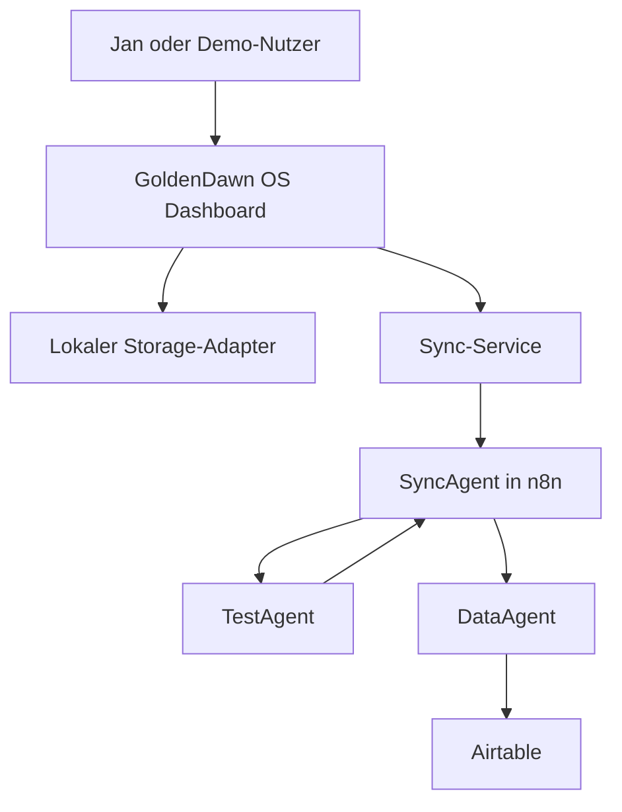
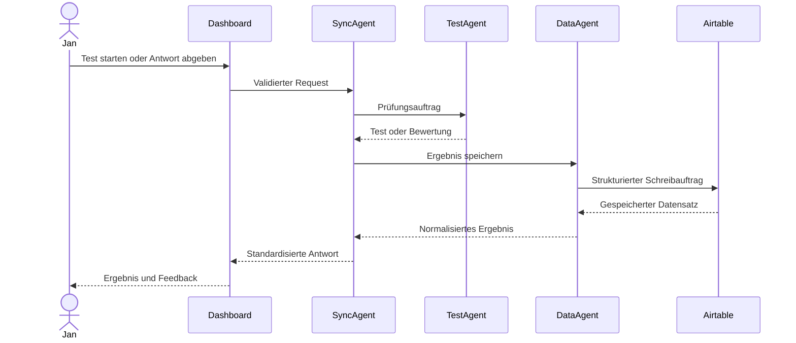

# GoldenDawn OS – Architektur

## Dokumentstatus

| Feld | Wert |
| --- | --- |
| Projektphase | `v0.2.2 – LichtwaldLog Local MVP in Arbeit` |
| Architekturumfang | Zielarchitektur für Version 1 |
| Status | Verbindliche Zielarchitektur; v0.2.1 veröffentlicht; LichtwaldLog Contract- und private Storage-Foundation implementiert |
| Letzte Aktualisierung | 2026-07-26 |

Dieses Dokument beschreibt die verbindliche Zielarchitektur für Version 1 von
GoldenDawn OS. Es konkretisiert die Regeln aus `AGENTS.md` und dient als
Referenz für Frontend, n8n-Workflows, Airtable-Struktur und spätere
Implementierungsentscheidungen.

## Architekturziele

GoldenDawn OS soll:

- lokal früh nutzbar und testbar sein;
- externe Kommunikation über eine einzige kontrollierte Schnittstelle führen;
- Benutzeroberfläche, Speicherung, Routing, Prüfungslogik und Datenzugriff klar
  voneinander trennen;
- ohne Secrets im Frontend auskommen;
- private Daten und öffentliche Demo-Daten getrennt halten;
- durch kleine, überprüfbare Schritte wachsen;
- die Zusammenarbeit spezialisierter Agenten nachvollziehbar demonstrieren.

## Umfang von Version 1

Version 1 verwendet ausschließlich drei Agentenrollen:

| Agent | Verantwortung | Darf nicht |
| --- | --- | --- |
| `SyncAgent` | Requests validieren, klassifizieren und routen | Fachlogik oder Airtable-Zugriffe übernehmen |
| `TestAgent` | Lerntests erstellen, Antworten bewerten und Feedback liefern | Ergebnisse direkt speichern oder Airtable aufrufen |
| `DataAgent` | Strukturierte Daten lesen, schreiben und in Airtable verwalten | Prüfungslogik oder UI-Aufgaben übernehmen |

Weitere Agenten sind nicht Teil von Version 1. Sie werden erst nach einer
Auswertung dieser Architektur geplant.

## Nicht-Ziele von Version 1

Folgende Punkte werden bewusst nicht umgesetzt:

- zusätzliche Agentenrollen;
- ein eigenes Backend neben n8n;
- direkte Airtable- oder OpenAI-Aufrufe aus dem Frontend;
- Authentifizierung und Mehrbenutzerverwaltung;
- autonome GitHub-Commits oder Releases durch Coding-Agenten;
- produktive Verarbeitung privater Daten in einer öffentlichen Demo;
- komplexes Event-Sourcing oder eine Microservice-Architektur;
- ein Frontend-Framework wie React ohne neue Architekturentscheidung.

## Systemkontext



Der Pfeil vom `TestAgent` zurück zum `SyncAgent` zeigt, dass Testergebnisse
zunächst an die zentrale Orchestrierung zurückgegeben werden. Wenn sie
gespeichert werden sollen, erstellt der `SyncAgent` daraus einen strukturierten
Auftrag für den `DataAgent`.

## Zentrale Architekturregel

Das Dashboard kommuniziert langfristig ausschließlich über den Sync-Service
mit dem Agentensystem. Innerhalb des Agentensystems ist der `SyncAgent` der
zentrale Einstiegspunkt. Airtable wird ausschließlich durch den `DataAgent`
angesprochen.

```text
Dashboard
  → Sync-Service
  → SyncAgent
  → TestAgent oder DataAgent
  → Airtable ausschließlich über DataAgent
```

Diese Regel verhindert:

- verteilte und schwer auffindbare externe Datenzugriffe;
- Secrets in UI-Komponenten;
- doppelte Validierungs- und Routinglogik;
- direkte Abhängigkeiten zwischen Benutzeroberfläche und Airtable-Schema;
- vermischte Verantwortlichkeiten der Agenten.

## Frontend-Schichten

### UI-Komponenten

UI-Komponenten übernehmen:

- Darstellung;
- Benutzerinteraktionen;
- zugängliche Lade-, Leer-, Erfolgs- und Fehlerzustände;
- Übergabe von Benutzeraktionen an Modul- oder Anwendungsservices.

UI-Komponenten übernehmen nicht:

- direkten Zugriff auf `localStorage`;
- Aufbau beliebiger Webhook-Payloads;
- Airtable-, n8n- oder OpenAI-Aufrufe;
- fachliche Datenmigrationen;
- Speicherung von Secrets.

### Modul- und Anwendungsservices

Services koordinieren die Anwendungslogik eines Moduls. Sie:

- validieren Eingaben für den lokalen Anwendungsfall;
- rufen Storage-Adapter oder den Sync-Service auf;
- übersetzen technische Fehler in verständliche Anwendungszustände;
- halten UI-Komponenten unabhängig von konkreten Datenquellen;
- verwenden bei persistenten Modulen den Storage als autoritative Quelle und
  führen keine zweite dauerhaft veränderliche In-Memory-Wahrheit.

### Storage-Adapter

Fachliche Storage-Schichten kapseln die lokale Speicherung einer Domäne. Sie
besitzen feste, nicht nutzerkontrollierte `localStorage`-Keys, validieren
Domänenobjekte und stellen fachlich benannte Lade- und Speicherfunktionen
bereit. Der gemeinsame `StorageAdapter` wird per Dependency Injection
bereitgestellt und übernimmt den technischen JSON-Lese- und Schreibzugriff.
`readJson(key, options?)` und `writeJson(key, value, options?)` akzeptieren
optional `maxSerializedLength` als positive sichere Ganzzahl. Ohne diese Option
bleibt das Verhalten aller bestehenden Aufrufer unverändert. Beim Lesen wird
ein vorhandener String vor dem Parsen, beim Schreiben die exakt einmal erzeugte
JSON-Zeichenfolge vor dem eigentlichen Storage-Zugriff begrenzt. Eine ungültige
Limitkonfiguration wird vor Storage- oder Serialisierungszugriffen abgelehnt.
Für den in ADR 0012 begrenzten Multi-Store-Erststart bietet er zusätzlich
`removeJsonIfUnchanged`: Der technische Rollback entfernt einen Wert nur,
wenn dessen aktuelle Serialisierung noch exakt dem erwarteten Seed entspricht.
Dieser Pfad ist keine allgemeine fachliche Löschoperation und seine Semantik
wird durch die optionale Größenbegrenzung nicht verändert. Auch ein
Fehlerobjekt mit nicht sicher lesbarem `name` wird innerhalb des gemeinsamen
Adapters kontrolliert als allgemeiner Lese-, Schreib- oder Entfernungsfehler
behandelt.

Fehlende Daten werden von beschädigtem JSON, ungültigen Domänendaten und
Adapterfehlern unterschieden. Ein fachlicher leerer Initialzustand darf nur für
einen fehlenden Key geliefert werden. Beschädigte oder ungültige gespeicherte
Daten werden nicht stillschweigend gelöscht, überschrieben oder durch
Fallback-Daten ersetzt. Migrationen werden erst nach einer eigenen
dokumentierten Entscheidung eingeführt.

Beispiel:

```js
loadPrompts()
savePrompt(prompt)
loadLearningHub()
saveLearningHub(learningHub)
loadLearningProgress()
saveLearningProgress(progress)
loadLearningArtifacts()
saveLearningArtifacts(artifactStore)
loadLearningTestBank()
saveLearningTestBank(testBank)
loadLearningTestAttempts()
appendLearningTestAttempt(attempt)
loadLichtwaldLog()
saveLichtwaldLog(lichtwaldLog)
```

### Sync-Service

Der Sync-Service ist die einzige externe Kommunikationsschicht des Frontends.
Er:

- erstellt Requests nach dem dokumentierten Sync-Vertrag;
- sendet Requests an den n8n-Webhook;
- verarbeitet standardisierte Antworten;
- behandelt Timeouts, Netzwerkfehler und ungültige Antworten kontrolliert;
- unterstützt einen lokalen Modus ohne konfigurierte Webhook-Verbindung.

Der Sync-Service enthält keine Prüfungs- oder Airtable-Fachlogik.

## Agentenverantwortung

### SyncAgent

Der `SyncAgent` ist Gateway und Orchestrator. Er:

1. nimmt einen Request vom Sync-Service entgegen;
2. prüft Version, Aktion, Quelle, Zeitstempel und Payload;
3. erzeugt oder übernimmt eine `requestId`;
4. klassifiziert die Anfrage;
5. routet sie an `TestAgent` oder `DataAgent`;
6. normalisiert das Ergebnis;
7. gibt eine standardisierte Antwort an das Dashboard zurück.

Der `SyncAgent` darf keine Airtable-Credentials verwenden und keine
fachspezifische Prüfungsbewertung durchführen.

### TestAgent

Der `TestAgent` ist der Prüfer für Lerninhalte. Er verarbeitet klar abgegrenzte
Aufgaben wie:

- einen Test aus einem freigegebenen Lernkontext erstellen;
- Fragen und erwartete Antwortmerkmale strukturieren;
- eine Antwort nach dokumentierten Kriterien bewerten;
- Punktzahl, Feedback und Wiederholungshinweise zurückgeben.

Der `TestAgent` erhält nur den Lernkontext, der für die konkrete Prüfung nötig
ist. Er schreibt nicht direkt in Airtable und verändert nicht selbstständig den
Lernfortschritt.

### DataAgent

Der `DataAgent` ist Bibliothekar und Datenverwalter. Er:

- validiert strukturierte Datenaufträge;
- ordnet fachliche Entitäten den richtigen Airtable-Tabellen zu;
- liest und schreibt Datensätze;
- normalisiert Airtable-Antworten;
- verhindert, dass Airtable-interne Feldnamen in die UI durchsickern;
- liefert verständliche Fehler an den `SyncAgent` zurück.

Nur der `DataAgent` besitzt in Version 1 Zugriff auf Airtable-Credentials.

## Betriebsmodi

### Lokaler Modus

Der lokale Modus ist der Ausgangspunkt und bleibt als sicherer Fallback
erhalten.

```text
UI → Service → Storage-Adapter → localStorage
```

Eigenschaften:

- keine externe Verbindung erforderlich;
- Mock- oder lokale Daten;
- vollständige lokale Nutzbarkeit des jeweiligen MVP-Moduls;
- keine Fehlermeldung allein wegen einer fehlenden Webhook-Konfiguration.

### Lokale Module der Reihe v0.2.x

Die Reihe `v0.2.x` ist bewusst lokalen GoldenDawn-OS-Modulen vorbehalten.
Alle Datenzugriffe bleiben hinter Modulservices und Storage-Adaptern. Erst
`v0.3.0` beginnt mit externer Kommunikation über den Sync-Service.

#### LearningHub Local MVP in v0.2.1

LearningHub bleibt ein begrenztes lokales Lernmodul und kein allgemeines
Learning-Management-System. Die verbindliche fachliche Hierarchie von Schema 2
lautet:

```text
LearningHub
  → LearningModule
  → LearningChapter
  → LearningNode
```

Der interne Schema-2-Vertrag unterstützt mehrere nutzerkonfigurierte Module
direkt im `modules`-Array. Ein neuer Hub darf leer sein; jedes persistierbare
LearningModule besitzt mindestens ein LearningChapter. Alle Kapitel sind
implizit trackbar und dürfen noch keine LearningNodes enthalten. LearningNodes
sind selbst erstellte Textkarten innerhalb genau eines Kapitels. Course, Unit,
normalisierte Knotentypen, `parentId` und `isTrackable` gehören nicht zum
Vertrag.

Der implementierte vollständige Pfad für lokale LearningHub-Inhalte lautet:

```text
LearningHubView
  → LearningHubController
  → LearningHubService
  → LearningHubStorage
  → StorageAdapter
  → localStorage
```

`LearningHubView` rendert Lade-, Leer-, Inhalts-, Mutations-, Erfolgs- und
Fehlerzustände mit sicheren DOM-Text-APIs. `LearningHubController` hält
Modulauswahl, geöffnete Kapitel, Node-Auswahl und Formularzustände flüchtig,
fängt Servicefehler kontrolliert ab und reicht persistente Inhaltsmutationen
ausschließlich an `LearningHubService` weiter. Der Service stellt `loadHub`,
`createModule`, `renameModule`, `addChapter`, `renameChapter`,
`addLearningNode` und `updateLearningNode` bereit; `LearningHubStorage`
kapselt `loadLearningHub` und `saveLearningHub`. Fortschrittsmutationen gehen
getrennt an `LearningProgressService`. View und Controller greifen nicht direkt
auf `localStorage` zu.

Der Inhaltsservice verwendet den persistenten Hub als autoritative Quelle. Jede
Mutation lädt den aktuellen Zustand, prüft Ziel und Eingaben, erzeugt einen
neuen Zustand ohne Mutation des geladenen Hubs, validiert den vollständigen
Schema-2-Vertrag und speichert genau einmal. `createModule` legt ein Modul und
sein erstes Kapitel atomar an, weil ein persistierbares LearningModule niemals
ohne Kapitel gespeichert werden darf. Neue IDs entstehen ausschließlich im
Service; neue Positionen werden robust hinter der höchsten vorhandenen
Geschwisterposition vergeben.

LearningNode-Aktionen sind Service-, Controller- und UI-Fähigkeiten, keine
Datenfelder. Der aktuelle Inhaltsservice unterstützt Hinzufügen und Bearbeiten;
Löschen, Archivieren und Umsortieren sind noch nicht implementiert.

Die Schema-2-Foundation definiert weiterhin nur die Inhaltsstruktur und deren
Validierung. Die getrennt implementierten View-, Controller-, Service- und
Storage-Schichten machen private Schema-2-Inhalte bedienbar und persistieren
sie unter dem festen Key
`goldendawn.learningHub.content.v1`. Ein fehlender Key liefert nur im
Arbeitsspeicher einen frischen leeren privaten Hub und löst keinen
Schreibzugriff aus. Dies bleibt das Verhalten der einzelnen Ladeoperation.

Vorgelagert koordiniert `src/main.js` einmalig den vollständig uninitialisierten
Erststart:

```text
LearningHubDemoInitializer
  ├→ LearningHubDemoInitializationStorage → StorageAdapter
  ├→ LearningHubStorage                   → StorageAdapter
  ├→ LearningArtifactStorage              → StorageAdapter
  └→ LearningTestBankStorage              → StorageAdapter
```

Der tief unveränderliche kanonische Demo-Datensatz trägt
`dataOrigin: synthetic` und enthält genau ein Modul, drei Kapitel, vier
LearningNodes, acht LearningArtifacts und sieben Fragen. Erst nach
vollständiger Produktionsvalidierung und
gemeinsamer Referenzprüfung erzeugt der Koordinator defensive private
Arbeitskopien und schreibt sie sequenziell über die drei bestehenden
Fachstorages. Das ist ausschließlich erlaubt, wenn Inhaltsstore,
Artifact-Store, Testbank und der Marker
`goldendawn.learningHub.demoInitialization.v1` sämtlich fehlen. Jeder
vorhandene Fachstore – auch ein leerer oder nicht auswertbarer – verhindert
das Seeding und wird nicht verändert. Der zuletzt geschriebene Marker hält die
Entscheidung `seeded` oder `skippedExistingData` dauerhaft fest.

Bei einem Speicherfehler entfernt der Rollback nur noch bytegenau mit dem
vorbereiteten Seed übereinstimmende Werte; fremde oder zwischenzeitlich
geänderte Daten bleiben unangetastet. Wiederholte Aufrufe sind schreibfrei,
Bearbeitungen bleiben erhalten und ein später gelöschtes Demo kehrt bei
erhaltenem Marker nicht zurück. Progress und Attempt-Historie werden nicht
vorbefüllt. Der Ablauf verwendet weder Netzwerk noch KI. Private Nutzerdaten
werden nie in die synthetische Repository-Quelle übernommen. Die gezielte
Erweiterung der bisherigen Demo-Trennung ist in ADR 0012 dokumentiert.

Kapitelabschluss und daraus abgeleiteter Modulfortschritt sind in einer davon
getrennten, implementierten Progress-Foundation modelliert und über dieselbe
View sowie denselben Controller bedienbar. Sie erweitert den Inhaltsvertrag
nicht um veränderliche `completed`-Felder und verwendet diesen Datenfluss:

```text
LearningProgressService
  ├→ LearningHubService
  │   → LearningHubStorage
  │   → StorageAdapter
  │
  └→ LearningProgressStorage
      → StorageAdapter
      → localStorage
```

Der Progress-Vertrag besitzt `schemaVersion: 1`, `dataOrigin` und ein
`events`-Array. Schema 1 unterstützt ausschließlich `chapter.completed` und
`chapter.reopened`; `chapter.started` ist bewusst noch nicht implementiert und
würde eine versionierte Vertragsänderung erfordern. Die Arrayreihenfolge ist
für den Kapitelstatus autoritativ, das jeweils letzte Ereignis eines Kapitels
gewinnt und `occurredAt` wird niemals zum Sortieren verwendet.

`LearningProgressService` stellt `loadProgress`, `completeChapter` und
`reopenChapter` bereit. Er verwendet `LearningHubService` ausschließlich zum
Laden des aktuellen validen Inhaltsstands und zur Prüfung der Modul-, Kapitel-
und Eigentumsreferenzen; der Inhaltsservice besitzt keine Rückabhängigkeit.
Damit entsteht keine gegenseitige oder zirkuläre Service-Abhängigkeit.
Verwaiste oder falsch zugeordnete gespeicherte Ereignisse werden kontrolliert
abgelehnt und nicht repariert. Eine echte Zustandsänderung hängt genau ein
Ereignis an und speichert den vollständig validierten Log genau einmal. Ein
bereits erreichter Zielzustand ist ein erfolgreicher, schreibfreier No-op mit
`changed: false` und erzeugt weder ID noch Zeitstempel.

Die reine Progress-Projektion kopiert keine Titel oder LearningNode-Inhalte.
Sie folgt der Modul- und Kapitelreihenfolge des aktuellen Inhaltsvertrags und
liefert je Modul Kapitelstatus, abgeschlossene und gesamte Kapitel,
ganzzahligen Prozentfortschritt sowie den abgeleiteten Abschlussstatus. Ein
leerer Hub ergibt eine leere Modulprojektion. Module mit 100 Prozent bleiben
vollständig erhalten. Fortschritt und spätere Testkompetenz bleiben getrennte
Konzepte.

`src/main.js` injiziert `LearningProgressService` zusätzlich zum
`LearningHubService` in den vorhandenen `LearningHubController`; ein eigener
Progress-Controller oder eine Rückabhängigkeit vom Inhaltsservice entsteht
nicht. Beim Öffnen lädt der Controller zuerst den Hub und anschließend den
Fortschritt. Im UI-Zustand hält er nur die defensiv gegen Modul- und
Kapitel-IDs sowie Zähler und Prozentwerte geprüfte Projektion, nie den rohen
Ereignislog. Die View verbindet Inhalt und Projektion ausschließlich über
stabile IDs und berechnet den Prozentwert nicht neu.

Ein isolierter Progress-Ladefehler lässt die Inhaltsverwaltung bedienbar,
kennzeichnet Fortschritt ohne falsche 0-Prozent-Anzeige als nicht verfügbar,
deaktiviert Abschlussfelder und bietet einen nicht destruktiven Retry. Der
Controller löscht, repariert oder überschreibt dabei keine beschädigten oder
verwaisten Progress-Daten. Fehlgeschlagene Progress-Mutationen erhalten die
letzte valide Projektion; es gibt keine dauerhafte optimistische Änderung.
Während einer Mutation werden konkurrierende Inhalts- und Progress-Aktionen
gesperrt. Auswahl, Accordions, LearningNode und Formularwerte bleiben erhalten,
und der Fokus kehrt nach Erfolg oder Fehler zum betroffenen Markierungsfeld
zurück.

Nach `createModule` und `addChapter` lädt der Controller die Projektion neu,
weil sich ihre Modul- und Kapitelmenge geändert hat. Scheitert dieser Refresh
nach einer bereits erfolgreichen Inhaltsmutation, wird die Inhaltsänderung
nicht zurückgerollt; die alte Projektion wird stattdessen als nicht mehr
verfügbar beziehungsweise veraltet behandelt und kann erneut geladen werden.
Umbenennungen und LearningNode-Mutationen erhalten die aktuelle Projektion.

Die View zeigt auf Modulkarten und im Moduldetail den gelieferten Zähler und
Prozentwert, im Detail zusätzlich einen zugänglich benannten Fortschrittsbalken.
Jedes Kapitel besitzt ein natives Markierungsfeld mit sichtbarem Label, getrennt
vom Accordion-Toggle. Fortschritt wird damit nicht nur über Farbe vermittelt.
Erfolgsmeldungen verwenden `role="status"`, Fehler `role="alert"`; Busy- und
Disabled-Zustände verhindern Mehrfachauslösungen. Private Titel und Inhalte
werden weiterhin nur über sichere DOM-Text-APIs gerendert. Abgeschlossene
Module bleiben sichtbar und bedienbar.

`LearningProgressStorage` kapselt `loadLearningProgress` und
`saveLearningProgress` unter dem festen Key
`goldendawn.learningHub.progress.v1`. Das `v1` des Persistenznamespace und
`schemaVersion: 1` des Vertrags sind getrennte Versionen. Der private
Storage-Pfad akzeptiert nur `dataOrigin: private`; ein fehlender Key liefert
ohne Initialisierungsschreibzugriff einen frischen leeren privaten Log.
Synthetische, beschädigte und nicht unterstützte gespeicherte Werte bleiben
unangetastet.

Notizen und Zusammenfassungen besitzen zusätzlich einen getrennten,
implementierten LearningArtifact-Pfad und sind über den vorhandenen Controller
und die View lokal bedienbar. Der vollständige Datenfluss lautet:

```text
LearningHubView
  → LearningHubController
  → LearningArtifactService
      ├→ LearningHubService
      │   → LearningHubStorage
      │   → StorageAdapter
      │
      └→ LearningArtifactStorage
          → StorageAdapter
          → localStorage
```

Der Artifact-Service verwendet den Inhaltsservice nur zum Laden des aktuellen
validen privaten Hubs und zur Prüfung der vollständigen Referenzkette
LearningModule → LearningChapter → LearningNode. Der Inhaltsservice kennt den
Artifact-Service nicht; es entsteht keine Rückabhängigkeit und kein Zyklus.
Vor einer Mutation werden sowohl die Zielreferenz als auch alle gespeicherten
Artefaktreferenzen geprüft. Global vorhandene IDs mit falscher Elternkette und
verwaiste gespeicherte Referenzen werden kontrolliert abgelehnt, ohne Daten zu
reparieren oder zu überschreiben.

Der LearningArtifact-Vertrag verwendet `schemaVersion: 1`, `dataOrigin` und ein
`artifacts`-Array. Zulässige Typen sind ausschließlich `note` und `summary`.
Artefakt-IDs sind im Store global eindeutig; zusätzlich ist die Kombination aus
`learningNodeId` und `type` eindeutig. Pro LearningNode kann somit höchstens ein
aktueller Arbeitsstand je Typ existieren, während Notiz und Zusammenfassung
nebeneinander erlaubt sind. Gespeichert werden stabile Modul-, Kapitel- und
LearningNode-Referenz-IDs, der private Artefakttext sowie Erstellungs- und
Änderungszeitpunkt. Titel und Inhalte des LearningHubs werden nicht kopiert.

LearningArtifacts sind editierbare aktuelle Zustände und kein append-only
Ereignislog. Sie besitzen in Schema 1 keine Versionshistorie. Der
`LearningArtifactService` stellt `loadArtifacts`, `saveNote`, `saveSummary`,
`clearNote` und `clearSummary` bereit. Beim Aktualisieren bleiben ID und
`createdAt` stabil; `updatedAt` darf nicht zurücklaufen. Inhaltlich identische
Speicheraufrufe und das Leeren eines nicht vorhandenen Typs sind schreibfreie
No-ops, die weder ID noch Zeitstempel erzeugen. Eine echte Mutation validiert
den vollständigen neuen Store und speichert genau einmal; das Entfernen eines
Typs erhält das andere Artefakt desselben LearningNodes und die Reihenfolge
aller übrigen Artefakte.

`src/main.js` injiziert den `LearningArtifactService` zusätzlich zu Inhalts-
und Progress-Service in den vorhandenen `LearningHubController`; ein eigener
Artifact-Controller entsteht nicht. Der Controller lädt Artefakte getrennt und
gibt der View ausschließlich eine defensiv geprüfte UI-Projektion der aktuellen
Notiz und Zusammenfassung des ausgewählten LearningNodes. Artefakt-IDs,
Referenzketten und Zeitstempel werden weder gerendert noch als bearbeitbarer
UI-Zustand verwendet.

Ein isolierter Artifact-Ladefehler lässt Inhaltsverwaltung und Fortschritt
bedienbar, deaktiviert nur die Artefaktaktionen und bietet einen nicht
destruktiven Retry. Mutationsfehler erhalten die letzte valide Projektion und
den bearbeitbaren Text. Identische Saves werden als erfolgreiche No-ops
sichtbar, ohne einen Schreibzugriff auszulösen; der Service behandelt weiterhin
auch bereits leere Clear-Ziele schreibfrei. Das Leeren verwendet eine
zugängliche Inline-Bestätigung statt eines blockierenden Browserdialogs;
Busy-Zustände verhindern parallele Artefaktmutationen und der Fokus kehrt nach
Erfolg, No-op oder Fehler zum betroffenen Editor oder Auslöser zurück.

`LearningArtifactStorage` kapselt `loadLearningArtifacts` und
`saveLearningArtifacts` unter dem festen Key
`goldendawn.learningHub.artifacts.v1`. Das `v1` des Persistenznamespace und
`schemaVersion: 1` des Vertrags werden unabhängig versioniert. Der private
Pfad akzeptiert ausschließlich `dataOrigin: private`; ein fehlender Key liefert
ohne Schreibzugriff einen frischen leeren privaten Store. Synthetische,
beschädigte und nicht unterstützte gespeicherte Werte bleiben unangetastet.
Lese- und Schreibwerte werden defensiv geklont, der vollständige Store wird vor
jedem Save validiert und Storage- sowie Quota-Fehler werden kontrolliert
behandelt. Zusätzlich liest der Storage den festen Key unmittelbar vor einem
Save erneut: Ein vorhandener synthetischer, beschädigter, nicht unterstützter
oder nicht sicher lesbarer Wert blockiert den Schreibzugriff. Dieser
Read-Preflight ist keine Transaktion und verhindert keine Multi-Tab-Rennen.

Artefakttexte sind nach dem Trimmen nicht leer und auf 10.000 Zeichen pro
Artefakt begrenzt. Diese Grenze ersetzt keine Gesamtgrößenbegrenzung. Zeitwerte
verwenden das exakte kanonische UTC-Format `YYYY-MM-DDTHH:mm:ss.sssZ`;
`updatedAt` darf nicht vor `createdAt` liegen. Fehlermeldungen und Logs enthalten
keine privaten Texte, IDs, Referenzketten, Rohwerte oder Zeitstempel. Die
implementierte View gibt Artefakttexte ausschließlich mit `textContent`,
Formularwert-Eigenschaften oder gleichwertiger sicherer DOM-Erzeugung aus.

Append-only ist eine Anwendungsregel des Progress-Service. Technisch wird der
vollständige JSON-Log bei einer Änderung als Snapshot in `localStorage`
geschrieben. Es gibt keine kryptografische Verkettung, Signatur oder
Manipulationssperre; andere Skripte derselben Origin könnten den Speicher
verändern. Das Modell ist xAPI-inspiriert, aber nicht xAPI-konform, verwendet
kein LRS und beansprucht kein vollständiges Event Sourcing. Multi-Tab-Rennen,
Browser-Quota, fehlende Verschlüsselung und fehlende Synchronisierung bleiben
bekannte Grenzen.

Die Inhalts-, Progress- und Artifact-UI-Integrationen verändern weder den
Schema-2-Inhaltsvertrag noch die getrennten Schema-1-Verträge oder deren
Storage-Keys. Eine spätere Archivierung muss bestehende Ereignisse,
Artefaktreferenzen, Fragen und Attempts berücksichtigen; dauerhaftes Löschen
benötigt zuvor eine gesonderte Referenz- und Löschrichtlinie. Für die lokalen
LearningHub-Stores werden weder Migration noch garantierte
Multi-Tab-Synchronisierung oder Transaktionssperren eingeführt.

Die implementierte LearningTest-UI verwendet diesen ausschließlich lokalen
Pfad:

```text
LearningHubView
  → LearningHubController
      ├→ LearningHubService
      ├→ LearningProgressService
      ├→ LearningArtifactService
      └→ LearningTestService
          ├→ LearningHubService                Referenzprüfung
          ├→ LearningTestBankStorage
          │    → StorageAdapter
          │    → localStorage
          ├→ LearningTestAttemptStorage
          │    → StorageAdapter
          │    → localStorage
          └→ LearningTestEngine                reine Deterministik
```

Die reine Engine präzisiert und ersetzt in dieser Foundation den früher
geplanten `MockLearningTestProvider`-Platzhalter. Die nutzergesteuerte Testbank
ist nun die getrennte Fragenquelle; die Engine übernimmt ausschließlich
deterministische Auswahl, öffentliche Projektion und Auswertung. Die
UI-Anbindung führt weder Agenten- noch externe Providerlogik ein.

Mit Ausnahme des rein speicherinternen Abbruchs über `cancelModuleTest` lädt
`LearningTestService` für jede fachliche Operation den aktuellen validen
privaten Hub und prüft vollständige Modul-, Kapitel- und
LearningNode-Referenzketten. Der Abbruch prüft ausschließlich den flüchtigen
Sessionzustand und liest keine fachliche Dependency.
Der Inhaltsservice besitzt keine Rückabhängigkeit auf die Testschichten;
Contract, Engine, Storages und Service greifen nicht direkt auf
`localStorage` zu. Der Service stellt `loadTestBank`, `createQuestion`,
`updateQuestion`, `startModuleTest`, `submitModuleTest`,
`cancelModuleTest` und `loadAttemptHistory` bereit. Die Testbank ist ein
veränderbarer aktueller Bestand
nutzergesteuerter Fragen und liegt als `LearningTestBank` mit
`schemaVersion: 1` unter
`goldendawn.learningHub.testBank.v1`. Schema 1 unterstützt ausschließlich
`singleChoice`; jede Frage besitzt zwei bis sechs geordnete Optionen, genau
eine korrekte Option, eine positive Position innerhalb ihres LearningNodes und
eine positive Revision. Fragen verweisen stets auf die vollständige Kette
LearningModule → LearningChapter → LearningNode.

Die reine `LearningTestEngine` bestimmt alle validen Fragen eines Moduls und
ordnet sie ohne Zufall nach Kapitelposition des aktuellen Hubs,
LearningNode-Position und Frageposition. Optionen folgen ausschließlich ihrer
Position. Sie verändert keine Eingabe und besitzt weder Uhr-, ID-, Storage-,
Netzwerk- noch DOM-Zugriff. Vor der Abgabe enthält die defensive öffentliche
Testprojektion Prompt, Schwierigkeitsstufe und Optionen, aber weder
`correctOptionId` noch `explanation`. Single-Choice-Antworten werden mit
strikter ID-Gleichheit bewertet; der Prozentwert wird ausschließlich mit
`Math.round` berechnet.

`startModuleTest` friert nach vollständiger Validierung eine private Session
mit der autoritativen Reihenfolge und dem Antwortschlüssel im Servicezustand
ein, schreibt aber noch keinen Attempt. In-Progress-Sessions bleiben bewusst
flüchtig; nach einem Reload muss der Test neu begonnen werden. Änderungen an
der Bank beeinflussen eine bereits gestartete Session nicht. Bei
`submitModuleTest` werden fehlende, doppelte, zusätzliche und unbekannte
Fragen oder Optionen kontrolliert abgelehnt. Erst eine vollständige gültige
Abgabe erzeugt genau einen konsistenten Attempt; die Session wird erst nach
erfolgreicher Persistenz entfernt und kann danach nicht doppelt gespeichert
werden. `cancelModuleTest` entfernt eine bekannte sicher abbrechbare Session
ohne Attempt, Storage-Schreibzugriff, neue ID oder Uhrzeit. Eine laufende
Submission oder eine für Retry beziehungsweise Reconciliation gehaltene
`pendingSubmission` wird nicht verworfen; unbekannte Sessions werden
kontrolliert als nicht gefunden behandelt. Einmal vergebene Session-IDs bleiben
für die Lebensdauer der Serviceinstanz reserviert.

`src/main.js` erzeugt beide Test-Storages über den vorhandenen
`StorageAdapter`, erzeugt den `LearningTestService` und injiziert ihn in den
bestehenden `LearningHubController`. Der Controller hält Bank, Ziele,
öffentliche Session, Abgabepayload und historische Rohprojektionen in
getrennten defensiven Snapshots. Während einer laufenden Session enthält sein
View-Modell weder `correctOptionId`, `explanation` noch einen internen
Bank-Snapshot. Erst ein gegen Session, Antworten, Options-IDs, Reihenfolge,
Zähler und `Math.round` vollständig validiertes `testCompleted`-Ergebnis
wird als redigierte Ergebnisprojektion übernommen. Die Versuchshistorie gibt
nur Abschlusszeit, Zähler und Prozentwert an die View weiter.

Abgeschlossene Versuche verwenden den getrennten append-only
`LearningTestAttemptLog` mit `schemaVersion: 1` unter
`goldendawn.learningHub.testAttempts.v1`. Die persistierte Arrayreihenfolge ist
autoritativ und wird nicht anhand von Zeitstempeln sortiert. Ein Attempt
speichert Referenz-IDs, Fragenrevisionen, ausgewählte und korrekte Options-ID,
Korrektheitswert sowie konsistente Zähler und Prozentwerte, aber keine Fragen-,
Options- oder LearningNode-Texte. `LearningTestAttemptStorage` darf nur genau
einen neuen Attempt an einen unveränderten gültigen Präfix anhängen und bietet
keinen allgemeinen öffentlichen Überschreibpfad für historische Attempts.

LearningHub-Inhalt, Kapitelprogress, LearningArtifacts, Testbank und Attempts
bleiben getrennte Verträge und Persistenzlebenszyklen. Ein abgeschlossener
Modulfortschritt wird nicht als Testkompetenz interpretiert; die lokale
Foundation leitet noch keinen Kompetenzstand ab. Confidence, Hinweise,
Freitext-Rubriken, semantische Freitextbewertung und Testkompetenz sind nur
mögliche spätere versionierte Erweiterungen. Schema 1 reserviert dafür keine
Felder.

Beide Test-Storages verwenden Read-Preflights und akzeptieren im privaten Pfad
nur `dataOrigin: private`. Fehlende Keys liefern schreibfrei frische private
Leerzustände; synthetische, beschädigte oder nicht unterstützte Bestände werden
nicht überschrieben. Preflights sind keine Transaktionen und verhindern weder
TOCTOU- noch Multi-Tab-Rennen. Browser-Quota, unverschlüsselter
Same-Origin-Zugriff und fehlende Synchronisierung bleiben Grenzen.
Append-only ist eine Service- und Storage-Regel über vollständig neu
geschriebene JSON-Snapshots, keine kryptografische Manipulationssperre.

Die Oberfläche kennzeichnet diesen Ablauf sichtbar als „Lokaler Mock-Test“ und
behauptet weder KI-Auswertung noch Agentenlogik. Fragenverwaltung, laufender
Test, Ergebnis, kontrollierter Abbruch und redigierte Versuchshistorie sind
lokal bedienbar. `v0.2.1` ist vollständig geprüft und veröffentlicht. Der
annotierte Tag `v0.2.1` und das zugehörige GitHub Release wurden am
`2026-07-25` veröffentlicht; GoldenDawn OS ist seitdem als öffentlich
sichtbares Portfolio-Repository ohne Open-Source-Lizenz verfügbar.
`v0.2.2 – LichtwaldLog Local MVP` ist als rein lokaler Meilenstein in Arbeit.
Die Contract Foundation und private Storage-Foundation mit ADR 0013 und 0014
sind implementiert; der vollständige MVP ist weder abgeschlossen noch
veröffentlicht.

Der spätere Zielpfad bleibt:

```text
LearningTestService
  → SyncService
  → SyncAgent
  → TestAgent
```

Semantische Freitextbewertung und echte `TestAgent`-Logik beginnen erst in
`v0.5.0`.

#### LichtwaldLog Local MVP in v0.2.2

Die implementierte Contract Foundation umfasst den Schema-1-Vertrag, den
reinen Validator, synthetische Contract-Tests und die in ADR 0013 dokumentierte
Architekturentscheidung. Der lokale Vertrag bildet Reflexions- und
Erkenntniseinträge mit Titel, Kalenderdatum, Text und Tags ab.

Die in ADR 0014 dokumentierte private Storage-Foundation verwendet
ausschließlich diesen lokalen Datenfluss:

```text
LichtwaldLogStorage
  → StorageAdapter
  → localStorage
```

`createLichtwaldLogStorage` stellt als eingefrorene API ausschließlich
`loadLichtwaldLog` und `saveLichtwaldLog` bereit. Beide Operationen verwenden
den festen Key `goldendawn.lichtwaldLog.content.v1`; frei wählbare Keys oder
weitere Lösch-, Import-, Migrations-, Seed- oder Sync-Operationen gibt es nicht.
Der direkte Schema-1-Root wird ohne zweites Envelope als ein vollständiger
Snapshot gespeichert. Storage-Namespace `v1` und `schemaVersion: 1` werden
unabhängig versioniert. Der private Pfad akzeptiert ausschließlich
`dataOrigin: private`.

Die tatsächliche JSON-Zeichenfolge ist gemäß `String.length` auf 500.000
UTF-16-Codeeinheiten begrenzt; der exakte Grenzwert ist erlaubt. Der gemeinsame
`StorageAdapter` prüft die Grenze beim Lesen vor `JSON.parse` und beim Schreiben
vor `setItem`. Diese Anwendungsgrenze ersetzt weder Browser-Quota noch deren
getrennte Fehlerbehandlung.

Ein fehlender Key liefert schreibfrei bei jedem Aufruf einen frischen privaten
Leerzustand. Gefundene und zu speichernde Werte werden vollständig validiert,
defensiv tief geklont und als Clone erneut validiert. Vor jedem Save liest der
Storage denselben Key mit demselben Limit. Synthetische, beschädigte,
inkompatible, übergroße oder nicht sicher lesbare Bestände werden dadurch nicht
automatisch überschrieben, repariert, migriert oder gelöscht. Dieser
Read-Preflight ist keine Transaktion, kein Compare-and-Swap, kein Lock und
verhindert keine TOCTOU- oder Multi-Tab-Rennen.

Service, Controller, View, Erstellen, Anzeigen, Bearbeiten, Löschen sowie lokale
Suche und Filterung sind noch nicht implementiert. Für den vollständigen Local
MVP bleiben private lokale Einträge und synthetische Demo-Daten getrennt;
Bilder werden nicht als Base64 in `localStorage` abgelegt. Der Storage ist
unverschlüsselt und bietet weder Authentifizierung, Zugriffskontrolle,
Integritätsgarantie, Cloud-Sicherung noch Synchronisierung.

Für `v0.2.2` existieren keine externe Kommunikation, Webhooks,
Synchronisierung, Agentenlogik oder Airtable-Anbindung. Agentengestützte,
synchronisierte oder automatisierte LichtwaldLog-Prozesse bleiben einer
späteren Phase vorbehalten. Weekly Review ist weiterhin geplant und kein
stillschweigender Bestandteil dieses lokalen MVP. Ein späterer Agentenfluss
benötigt einen eigenen minimierten Vertrag; der private lokale Gesamtsnapshot
darf nicht automatisch oder vollständig weitergegeben werden.

### Verbundener Modus

Der verbundene Modus ergänzt die lokale Anwendung um kontrollierte externe
Verarbeitung.

```text
UI → Service → Sync-Service → SyncAgent → Fachagent
```

Ein Modul entscheidet nicht selbst, welcher Fachagent angesprochen wird. Diese
Entscheidung liegt beim `SyncAgent`.

## Sync-Vertrag

Der grundlegende Request-Umschlag lautet:

```json
{
  "version": "1.0",
  "action": "syncTest",
  "source": "goldendawn-os",
  "requestId": "req_example_001",
  "timestamp": "2026-07-11T12:00:00.000Z",
  "payload": {}
}
```

Eine standardisierte Antwort soll mindestens folgende Struktur unterstützen:

```json
{
  "version": "1.0",
  "success": true,
  "requestId": "req_example_001",
  "handledBy": "SyncAgent",
  "action": "syncTest",
  "data": {},
  "error": null
}
```

Die konkreten Aktionen, Payloads und Antwortdaten werden verbindlich in
`docs/data-contracts.md` definiert. Dieses Dokument legt nur den gemeinsamen
Umschlag und die Verantwortungsgrenzen fest.

## Späterer verbundener Ablauf eines Lerntests



Falls die Speicherung fehlschlägt, müssen Testergebnis und Speicherstatus
unterscheidbar bleiben. Eine fachlich erfolgreiche Bewertung darf nicht als
fehlgeschlagener Test dargestellt werden, nur weil Airtable vorübergehend nicht
erreichbar ist.

## Fehlerbehandlung

Fehler werden an der Schicht behandelt, die genügend Kontext dafür besitzt:

| Fehlerart | Verantwortliche Schicht |
| --- | --- |
| Ungültige Formulareingabe | UI oder Modulservice |
| Beschädigte lokale JSON-Daten oder Browser-Storage-Fehler | StorageAdapter |
| Ungültige lokale Domänendaten oder falsche Datenherkunft | fachliche Storage-Schicht und Modulservice |
| Netzwerkfehler oder Timeout | Sync-Service |
| Ungültiger Request-Vertrag | SyncAgent |
| Fehlerhafte Prüfungsantwort | TestAgent |
| Airtable- oder Mappingfehler | DataAgent |

Grundregeln:

- Fehler dürfen die Anwendung nicht unkontrolliert zum Absturz bringen.
- Nutzer erhalten verständliche Meldungen ohne Secrets oder interne Details.
- Technische Fehler enthalten für die Diagnose eine stabile Fehlerkennung.
- Ein Agent gibt Fehler strukturiert an den `SyncAgent` zurück.
- Wiederholungen müssen begrenzt sein und dürfen keine doppelten Datensätze
  erzeugen.

## Sicherheit

- Airtable- und Modell-Credentials liegen ausschließlich in n8n oder einer
  späteren serverseitigen Umgebung.
- `VITE_*`-Variablen gelten als öffentlich und dürfen keine Secrets enthalten.
- Eine Webhook-URL wird nicht als alleiniger Schutzmechanismus betrachtet.
- Requests werden im Frontend und erneut im `SyncAgent` validiert.
- Payload-Größe, erlaubte Aktionen und Datentypen werden begrenzt.
- Logs enthalten keine Tokens oder unnötigen personenbezogenen Daten.
- Private und öffentliche Daten verwenden getrennte Airtable-Bases,
  Konfigurationen und Deployments.
- Die öffentliche Demo verwendet ausschließlich synthetische Daten.

Weitere Details werden in `docs/security.md` dokumentiert.

## Vorgesehene Projektstruktur

```text
src/
├── app/
├── components/
├── modules/
│   └── learning-hub/
│       ├── learningArtifactContract.js
│       ├── learningProgressContract.js
│       ├── learningProgressProjection.js
│       ├── learningTestAttemptContract.js
│       ├── learningTestBankContract.js
│       └── learningTestEngine.js
├── services/
│   ├── learningArtifactService.js
│   ├── learningHubService.js
│   ├── learningProgressService.js
│   ├── learningTestService.js
│   └── syncService.js
├── storage/
│   ├── learningArtifactStorage.js
│   ├── learningHubStorage.js
│   ├── learningProgressStorage.js
│   ├── learningTestAttemptStorage.js
│   ├── learningTestBankStorage.js
│   └── storageAdapter.js
├── contracts/
├── data/
│   └── mock/
├── utils/
└── styles/

automation/
└── n8n/
    └── workflows/

schemas/
└── airtable/

docs/
├── architecture.md
├── roadmap.md
├── security.md
├── data-contracts.md
└── decisions/
```

Die Struktur wird nur angelegt, wenn die zugehörigen Dateien tatsächlich
benötigt werden. Leere Architekturordner werden vermieden.

## Implementierungsreihenfolge

| Version | Ergebnis |
| --- | --- |
| `v0.1.0` | Dokumentation, Vite-Grundlage und Architekturregeln |
| `v0.2.0` | Local Dashboard MVP abgeschlossen |
| `v0.2.1` | LearningHub Local MVP vollständig geprüft und veröffentlicht |
| `v0.2.2` | In Arbeit; Contract- und private Storage-Foundation mit ADR 0013 und 0014 implementiert; übriger Local MVP offen und ohne externe Kommunikation |
| `v0.3.0` | SyncService, Webhook und SyncAgent als Beginn externer Kommunikation |
| `v0.4.0` | DataAgent mit minimalem Airtable-Lese- und Schreibfluss |
| `v0.5.0` | TestAgent für Erstellung und Bewertung von Lerntests |
| `v0.6.0` | Integrierter Drei-Agenten-Fluss |
| `v1.0.0` | Sichere Portfolio-Demo, getrennte Deployments und Dokumentation |

Die technische Reihenfolge bleibt **Mock → Webhook → Airtable →
Agentenlogik**. Jede Version muss überprüfbar und dokumentiert sein, bevor die
nächste begonnen wird. Weitere Unterversionen dürfen für neue, klar
abgegrenzte Arbeitspakete ergänzt werden.

## Architekturentscheidungen

Wesentliche Entscheidungen werden als Architecture Decision Records unter
`docs/decisions/` festgehalten:

| ADR | Entscheidung | Status |
| --- | --- | --- |
| [0001](decisions/0001-vite-vanilla-js.md) | Vite und Vanilla JavaScript als Frontend-Grundlage | Angenommen |
| [0002](decisions/0002-syncagent-gateway.md) | SyncAgent als einziges Gateway des Dashboards | Angenommen |
| [0003](decisions/0003-dataagent-airtable-boundary.md) | DataAgent als einzige Airtable-Schnittstelle | Angenommen |
| [0004](decisions/0004-private-demo-separation.md) | Trennung von privaten und öffentlichen Daten | Angenommen |
| [0005](decisions/0005-v1-three-agent-scope.md) | Begrenzung von Version 1 auf drei Agenten | Angenommen |
| [0006](decisions/0006-learning-catalog-hierarchy-and-nodes.md) | Feste LearningHub-Hierarchie mit normalisierten LearningNodes | Ersetzt |
| [0007](decisions/0007-user-configured-learning-modules.md) | Nutzerkonfigurierte LearningModules mit trackbaren Kapiteln und LearningNodes | Angenommen |
| [0008](decisions/0008-learning-hub-local-content-persistence.md) | Lokale LearningHub-Inhaltsverwaltung und -Persistenz | Angenommen |
| [0009](decisions/0009-append-only-learning-progress-events.md) | Separater Lernfortschritt als append-only Ereignislog | Angenommen |
| [0010](decisions/0010-learning-artifacts-for-notes-and-summaries.md) | Getrennte LearningArtifacts für Notizen und Zusammenfassungen | Angenommen |
| [0011](decisions/0011-local-deterministic-learning-test-foundation.md) | Lokale deterministische LearningTest-Foundation | Angenommen |
| [0012](decisions/0012-one-time-learning-hub-demo-seed.md) | Einmaliger koordinierter LearningHub-Demo-Erststart | Angenommen |
| [0013](decisions/0013-lichtwald-log-local-contract.md) | Lokaler LichtwaldLog-Vertrag mit einzelner Fokusreferenz | Angenommen |
| [0014](decisions/0014-lichtwald-log-private-storage-foundation.md) | Begrenzte private LichtwaldLog-Full-Snapshot-Persistenz | Angenommen |

Der vollständige Index und die Regeln für neue Entscheidungen stehen in
[`docs/decisions/README.md`](decisions/README.md).

## Änderungsregel

Eine Änderung an Agentenrollen, Datenfluss, Systemgrenzen, Sync-Vertrag oder
Sicherheitsmodell erfordert:

1. Aktualisierung dieses Dokuments;
2. gegebenenfalls einen neuen ADR;
3. Abgleich mit `AGENTS.md`, `README.md`, `docs/security.md` und
   `docs/data-contracts.md`;
4. einen manuellen Pull Request mit nachvollziehbarer Begründung.
