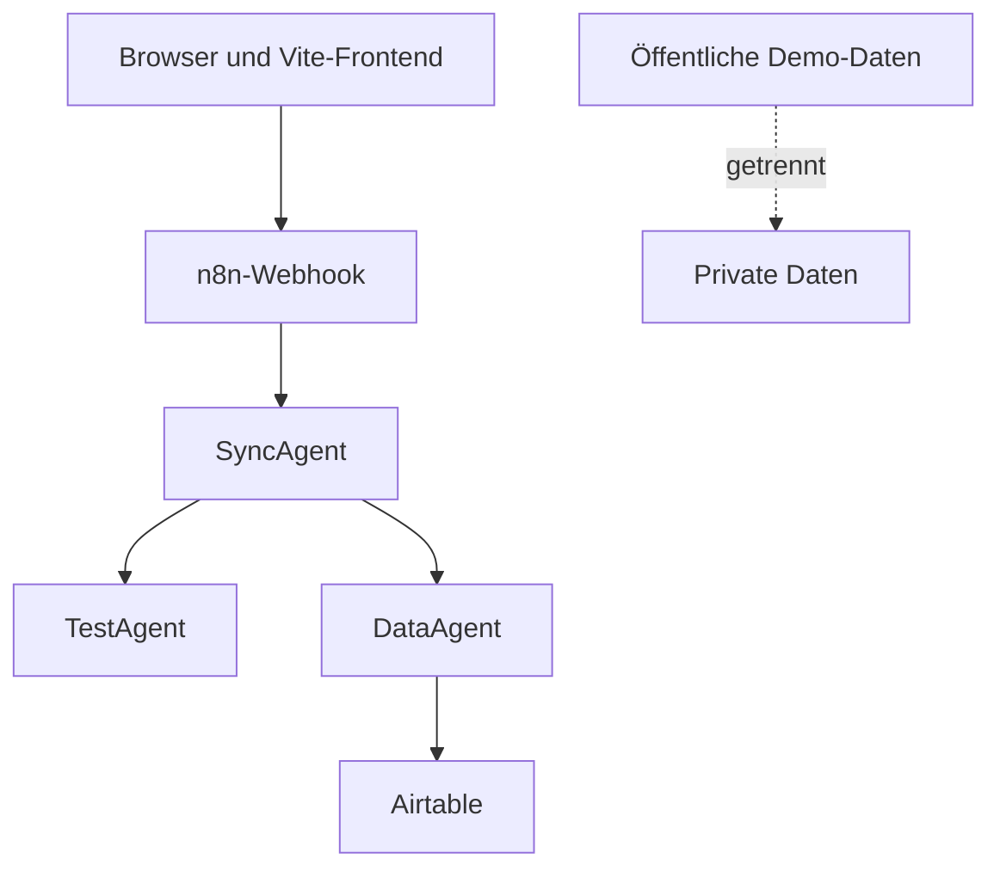

# GoldenDawn OS – Sicherheitsgrundlage

## Dokumentstatus

| Feld | Wert |
| --- | --- |
| Projektphase | `v0.2.1 – LearningHub Local MVP in Arbeit` |
| Geltungsbereich | Version 1 und Portfolio-Demo |
| Status | Verbindliche Sicherheitsbasis |
| Letzte Aktualisierung | 2026-07-18 |

Dieses Dokument definiert die Sicherheits- und Datenschutzgrenzen für
GoldenDawn OS. Es ergänzt `AGENTS.md`, `docs/architecture.md` und
`docs/roadmap.md`.

Die Regeln sind eine technische Mindestbasis und keine Garantie vollständiger
Sicherheit. Offene Risiken werden dokumentiert und vor einem öffentlichen
Deployment erneut bewertet.

## Sicherheitsziele

GoldenDawn OS soll:

- keine Secrets im Frontend oder Repository offenlegen;
- private Daten strikt von öffentlichen Demo-Daten trennen;
- externe Requests validieren, begrenzen und nachvollziehbar behandeln;
- Airtable ausschließlich über den DataAgent ansprechen;
- Agenten nur die für ihre Aufgabe nötigen Daten und Fähigkeiten geben;
- Fehler und Logs für die Diagnose nutzbar halten, ohne sensible Inhalte zu
  verbreiten;
- bei Ausfällen kontrolliert reagieren und keine unbemerkten Duplikate oder
  Datenverluste erzeugen.

## Schutzwerte

| Schutzwert | Beispiele | Schutzziel |
| --- | --- | --- |
| Credentials | Airtable-PAT, Modell-Token, n8n-Schlüssel | Vertraulichkeit und Rotation |
| Private Daten | Lernnotizen, Testergebnisse, Reflexionen | Vertraulichkeit und Zweckbindung |
| Systemdaten | Request-IDs, Agentenstatus, Fehlercodes | Integrität und Nachvollziehbarkeit |
| Prompt- und Lerninhalte | PromptVault, Testkontext | Integrität und Schutz vor Injection |
| Airtable-Datensätze | Prompts, Lernfortschritt, Testergebnisse | Vertraulichkeit und Integrität |
| Quellcode und Dokumentation | GitHub-Repository | Integrität und Secret-Freiheit |
| Öffentliche Demo | synthetische Daten und Beispielabläufe | Missbrauchsbegrenzung |

## Datenklassifikation

| Klasse | Inhalt | Erlaubte Ablage | Repository und Logs |
| --- | --- | --- | --- |
| Öffentlich | README, Architektur, bereinigte Beispiele | GitHub und Demo | erlaubt |
| Demo | vollständig synthetische Datensätze | separate Demo-Datenquelle | erlaubt, wenn eindeutig markiert |
| Privat | reale Lern- und Reflexionsdaten | lokale private Ablage oder private Airtable-Base | nicht committen, Logs minimieren |
| Sensitiv | Gesundheitsdaten oder besonders persönliche Notizen | nur ausdrücklich freigegebene private Systeme | nicht committen oder in Ausführungsdaten speichern |
| Secret | Tokens, Schlüssel, Passwörter, Credential-IDs | n8n-Credential-Store oder serverseitige Secret-Verwaltung | niemals committen oder loggen |

Synthetische Demo-Daten dürfen keine leicht veränderten Kopien realer privater
Daten sein. Sie werden neu erstellt und als Demo-Inhalte gekennzeichnet.

## Vertrauensgrenzen



An jeder Grenze gilt:

- Eingaben werden als nicht vertrauenswürdig behandelt.
- Struktur, Datentypen, Wertebereiche und Größe werden validiert.
- Fehlerantworten enthalten keine Secrets oder internen Stacktraces.
- Berechtigungen werden nicht allein aus Angaben des Clients abgeleitet.
- Daten werden nur an den Agenten weitergegeben, der sie benötigt.

## Bedrohungsmodell für Version 1

| Bedrohung | Beispiel | Gegenmaßnahme |
| --- | --- | --- |
| Secret-Leak | Token in `VITE_*`, Git oder Screenshot | keine Secrets im Client, Secret-Scan und Rotation |
| Webhook-Missbrauch | automatisierte oder übergroße Requests | Authentisierung oder Netzschutz, Rate Limit, Größenlimit |
| Prompt Injection | Lerntext fordert den TestAgent zu Fremdaktionen auf | Kontext als Daten behandeln, Toolrechte begrenzen, Output validieren |
| Unberechtigter Datenzugriff | frei wählbare Airtable-Tabelle oder Record-ID | Entitäts- und Feld-Allowlist im DataAgent |
| Mass Assignment | Client sendet zusätzliche geschützte Felder | nur definierte Felder übernehmen |
| Doppelte Schreibvorgänge | Wiederholung nach Timeout | `requestId`, Idempotenz und eindeutige IDs |
| Datenvermischung | Demo schreibt in private Base | getrennte Bases, Tokens, Workflows und Deployments |
| XSS | Prompt-Text wird als HTML gerendert | standardmäßig `textContent`, kein unbereinigtes `innerHTML` |
| Übermäßige Logs | vollständige Prompts oder Tokens in n8n-Ausführung | Redaction, Datensparsamkeit und kurze Aufbewahrung |
| Abhängigkeitsrisiko | unnötiges Paket mit Schwachstelle | wenige Abhängigkeiten und dokumentierte Einführung |

## Frontend-Sicherheit

### Öffentliche Vite-Variablen

Alle Variablen mit dem Präfix `VITE_` gelangen in den Client-Build und gelten
deshalb als öffentlich. Dort dürfen nur nicht-sensitive Konfigurationswerte
liegen.

Nicht erlaubt:

```text
VITE_AIRTABLE_TOKEN
VITE_OPENAI_API_KEY
VITE_N8N_SECRET
VITE_DATABASE_PASSWORD
```

Eine Webhook-URL darf nur dann als Client-Konfiguration verwendet werden, wenn
sie ausdrücklich nicht als Secret oder alleiniger Schutzmechanismus behandelt
wird.

### Browser-Speicher

- `localStorage`, `sessionStorage` und IndexedDB sind keine Secret-Stores.
- `localStorage` speichert Werte unverschlüsselt und kann von JavaScript
  derselben Origin gelesen werden. Eingeschleuster oder kompromittierter
  Same-Origin-Code kann daher auch lokale private Inhalte erreichen.
- Tokens und Passwörter werden dort nicht gespeichert.
- Lokale private Inhalte werden auf das notwendige Minimum begrenzt.
- Beschädigte oder manipulierte Werte werden nicht ungeprüft verwendet.
- `dataOrigin: private` ist nur eine fachliche Klassifikation. Das Feld
  verschlüsselt Daten nicht, authentifiziert keine Person und bildet keine
  technische Zugriffsgrenze.
- Ein fachlich append-only geführter Log ist in `localStorage` technisch ein
  überschreibbarer JSON-Snapshot. Append-only ersetzt weder kryptografische
  Integrität noch eine Signatur oder Manipulationssperre.
- Lokale Browserdaten sind keine Cloud-Sicherung, keine geräteübergreifende
  Synchronisierung und kein Schutz vor dem Löschen des Browserprofils.
- Eine spätere Browser-Authentifizierung benötigt eine eigene serverseitige
  Architekturentscheidung.

### Lokale Modulgrenzen für v0.2.x

Die Module der Reihe `v0.2.x` arbeiten ausschließlich lokal. Sie übertragen
keine Inhalte an Webhooks, Agenten, Airtable oder andere externe Dienste.
Datenzugriffe laufen über fachliche Services und Storage-Adapter; Views und
Controller greifen nicht direkt auf `localStorage` zu.

#### LearningHub Local MVP in v0.2.1

- Der implementierte lokale Inhaltsfluss verläuft ausschließlich über
  `LearningHubView`, `LearningHubController`, `LearningHubService`,
  `LearningHubStorage` und den gemeinsamen `StorageAdapter`. View und
  Controller greifen nicht direkt auf `localStorage` zu. Der Storage verwendet
  den festen, nicht nutzerkontrollierten Key
  `goldendawn.learningHub.content.v1` und akzeptiert im privaten Speicherpfad
  nur Hubs mit `dataOrigin: private`.
- Der davon getrennte Progress-Pfad verläuft über
  `LearningProgressService`, `LearningHubService`,
  `LearningProgressStorage` und den gemeinsamen `StorageAdapter`. Der
  Progress-Service verwendet den Inhaltsservice nur zum Laden und zur
  Referenzprüfung; es gibt keine Rückabhängigkeit. Fortschritt liegt unter dem
  festen Key `goldendawn.learningHub.progress.v1`, während der Inhaltsvertrag
  unverändert unter `goldendawn.learningHub.content.v1` bleibt.
- `src/main.js` injiziert den Progress-Service in den vorhandenen
  `LearningHubController`. View und Controller halten und rendern nur die
  validierte Projektion, nicht Ereignis-IDs, Zeitstempel oder den vollständigen
  Log. Kapitel-Checkboxen und Fortschrittsanzeigen bleiben vollständig lokal
  und übertragen keine Daten an Webhooks, Agenten, Airtable oder andere
  Netzwerke.
- Private LearningModules, Kapitel und LearningNodes sowie spätere Lernnotizen,
  Zusammenfassungen und lokale Testversuche werden weder in das Repository
  übernommen noch in öffentlichen Demo-Daten oder unnötigen Logs verwendet.
- Der Demo-Hub verwendet ausschließlich unabhängig erfundene synthetische
  Inhalte mit `dataOrigin: synthetic`. Private Nutzerdaten tragen
  `dataOrigin: private` und verwenden getrennte Datenquellen. Die Demo wird
  weder automatisch importiert noch als privater Initialzustand gespeichert.
- Ein fehlender Storage-Key liefert nur im Arbeitsspeicher einen leeren
  privaten Hub und löst beim Laden keinen Schreibzugriff aus. Beschädigtes JSON,
  ungültige Schema-Daten oder Adapterfehler werden davon unterschieden und
  niemals stillschweigend gelöscht, überschrieben oder durch den leeren Hub
  ersetzt.
- Entsprechend liefert ein fehlender Progress-Key einen frischen privaten Log
  mit leerem `events`-Array ohne Initialisierungsschreibzugriff. Der private
  Progress-Storage akzeptiert ausschließlich `dataOrigin: private`.
  Synthetische, beschädigte oder nicht unterstützte gespeicherte Logs bleiben
  unverändert und werden weder als leerer privater Log ausgegeben noch durch
  ihn überschrieben.
- Der `LearningHubService` trimmt Eingabetexte vor der Längenprüfung und
  begrenzt Titel auf 120 sowie LearningNode-Inhalte auf 10.000 Zeichen. Diese
  Eingabegrenzen reduzieren versehentlich übergroße einzelne Werte, ersetzen
  aber weder Quota-Behandlung noch eine allgemeine Größenbegrenzung des
  vollständigen Hubs. Der persistierte Vertrag bleibt bei
  `schemaVersion: 2`; Schema 3 wird dadurch nicht eingeführt.
- Fehlermeldungen und Logs enthalten keine privaten Titel, LearningNode-Texte,
  vollständigen Fortschrittslogs oder sonstigen Rohdaten. Rohe `DOMException`-
  und Storage-Fehler werden nicht unkontrolliert an höhere Schichten
  weitergereicht.
- Die Oberfläche weist sichtbar darauf hin, dass Inhalte und Fortschritt nur im
  aktuellen Browserprofil ohne Cloud-Sicherung oder geräteübergreifende
  Synchronisierung liegen und von anderen Skripten derselben Origin
  grundsätzlich aus dem unverschlüsselten `localStorage` gelesen werden
  könnten. Sie behauptet weder Echtzeit- noch Multi-Tab-Konsistenz.
- Schema 2 speichert keine Abschluss- oder Fortschrittsdaten. Kapitelabschluss
  und daraus abgeleiteter Modulfortschritt verwenden den separaten
  LearningProgress-Schema-1-Vertrag; Testkompetenz bleibt ein davon getrenntes
  Konzept.
- Der Progress-Vertrag speichert ausschließlich Ereignis-ID, Ereignistyp,
  Modul- und Kapitelreferenz sowie UTC-Zeitstempel. Titel und
  LearningNode-Inhalte werden nicht in Ereignisse oder Projektionen kopiert.
  IDs und Nutzungszeitpunkte können dennoch private Metadaten sein und werden
  nicht unnötig protokolliert oder in öffentliche Demo-Daten übernommen.
- Vor einer Progress-Mutation werden der vollständige Hub und Log validiert,
  alle gespeicherten Referenzen gegen den aktuellen Inhaltsstand geprüft und
  verwaiste oder falsch zugeordnete Ereignisse kontrolliert abgelehnt. Diese
  Prüfung schützt vor versehentlicher Weiterverarbeitung inkonsistenter Daten,
  beweist aber weder Urheberschaft noch Manipulationsfreiheit.
- Kann Progress nicht sicher geladen oder gegen den aktuellen Hub projiziert
  werden, bleibt die Inhaltsverwaltung bedienbar. Die Oberfläche zeigt keine
  falschen 0-Prozent-Werte, deaktiviert Fortschrittsaktionen und bietet einen
  nicht destruktiven Retry. Beschädigte oder verwaiste Progress-Daten werden
  weder gelöscht, repariert noch überschrieben.
- Fortschrittsfehler und sichtbare Statusmeldungen enthalten keine privaten
  Titel, LearningNode-Inhalte, Modul- oder Kapitel-IDs, Ereignis-IDs,
  Zeitstempel oder Roh-Payloads. Private Nutzereingaben werden weiterhin nur
  über sichere DOM-Text-APIs gerendert.
- Append-only gilt ausschließlich für die öffentlichen Operationen des
  `LearningProgressService`. Der vollständige Log wird technisch bei jeder
  echten Änderung als neuer JSON-Snapshot geschrieben. Es gibt keine
  kryptografische Verkettung, Signatur oder Manipulationssperre; andere Skripte
  derselben Origin könnten den Wert lesen, überschreiben oder umsortieren. Das
  Modell ist xAPI-inspiriert, aber nicht xAPI-konform, verwendet kein LRS und
  beansprucht kein vollständiges Event Sourcing.
- `chapter.started` ist in Schema 1 nicht erlaubt. Seine spätere Einführung
  benötigt eine versionierte Vertrags- und Sicherheitsprüfung, weil zusätzliche
  Zeit- und Nutzungsmetadaten entstehen würden.
- Eine spätere Archivierung muss Fortschrittsereignisse erhalten. Dauerhaftes
  Löschen von Modulen oder Kapiteln benötigt vor der Implementierung eine
  gesonderte Referenz- und Löschrichtlinie; verknüpfte Ereignisse dürfen nicht
  stillschweigend entfernt oder verwaist werden.
- Der noch nicht implementierte Mock-Test soll lokal und deterministisch mit
  vorbereiteten Fragen arbeiten. Er muss sichtbar als **„Lokaler Mock-Test“**
  gekennzeichnet werden und darf weder eine KI-Auswertung noch eine semantische
  Freitextbewertung behaupten.
- Notizen, Zusammenfassungen und Testversuche dürfen nach ihrer späteren
  Einführung ausschließlich hinter den vorgesehenen Service- und
  Storage-Adapter-Grenzen gespeichert werden.
- Der lokale MVP garantiert noch keine Multi-Tab-Konsistenz und verwendet keine
  Transaktionssperre. Gleichzeitige Änderungen in mehreren Tabs können sich
  überholen; Browser-Quota, fehlende Verschlüsselung und fehlende
  Synchronisierung bleiben ebenfalls offene Grenzen. Eine spätere Lösung
  benötigt einen eigenen Vertrag.

Schema 2 bleibt der verbindliche interne Inhalts- und Validierungsvertrag. Der
Storage-Key `content.v1` bezeichnet davon getrennt nur dessen
Persistenz-Namespace. Der Fortschrittsvertrag verwendet unabhängig
`schemaVersion: 1` und den Persistenznamespace `progress.v1`. View, Controller,
Service und Storage für private Inhalte sowie Vertrag, Projektion, Service und
Storage einschließlich der zugänglichen Progress-UI sind implementiert.
Notizen, Zusammenfassungen und Testversuche sind in diesem Arbeitspaket noch
nicht umgesetzt; `v0.2.1` bleibt in Arbeit.

#### LichtwaldLog Local MVP in v0.2.2

- Private lokale Reflexions- und Erkenntniseinträge bleiben strikt von
  synthetischen öffentlichen Demo-Daten getrennt. Es gibt keinen automatischen
  Fallback oder gemeinsamen Datenfluss zwischen beiden Bereichen.
- Bilder werden nicht als Base64-Daten in `localStorage` gespeichert.
- LichtwaldLog-Inhalte werden in `v0.2.2` weder synchronisiert noch an Agenten,
  Webhooks, Airtable oder andere externe Dienste übertragen.
- Lokale Datenzugriffe bleiben vollständig hinter Services und
  Storage-Adaptern gekapselt.

### Sichere Darstellung

- Unvertrauenswürdige Texte werden standardmäßig über `textContent` dargestellt.
- LearningModule-, Kapitel- und LearningNode-Titel sowie LearningNode-Inhalte
  sind nicht vertrauenswürdiger Klartext. Die implementierte LearningHub-View
  gibt sie über `textContent`, `createTextNode` und sichere DOM-Erzeugung aus.
- `innerHTML` wird für Nutzereingaben und Agentenoutput nicht verwendet.
- Markdown oder Rich Text benötigt vor HTML-Ausgabe eine dokumentierte
  Sanitization-Lösung.
- Links aus externen Daten werden validiert und erhalten bei neuen Tabs
  `rel="noopener noreferrer"`.
- Fehlertexte aus externen Systemen werden nicht ungefiltert als HTML gerendert.

### Build- und Deployment-Schutz

- Source Maps werden vor einem öffentlichen Deployment bewusst bewertet.
- Produktions-Builds enthalten keine Debug-Payloads oder privaten Mock-Daten.
- HTTPS ist für verbundene Deployments verpflichtend.
- Sicherheitsheader werden beim Hosting konfiguriert, insbesondere Content
  Security Policy, `X-Content-Type-Options`, Referrer Policy und Schutz gegen
  unerwünschtes Framing.

## Webhook-Sicherheit

### Entwicklungsmodus

Ein n8n-Test-Webhook ohne Authentisierung ist nur zulässig, wenn:

- ausschließlich synthetische oder nicht-sensitive Testdaten verwendet werden;
- der Workflow nicht dauerhaft öffentlich aktiv bleibt;
- keine Schreibrechte auf private Datenquellen bestehen;
- der Test-Endpunkt nach dem Versuch deaktiviert oder ersetzt wird.

`Authentication: None` ist kein Produktionsschutz.

### Privater verbundener Modus

Da ein statisches Browser-Frontend kein dauerhaftes Secret sicher verwahren
kann, benötigt ein privater verbundener Modus mindestens eine kontrollierte
Netzwerkgrenze. Geeignete Optionen werden vor Deployment entschieden:

- Zugriff nur über privates Netzwerk oder VPN;
- Reverse Proxy mit Authentisierung und Rate Limit;
- IP-Allowlist, sofern die Einsatzumgebung stabile IPs besitzt;
- später eine serverseitige Authentifizierungs- oder Gateway-Schicht.

Ein geheimer Header, der fest in den Frontend-Build eingebettet wird, ist keine
gültige Lösung.

### Öffentliche Portfolio-Demo

Eine öffentliche Demo darf nicht auf private Workflows oder Airtable-Bases
zugreifen. Bevorzugte Reihenfolge:

1. rein lokaler Demo-Modus mit synthetischen Daten;
2. getrennte Demo-Workflows mit eingeschränkten Aktionen;
3. separate Demo-Base und minimal berechtigter Token;
4. Rate Limit, Monitoring und klarer Abschaltweg.

Öffentliche Schreibfunktionen werden nur aktiviert, wenn Missbrauchsrisiko,
Kosten und Datenbereinigung kontrolliert sind.

### Request-Regeln

- Nur die benötigten HTTP-Methoden sind aktiv; für Version 1 primär `POST`.
- Der erwartete Content-Type ist `application/json`.
- Erlaubte Aktionen werden über eine feste Allowlist definiert.
- Payloads werden gegen das Schema aus `docs/data-contracts.md` validiert.
- Für Version 1 gilt als Ziel ein maximales JSON-Payload von `64 KiB`, sofern
  ein dokumentierter Anwendungsfall keine andere Grenze verlangt.
- Zeitstempel, `requestId` und Feldlängen werden geprüft.
- Wiederholte Schreibrequests werden idempotent behandelt.
- CORS erlaubt nur bekannte Origins; `*` wird im verbundenen Produktionsmodus
  nicht verwendet.
- CORS ist keine Authentisierung und ersetzt keinen Zugriffsschutz.
- Interne Node-Namen, Stacktraces und Credential-Informationen werden nicht an
  den Client zurückgegeben.

## n8n-Sicherheit

### Instanzschutz

- n8n wird nur über HTTPS betrieben.
- Administrationskonten verwenden starke, einzigartige Passwörter und 2FA.
- Die Instanz und verwendete Nodes werden regelmäßig aktualisiert.
- Editor- und Administrationsoberfläche werden nicht unnötig öffentlich
  erreichbar gemacht.
- Bei Self-Hosting wird ein eigener `N8N_ENCRYPTION_KEY` serverseitig gesetzt,
  sicher gesichert und nicht im Repository gespeichert.
- Reverse-Proxy- und Webhook-Konfiguration werden dokumentiert.

### Credential-Verwaltung

- Airtable- und Modellzugänge werden als n8n-Credentials angelegt.
- Credentials werden nicht in Code-Nodes, Workflow-Namen oder Beschreibungen
  kopiert.
- Workflow-Exporte werden vor dem Commit auf Credential-Werte, IDs und private
  Beispielpayloads geprüft.
- Test- und Produktionscredentials werden getrennt.
- Nicht mehr benötigte Credentials werden entfernt oder widerrufen.

### Ausführungsdaten

- Erfolgreiche Ausführungsdaten werden nur gespeichert, wenn sie für Diagnose
  oder Portfolio-Nachweis nötig sind.
- Fehlerausführungen werden auf sensible Felder geprüft und redigiert.
- Prompts, Lernantworten und Airtable-Datensätze werden nicht pauschal in Logs
  dupliziert.
- Aufbewahrung wird so kurz wie praktisch möglich konfiguriert.
- Bereinigte Metadaten wie `requestId`, Aktion, Agent, Status und Dauer werden
  vollständigen Payloads vorgezogen.

## Airtable-Sicherheit

### Token-Regeln

- Verwendet werden Personal Access Tokens oder eine später dokumentierte
  OAuth-Lösung, keine veralteten API Keys.
- Jeder Token erhält nur die erforderlichen Scopes und Zugriff auf die
  benötigte Base.
- Private und Demo-Bases verwenden unterschiedliche Tokens.
- Schreibrechte werden nur vergeben, wenn der Workflow sie benötigt.
- Schema-Schreibrechte werden für normale Datenflüsse nicht vergeben.
- Tokens werden regelmäßig überprüft und bei Verdacht sofort regeneriert oder
  gelöscht.

### DataAgent als Schutzschicht

Der DataAgent:

- akzeptiert nur bekannte Entitäten und Operationen;
- verwendet feste Tabellen- und Feldzuordnungen;
- erlaubt keine frei übergebenen Base- oder Tabellen-IDs aus dem Client;
- übernimmt nur explizit erlaubte Felder;
- validiert Record-IDs, Filter und Feldlängen;
- normalisiert Airtable-Antworten vor der Rückgabe;
- behandelt Löschvorgänge als gesonderte, bestätigungspflichtige Aktion.

### Datensparsamkeit

- Airtable speichert nur fachlich notwendige Daten.
- Rohprompts, Lernantworten oder Gesundheitsdaten werden nicht automatisch in
  mehrere Tabellen oder Logs kopiert.
- Demo-Daten enthalten keine echten Namen, Kontaktdaten oder Rückschlüsse auf
  private Einträge.
- Exporte und Backups werden wie die ursprünglichen Daten klassifiziert.

## Agenten- und LLM-Sicherheit

### Allgemeine Agentenregeln

- Agenten erhalten nur die Tools und Daten, die ihre Rolle benötigt.
- Kein Agent darf neue Agenten, Credentials oder externe Verbindungen erzeugen.
- Agenten führen keine Git-Commits, Pushes, Merges oder Releases aus.
- Schreibende oder löschende Hochrisikoaktionen benötigen eine explizite
  Bestätigung oder einen eng definierten Workflow.
- Agentenoutput wird als untrusted input validiert, bevor er gespeichert oder
  dargestellt wird.

### Schutz des SyncAgent

- Der SyncAgent verwendet eine feste Aktions-Allowlist.
- Routingentscheidungen basieren auf validierten Feldern, nicht auf frei
  formulierten Anweisungen innerhalb des Payloads.
- Unbekannte Aktionen werden abgelehnt oder kontrolliert als `unknown`
  behandelt.
- Der SyncAgent besitzt keine Airtable-Credentials.

### Schutz des TestAgent

- Lernkontext wird als Datenquelle behandelt, nicht als Systemanweisung.
- Fremde Anweisungen in Lernnotizen dürfen Rollen, Bewertungsregeln oder
  Toolrechte nicht verändern.
- Der TestAgent erhält keine Airtable-Credentials.
- Bewertungsoutputs folgen einem festen Schema und werden validiert.
- Eine Bewertung verändert den Lernfortschritt nicht ohne dokumentierten
  Folgeauftrag.

### Schutz des DataAgent

- Der DataAgent führt keine freien Anweisungen aus Prompt-Texten aus.
- Er akzeptiert nur strukturierte, erlaubte Datenoperationen.
- Tabellen, Felder und Operationen werden serverseitig zugeordnet.
- Schreibvorgänge verwenden stabile IDs und Idempotenzschutz.
- Löschungen werden in Version 1 nicht autonom ausgeführt.

## Logging und Monitoring

Erlaubte Standardmetadaten:

```json
{
  "requestId": "req_example_001",
  "action": "learningTest.evaluate",
  "agent": "TestAgent",
  "success": true,
  "durationMs": 842,
  "timestamp": "2026-07-11T12:00:00.000Z"
}
```

Nicht loggen:

- Tokens oder Authorization-Header;
- vollständige Webhook-URLs mit geheimen Bestandteilen;
- Passwörter oder n8n-Verschlüsselungsschlüssel;
- vollständige private Lern- oder Gesundheitsdaten;
- ungefilterte Modellprompts, wenn sie private Inhalte enthalten;
- vollständige Airtable-Antworten ohne diagnostische Notwendigkeit.

Sicherheitsrelevante Ereignisse werden nachvollziehbar erfasst:

- wiederholt ungültige Requests;
- abgelehnte Aktionen;
- ungewöhnlich große Payloads;
- wiederholte Authentisierungsfehler;
- Airtable-Berechtigungsfehler;
- unerwartete Agenten- oder Schemaantworten.

## Repository-Sicherheit

- `.env`, `.env.*.local`, lokale Konfigurationen und Logs werden ignoriert.
- Eine `.env.example` enthält ausschließlich Platzhalter und Erklärungen.
- n8n-Credentials gehören nicht in das Frontend-Repository.
- Workflow-Exporte enthalten keine produktiven Payload-Beispiele.
- Vor jedem Commit werden `git diff` und `git status` geprüft.
- Vor einem öffentlichen Release wird das gesamte Repository auf Secrets,
  private Daten und sensible Historie geprüft.
- Abhängigkeiten werden nur nach dokumentierter Notwendigkeit ergänzt.
- Sicherheitsupdates werden getrennt von unnötigen Refactorings durchgeführt.

Wenn ein Secret versehentlich committed wurde, reicht das Entfernen aus der
aktuellen Datei nicht aus. Das Secret wird zuerst widerrufen oder rotiert;
danach wird die Repository-Historie kontrolliert bereinigt und der Vorfall
dokumentiert.

## Private und öffentliche Umgebungen

| Bereich | Private Umgebung | Öffentliche Demo |
| --- | --- | --- |
| Daten | reale persönliche Daten | ausschließlich synthetische Daten |
| Airtable | private Base | separate Demo-Base oder kein Airtable |
| Credentials | private n8n-Credentials | eigener minimal berechtigter Demo-Token |
| Workflows | private Produktivworkflows | getrennte Demo-Workflows |
| Logs | minimale private Diagnosedaten | bereinigte Metadaten |
| Deployment | privat oder netzwerkgeschützt | öffentlich, begrenzt und überwacht |

Es gibt keinen automatischen Fallback von der Demo auf private Datenquellen.
Umgebungen werden ausdrücklich ausgewählt und sichtbar gekennzeichnet.

## Sicherheitsgates nach Version

| Version | Erforderliches Sicherheitsgate |
| --- | --- |
| `v0.1.0` | Regeln dokumentiert, Repository secret-frei, Gitignore geprüft |
| `v0.2.0` | sichere Textdarstellung, robuste Storage-Validierung, keine Client-Secrets |
| `v0.2.1` | sichere lokale Inhalts- und Progress-UI, getrennte validierte Persistenz ohne Demo-Seeding, kontrollierte Referenzprüfung und isolierte Progress-Fehler; später Notizen, Zusammenfassungen, Testversuche und deterministischer lokaler Mock-Test |
| `v0.2.2` | getrennte private Reflexions- und synthetische Demo-Daten, keine Base64-Bilder in `localStorage`, keine externe Übertragung |
| `v0.3.0` | Beginn externer Kommunikation: Webhook-Allowlist, Schema- und Größenprüfung, kontrollierte CORS-Regeln |
| `v0.4.0` | minimaler Airtable-PAT, Feld-Allowlist, Idempotenz und getrennte Bases |
| `v0.5.0` | Prompt-Injection-Schutz, strukturierter TestAgent-Output, keine Direktzugriffe |
| `v0.6.0` | End-to-End-Sicherheitsreview und vollständige Demo-Trennung |
| `v1.0.0` | Secret-Scan, Deployment-Review, Incident- und Abschaltweg getestet |

## Incident-Response

Bei Verdacht auf Credential- oder Datenoffenlegung:

1. betroffenen Workflow oder Endpunkt deaktivieren;
2. Token, Schlüssel oder Passwort widerrufen beziehungsweise rotieren;
3. betroffene Logs, Ausführungen und Datensätze eingrenzen;
4. private und öffentliche Umgebungen auf Vermischung prüfen;
5. Ursache beheben und Wiederholungsschutz ergänzen;
6. Repository-Historie erst nach der Rotation kontrolliert bereinigen;
7. Vorfall, Auswirkung und Gegenmaßnahmen dokumentieren;
8. System kontrolliert wieder aktivieren.

Für die öffentliche Demo muss ein schneller manueller Abschaltweg bekannt und
getestet sein.

## Offene Sicherheitsentscheidungen

Diese Punkte werden nicht stillschweigend angenommen, sondern vor dem
jeweiligen Deployment entschieden:

- Hosting-Anbieter und Serverstandort;
- privater Netzwerkzugriff, VPN oder Reverse Proxy;
- Authentisierung des verbundenen Browser-Clients;
- konkrete Rate-Limit-Implementierung;
- Aufbewahrungsdauer für n8n-Ausführungsdaten;
- Source-Map-Strategie;
- Rotationsintervall für produktive Tokens;
- Umfang öffentlicher Schreibfunktionen;
- Backup- und Wiederherstellungsstrategie.

## Security Definition of Done

Eine Änderung mit Daten- oder Integrationsbezug ist aus Sicherheitssicht erst
fertig, wenn:

- keine Secrets im Frontend, Diff oder Log enthalten sind;
- Eingaben und externe Antworten validiert werden;
- erlaubte Aktionen, Entitäten und Felder begrenzt sind;
- Fehler keine internen Details offenlegen;
- private und öffentliche Datenquellen nicht vermischt werden;
- Schreibvorgänge gegen unbeabsichtigte Wiederholung geschützt sind;
- neue Risiken und offene Entscheidungen dokumentiert wurden;
- die relevanten Sicherheitsgates der Projektversion erfüllt sind.

## Referenzen

- [Vite: Env Variables and Modes](https://vite.dev/guide/env-and-mode)
- [n8n: Webhook node](https://docs.n8n.io/integrations/builtin/core-nodes/n8n-nodes-base.webhook/)
- [n8n: Security configuration](https://docs.n8n.io/deploy/host-n8n/configure-n8n/security/)
- [n8n: Manage execution data](https://docs.n8n.io/deploy/host-n8n/configure-n8n/scaling/manage-execution-data/)
- [Airtable: Creating Personal Access Tokens](https://support.airtable.com/docs/creating-personal-access-tokens)
- [OWASP API Security Top 10 – 2023](https://owasp.org/API-Security/editions/2023/en/0x11-t10/)
- [OWASP REST Security Cheat Sheet](https://cheatsheetseries.owasp.org/cheatsheets/REST_Security_Cheat_Sheet.html)
