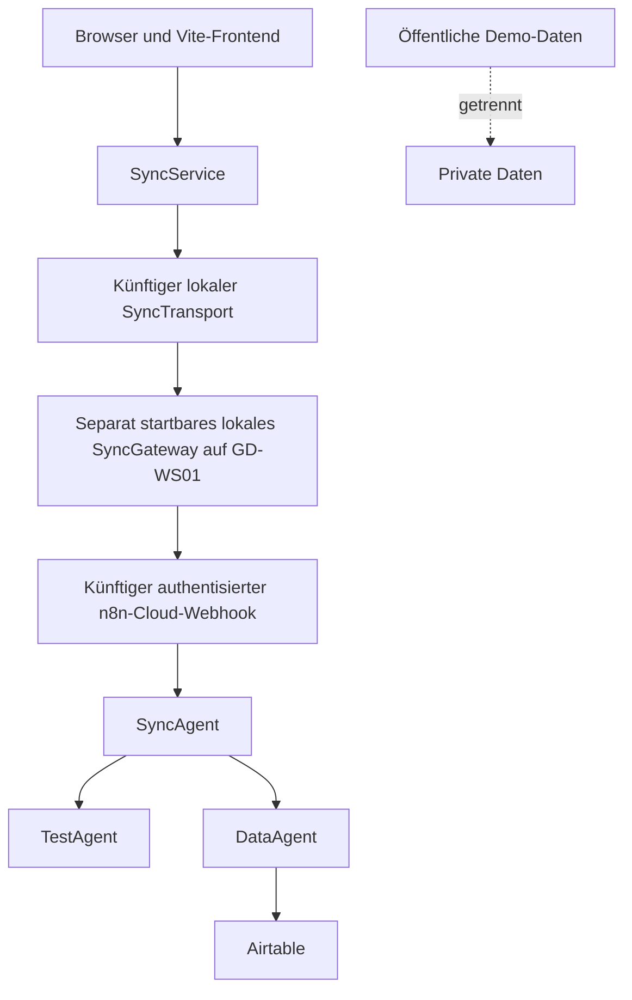

# GoldenDawn OS – Sicherheitsgrundlage

## Dokumentstatus

| Feld | Wert |
| --- | --- |
| Projektphase | `v0.3.0 – in Arbeit – n8n Cloud Ingress & Runtime Evidence Gate Foundation` |
| Geltungsbereich | Version 1 und Portfolio-Demo |
| Status | Verbindliche Sicherheitsbasis; Paketversion `0.2.2`; neuestes veröffentlichtes Release und Tag `v0.2.2`; transportneutrale Sync-Foundations, separat startbare Local SyncGateway Raw-Wire and HTTP Foundation, Generated n8n Boundary Bundle Foundation und lokal netzwerkinaktive n8n Cloud Ingress & Runtime Evidence Gate Foundation implementiert; öffentliche stabile OSS-Kompatibilität `FAIL`, Tenantmessung `UNPROVEN`, Aktivierung geschlossen; kein Browser- oder Produkt-Cloudtransport |
| Letzte Aktualisierung | 2026-08-19 |

Dieses Dokument definiert die Sicherheits- und Datenschutzgrenzen für
GoldenDawn OS. Es ergänzt `AGENTS.md`, `docs/architecture.md` und
`docs/roadmap.md`.

Die Regeln sind eine technische Mindestbasis und keine Garantie vollständiger
Sicherheit. Offene Risiken werden dokumentiert und vor einem öffentlichen
Deployment erneut bewertet.

## Sicherheitsziele

GoldenDawn OS soll:

- keine Secrets im Frontend oder Repository offenlegen;
- private Daten strikt von öffentlichen Demo-Daten trennen;
- externe Requests validieren, begrenzen und nachvollziehbar behandeln;
- Airtable ausschließlich über den DataAgent ansprechen;
- Agenten nur die für ihre Aufgabe nötigen Daten und Fähigkeiten geben;
- Fehler und Logs für die Diagnose nutzbar halten, ohne sensible Inhalte zu
  verbreiten;
- bei Ausfällen kontrolliert reagieren und keine unbemerkten Duplikate oder
  Datenverluste erzeugen.

## Schutzwerte

| Schutzwert | Beispiele | Schutzziel |
| --- | --- | --- |
| Credentials | Airtable-PAT, Modell-Token, n8n-Schlüssel | Vertraulichkeit und Rotation |
| Private Daten | Lernnotizen, Testergebnisse, Reflexionen | Vertraulichkeit und Zweckbindung |
| Systemdaten | Request-IDs, Agentenstatus, Fehlercodes | Integrität und Nachvollziehbarkeit |
| Prompt- und Lerninhalte | PromptVault, Testkontext | Integrität und Schutz vor Injection |
| Airtable-Datensätze | Prompts, Lernfortschritt, Testergebnisse | Vertraulichkeit und Integrität |
| Quellcode und Dokumentation | GitHub-Repository | Integrität und Secret-Freiheit |
| Öffentliche Demo | synthetische Daten und Beispielabläufe | Missbrauchsbegrenzung |

## Datenklassifikation

| Klasse | Inhalt | Erlaubte Ablage | Repository und Logs |
| --- | --- | --- | --- |
| Öffentlich | README, Architektur, bereinigte Beispiele | GitHub und Demo | erlaubt |
| Demo | vollständig synthetische Datensätze | separate Demo-Datenquelle | erlaubt, wenn eindeutig markiert |
| Privat | reale Lern- und Reflexionsdaten | lokale private Ablage oder private Airtable-Base | nicht committen, Logs minimieren |
| Sensitiv | Gesundheitsdaten oder besonders persönliche Notizen | nur ausdrücklich freigegebene private Systeme | nicht committen oder in Ausführungsdaten speichern |
| Secret | Tokens, Schlüssel, Passwörter, Credential-IDs | n8n-Credential-Store oder serverseitige Secret-Verwaltung | niemals committen oder loggen |

Synthetische Demo-Daten dürfen keine leicht veränderten Kopien realer privater
Daten sein. Sie werden neu erstellt und als Demo-Inhalte gekennzeichnet.

## Vertrauensgrenzen



An jeder Grenze gilt:

- Eingaben werden als nicht vertrauenswürdig behandelt.
- Struktur, Datentypen, Wertebereiche und Größe werden validiert.
- Fehlerantworten enthalten keine Secrets oder internen Stacktraces.
- Berechtigungen werden nicht allein aus Angaben des Clients abgeleitet.
- Daten werden nur an den Agenten weitergegeben, der sie benötigt.

### Aktuelle Grenzen der transportneutralen Sync-Foundations

Die implementierte SyncContract Foundation bleibt die reine
Validierungsgrundlage. Die asynchrone transportneutrale SyncService Foundation
ist ebenfalls implementiert. Die synchrone transportneutrale Request Boundary
für einen bereits materialisierten Raw-Body-Wert ist ebenfalls implementiert.
Der vorherige Dokumentationsslice hat mit ADR 0019 die lokale Netzwerkgrenze
im Diagramm entschieden; ADR 0020 setzt den separat startbaren Loopback-HTTP-
Handler mit früher Header-, Methoden-, Pfad-, Host-, Origin-, CORS-, Content-
Type-, Content-Encoding-, Wire-Byte-, UTF-8- und Boundary-Policy um. ADR 0021
erzeugt das selbstständige Boundary-Derivat und sein deterministisches
SHA-256-Integritätsgate aus den unveränderten kanonischen Quellen. Der aktuelle
Slice ergänzt nach ADR 0022 ausschließlich eine lokal verifizierte,
importseitig und standardmäßig netzwerkinaktive Evidence-Foundation. Ein
n8n-Tenant wurde nicht kontaktiert, und es wurden weder Workflow noch
Credential angelegt. Es gibt weiterhin keinen Browser- oder Produkt-
Cloudtransport, Webhook, operativen `SyncAgent`, keine Produkt-
Authentisierung, Autorisierung, Signaturprüfung, Rate-Limit-Durchsetzung,
Telemetrie, Persistenz, UI oder `src/main.js`-Komposition.

Der Service löst zuerst `syncTransport.sendSyncRequest` genau einmal sicher
auf. Bei fehlender, nicht funktionaler oder werfend aufgelöster Portmethode
werden Generator und Clock nicht ausgewertet. Erst nach erfolgreicher
Methodenauflösung erzeugt er `requestId` und `timestamp` jeweils einmal über
kontrollierte Composition-Dependencies und baut `payload` als frisches exakt
leeres Objekt. Der Standardgenerator verwendet ausschließlich
`req_ + crypto.randomUUID()` ohne schwächeren Fallback. Generator- und
Clock-Ergebnisse müssen primitive Strings sein; Konvertierungs-Hooks wie
`toString`, `valueOf` oder `Symbol.toPrimitive` werden nicht verwendet.
Ungültige oder werfende Ergebnisse werden statisch redigiert und führen nicht
zum Aufruf der Portmethode. Nur die eigentliche Portmethode wird nach
vollständiger Requestvalidierung höchstens einmal aufgerufen.

Der leere Request-Payload entfernt das vorgesehene Inhaltsfeld, beweist aber
nicht automatisch die semantische Privatheit aller Metadaten. Die rein
syntaktische Prüfung von `requestId` sowie die strukturelle, kanonische und
zeitliche Prüfung des Request-`timestamp` gegen die Referenzzeit beweisen weder
deren semantische Herkunft noch Kollisionsarmut oder die Abwesenheit privater
Fragmente.

Injizierte Generatoren und Clocks sind vertrauenswürdige
Composition-Dependencies und dürfen keine Werte aus PromptVault, LearningHub,
LichtwaldLog oder anderen privaten Inhalten ableiten.

`dataOrigin: "synthetic"` ist nur eine validierte Vertragsklassifikation und
kein Beweis tatsächlicher Herkunft oder Datenschutzkonformität. Der Service
liest, persistiert oder exportiert keine lokalen privaten Bestände. Da kein
konkreter Transport ausgeliefert oder komponiert ist, ist kein externer
Datenfluss implementiert.

Dasselbe gilt für `source: "goldendawn-os"`: Der Wert ist nur eine syntaktische
Contract-Klassifikation und beweist weder Authentisierung noch technische
Herkunft, Identität oder Berechtigung. Eine spätere serverseitige Grenze muss
vertrauenswürdige Herkunft aus ihrem Transport- und Authentisierungskontext
bestimmen. Routing und Autorisierung dürfen nie allein aus `source` folgen.

Für stabile, seiteneffektfreie gewöhnliche Records, Arrays und Strings prüft der
Validator eigene Keys und Property-Deskriptoren deterministisch. Er schreibt
selbst keine Properties und liest gewöhnliche eigene Accessors nicht als Werte;
deren Getter werden dabei nicht aufgerufen. Reflection auf einem Proxy kann
jedoch `getPrototypeOf`-, `ownKeys`- und `getOwnPropertyDescriptor`-Traps sowie
Getter eines von einer Trap gelieferten Descriptorobjekts ausführen. Solcher
Code kann Eingaben mutieren oder externen Zustand ändern. Same-Realm-Proxy-Traps
sind beliebiger JavaScript-Code und können globale Laufzeitobjekte verändern,
die Ausführung blockieren oder spätere Operationen zum Werfen bringen.
Reflection-Catches können solche Wirkungen weder verhindern noch rückgängig
machen.

Eine portable vollständige Proxy-Erkennung existiert nicht. Beobachtbar
werfende Reflection-Schritte werden kontrolliert als ungültig behandelt, aber
ein transparenter oder zustandsabhängiger Proxy kann während eines Aufrufs wie
ein gewöhnlicher Wert erscheinen. Erfolg bestätigt daher nur die dabei
beobachtete Struktur und weder Seiteneffektfreiheit noch einen später identischen
Zustand.

Für die SyncService Foundation gilt dieselbe Grenze zusätzlich für injizierte
Functions, den Zugriff auf `sendSyncRequest` sowie Promise-/Thenable-Auflösung.
Functions und Function-Proxies sind beliebiger ausführbarer Same-Realm-Code und
werden als vertrauenswürdige Anwendungskonfiguration behandelt. Ein
Methodenzugriff, Aufruf oder `then`-Zugriff kann Seiteneffekte auslösen,
blockieren oder werfen. Der Service redigiert beobachtbare Throws und
Rejections, kann bereits ausgelöste Wirkungen aber weder verhindern noch
rückgängig machen. Eine portable universelle Proxy- oder Thenable-Erkennung und
die Behauptung, beliebiger Dependency-Code könne niemals werfen oder blockieren,
werden ausdrücklich vermieden.

Transportrequest und interne Korrelationsgrundlage sind getrennt und tief
eingefroren. Das schützt ihre nachfolgende Verwendung vor gemeinsamer Mutation,
ist aber keine Sandbox für den Port. Der Port-Rückgabewert bleibt
unvertrauenswürdig. Der Service erzeugt daraus eine neue allowlist-basierte
gewöhnliche Datenprojektion und gibt nur einen vollständig validierten tief
eingefrorenen Snapshot zurück. Das originale Transportobjekt wird weder
verändert, eingefroren noch zurückgegeben.

Eine gültige normale Contract-Fehlerresponse bleibt eine empfangene
SyncResponse; `syncResponse.success` trägt ihren fachlichen Zustand. Lokale
Servicefehler sind getrennte statische Resultate und behaupten weder
`handledBy: "SyncAgent"` noch `processedBy: ["SyncAgent"]`. Dieselben Werte in
Testfixtures simulieren ausschließlich die bestehende Vertragsrolle und
beweisen keinen operativen oder extern ausgeführten Agenten.

Die aktuelle SyncGateway Request Boundary erwartet exakt einen Aufrufwert.
Fehlende oder zusätzliche Argumente werden ohne Inspektion, Konvertierung,
Größenprüfung, Parsing, Clock- oder Generatorzugriff als statischer lokaler
Fehler abgelehnt. Bei exakt einem Argument gibt sie den unveränderten Wert
zuerst an `validateSyncRawBodySize`. Auch nicht primitive Stringwerte werden
nicht über `String`, `toString`, `valueOf` oder `Symbol.toPrimitive`
konvertiert und ihre Properties werden nicht absichtlich gelesen.

`validateSyncRawBodySize` akzeptiert nur einen bereits vorhandenen String und
erlaubt inklusive exakt 65.536 berechnete UTF-8-Bytes. Der String wurde zu
diesem Zeitpunkt bereits alloziert und möglicherweise bereits aus Wire-Bytes
dekodiert. Weder Helper noch Boundary begrenzen deshalb tatsächlich empfangene
HTTP-Bytes, schützen vor vorheriger Body-Allokation oder bieten eine
produktive Webhook- beziehungsweise DoS-Garantie.

Nur nach bestandener Raw-Body-Prüfung ruft die Boundary natives
`JSON.parse(rawBody)` exakt einmal, mit exakt einem Argument und ohne Reviver
auf. Sie trimmt, entfernt oder normalisiert weder Whitespace, BOM noch Unicode
und repariert den String nicht. Parserexceptions können intern sensible
Textausschnitte enthalten; sie werden vollständig verworfen. Raw Body,
Parserexception und Parsed-Original werden weder zurückgegeben noch geloggt,
persistiert oder weitergereicht.

Native doppelte JSON-Membernamen folgen bewusst der ECMAScript-Last-Key-Wins-
Semantik. Die Foundation behauptet weder duplikatfreies noch kanonisches JSON
und führt keinen eigenen Parser, Reviver oder Duplicate-Key-Scanner ein. Die
lokale HTTP-Komposition interpretiert den Raw Body nicht durch einen zweiten
Parser mit abweichender Semantik.

Der unveränderte Parsed-Wert muss den bestehenden geschlossenen SyncContract
vollständig bestehen, bevor eine defensive Projektion entsteht. Zusatzfelder,
Symbole, Accessors und ungeeignete Prototypen werden nicht vor der maßgeblichen
Validierung bereinigt. Nur danach übernimmt eine descriptor-basierte neue
Sechs-Felder-Projektion die bereits validierten primitiven Werte und erzeugt
ein frisches exakt leeres Payload. Projektion und finaler tief eingefrorener
Snapshot werden mit derselben einmal erfassten Referenzzeit erneut validiert.
Parsed-Original und Ausgabe teilen keine mutablen Recordidentitäten. Deep
Freeze schützt nur die neue gewöhnliche Ausgabe und ist keine Sandbox.

Eine beherrschte Eingabeablehnung erzeugt pro Aufruf eine neue vollständig
validierte frühe Gateway-Fehlerresponse. Sie verwendet eine kontrollierte
`gateway_`-ID, `action: null`, `handledBy: null`, `data: null`, frische
leere `details`, `warnings` und `processedBy` sowie statisches, nicht
gemessenes `durationMs: 0`. Sie spiegelt niemals eine eingehende `req_`-ID
und behauptet keine SyncAgent-Verarbeitung.

Die Boundary ordnet ausschließlich statisch zu: Übergröße zu
`PAYLOAD_TOO_LARGE`, andere reguläre Raw-Body-Fehler zu
`VALIDATION_ERROR`, Parser-Throw zu `INVALID_JSON`, einen alleinigen
Versions- oder Aktionsfehler zum jeweiligen spezifischen Profil und sonstige
oder gemischte Requestfehler zu `VALIDATION_ERROR`. `FORBIDDEN` wird ohne
Authentisierung oder Autorisierung nicht erzeugt. `SERVICE_UNAVAILABLE` und
`INTERNAL_ERROR` werden nicht als frühe Fehler erfunden. Ungültige
Referenzzeit sowie Clock-, Generator-, Builder-, Projektions-, Freeze- oder
Validatorfehler bleiben statische lokale Boundary-Fehler ohne Gateway-Response.

Für einen akzeptierten Request oder eine ausgegebene Gateway-Fehlerresponse
wird die Clock exakt einmal ausgewertet. Der Gateway-ID-Generator wird nur bei
einer tatsächlich benötigten Ablehnung aufgerufen; sein Default verwendet
ausschließlich `gateway_ + crypto.randomUUID()` ohne schwächeren Fallback.
Clock, Generator und Function-Proxies sind vertrauenswürdige ausführbare
Same-Realm-Composition-Dependencies. Manipulierte Intrinsics und Reflection
können beliebigen Code ausführen, blockieren, werfen oder Seiteneffekte
auslösen. Beobachtbare Fehler werden redigiert; bereits ausgelöste Wirkungen
können nicht verhindert oder rückgängig gemacht werden.

Natives `JSON.parse` ohne Reviver erzeugt aus JSON selbst keine Proxies,
Accessors, Symbole, Functions oder Thenables. Manipulierte Same-Realm-
Intrinsics bleiben außerhalb einer Sandboxgarantie. Eine universelle Proxy-
oder Thenable-Erkennung und die Behauptung, beliebiger Runtime- oder
Dependency-Code könne niemals werfen oder blockieren, werden vermieden.

Die vorgelagerte reale Reihenfolge ist nun implementiert:

```text
rohe Bodybytes am Transport begrenzen
→ kontrolliert in einen String dekodieren
→ diese Boundary genau einmal parsen lassen
→ die defensive Projektion in diesem Slice nicht spiegeln oder weiterreichen
→ mangels Upstream statisch mit HTTP 503 enden
```

`source: "goldendawn-os"` und eine gültige `req_`-ID sind nur syntaktisch
gültig und beweisen keine Authentisierung, Herkunft, Identität, Berechtigung,
Kollisionsfreiheit oder Replay-Sicherheit. Die Timestamp-Toleranz ist kein
Idempotenz- oder Deduplizierungsschutz. Der exakt leere Payload entfernt das
vorgesehene Inhaltsfeld, beweist aber nicht die semantische Privatheit anderer
Metadaten. Die Boundary liest, persistiert oder exportiert keine Bestände aus
PromptVault, LearningHub oder LichtwaldLog. Der neue HTTP-Handler besitzt
keinen externen Upstream und ist weder mit Browser noch Cloud komponiert;
deshalb entsteht weiterhin kein externer Datenfluss.

### Durch ADR 0019 begründete lokale Grenze und neu zu bewertender Cloudpfad

ADR 0019 ist angenommen. Die lokale Raw-Wire-, HTTP-, Origin-, Decoder- und
Boundary-Komposition sowie das generierte Boundary-Derivat mit lokalem
Integritäts- und Paritätsgate sind implementiert. Der ursprünglich damit
vorgesehene Cloudpfad ist wegen Stable-OSS-`FAIL` und Tenant-`UNPROVEN`
gesperrt und muss neu bewertet werden. Browsertransport, Credential,
Cloudtransport, Webhook, Workflow und die übrigen Cloud- und
Betriebsmechanismen sind nicht implementiert.

| Zone | Inhalt | Sicherheitsgrenze |
| --- | --- | --- |
| A | GoldenDawn-Browser und SyncService | kein vertrauenswürdiger Secret-Speicher; Caller am lokalen Gateway nicht authentisiert und nicht vertrauenswürdig |
| B | separat startbarer lokaler Node-Prozess auf GD-WS01 | ausschließlich `127.0.0.1`; implementierte Wire-, Decoder-, Boundary- und frühe HTTP-Policygrenze; Cloudtransport fehlt |
| C | n8n Cloud | externer Dienst; aktuell gesperrter Zielpfad; ein authentisierter Webhook und minimales SyncAgent-Gerüst wären erst nach neuem ADR auf Basis der ADR-0019-Neubewertung, neuer Evidenz-Schemaversion, Spezifikation und eigenen Freigaben zulässig; Eingaben blieben unvertrauenswürdig |

Das lokale SyncGateway ist kein Agent, keine Fachlogik, kein allgemeines
Backend, kein Storage, kein DataAgent, kein Ersatz für den `SyncAgent` und
keine UI-Komponente. Der `SyncAgent` bleibt der einzige Eingang in das
Agentensystem; Version 1 bleibt auf `SyncAgent`, `DataAgent` und `TestAgent`
begrenzt.

Die Sicherheitskomposition liegt ausschließlich in
`server/localSyncGatewayRuntimeConfig.js`,
`server/localSyncGatewayHttpServer.js` und
`server/startLocalSyncGateway.js`. Das Config-Modul exportiert nur
`readLocalSyncGatewayRuntimeConfig(environment = process.env)` und liefert
einen tief eingefrorenen exakten `{ ok, status, config, error }`-Result. Port
und Origin stammen nur aus `GOLDENDAWN_SYNC_GATEWAY_PORT` und
`GOLDENDAWN_SYNC_GATEWAY_ALLOWED_ORIGIN`. Produktiv sind nur ein kanonischer
Dezimalport von 1 bis 65.535 und genau eine kanonische HTTP(S)-Origin für
`localhost`, `127.0.0.1` oder `[::1]` ohne Credentials, Pfad, Query oder
Fragment erlaubt. Port `0` ist ausschließlich an der Serverfactory für
automatisierte Tests zulässig. Es gibt keine Default-Origin, `.env`-Datei oder
`VITE_*`-Konfiguration; ungültige Werte werden nie gespiegelt.

Das HTTP-Modul exportiert nur die tief eingefrorenen
`LOCAL_SYNC_GATEWAY_HTTP_LIMITS` und
`createLocalSyncGatewayHttpServer({ port, allowedOrigin,
syncGatewayRequestBoundary, createTextDecoder, onFatal = () => {},
useTestTimeoutPolicy })`. Seine
eingefrorene API besitzt exakt die Promise-basierten Methoden `start` und
`stop`. Jeder Lifecycle-Result besitzt exakt `ok`, `status`, `host`, `port`
und `error`.
Neben `started` und `stopped` sind `alreadyStarted`, `startFailed`,
`notStarted`, `alreadyStopped` und der defensive Stopfehler `stopFailed` /
`localSyncGatewayStopFailed` / `Das lokale SyncGateway konnte nicht
kontrolliert gestoppt werden.` statisch getrennt. Nach Stop ist die Instanz
nicht erneut startbar. Noch verfolgte Sockets werden beim Stop zerstört. Auch
ein Startfehler führt durch denselben irreversiblen Cleanup-Pfad, verwirft
`boundPort`, schließt den Listener best effort und zerstört verfolgte Sockets,
bevor der vorhandene statische `startFailed`-Result zurückgegeben wird. Ein
synchroner Close-Throw erhält genau einen Retry; bleibt er werfend, wird der
Listener dereferenziert und der Prozesseinstieg versucht zusätzlich `stop`.
Der Listening-Handler schützt den vollständigen Zugriff auf `server.address()`
einschließlich des jeweils einmaligen Lesens der Eigenschaften `address` und
`port`. Wirft einer dieser Zugriffe, läuft derselbe redigierte Start-Cleanup;
`start()` bleibt nicht offen und `onFatal` wird nicht aufgerufen.
Dasselbe gilt, wenn der gemeldete Port kein Safe Integer von `1` bis `65535`
ist oder bei einem angeforderten Produktionsport nicht exakt mit diesem
übereinstimmt. Nur Factory-Port `0` akzeptiert einen abweichenden tatsächlich
gebundenen Port innerhalb dieses Bereichs. Gemeldete Werte `0`, `-1`, `65536`
und ein abweichender gültiger Produktionsport führen zu `startFailed`,
Listener-/Socket-Cleanup und keinem Fatal-Aufruf.

Ein Serverfehler nach erfolgreichem Start verwirft `boundPort` sofort, setzt
die Instanz irreversibel auf `failed`, schließt den Listener best effort und
zerstört alle verfolgten Sockets. Betriebszustandsprüfungen sperren danach auch
bereits eingeplante Request-, Decoder- und Boundary-Verarbeitung. Fremde
Exceptiontexte werden weder zurückgegeben noch ausgegeben. `onFatal` wird für
diesen Zustand ohne Argument und höchstens einmal aufgerufen. Ein synchroner
Throw oder eine zurückgegebene Rejection wird konsumiert; die öffentliche API
bleibt exakt `{ start, stop }`.

Nur `npm run gateway:local` startet den import-inerten Einstiegspunkt;
`npm run dev` startet ihn nicht. Der Listener bindet fest an `127.0.0.1`.
`SIGINT` und `SIGTERM` schließen ihn kontrolliert. Prozessmeldungen enthalten
weder Konfigurationswerte, Requestdaten noch Stacks. Nach einem Fatal-Signal
entfernt der Einstiegspunkt beide Signalhandler, setzt `process.exitCode = 1`,
versucht die Bereinigung idempotent und gibt genau einmal ausschließlich
`Das lokale SyncGateway wurde nach einem internen Serverfehler beendet.` aus.
Mehrfache Signale oder fehlschlagende Cleanup-Versuche führen weder zu einer
zweiten Meldung noch zu einer unbehandelten Exception.

#### Browser- und Policygrenze

- Ausschließlich HTTP/1.1 wird unterstützt. Ein als HTTP/1.0 geparster Request
  wird statisch als `invalidHttpRequest` beendet, bevor Raw-Header projiziert,
  ein Decoder erzeugt oder die Boundary aufgerufen wird.
- Eine factory-lokale Request-Admission pro physischem Socket ist vom
  Response-Owner getrennt und liegt als erster gemeinsamer Anwendungsschritt
  vor `request`, `checkContinue` und `checkExpectation`. Nur der erste Request
  wird zugelassen. Jedes Folgeereignis beansprucht den terminalen
  Response-Owner, pausiert und zerstört den Socket ohne zweite Response und
  ohne HTTP-Version, Headerprojektion, Decoder oder Boundary auszuwerten. Die
  mutationswirksame Reihenfolge belegt für den ersten gültigen HTTP/1.1-Request
  exakt einen Decoderfactory-, Decode- und Boundary-Aufruf mit dem ersten Raw
  Body; ein zweites reguläres oder Expect-Ereignis liest `rawHeaders` kein
  einziges Mal und endet terminal.
- `VITE_*`, Bundle, DOM, Browserstorage, URLs und Browserkonfiguration sind
  keine Secret-Speicher.
- Der Browser bestimmt weder Cloudziel, Umgebung, Handler noch Berechtigungen.
- Fachlich ist nur `POST` auf dem exakten Pfad `/api/sync-test` erlaubt.
  Querystrings, absolute Request-Targets und andere Pfade werden abgelehnt;
  bei tatsächlich gebundenem Port `80` muss `Host` exakt `127.0.0.1` oder
  explizit `127.0.0.1:80` sein, bei jedem anderen Port ausschließlich
  `127.0.0.1:<tatsächlicher Port>`. `OPTIONS` darf nur einen Preflight für
  `POST` und genau `Content-Type` mit `204` ohne Body beantworten und führt
  Decoder oder Boundary nie aus. Andere Methoden, `CONNECT`, Upgrade und
  unerwartetes `Expect` lösen keinen Syncfluss aus.
- `requireHostHeader: false` deaktiviert ausschließlich Nodes vorgezogene
  automatische HTTP/1.1-Hostantwort und lockert weder Hostpflicht noch
  Allowlist. Im ansonsten regulären Requestpfad, sofern keine frühere
  fail-closed Target- oder Sonderpfadablehnung greift, erreichen regulär
  parsebare fehlende, doppelte oder falsche Hostwerte zuerst Admission und
  werden danach unter dem eigenen Response-Owner von der Raw-Header-Policy mit
  dem statischen `invalidHttpRequest`-Envelope und kontrolliertem
  `Content-Length` abgelehnt. Die Option öffnet keinen akzeptierenden Pfad.
- Akzeptiert wird nur `application/json`, optional mit genau
  `charset=utf-8`. Content-Encoding fehlt oder ist genau `identity`.
  Komprimierte Bodies und andere oder mehrfache Encodings werden ohne
  Dekompression abgelehnt.
- Die Origin-Allowlist ist exakt; `*` und unkontrolliertes Origin-Echo sind
  ausgeschlossen. Eine Origin ist genau einmal erforderlich. Eine abgelehnte
  Origin erhält keinen lesbaren CORS-Zugriff; Credentials werden nicht
  freigegeben.
- Sicherheitsrelevante Header werden aus `rawHeaders` gelesen. Doppelte Host-,
  Origin-, Medien-, Encoding-, Längen-, Transfer-, Connection-, Expect-,
  Upgrade-, Preflight- oder Trailerfelder werden nicht durch Nodes
  zusammengeführte Header verdeckt, sondern fail-closed abgelehnt.
- CORS, Origin, Loopback und Prozesseigentümerschaft sind weder
  Authentisierung noch Autorisierung. Bösartige lokale Prozesse werden durch
  CORS nicht kontrolliert.
- Die anonyme Capability ist auf den vorhandenen leeren, nebenwirkungsfreien,
  synthetischen `syncTest` begrenzt. PromptVault, LearningHub, LichtwaldLog,
  GoldenDawn-Vault, Airtable, DataAgent und TestAgent sind nicht erlaubt.

Diese kleine Capability ist nur vertretbar, weil sie keine privaten Daten
liest, keinen fachlichen Zustand verändert und nur eine als `synthetic`
klassifizierte Antwort erzeugen darf. `synthetic` bleibt eine
Vertragsklassifikation und kein Herkunfts- oder Datenschutzbeweis.

#### Lokale Raw-Wire- und Decodierungsgrenze

Die implementierte Reihenfolge lautet:

```text
Request-Target und Raw-Header-Struktur prüfen; Host exakt prüfen
→ Methode prüfen
→ Origin/CORS-Policy prüfen
→ Preflight oder Content-Type, Content-Encoding und Framing prüfen
→ Content-Length dabei nur als frühes Signal behandeln
→ tatsächlich empfangene Bytes beim Streaming auf 65.536 begrenzen
→ bei Byte 65.537 vor vollständiger Bodymaterialisierung abbrechen
→ exakt einmal streng als UTF-8 dekodieren; ungültiges UTF-8 ablehnen
→ eine gültige BOM als U+FEFF erhalten und weder entfernen noch reparieren
→ weder normalisieren noch trimmen oder reparieren
→ materialisierten String exakt einmal an die bestehende Boundary geben
→ nur eine kanonisch validierte, an Root und Payload eingefrorene
  Sechs-Felder-Projektion als akzeptiert behandeln und nicht weiterleiten
→ ohne implementierten Upstream statisch mit 503 enden
```

`Content-Length` ist nicht vertrauenswürdig und kann fehlen. Die tatsächliche
Bytezählung erfolgt unabhängig davon und verwendet ausschließlich die
kanonische Konstante `SYNC_CONTRACT_MAX_RAW_BODY_BYTES`. Ein vorhandener Wert
muss eindeutig dezimal, nicht negativ und sicher auswertbar sein; mehr als
65.536 wird vor Decoder und Boundary abgelehnt. Fehlendes Content-Length bleibt
für kontrolliertes Chunking erlaubt.

Chunks werden ohne `request.setEncoding()` nur als Bytes behandelt und nur
gehalten, solange die Summe höchstens 65.536 beträgt. Bei Byte 65.537 werden
keine weiteren Bytes übernommen, gehaltene Referenzen verworfen und Decoder
sowie Boundary nicht aufgerufen. Der Gesamtpuffer entsteht erst nach
vollständigem Empfang. Node und Betriebssystem können den aktuell gelieferten
Chunk bereits alloziert haben; die Zusage umfasst begrenzte
Anwendungspufferung, keine Kernel-, Socket- oder plattformweite
Preallocation-Garantie.

Der Decoder wird pro vollständig empfangenem Body genau einmal als
`new TextDecoder('utf-8', { fatal: true, ignoreBOM: true })` erzeugt. Seine
Optionen werden fail-closed verifiziert. Ungültiges UTF-8 und unvollständige
Mehrbytefolgen werden ohne Replacement Character abgelehnt; es gibt kein
per-Chunk-Decoding, keine Normalisierung, Trimmung, Reparatur oder
BOM-Entfernung. `ignoreBOM: true` erhält unter Node die gültige BOM als
U+FEFF. Diese erreicht die bestehende Boundary exakt einmal und ergibt dort
nach nativer Parsersemantik `INVALID_JSON`; sie wird nicht als Encodingfehler
umgedeutet. Die HTTP-Schicht parst kein JSON.

#### Gateway-zu-n8n-Authentisierung und Secrets

Der vor ADR 0022 vorgesehene erste Cloudfluss ist aktuell gesperrt. Nur ein
neuer ADR mit neuer Evidenz-Schemaversion sowie eine separat freigegebene
Webhook-/Credential-Spezifikation könnten ihn künftig neu freigeben; dann
dürfte er ausschließlich HTTPS und n8n Header Authentication
mit einem dedizierten hochentropischen gemeinsamen Bearer-Secret verwenden.
Das Secret läge nur im n8n-Credential-Store und in vertrauenswürdiger
serverseitiger Laufzeitkonfiguration des lokalen Gateways. Es dürfte niemals in
Browserbundle, `VITE_*`, `localStorage`, URL, Repository, GoldenDawn-Vault,
Workflow-Export, Testfixture, Screenshot oder Log gelangen. Webhook-URL und
zufälliger Pfad wären sensible Konfiguration, aber keine Authentisierung.

Rotation und Widerruf müssten serverseitig möglich sein. Das Credential würde
ausschließlich für den einen `syncTest`-Webhook verwendet. Der erfolgreiche
Secret-Besitznachweis würde den präsentierenden Caller nur als Inhaber
dieses Gateway-Credentials; er beweist keine starke Geräte-, Prozess- oder
Benutzeridentität und keinen n8n-RBAC-Principal. Header Authentication ist
keine anwendungsspezifische Bodysignatur. TLS ersetzt keinen Replay- oder
Idempotenzschutz. Ein dann freigegebener erster synthetischer Flow besäße
bewusst keinen HMAC-, JWT-Body-Binding- oder Replay-Nachweis. Vor etwaigen
privaten oder schreibenden Aktionen müssten Body-Binding, Replay-Schutz,
Idempotenz und stärkere Secret-Verwaltung neu entschieden werden.

#### n8n-Cloud- und kanonische Boundary-Grenze

Nach dem auf den 2026-08-17 datierten offiziellen Plattformbefund stellt die
n8n-Code-Node-Dokumentation beliebige externe npm-Module nur für selbst
gehostete Instanzen dar. Die getrennte Self-Hosted-Anleitung erlaubt Module
über Environment-Allowlists; sie ist keine n8n-Cloud-Garantie.
`src/contracts/syncContract.js` und
`src/gateways/syncGatewayRequestBoundary.js` bleiben deshalb die kanonischen
Quellen.

ADR 0021 implementiert das daraus reproduzierbar erzeugte eigenständige
Boundary-Derivat. Contract und Boundary bleiben die einzigen fachlich
kanonischen Quellen. Der manifestierte Entry ist eine kleine explizit gepflegte
nichtfachliche Glue- und Quelldatei, der Generator gepflegtes
Repository-Tooling; ausschließlich Bundle und Manifest sind generierte
Derivate. Nach dem statischen Header sind die vollständigen Artefaktbytes genau
ein direkt bindbares Ausdrucks-IIFE ohne Top-Level-`var` oder Globalmutation.
`"use strict";` ist der erste IIFE-Body-Prolog und kein Top-Level-Statement;
nach dem Ausdruck folgt kein separates Semikolon-Statement. Das Artefakt ist
unverändert hinter `const boundaryBundle =` bindbar. Seine Auswertung liefert
ausschließlich die eingefrorene API
`{ createSyncGatewayRequestBoundary }`; die Factory liefert ausschließlich
`{ processSyncRawBody }`. Es enthält keine Laufzeitimports, n8n-Inputannahmen,
Netzwerk-, Datei-, Prozess-, Environment-, Credential-, Secret-, Log- oder
Telemetriepfade.

Das deterministische Manifest verwendet SHA-256 über die exakten Artefaktbytes
und die feste Quellenfolge Contract, Boundary und Entry. Generator-, Check-,
Snapshot-/ABA-, Outputpfad-, Paritäts- und Mutationstests erkennen Drift des
Artefakts, Manifests und der manifestierten Quellen. Sie sind keine signierte
Herkunfts- oder Deploymentattestierung. Erst nach einem neuen ADR auf Basis der
ADR-0019-Neubewertung, neuer Evidenz-Schemaversion und den separat
freigegebenen Spezifikations- und Kompositionsslices dürfte ein späterer
Cloudworkflow nur dieses generierte Derivat verwenden, niemals eine manuell
gepflegte Contractkopie. ADR 0022 ersetzt ADR 0019 nicht.

Jede manifestierte Quelle wird exakt einmal über einen sicheren FileHandle
gelesen. Hashing und Vite-Virtualmodule stammen aus demselben danach
unveränderlichen In-Memory-Snapshot; der Build besitzt keinen zweiten
Live-Datei-Read, und ein ABA-Test sichert diese Grenze. Vor Generate-Writes
werden kanonischer Repository-Root, Zielordner und feste Outputpfade auf
Containment, von Node erkannte symbolische Links und Junctions sowie
`realpath`-Abweichungen geprüft. Unvorhersagbar benannte exklusive Tempdateien
entstehen nur im verifizierten Zielordner; ihre Identität und Bytes werden
geprüft. Artefakt und Manifest werden einzeln in dieser Reihenfolge ersetzt,
weiterhin identitätsgleich zuordenbare Tempdateien bereinigt und das Paar
abschließend erneut geprüft. Ein kontrolliert unterbrochenes Mischpaar bleibt
fail-closed, weil der Checkmodus es ablehnt. Das ist keine atomare
Paartransaktion und keine Power-Loss- oder Single-Writer-Garantie. Die portable
Node-API attestiert nicht jeden Windows-Reparse-Tag; Schutz gegen ein
bösartiges gleichzeitiges Reparse-Rennen wird nicht behauptet.

Der Webhook müsste später `Raw Body` verwenden, und Header Authentication
müsste vor der Bodyannahme greifen. Die offizielle
[Webhook-Dokumentation](https://docs.n8n.io/integrations/builtin/core-nodes/n8n-nodes-base.webhook/)
bezeichnet die Option als Rohformat, garantiert aber weder ursprüngliche
Wire-Oktette noch eine konkrete Allokations-, Dekompressions-, Decodierungs-,
Parsing- oder Signaturreihenfolge. Dokumentierte Plattformgarantie,
commitgebundene öffentliche OSS-Beobachtung, Messung im konkreten Tenant und
workflowseitig nicht beobachtbare Provider-/Ingress-Eigenschaft bleiben vier
getrennte Evidenzklassen; keine darf eine andere ersetzen.

Der offizielle stabile Quellstand
[`n8n@2.35.4`](https://github.com/n8n-io/n8n/releases/tag/n8n%402.35.4) am Commit
`d2ce3c084c228622c2ffe7c245d25870430e18a9` zeigt als öffentliche
OSS-Beobachtung:

- [`body-parser.ts`](https://github.com/n8n-io/n8n/blob/d2ce3c084c228622c2ffe7c245d25870430e18a9/packages/cli/src/middlewares/body-parser.ts)
  schaltet `createGunzip()` beziehungsweise `createInflate()` vor
  `getRawBody()`; `gzip` und `deflate` werden damit vor der
  `rawBody`-Materialisierung dekomprimiert.
- [`webhook-helpers.ts`](https://github.com/n8n-io/n8n/blob/d2ce3c084c228622c2ffe7c245d25870430e18a9/packages/cli/src/webhooks/webhook-helpers.ts)
  ruft `parseRequestBody` vor dem Webhook-Node auf. Bei Node-Versionen größer
  als 1 werden JSON, Text, URL-encoded und XML vorgeparst;
  `application/octet-stream` liegt außerhalb dieser Liste und ist deshalb der
  enge Probe-Content-Type, aber keine Cloudgarantie.
- Der [`Webhook`-Node](https://github.com/n8n-io/n8n/blob/d2ce3c084c228622c2ffe7c245d25870430e18a9/packages/nodes-base/nodes/Webhook/Webhook.node.ts)
  validiert im Octet-Stream-Pfad zuerst die Authentisierung und liest danach
  bei aktivem Raw Body den Buffer. Sein Workflowoutput enthält jedoch zugleich
  `req.headers` und den aus `req.rawBody` gebildeten Binärwert.
- Die [Header-Auth-Implementierung](https://github.com/n8n-io/n8n/blob/d2ce3c084c228622c2ffe7c245d25870430e18a9/packages/nodes-base/nodes/Webhook/utils.ts)
  vergleicht den konsumierten Headerwert, entfernt ihn aber nicht aus den
  anschließend ausgegebenen Requestheadern.
- Der [Execution-Redaction-Service](https://github.com/n8n-io/n8n/blob/d2ce3c084c228622c2ffe7c245d25870430e18a9/packages/cli/src/modules/redaction/executions/execution-redaction.service.ts)
  erzeugt bei `keepOriginal` eine redigierte Darstellungskopie. Read-time-
  Redaction löscht deshalb keine bereits gespeicherten Datenbankwerte und ist
  kein Non-Storage-Nachweis.
- [`test-webhooks.ts`](https://github.com/n8n-io/n8n/blob/d2ce3c084c228622c2ffe7c245d25870430e18a9/packages/cli/src/webhooks/test-webhooks.ts)
  ist der commitgebundene Inspektionsanker für den getrennten Test-Webhook-
  Lifecycle. Daraus werden keine nicht dokumentierten Symbol-, Zeilen- oder
  Tenantgarantien abgeleitet.

Wegen der Dekomprimierung und der möglichen Credential-/Execution-Data-
Exposition ist das getrennte öffentliche stabile OSS-Kompatibilitätsgate
`FAIL`. Das ist keine Aussage darüber, welcher Build oder Ingresspfad in einem
konkreten n8n-Cloud-Tenant läuft. Da kein Cloudprobe ausgeführt wurde, bleibt
das Tenantmessungsgate `UNPROVEN`. Providerallokation, Edge-Buffering und
Providerlogs bleiben auch aus einem Workflow unsichtbar und benötigen eine
passende offizielle Garantie oder gebundene Providerantwort.

Die Webhook-Seite dokumentiert 16 MB. Nur die verlinkte self-hosted
Konfiguration nennt einen Default von 16 MiB und eine dortige
Konfigurationsmöglichkeit. Für n8n Cloud ist keine nutzerseitige Absenkung auf
65.536 Bytes dokumentiert; exakte Byteinterpretation und
Enforcement-Reihenfolge bleiben offen. Keine dieser Plattformangaben ersetzt
die GoldenDawn-Grenze oder beweist deren Durchsetzung vor Provider-Allokation.
Die Cloudprüfung ist eine zusätzliche Defense-in-Depth-Schicht nach möglicher
Allokation und keine DoS-Garantie. Die exakte vorgelagerte
Anwendungspuffergrenze liegt im implementierten lokalen SyncGateway.

#### Nichtproduktiver Evidence-Pfad und Aktivierungsgate

Die implementierte Foundation bereitet ausschließlich diesen getrennten
manuellen One-shot-Pfad vor:

```text
manuelle erneute Registrierung/Listening des temporären Test-Webhooks
  → explizites lokales Probe-CLI mit genau einer allowlist-validierten probeId
  → genau ein HTTPS-Request an /webhook-test/
  → temporärer Webhook mit Header Authentication und Raw Body
  → Code-Node-Observer
  → geschlossene kleine Beobachtungsresponse
  → Stopp ohne Retry oder zweiten Versuch
```

`scripts/n8n/n8nCloudIngressProbe.js` enthält Registry, Transport,
Gate-Aggregation und Evidence-Validator;
`scripts/n8n/n8nCloudIngressProbeObserver.js` ist das direkt bindbare
Expression-IIFE; `tests/n8nCloudIngressProbe.test.js` prüft die lokale
Foundation; `docs/evidence/n8n-cloud-ingress-runtime-evidence.template.json`
ist die sanitierte Vorlage. Der Observer wird später mit
`return await observeProbe.call(this, $input)` aufgerufen, bezieht Binärdaten
ausschließlich über die offizielle
[`this.helpers.getBinaryDataBuffer`](https://docs.n8n.io/build/code-in-n8n/cookbook/code-node/get-the-binary-data-buffer/)-API,
ruft weder Contract noch Boundary oder Bundle auf und gibt ausschließlich
`probeId`, `exactMatch`, `receivedByteLength`, `strictUtf8Outcome`,
`authorizationHeaderPresence` und `contentEncodingOutcome` aus.

Der kanonische und vorgesehene Operator-Laufweg für einen One-shot ist
`npm run probe:n8n:cloud:test -- --vector <probeId>`; das Paket-Script bindet
den Prozess mit `--run`. Import, bloße Factory-Erzeugung, Dev-Server,
Produktions-Build und Bundle-Check binden keinen Real-HTTPS-Transport. Tests
verwenden ausschließlich Doubles und für den echten HTTP/1.1-Wirenachweis
kontrolliertes TCP-Loopback auf `127.0.0.1`, aber keinen externen Endpoint.
Endpoint und Wegwerfsecret stammen ausschließlich aus
`GOLDENDAWN_N8N_CLOUD_PROBE_ENDPOINT` und
`GOLDENDAWN_N8N_CLOUD_PROBE_SECRET`, niemals aus CLI-Argumenten oder
`VITE_*`. Zulässig sind nur HTTPS ohne Userinfo, Query oder Fragment und nur
kanonische Test-URL-Pfade der Form
`/webhook-test/<segment>[/<segment>…]`. Jedes nicht leere Suffixsegment besteht
nur aus ASCII-Buchstaben, Ziffern, Bindestrich oder Unterstrich.
Prozentkodierungen, rohe oder kodierte Backslashes, Steuerzeichen, leere
Segmente sowie `.` und `..` werden vor der Transportauflösung abgelehnt. Das
Tool folgt keinen Redirects und führt keine automatischen Retries aus. Nach
vollständiger Argument-, Konfigurations- und ID-Validierung sendet ein Lauf
genau einen allowlist-validierten Vektor in genau einem Request, verwendet
exakt 5.000 ms Deadline mit kontrolliertem Abort und höchstens 16.384
Responsebytes und stoppt danach. Vor jedem weiteren Vektor muss der Operator
den Test-Webhook manuell neu registrieren beziehungsweise in Listening
versetzen. Es gibt keinen Sweep, kein Autoregister und keinen Production-URL-
Runner oder -Messpfad. Die Factory besitzt nur einen explizit injizierten
Transport; Real-HTTPS wird ausschließlich im CLI-Adapter und erst nach der
vollständigen Vorvalidierung gebunden.
Fehler sind statisch redigiert; Endpoint, Secret, Credential-ID,
Authorization-Header, Raw Body und Responsebody gelangen weder in Ausgabe,
Evidenz, Workflowexport, Repository noch Vault.

Die Registry besitzt exakt 32 Vektoren. Der alte
`auth-duplicate-conflicting` entfällt; die widersprüchliche Variante wird mit
`auth-duplicate-conflicting-correct-first-wrong-last` und
`auth-duplicate-conflicting-wrong-first-correct-last` in beiden
Headerreihenfolgen gemessen. Alle Auth-Bodies sind identisch; absent/identity
und `Content-Length`/Chunked teilen jeweils denselben Body; die
Größenfixtures sind A-Präfix-kompatibel; die `gzip`-/`deflate`-/`br`-Encoding-
Payloads besitzen denselben dekomprimierten Sentinel, während der
Expansionsvektor die getrennte 65.537-Byte-Grenzprobe bleibt.

Bei den fünf negativen Credential-Vektoren ist jede `2xx`-Akzeptanz `FAIL`.
Ein HTTP-Status `400`, `401` oder `403` allein ist nur `UNPROVEN`; `PASS`
verlangt zusätzlich gebundene `observerCallCount: 0`,
`workflowExecutionCount: 0` und `uniqueVectorAttribution: true`. Nur genau ein
korrektes Feld darf Observer und Workflow jeweils einmal erreichen. Sein
`PASS` verlangt zusätzlich 1/1 und eindeutige Zuordnung. Auf jedem
übernommenen erfolgreichen und eindeutig zugeordneten `2xx`-Observerpfad kann
nur `authorizationHeaderPresence: absent` das Header-Teilgate bestehen lassen;
`present` ist `FAIL`, `null` oder `unavailable` ist mindestens `UNPROVEN`.
Counts sind nullable und werden niemals aus HTTP-Status oder Response erfunden.
Sobald für einen `2xx`-Pfad eine geschlossene erfolgreiche Observerresponse
übernommen wurde, muss jeder nicht-nullische Count exakt `1` sein; bekannte `0`
oder Werte größer als `1` sind `FAIL`. Bei normalen und komprimierten
Erfolgswegen darf `null` weiterhin „noch nicht separat gebunden“ bedeuten.
Frühe eindeutig gebundene Auth- oder Encoding-Ablehnungen mit `400`, `401`,
`403` oder `415` dürfen weiterhin 0/0 verwenden; `auth-correct` bleibt
unverändert auf 1/1 begrenzt.

Die Encoding-Klassifikation ist ausschließlich `match`, `mismatch` oder
`unavailable`. Ein exakter Body allein genügt nicht. Automatische
Dekomprimierung, Header-/Byte-Widerspruch oder `mismatch` ist `FAIL`; `400`
oder `415` allein bleibt `UNPROVEN`. Eine fail-closed Encoding-Ablehnung ist
nur mit gebundenen 0/0-Counts und eindeutiger Vektorzuordnung `PASS`.

Jedes Vektorergebnis besitzt exakt `probeId`, `expectedByteLength`,
`observedByteLength`, `expectedSha256`, `httpStatus`, `observerCallCount`,
`workflowExecutionCount`, `uniqueVectorAttribution`, `exactMatch`,
`strictUtf8Outcome`, `authorizationHeaderPresence`,
`contentEncodingOutcome` und `gate`. HTTP-Status, Counts, Attribution und
Observerwerte sind nullable; fehlende Werte bleiben `UNPROVEN`.

Jedes Vektorgate und jeder variable Messstatus besitzt exakt `PASS`, `FAIL`
oder `UNPROVEN`. Mindestens ein `FAIL` aggregiert für den zugehörigen
Messstatus zu `FAIL`; ausschließlich 32 vollständig gebundene Vektor-`PASS`-
Werte können den Test-URL-Tenantmessstatus auf `PASS` setzen, jedes andere
Bild bleibt `UNPROVEN`. Timeout, unbekannte Runtimeantwort, unvollständige
Messung sind `UNPROVEN`. Ein
einzelnes Vektor-`PASS` setzt weder den Tenantgesamtstatus noch eine
Aktivierungsentscheidung.

Die geschlossene Test-URL-Tenantbindung umfasst Alias, Zeitpunkt und Zeitzone,
Plan und Region soweit veröffentlichbar, n8n-Build,
Webhook-Node-`typeVersion` und SHA-256 des secretfreien Probe-Workflows.
`executionDataSettings` besitzt getrennt exakt
`saveDataErrorExecution`, `saveDataSuccessExecution`,
`saveManualExecutions`, `executionDataPruning` und `readTimeRedaction`.
Ein vollständiger `providerExecutionEvidenceStatus: PASS` verlangt effektiv
`none`, `none`, `false`, `enabled` und `enabled`, auf jedem erfolgreichen
eindeutig zugeordneten Observerpfad einen abwesenden Authorization-Header, den
gebundenen `auth-correct`-Pfad zusätzlich mit Counts `1`/`1` und eindeutiger
Attribution, passende Providerattestierung, bestätigten Cleanup sowie
nicht-nullische `tenantAlias`, `observedAt`, `timezone`, `n8nBuild`,
`webhookNodeTypeVersion` und `secretFreeWorkflowSha256`. `plan` und `region`
dürfen `null` bleiben. Fehlt eine der sechs Pflichtbindungen, ist der
Providerstatus ohne bekannten Widerspruch `UNPROVEN`; bekannte unsichere
Setting-, Header-, Count- oder Attributionswerte behalten mit `FAIL` Vorrang.
`readTimeRedaction: enabled` beweist nie Non-Storage.

Das persistierbare Schema 1 besitzt exakt `schemaVersion`, `endpointKind`,
`tenantAlias`, `observedAt`, `timezone`, `plan`, `region`, `n8nBuild`,
`webhookNodeTypeVersion`, `secretFreeWorkflowSha256`,
`executionDataSettings`, `vectors`, `testUrlTenantMeasurementStatus`,
`stableOssCompatibility`, `providerExecutionEvidenceStatus`,
`productionUrlMeasurementStatus`, `activationDecision`,
`redactedProviderReference` und `cleanupConfirmed`. `endpointKind` ist exakt
`test`. `stableOssCompatibility: FAIL`,
`productionUrlMeasurementStatus: UNPROVEN` und `activationDecision: FAIL` sind
in Schema 1 unveränderlich; `activationDecision: PASS` wird immer abgelehnt.
Ohne Lauf sind Test-URL-Tenant- und Providerstatus `UNPROVEN`; `overallGate`
existiert nicht. Jede Änderung der drei festen Statuswerte benötigt einen
neuen ADR und eine neue Evidenz-Schemaversion.

Vor Cloudzugriff gilt ein gesonderter Stopp. Temporärer Workflow,
Wegwerfcredential, synthetischer Test-URL-Verkehr und jede Supportanfrage
benötigen eigene Freigabe. Die Fragen zu Allokation, Edge-Buffering,
Dekomprimierung, Headersemantik, Logs, Retention und Test-/Production-URL-
Unterschieden sind nur vorbereitet und nicht gesendet. Die letzte Frage ist
rein informativ und autorisiert keinen Productionlauf. Ein später
freigegebener Lauf beginnt nur nach manueller Registrierung der Test-URL,
sendet genau einen Vektor und stoppt. Vor dem nächsten Vektor ist eine erneute
manuelle Registrierung Pflicht. Es gibt keinen Production-URL-Runner. Danach
werden Workflow und Credential entfernt beziehungsweise widerrufen,
Ausführungsdaten soweit möglich gelöscht und die Test-URL auf
Nichtausführbarkeit geprüft. Erst dann darf `cleanupConfirmed` wahr sein. Jede
relevante Änderung an Tenant, Plan, Region, Build, Node-
`typeVersion`, Workflowhash, Execution-Settings, Binary-API, Runtime oder
Providerzusage erzwingt vollständige Revalidierung.

Die gezielte Evidence-Suite besteht mit 26/26 Tests. Bundle und Boundary
bestehen unverändert mit 115/115 Tests; die kombinierte Sync-Suite
einschließlich der Evidence-Foundation besteht mit 279/279 Tests und die
vollständige serielle Gesamtsuite mit 1212/1212 Tests. Alle vier Läufe besitzen
0 Fehlschläge, 0 Skips und 0 Todos. Beide neuen Skripte bestehen die
Syntaxprüfung, der Produktions-Build transformiert weiterhin exakt 46
Browsermodule und der schreibfreie Bundle-Check meldet keinen Drift.

Aktuell bleibt `activationDecision: FAIL` unveränderlich, die
Produktaktivierung geschlossen und der lokale akzeptierte Request endet
unverändert mit `503`. Weder Boundary-Bundle noch SyncAgent sind in n8n
komponiert. ADR 0022 ersetzt ADR 0019 nicht.

#### Response-, Ressourcen- und Betriebsgrenzen

Der SyncService akzeptiert unverändert nur normale, vollständig korrelierte
SyncResponses. Eine gültige normale Contract-Fehlerresponse bleibt außen
`ok: true`; `syncResponse.success: false` trägt den fachlichen Misserfolg.
Das lokale Gateway verwendet für selbst erzeugte JSON-Fehler ausschließlich
den exakten Envelope `{ ok: false, status, error: { code, message } }`.
Zugeordnet sind `400 invalidHttpRequest`, `403 originRejected`,
`404 routeNotFound`, `405 methodNotAllowed`, `413 payloadTooLarge`,
`415 unsupportedMediaType`,
`417 expectationRejected`, `431 requestHeadersTooLarge`,
`500 gatewayFailed` und `503 upstreamUnavailable`. Eine kontrollierte
Boundary-Ablehnung bleibt davon getrennt: HTTP `400` serialisiert
ausschließlich ihre erneut validierte frühe `gatewayErrorResponse`. Ein
akzeptierter Request endet mangels Upstream mit dem lokalen `503`-Envelope;
seine Projektion wird nicht an Client oder Port gegeben. Keine dieser Antworten
ist eine normale SyncResponse oder behauptet SyncAgent-Verarbeitung.

JSON-Responses setzen `Content-Type: application/json; charset=utf-8`,
`Cache-Control: no-store`, `X-Content-Type-Options: nosniff` und
`Connection: close`. CORS wird ausschließlich aus der exakt konfigurierten
Origin gesetzt. Parserfehler vor dem Handler erhalten eine statische
Raw-Socket-Response ohne CORS. Fremde Meldungen, Header, URLs, Origins, Raw
Bodies, IDs, Tokens, Validatorlisten und Stacks werden nicht gespiegelt.
Ein regulär parsebarer Hostfehler ist im ansonsten regulären Requestpfad,
sofern keine frühere fail-closed Target- oder Sonderpfadablehnung greift,
bewusst kein Node-eigener Parserresponsepfad: Er erhält nach Admission genau
den kontrollierten lokalen Envelope unter dem gemeinsamen Response-Owner.
Falsches Target, `CONNECT` und Erwartungen behalten dagegen ihre früheren
fail-closed Antworten `404`, `405` beziehungsweise `417`.

Vor dem ersten eigenen Application- oder Raw-Socket-Responsewrite beansprucht
genau ein Pfad den physischen Socket. Nach dieser Übernahme schreibt ein
späteres `clientError` weder eine zweite Statuszeile noch eine zweite Response,
sondern zerstört den Socket ohne Write. Tritt der Parserfehler vor jeder
Anwendungsübernahme ein, kann `clientError` weiterhin genau eine kontrollierte
statische Raw-Socket-Response übernehmen. Jeder Raw-Pfad versucht die statische
redigierte Response best effort zu senden und zerstört den Socket anschließend
zuverlässig; ein asynchroner Raw-Schreibfehler wird redigiert abgefangen und
führt nur zum Destroy. Bei bereits beanspruchtem Owner erfolgt dieser
unmittelbar.
Damit bleiben auch halb offene CONNECT-, Upgrade- und Parserfehler-Sockets
begrenzt, deren Client nach Response oder FIN weiter Bytes schreibt.

Die konkreten endlichen Servergrenzen sind 8.192 Headerbytes, höchstens 32
akzeptierte Headerfelder mit Parser-Sentinel 33, 5.000 ms Header-Timeout,
10.000 ms Request-Timeout, ein festes
`connectionsCheckingInterval` von 100 ms, 10.000 ms Socket-Idle-Timeout,
1.000 ms Keep-Alive-Timeout und höchstens ein Request pro Socket.
Header- und Request-Timeout sind absolute Fristen; tröpfelnde Teilbytes setzen
sie nicht zurück. Bei responsivem Eventloop werden sie mit höchstens einem
Prüftakt konfigurierter Erkennungstoleranz, also spätestens nach 5.100
beziehungsweise 10.100 ms, erkannt. `insecureHTTPParser` wird nicht verwendet.
Diese Grenzen sind kein Rate Limiting und kein vollständiger DoS-Schutz.
Die anwendungsseitige Request-Admission setzt das Ein-Request-Limit primär
durch. `maxRequestsPerSocket: 1` und der explizite synchrone
`dropRequest`-Handler bleiben Defense-in-Depth. Der Handler beansprucht den
terminalen Response-Owner, zerstört den physischen Socket für einen von Node
verworfenen pipelinierten Folgerequest und erzeugt keine
zusätzliche Node- oder Gateway-Response.

Nur die direkt injizierte Factory darf bei Port `0` und exakt dem primitiven
booleschen Wert `useTestTimeoutPolicy: true` die fest verdrahtete Testpolicy
von 250 ms Header-, 500 ms Request-, 500 ms Socket-Idle-Timeout und 25 ms
Prüftakt verwenden. Sie ist weder über eine Environmentvariable noch über den
produktiven Prozesseinstieg erreichbar, kann die festen Produktionswerte nicht
abschwächen und erweitert die eingefrorene `{ start, stop }`-API nicht.
Timeouts schließen Parser-, Request- oder Socketpfade fail-closed. Wenn der
Node-Parser keine kontrollierte JSON-Antwort mehr zulässt, kann nur ein
Verbindungsabschluss oder eine minimale laufzeiteigene Timeoutantwort erfolgen;
ein lokaler JSON-Envelope wird dafür nicht garantiert. Eine blockierte
Eventloop-Ausführung sowie Betriebssystem- und Netzwerkplanung können den
tatsächlichen Schließzeitpunkt über die konfigurierte Erkennungstoleranz hinaus
verschieben; die Fristen sind keine laufzeitunabhängige Wall-Clock-Garantie.

Der lokale Listener besitzt die beschriebenen endlichen Empfangs- und
Socketgrenzen. Jeder spätere Cloudaufruf benötigt zusätzlich einen endlichen
kontrollierten Timeout; der erste Flow führt keine automatischen Retries aus.
Timestamp-Toleranz ist kein
Replay-Schutz, und `requestId` ist keine Idempotenz- oder
Deduplizierungsgarantie. Lokales Gateway und Cloudgrenze benötigen vor
dauerhaftem Betrieb risikogerechte mehrschichtige Rate Limits. Konkrete Werte
und Mechanismen bleiben unimplementiert.

Der spätere Testfluss überträgt – neben dem getrennt beschriebenen
Gateway-Credential – höchstens Contractversion, `syncTest`,
Quellklassifikation, zufällige Request-ID, kontrollierten UTC-Zeitstempel,
exakt leeres Payload, technisch unvermeidbare HTTP-, TLS-, IP- und
Providermetadaten sowie eine als `synthetic` klassifizierte Antwort. Der
Gateway-zu-Cloud-Hop überträgt das dedizierte gemeinsame Secret ausschließlich
im noch nicht namentlich festgelegten Authentisierungsheader über HTTPS. Sobald
der Workflow aktiviert wird, ist n8n Cloud eine externe Verarbeitung mit
möglicher Speicherung technischer Ausführungsdaten. Speicherung, Aufbewahrung
und Redaction werden vor Aktivierung tenant-, plan- und versionsgebunden
geprüft.

Dieser Evidence-Slice ergänzt zusätzlich zum unveränderten lokalen Gateway und
dem bereits abgeschlossenen generierten Boundary-Derivat ausschließlich einen
standardmäßig inaktiven, synthetischen und manuell freizugebenden Test-URL-
Probeadapter; bislang wurde kein Cloudrequest ausgeführt. Er implementiert
weder Browser-, Produkt- oder komponierten Cloudtransport, Webhook, Credential,
Workflow,
Authentisierung, Autorisierung, Rate Limit, Replay, Idempotenz, Logging,
Telemetrie, Monitoring noch externen Datenfluss. Die Anwendung einzelner
Prinzipien ist kein vollständiger DSGVO-, AI-Act-, Zero-Trust-,
Defense-in-Depth- oder sonstiger Compliance-Nachweis.

#### Bedrohungen des entschiedenen Zielpfads

Die lokalen HTTP-, Origin-, Wire-, Decoder- und Boundary-Schutzschichten sind
implementiert. Cloud-, Credential-, Rate-Limit-, Replay- und
Idempotenzschutz bleibt geplant.

| Bedrohung | Betroffene Grenze | Geplante Schutzschichten | Verbleibendes Risiko | Status |
| --- | --- | --- | --- | --- |
| bösartige Webseite | Zone A → B | `127.0.0.1`, exakte Origin-Allowlist, POST-only, geschlossene `syncTest`-Capability | kompromittierter erlaubter Origin; Nicht-Browser umgehen CORS | lokale Schutzschichten implementiert; Browsertransport fehlt |
| bösartiger lokaler Prozess | Zone B | Loopback-only, nebenwirkungsfreie Capability, spätere Rate Limits | keine lokale Calleridentität | Loopback und Capability implementiert; Rate Limits geplant |
| langsam tröpfelnder oder unvollständiger Request | lokale Parser- und Socketgrenze | absolute 5.000-/10.000-ms-Fristen, fester 100-ms-Prüftakt, endliche Idle- und Keep-Alive-Zeiten | Eventloop-, Betriebssystem- und Netzwerkplanung können den tatsächlichen Abschluss verzögern; kein Rate Limit | lokal implementiert und regressionsgeprüft |
| manipulierte oder übergroße Bodybytes | lokale Wire-Grenze | Streaminglimit 65.536, Abbruch bei Byte 65.537, keine Kompression | Node/OS können aktuellen Chunk bereits alloziert haben; Ressourcen vor Prozessannahme | lokale Anwendungspuffergrenze implementiert |
| ungültiges UTF-8 oder JSON | Decoder und Boundary | strikte einmalige Decodierung, keine Reparatur, kanonische Single-Parser-Boundary | Same-Realm-Runtime-/Decoderfehler | lokal implementiert |
| direkte Umgehung des lokalen Gateways | n8n Cloud | HTTPS, dediziertes Header-Secret nur am `syncTest`-Webhook | gestohlenes Secret oder Fehlkonfiguration | durch aktuelles `FAIL`/`UNPROVEN` gesperrt; ADR 0019 neu zu bewerten |
| gestohlenes Cloud-Secret | Zone B → C | serverseitige Ablage, dedizierte Verwendung, Rotation und Widerruf | Nutzung bis Widerruf; kein Body-Binding | durch aktuelles `FAIL`/`UNPROVEN` gesperrt; ADR 0019 neu zu bewerten |
| Replay eines gültigen Requests | Zone B → C | keine automatischen Retries; spätere Replay-/Idempotenzregeln | kein Replay-Nachweis im ersten Flow | Cloudpfad gesperrt; Schutzprüfung erst nach neuem ADR und neuer Schemaversion |
| Provider- oder n8n-Ausführungsdaten | Zone C | Retention-/Redaction-Review vor Aktivierung | externe Metadatenverarbeitung | Stable-OSS `FAIL`, Tenant `UNPROVEN`; Aktivierung geschlossen |
| Contractdrift | Repository → Cloudworkflow | generiertes Artefakt, Integritäts-, Paritäts- und Mutationstests | Toolchain-/Deploymentdrift | Repositoryartefakt und lokale Gates implementiert; Cloudworkflow durch aktuelles Gate gesperrt |
| manipulierte Same-Realm-Dependencies | lokale und Cloud-Laufzeit | kleine Composition, defensive Projektion, Tests, keine Sandboxbehauptung | Seiteneffekte nicht rückgängig | Härtung geplant |
| Cloudausfall oder Timeout | Zone B → C | endlicher Timeout, keine automatischen Retries, redigierter Fehler | zeitweise Nichtverfügbarkeit | Cloudpfad gesperrt; ADR 0019 neu zu bewerten |
| unbeabsichtigte Workflowaktivierung | n8n Deployment | Bundle-/Paritätsgate, bereinigter Export, Abschaltweg | menschliche oder Plattformfehlkonfiguration | `activationDecision: FAIL` und geschlossen; keine Workflowaktivierung zulässig |

## Bedrohungsmodell für Version 1

| Bedrohung | Beispiel | Gegenmaßnahme |
| --- | --- | --- |
| Secret-Leak | Token in `VITE_*`, Git oder Screenshot | keine Secrets im Client, Secret-Scan und Rotation |
| Webhook-Missbrauch | automatisierte oder übergroße Requests | Authentisierung oder Netzschutz, Rate Limit, Größenlimit |
| Prompt Injection | Lerntext fordert den TestAgent zu Fremdaktionen auf | Kontext als Daten behandeln, Toolrechte begrenzen, Output validieren |
| Unberechtigter Datenzugriff | frei wählbare Airtable-Tabelle oder Record-ID | Entitäts- und Feld-Allowlist im DataAgent |
| Mass Assignment | Client sendet zusätzliche geschützte Felder | nur definierte Felder übernehmen |
| Doppelte Schreibvorgänge | Wiederholung nach Timeout | `requestId`, Idempotenz und eindeutige IDs |
| Datenvermischung | Demo schreibt in private Base | getrennte Bases, Tokens, Workflows und Deployments |
| XSS | Prompt-Text wird als HTML gerendert | standardmäßig `textContent`, kein unbereinigtes `innerHTML` |
| Übermäßige Logs | vollständige Prompts oder Tokens in n8n-Ausführung | Redaction, Datensparsamkeit und kurze Aufbewahrung |
| Abhängigkeitsrisiko | unnötiges Paket mit Schwachstelle | wenige Abhängigkeiten und dokumentierte Einführung |

## Frontend-Sicherheit

### Öffentliche Vite-Variablen

Alle Variablen mit dem Präfix `VITE_` gelangen in den Client-Build und gelten
deshalb als öffentlich. Dort dürfen nur nicht-sensitive Konfigurationswerte
liegen.

Nicht erlaubt:

```text
VITE_AIRTABLE_TOKEN
VITE_OPENAI_API_KEY
VITE_N8N_SECRET
VITE_DATABASE_PASSWORD
```

Eine Webhook-URL darf nur dann als Client-Konfiguration verwendet werden, wenn
sie ausdrücklich nicht als Secret oder alleiniger Schutzmechanismus behandelt
wird.

### Browser-Speicher

- `localStorage`, `sessionStorage` und IndexedDB sind keine Secret-Stores.
- `localStorage` speichert Werte unverschlüsselt und kann von JavaScript
  derselben Origin gelesen werden. Eingeschleuster oder kompromittierter
  Same-Origin-Code kann daher auch lokale private Inhalte erreichen.
- Tokens und Passwörter werden dort nicht gespeichert.
- Lokale private Inhalte werden auf das notwendige Minimum begrenzt.
- Beschädigte oder manipulierte Werte werden nicht ungeprüft verwendet.
- `dataOrigin: private` ist nur eine fachliche Klassifikation. Das Feld
  verschlüsselt Daten nicht, authentifiziert keine Person und bildet keine
  technische Zugriffsgrenze.
- Ein fachlich append-only geführter Log ist in `localStorage` technisch ein
  überschreibbarer JSON-Snapshot. Append-only ersetzt weder kryptografische
  Integrität noch eine Signatur oder Manipulationssperre.
- Ein Read-Preflight unmittelbar vor dem Schreiben ist keine Transaktion. Er
  verhindert weder Änderungen zwischen Prüfung und Save noch TOCTOU- oder
  Multi-Tab-Rennen.
- Lokale Browserdaten sind keine Cloud-Sicherung, keine geräteübergreifende
  Synchronisierung und kein Schutz vor dem Löschen des Browserprofils.
- Eine spätere Browser-Authentifizierung benötigt eine eigene serverseitige
  Architekturentscheidung.

### Lokale Modulgrenzen für v0.2.x

Die Module der Reihe `v0.2.x` arbeiten ausschließlich lokal. Sie übertragen
keine Inhalte an Webhooks, Agenten, Airtable oder andere externe Dienste.
Datenzugriffe laufen über fachliche Services und Storage-Adapter; Views und
Controller greifen nicht direkt auf `localStorage` zu.

#### LearningHub Local MVP in v0.2.1

- Der implementierte lokale Inhaltsfluss verläuft ausschließlich über
  `LearningHubView`, `LearningHubController`, `LearningHubService`,
  `LearningHubStorage` und den gemeinsamen `StorageAdapter`. View und
  Controller greifen nicht direkt auf `localStorage` zu. Der Storage verwendet
  den festen, nicht nutzerkontrollierten Key
  `goldendawn.learningHub.content.v1` und akzeptiert im privaten Speicherpfad
  nur Hubs mit `dataOrigin: private`.
- Der davon getrennte Progress-Pfad verläuft über
  `LearningProgressService`, `LearningHubService`,
  `LearningProgressStorage` und den gemeinsamen `StorageAdapter`. Der
  Progress-Service verwendet den Inhaltsservice nur zum Laden und zur
  Referenzprüfung; es gibt keine Rückabhängigkeit. Fortschritt liegt unter dem
  festen Key `goldendawn.learningHub.progress.v1`, während der Inhaltsvertrag
  unverändert unter `goldendawn.learningHub.content.v1` bleibt.
- Der getrennte LearningArtifact-Pfad verläuft über `LearningHubView`,
  `LearningHubController`, `LearningArtifactService`,
  `LearningArtifactStorage` und den gemeinsamen `StorageAdapter`. Der
  Artifact-Service verwendet den Inhaltsservice ausschließlich zum Laden und
  zur vollständigen Referenzprüfung; es gibt keine Rückabhängigkeit. Artefakte
  liegen unter `goldendawn.learningHub.artifacts.v1` und sind als Notizen und
  Zusammenfassungen lokal bedienbar.
- `src/main.js` injiziert Progress- und Artifact-Service in den vorhandenen
  `LearningHubController`. Der Controller hält validierte private Snapshots,
  gibt der View aber nur die benötigten Projektionen ohne Progress-Logs,
  Artefakt- oder Ereignis-IDs, Referenzketten und Zeitstempel. Kapitel-
  Checkboxen, Fortschrittsanzeigen und Artefakteditoren bleiben vollständig
  lokal und übertragen keine Daten an Webhooks, Agenten, Airtable oder andere
  Netzwerke.
- Private LearningModules, Kapitel, LearningNodes, Lernnotizen,
  Zusammenfassungen, Testfragen, Erklärungen, Antworten und Attempts werden
  weder in das Repository übernommen noch in öffentlichen Demo-Daten oder
  unnötigen Logs verwendet.
- Die kanonische LearningHub-Demoquelle verwendet ausschließlich unabhängig
  erfundene synthetische Inhalte mit `dataOrigin: synthetic`; private
  Nutzerdaten fließen niemals in diese Repository-Quelle zurück. ADR 0012
  erlaubt daraus genau einmal eine defensive Arbeitskopie mit
  `dataOrigin: private`, weil die lokalen Fachstorages ausschließlich private
  Arbeitszustände akzeptieren. Das Modul bleibt sichtbar mit `[Demo]`
  gekennzeichnet und der Vorgang überträgt keine Daten an externe Dienste.
- Dieser Erststart ist nur erlaubt, wenn Inhaltsstore, Artifact-Store,
  Testbank und Initialisierungsmarker sämtlich fehlen. Jeder vorhandene Key –
  auch ein leerer oder beschädigter – verhindert Ergänzung und Überschreiben.
  Der zuletzt geschriebene Marker hält sowohl einen Seed als auch ein bewusstes
  Überspringen dauerhaft fest; Bearbeitungen und spätere Löschungen werden
  nicht durch erneutes Seeding rückgängig gemacht.
- Vor dem ersten Write werden alle drei Fachverträge und ihre Referenzketten
  geprüft. Bei einem Teilfehler darf der Rollback ausschließlich noch
  bytegleiche Seed-Werte entfernen. Fremde oder zwischenzeitlich geänderte
  Werte bleiben unangetastet. Attempt- und Progress-Stores werden nicht
  vorbefüllt; es entstehen keine Antworten, Ergebnisse oder Historieneinträge.
- Ein fehlender Storage-Key liefert nur im Arbeitsspeicher einen leeren
  privaten Hub und löst beim Laden keinen Schreibzugriff aus. Beschädigtes JSON,
  ungültige Schema-Daten oder Adapterfehler werden davon unterschieden und
  niemals stillschweigend gelöscht, überschrieben oder durch den leeren Hub
  ersetzt.
- Entsprechend liefert ein fehlender Progress-Key einen frischen privaten Log
  mit leerem `events`-Array ohne Initialisierungsschreibzugriff. Der private
  Progress-Storage akzeptiert ausschließlich `dataOrigin: private`.
  Synthetische, beschädigte oder nicht unterstützte gespeicherte Logs bleiben
  unverändert und werden weder als leerer privater Log ausgegeben noch durch
  ihn überschrieben.
- Entsprechend liefert ein fehlender Artifact-Key einen frischen privaten
  Store mit leerem `artifacts`-Array ohne Initialisierungsschreibzugriff. Der
  Artifact-Storage akzeptiert im privaten Pfad ausschließlich
  `dataOrigin: private`. Synthetische, beschädigte oder nicht unterstützte
  gespeicherte Artefaktdaten bleiben unangetastet und werden nicht als leerer
  Privatbestand ausgegeben oder überschrieben. Lese- und Schreibwerte werden
  defensiv geklont und vor dem Speichern vollständig validiert. Ein
  Read-Preflight desselben Keys blockiert jeden Save über einen vorhandenen
  synthetischen, beschädigten, nicht unterstützten oder nicht sicher lesbaren
  Bestand; er ist keine Transaktions- oder Multi-Tab-Sperre.
- Die LearningTest-Foundation verwendet zwei weitere getrennte feste Keys:
  `goldendawn.learningHub.testBank.v1` für den veränderbaren privaten
  Fragenbestand und `goldendawn.learningHub.testAttempts.v1` für
  abgeschlossene append-only Attempts. Beide Verträge verwenden unabhängig
  `schemaVersion: 1`; sie erweitern weder Inhalt, Progress noch Artifacts.
- Beide Test-Storages akzeptieren im privaten Pfad ausschließlich
  `dataOrigin: private`. Fehlende Keys liefern schreibfrei frische private
  Leerzustände. Synthetische, beschädigte und nicht unterstützte Bestände
  bleiben unangetastet und werden nicht automatisch importiert, gelöscht oder
  überschrieben. Lese-, Schreib- und Rückgabewerte werden defensiv geklont und
  vollständig validiert.
- Vor jedem Bank-Save beziehungsweise Attempt-Append liest der fachliche
  Storage seinen festen Key erneut. Dieser Preflight blockiert erkennbare
  falsche Herkunft und beschädigte Daten, bietet aber keine Transaktion:
  Änderungen zwischen Prüfung und Schreiben sowie TOCTOU- und Multi-Tab-Rennen
  bleiben möglich.
- `LearningTestAttemptStorage` bietet keinen allgemeinen öffentlichen
  Überschreibpfad. Es darf nur genau einen neuen Attempt an einen unveränderten
  gültigen Präfix hängen. Diese append-only Regel beweist weder Urheberschaft
  noch Unveränderlichkeit; derselbe Origin-Speicher bleibt technisch
  überschreibbar und besitzt keine kryptografische Verkettung oder Signatur.
- Der `LearningHubService` trimmt Eingabetexte vor der Längenprüfung und
  begrenzt Titel auf 120 sowie LearningNode-Inhalte auf 10.000 Zeichen. Diese
  Eingabegrenzen reduzieren versehentlich übergroße einzelne Werte, ersetzen
  aber weder Quota-Behandlung noch eine allgemeine Größenbegrenzung des
  vollständigen Hubs. Der persistierte Vertrag bleibt bei
  `schemaVersion: 2`; Schema 3 wird dadurch nicht eingeführt.
- Fehlermeldungen und Logs enthalten keine privaten Titel, LearningNode-Texte,
  Artefakttexte, Testfragen, Optionslabel, Erklärungen, Antworten, Artefakt-,
  Test- oder Referenz-IDs, Referenzketten, Zeitstempel, vollständigen
  Fortschritts- oder Attempt-Logs oder sonstigen Rohdaten. Rohe
  `DOMException`- und Dependency-Fehler werden nicht unkontrolliert an höhere
  Schichten weitergereicht; die Foundation erzeugt keine Console-Ausgaben.
- Die Oberfläche weist sichtbar darauf hin, dass Inhalte, Fortschritt, Notizen,
  Zusammenfassungen, Testfragen und abgeschlossene Versuche nur im aktuellen
  Browserprofil ohne Cloud-Sicherung oder geräteübergreifende
  Synchronisierung liegen und von anderen Skripten derselben Origin
  grundsätzlich aus dem unverschlüsselten `localStorage` gelesen werden
  könnten. Sie behauptet weder Echtzeit- noch Multi-Tab-Konsistenz.
- Die Mock-Test-UI weist zusätzlich darauf hin, dass laufende Sessions nur im
  Arbeitsspeicher liegen und bei einem Reload verloren gehen. Sie ist sichtbar
  als „Lokaler Mock-Test“ gekennzeichnet und behauptet keine KI-Bewertung.
- Schema 2 speichert keine Abschluss- oder Fortschrittsdaten. Kapitelabschluss
  und daraus abgeleiteter Modulfortschritt verwenden den separaten
  LearningProgress-Schema-1-Vertrag; Testkompetenz bleibt ein davon getrenntes
  Konzept.
- Die LearningTestBank unterstützt in Schema 1 ausschließlich
  nutzerkonfigurierte Single-Choice-Fragen mit zwei bis sechs Optionen und
  vollständigen Modul-, Kapitel- und LearningNode-Referenzen. Vor jeder
  fachlichen Operation außer dem rein speicherinternen Session-Abbruch
  validiert der Service den aktuellen Hub und die vollständige Bank; verwaiste
  oder falsch zugeordnete Referenzen werden nicht repariert oder überschrieben.
  `cancelModuleTest` prüft dagegen nur den flüchtigen Sessionzustand und liest
  weder Hub noch Bank oder Attempt-Storage.
- Die öffentliche Testprojektion entfernt vor der Abgabe
  `correctOptionId` und `explanation`. Das reduziert versehentliche
  Lösungsweitergabe an die Runner-View, schützt aber nicht vor anderem
  JavaScript derselben Origin, das lokalen Speicher oder Servicezustand lesen
  kann.
- Laufende Sessions halten den vollständigen Antwortschlüssel ausschließlich
  im privaten Speicher der Serviceinstanz und werden nicht persistiert. Nach
  einem Reload muss der Test neu begonnen werden. Erst eine vollständige
  valide Abgabe hängt genau einen Attempt an; nach erfolgreichem Append wird
  eine Doppelsubmission derselben Session ohne zweiten Schreibzugriff
  abgelehnt.
- Attempts kopieren keine Fragen-, Options-, Erklärungs- oder LearningNode-
  Texte. Referenz-IDs, ausgewählte und korrekte Options-IDs, Fragenrevisionen
  und Zeitstempel bleiben dennoch private Nutzungsmetadaten und dürfen nicht
  unnötig dargestellt oder protokolliert werden.
- Ein lokaler Score verändert weder Kapitelprogress noch LearningArtifacts und
  wird nicht als Testkompetenz ausgegeben. Confidence, Hinweise,
  Freitext-Rubriken, semantische Freitextbewertung und Kompetenzstände sind nur
  mögliche spätere versionierte Erweiterungen; Schema 1 reserviert dafür keine
  Felder.
- Der getrennte LearningArtifact-Schema-1-Vertrag speichert ausschließlich
  stabile Modul-, Kapitel- und LearningNode-Referenz-IDs, den privaten
  Artefakttext sowie Erstellungs- und Änderungszeitpunkt. Er kopiert keine
  Modul-, Kapitel- oder LearningNode-Titel und keine vollständigen
  LearningNode-Inhalte. IDs, Referenzketten und Zeitpunkte bleiben dennoch
  private Metadaten und dürfen nicht unnötig offengelegt werden.
- Pro LearningNode ist höchstens eine aktuelle Notiz und eine aktuelle
  Zusammenfassung erlaubt. Diese Texte sind editierbare Arbeitsstände ohne
  Versionshistorie und ausdrücklich keine append-only Progress-Ereignisse.
  Vor Mutationen werden Zielkette, vorhandene Artefaktketten und beide
  vollständigen Stores geprüft; verwaiste oder falsch zugeordnete Daten werden
  nicht automatisch repariert, gelöscht oder überschrieben.
- Artefakttexte werden vor der Validierung getrimmt und auf 10.000 Zeichen pro
  Artefakt begrenzt. Diese Einzelgrenze ersetzt weder eine
  Gesamtgrößenbegrenzung des Artifact-Stores noch Quota-Behandlung. Browser-
  Quota und Multi-Tab-Rennen können weiterhin zu kontrollierten Fehlern oder
  überholten Schreibständen führen.
- Ein isolierter Artifact-Ladefehler lässt Inhaltsverwaltung und Fortschritt
  bedienbar, deaktiviert nur Artefaktmutationen und bietet einen nicht
  destruktiven Retry. Mutationsfehler erhalten die letzte valide Projektion und
  den eingegebenen Text. Identische Saves bleiben als sichtbarer UI-Zustand
  schreibfrei; der Service behandelt weiterhin auch bereits leere Clear-Ziele
  als No-op. Das Leeren erfordert eine zugängliche Inline-Bestätigung und
  verwendet keinen blockierenden Browserdialog.
- Der Progress-Vertrag speichert ausschließlich Ereignis-ID, Ereignistyp,
  Modul- und Kapitelreferenz sowie UTC-Zeitstempel. Titel und
  LearningNode-Inhalte werden nicht in Ereignisse oder Projektionen kopiert.
  IDs und Nutzungszeitpunkte können dennoch private Metadaten sein und werden
  nicht unnötig protokolliert oder in öffentliche Demo-Daten übernommen.
- Vor einer Progress-Mutation werden der vollständige Hub und Log validiert,
  alle gespeicherten Referenzen gegen den aktuellen Inhaltsstand geprüft und
  verwaiste oder falsch zugeordnete Ereignisse kontrolliert abgelehnt. Diese
  Prüfung schützt vor versehentlicher Weiterverarbeitung inkonsistenter Daten,
  beweist aber weder Urheberschaft noch Manipulationsfreiheit.
- Kann Progress nicht sicher geladen oder gegen den aktuellen Hub projiziert
  werden, bleibt die Inhaltsverwaltung bedienbar. Die Oberfläche zeigt keine
  falschen 0-Prozent-Werte, deaktiviert Fortschrittsaktionen und bietet einen
  nicht destruktiven Retry. Beschädigte oder verwaiste Progress-Daten werden
  weder gelöscht, repariert noch überschrieben.
- Fortschrittsfehler und sichtbare Statusmeldungen enthalten keine privaten
  Titel, LearningNode-Inhalte, Modul- oder Kapitel-IDs, Ereignis-IDs,
  Zeitstempel oder Roh-Payloads. Private Nutzereingaben werden weiterhin nur
  über sichere DOM-Text-APIs gerendert.
- Append-only gilt ausschließlich für die öffentlichen Operationen des
  `LearningProgressService`. Der vollständige Log wird technisch bei jeder
  echten Änderung als neuer JSON-Snapshot geschrieben. Es gibt keine
  kryptografische Verkettung, Signatur oder Manipulationssperre; andere Skripte
  derselben Origin könnten den Wert lesen, überschreiben oder umsortieren. Das
  Modell ist xAPI-inspiriert, aber nicht xAPI-konform, verwendet kein LRS und
  beansprucht kein vollständiges Event Sourcing.
- `chapter.started` ist in Schema 1 nicht erlaubt. Seine spätere Einführung
  benötigt eine versionierte Vertrags- und Sicherheitsprüfung, weil zusätzliche
  Zeit- und Nutzungsmetadaten entstehen würden.
- Eine spätere Archivierung muss Fortschrittsereignisse erhalten. Dauerhaftes
  Löschen von Modulen oder Kapiteln benötigt vor der Implementierung eine
  gesonderte Referenz- und Löschrichtlinie; verknüpfte Ereignisse dürfen nicht
  stillschweigend entfernt oder verwaist werden.
- Der implementierte LearningTest-Pfad arbeitet lokal und deterministisch mit
  nutzerkonfigurierten Single-Choice-Fragen. Er verwendet keine KI, keinen
  `TestAgent`, keine Freitextbewertung und keine externe Kommunikation. Die
  UI kennzeichnet ihn sichtbar als **„Lokaler Mock-Test“** und behauptet keine
  darüber hinausgehende Funktion.
- Die Artifact-Foundation speichert Notizen und Zusammenfassungen bereits
  ausschließlich hinter Controller-, Service- und Storage-Adapter-Grenzen. Die
  implementierte View greift nicht direkt auf `localStorage` zu. Testbank und
  Attempts liegen ebenfalls ausschließlich hinter Service-, fachlichen
  Storage- und `StorageAdapter`-Grenzen; der vorhandene Controller hält
  private Snapshots und gibt nur die erforderlichen redigierten Projektionen an
  die View weiter.
- Vor der Abgabe gelangen weder korrekte Options-IDs noch Erklärungen oder
  interne Bank-Snapshots in das Runner-View-Modell. Ein kontrollierter
  Session-Abbruch schreibt keinen Attempt; laufende oder pending Abgaben werden
  nicht verworfen, damit Retry und Reconciliation möglich bleiben.
- Der lokale MVP garantiert noch keine Multi-Tab-Konsistenz und verwendet keine
  Transaktionssperre. Gleichzeitige Änderungen in mehreren Tabs können sich
  überholen; Browser-Quota, fehlende Verschlüsselung und fehlende
  Synchronisierung bleiben ebenfalls offene Grenzen. Eine spätere Lösung
  benötigt einen eigenen Vertrag.

Schema 2 bleibt der verbindliche interne Inhalts- und Validierungsvertrag. Der
Storage-Key `content.v1` bezeichnet davon getrennt nur dessen
Persistenz-Namespace. Der Fortschrittsvertrag verwendet unabhängig
`schemaVersion: 1` und den Persistenznamespace `progress.v1`. View, Controller,
Service und Storage für private Inhalte sowie Vertrag, Projektion, Service und
Storage einschließlich der zugänglichen Progress-UI sind implementiert. Für
Notizen und Zusammenfassungen sind Vertrag, Service, Storage, Controller-
Anbindung und sichere lokale UI implementiert. Für LearningTest sind Bank- und
Attempt-Vertrag, getrennte private Storages, reine Engine, referenzprüfender
Service sowie Controller-, View- und `src/main.js`-Anbindung implementiert.
`v0.2.1` ist vollständig geprüft und veröffentlicht. Der annotierte Tag
`v0.2.1` und das zugehörige GitHub Release wurden am `2026-07-25`
veröffentlicht. GoldenDawn OS ist seitdem als öffentlich sichtbares
Portfolio-Repository ohne Open-Source-Lizenz verfügbar.
`private: true` ist ausschließlich eine Paketmetadatenentscheidung und macht
das öffentlich sichtbare Repository nicht privat.
`v0.2.2 – LichtwaldLog Local MVP` ist vollständig abgeschlossen, geprüft und
veröffentlicht.
Die Contract Foundation, private Storage-Foundation, Service-Foundation und
Controller-Foundation sowie die isolierte View- und CSS-Foundation sind
implementiert und über den gemeinsamen `StorageAdapter` in `src/main.js`
komponiert. LichtwaldLog ist über die Navigation mit dem sichtbaren Status
`Lokales MVP` erreichbar; der lokale CRUD- und Fokusfluss ist vollständig über
GoldenDawn OS bedienbar und real im Browser auf Desktop mit `1440 × 1000` sowie
bei exakt `390 × 844` geprüft. Die lokale Textsuche sowie exakte Kalenderdatum-
und Tagfilter sind als reine flüchtige Controllerableitung implementiert und
werden nicht persistiert. Der autoritativ über `featuredEntryId` fokussierte
Eintrag wird in Übersicht und Detail rein durch View und CSS als
`Besonderer Lichtwaldmoment` präsentiert. Diese visuelle Projektion führt
weder einen zweiten Zustand noch eine neue API oder Persistenz ein und begründet
weder Zugriffskontrolle noch Schutzklassifikation oder Compliance. Die
strikt getrennte synthetische In-Memory-Demo ist als eigener vollständig
bedienbarer Runtime-Stack umgesetzt; Herkunft und Reload-Verhalten bleiben auch
beim besonderen Moment sichtbar. Der geplante Implementierungsumfang ist
vollständig abgeschlossen und geprüft. Der annotierte Tag `v0.2.2` und das
zugehörige GitHub Release wurden am `2026-08-02` veröffentlicht; `v0.2.2` ist
das neueste veröffentlichte Release. `v0.3.0` ist mit der angenommenen Local-
SyncGateway-before-n8n-Cloud-Entscheidung auf Basis der drei implementierten
transportneutralen Sync-Foundations in Arbeit. ADR 0013, ADR 0014 und ADR 0015
dokumentieren die unveränderten Contract-, private Storage- und
Demo-Trennungsgrenzen.

#### LichtwaldLog Local MVP in v0.2.2

- Implementiert sind der Schema-1-Vertrag, der reine Validator, synthetische
  Contract-Tests und ADR 0013, die private Storage-Foundation und ADR 0014, die
  getrennte synthetische In-Memory-Demo-Runtime und ADR 0015, die
  darauf aufbauenden Service- und Controller-Foundations und die isolierte View-
  und CSS-Foundation, das reine Suchmodul sowie die beiden getrennten
  Anwendungskompositionen in `src/main.js`. Ausschließlich der private
  Stack verwendet den gemeinsamen `StorageAdapter`; der synthetische
  Demo-Stack bleibt ohne Adapter vollständig im Arbeitsspeicher.
- Der implementierte lokale Datenfluss lautet ausschließlich
  `LichtwaldLogView → LichtwaldLogController → LichtwaldLogService → LichtwaldLogStorage → StorageAdapter → localStorage`.
  Der Storage verwendet den festen Key
  `goldendawn.lichtwaldLog.content.v1`, speichert den direkten Schema-1-Root
  als einen Full-Snapshot ohne zweites Envelope oder getrennte Entry- und
  Fokus-Keys und akzeptiert nur `dataOrigin: private`.
- Der getrennte Demo-Datenfluss lautet
  `LichtwaldLogView → LichtwaldLogController(expectedDataOrigin: synthetic) → LichtwaldLogDemoService → LichtwaldLogDemoStorage → In-Memory-Full-Snapshot → kanonische Demo-Factory`.
  Demo-Storage und Demo-Service importieren weder privaten Storage noch
  privaten Service. Sie verwenden keinen `StorageAdapter`, keinen
  Browser-Storage-Key, kein `localStorage`, `sessionStorage`, Netzwerk
  oder Telemetrie. Jede neue Komposition erhält einen frischen, vollständig
  erfundenen Seed; Navigation im selben Dokument erhält ausschließlich den
  aktuellen Demo-Snapshot. Die sichtbare synthetische Herkunft und das
  Reload-Verhalten bleiben auch bei der Präsentation des besonderen Moments
  erhalten.
- `createLichtwaldLogService` besitzt eine eingefrorene API mit exakt
  `loadLog`, `createEntry`, `updateEntry`, `deleteEntry` und
  `setFeaturedEntry`. Der letzte Aufruf akzeptiert ausschließlich eine
  gültige exakte Entry-ID oder `null`; eine zusätzliche Clear- oder
  Toggle-Operation existiert nicht.
- `createLichtwaldLogController` besitzt eine eingefrorene API mit exakt
  `open` und `close`. Der View-Port wird ausschließlich über
  `render(viewModel, actions)` und `unmount()` injiziert.
  `createLichtwaldLogView(rootElement)` implementiert ihn als isolierte
  DOM-Grenze und liefert eine eingefrorene API mit exakt den eigenen
  Data-Properties `render` und `unmount`. Die feste sechzehnteilige
  Action-Allowlist umfasst `onRetryLoad`,
  `onSelectEntry`, `onBackToOverview`, `onOpenCreateEntryForm`,
  `onOpenUpdateEntryForm`, `onUpdateFormField`, `onSubmitForm`,
  `onCancelForm`, `onRequestDeleteEntry`, `onCancelDeleteEntry`,
  `onConfirmDeleteEntry`, `onSetFeaturedEntry`, `onChangeSearchQuery`,
  `onChangeCalendarDateFilter`, `onChangeTagFilter` und `onResetFilters`.
- `lichtwaldLogSearch.js` ist rein und kennt weder Service, Storage, Adapter,
  DOM, Browserzustand noch Netzwerk. Es normalisiert ausschließlich für den
  Vergleich mit NFC und `toLowerCase()`, wertet Query und Tags literal aus und
  verwendet weder RegExp noch dynamisches Markup. Der Kalenderdatum-Filter wird
  ohne `Date`- oder Zeitzonenumwandlung geprüft.
- Der Controller akzeptiert intern nur erneut vollständig mit
  `validateLichtwaldLog` geprüfte Snapshots der bei der Komposition
  unveränderlich festgelegten exakten Herkunft. Fehlende Konfiguration bedeutet
  `private`; ausschließlich `private` und `synthetic` sind erlaubt.
  Sein Snapshot ist eine
  flüchtige, tief entkoppelte UI-Projektion und niemals Grundlage eines
  Persistenzkandidaten. Das View-Modell enthält weder den rohen Schema-1-Root
  noch `schemaVersion`, `dataOrigin`, fremde Resultate oder interne Tokens.
- `searchQuery`, `calendarDateFilter`, `selectedTag`, `availableTags`,
  `visibleEntryIds`, `hasActiveFilters` und `filteredEmptyState` sind
  ausschließlich flüchtige defensive Ableitungen. Sie sind keine Felder von
  Schema 1 und gelangen weder in Storage noch Adapter. Die vollständige
  `entries`-Projektion bleibt für Details und Formulare erhalten.
- Pro akzeptierter Lade- oder Mutationsintention erfolgt exakt ein passender
  Serviceaufruf. Such- und Filteraktionen führen dagegen zu keinem Service-,
  Storage-, Adapter-, ID-Generator- oder Schedulerzugriff. Nach Mutationen gibt
  es keinen zusätzlichen Controller-Load,
  keinen Storage-Fallback und keine optimistische Inhalts-, Delete- oder
  Fokusänderung. Auswahl, Formularbearbeitung und -abbruch sowie Anfordern und
  Abbrechen einer Löschbestätigung sind service- und schreibfrei. Update- und
  Fokus-No-ops entscheidet ausschließlich der Service.
- Ziel-IDs werden exakt und case-sensitive im vertrauenswürdigen Snapshot
  aufgelöst. Eine Auswahl aus der Übersicht muss zusätzlich aktuell sichtbar
  sein. Der gewünschte Fokusendzustand wird ausdrücklich als Entry-ID oder
  `null` übergeben, nie getoggelt. Defensive View-Projektionen behalten die
  Entry- und Tag-Reihenfolge bei und teilen keine veränderlichen Referenzen.
- Die isolierte View baut jeden DOM-Baum ausschließlich über sichere DOM- und
  Formcontrol-APIs neu auf. Private Titel, Texte, Tags und Formwerte bleiben
  ungeparster Plain Text. Es gibt keine dynamische HTML- oder Markup-Auswertung,
  keine aus privaten Inhalten erzeugten URLs und keine Inhaltslogs.
- Query und Kalenderdatum werden nur über `.value`, Tagoptionen nur über sichere
  Text- und Formcontrol-APIs ausgegeben. Query, Datum und Tag werden weder in
  dynamische IDs, Klassen, Selektoren, Meldungen, URLs, `data-*`- oder
  ARIA-Attribute noch in Logs übernommen. Der Ergebnisstatus enthält nur Zahlen
  und statische Texte; gefilterte private Entries werden vollständig aus dem
  jeweils neuen DOM entfernt.
- Entry-IDs verbleiben ausschließlich als unveränderte Action-Ziele in
  Closures und renderlokalen Maps. Sie gelangen weder in sichtbare Texte,
  DOM-/ARIA-IDs, Selektoren, Klassen, `data-*`-Attribute noch View-eigene
  Status-, Fehler- oder Bestätigungsmeldungen.
- Die Mehrfeld-Tag-UI übergibt neue dichte Arrays ohne Komma-Parsing, Trimmen,
  Sortieren, Deduplizieren oder Case-Normalisierung. Die View projiziert Inhalt,
  Löschung und Fokus nicht optimistisch und bildet keine persistente oder
  fachlich autoritative Zustandsquelle.
- Der autoritativ fokussierte Eintrag wird in Übersicht und Detail anhand von
  `featuredEntryId` als `Besonderer Lichtwaldmoment` dargestellt. Diese rein
  visuelle View-/CSS-Projektion führt keinen zweiten Zustand, keine neue API
  oder Persistenz ein, ändert keine Herkunfts- oder Stackgrenze und ist weder
  Zugriffskontrolle noch Schutzklassifikation oder Compliance-Nachweis.
- Zugängliche Lade-, Leer-, Busy-, Erfolgs-, Notice-, Validierungs- und
  Fehlerzustände sowie die vollständige Fokuszielauflösung verwenden nur feste
  Semantik und redigierte Meldungen. `unmount()` entfernt sämtliche privaten
  Inhalte und den Busy-Zustand aus dem dedizierten Root und verwirft nur
  flüchtige Filter-, Fokus- und Caret-Metadaten.
- Der statische View-Hinweis benennt den Speicherort im aktuellen
  Browserprofil, fehlende geräteübergreifende Synchronisierung und automatische
  Cloud-Sicherung, die unverschlüsselte `localStorage`-Grenze, den möglichen
  Zugriff durch Skripte derselben Origin und möglichen Datenverlust beim
  Löschen von Browserdaten. Daraus wird keine formale Datenschutz-, Sicherheits-
  oder Accessibility-Konformität abgeleitet.
- Der Storage bleibt die einzige veränderliche Wahrheit. Der Service hält
  keinen langlebigen Cache, lädt den aktuellen privaten Snapshot für jede
  gültige Operation neu und akzeptiert ausschließlich vollständig gültige
  Zustände mit `dataOrigin: private`. Ungültige Form- und Ziel-ID-Eingaben
  werden vor Storage-, Generator- oder Schreibzugriffen abgelehnt.
- Formularobjekte und Tags werden über feste Feld- und Container-Allowlists
  gelesen. Kalenderdatum, Titel, Text und Tags werden nur an den Rändern
  getrimmt; interne Whitespaces und Zeilenumbrüche bleiben erhalten.
  Kalenderdaten werden ohne `Date`- oder Zeitzonenumwandlung geprüft.
  Ziel-IDs werden nicht automatisch normalisiert, sondern bereits getrimmt,
  längenbegrenzt, exakt und case-sensitive aufgelöst. Werfende Getter, Proxies
  und Reflection-Fehler werden kontrolliert behandelt.
- Die Standard-ID verwendet `lichtwald-entry-${crypto.randomUUID()}`.
  Ungültige, überlange, kollidierende und werfende Generatorresultate sind
  gemeinsam auf fünf Versuche begrenzt. Bei bereits 1.000 Einträgen erfolgen
  weder Generator- noch Save-Aufruf.
- Jede echte Mutation erzeugt einen neuen privaten Kandidaten, validiert den
  vollständigen Schema-1-Zustand und ruft an der Servicegrenze genau einmal
  `saveLichtwaldLog` auf. Inhaltlich identische Updates, ein bereits gesetzter
  Fokus und das Entfernen eines bereits leeren Fokus sind erfolgreiche
  schreibfreie No-ops. Beim Löschen des fokussierten Eintrags werden Entry und
  `featuredEntryId` im selben Kandidaten atomar geändert; ein verwaister
  Zwischenzustand wird nicht persistiert.
- Die tatsächliche serialisierte JSON-Zeichenfolge ist anhand von
  `String.length` auf 500.000 UTF-16-Codeeinheiten begrenzt. Exakt 500.000 sind
  erlaubt; größere Werte werden vor `JSON.parse` beziehungsweise vor
  `setItem` kontrolliert abgelehnt. Dieses Anwendungslimit garantiert keine
  Browser-Quota, und `QuotaExceededError` bleibt ein eigener Fehlerfall.
- Ein fehlender Key liefert ohne Initialisierungsschreibzugriff bei jedem Load
  einen frischen privaten Leerzustand. Gefundene und zu speichernde Snapshots
  werden vollständig validiert, defensiv tief geklont und als Clone erneut
  validiert. Service-Rückgaben, einzelne Entries und Save-Argumente sind
  zusätzlich von Eingaben, Dependency-Resultaten, internen Kandidaten und
  anderen Rückgaben entkoppelt. Eingaben und Rückgabewerte werden nicht mutiert
  oder geteilt.
- Vor einem Save schützt ein Read-Preflight synthetische, beschädigte,
  inkompatible, übergroße oder nicht sicher lesbare Rohbestände vor
  automatischem Überschreiben. Es erfolgen keine Reparatur, Migration,
  Demo-Übernahme oder automatische Löschung. Der Preflight ist keine
  Transaktion, kein Compare-and-Swap, kein Lock und kein Schutz vor TOCTOU- oder
  Multi-Tab-Rennen. Er bleibt im Storage bestehen; deshalb kann eine Mutation
  trotz genau eines Loads und eines Saves an der Servicegrenze auf Adapterebene
  zusätzliche Reads ausführen. Der Service serialisiert nicht und dupliziert
  weder Preflight noch Größenprüfung.
- Controller, Service und Storage akzeptieren Dependency-Status nur über
  ausdrückliche Allowlists und verwenden ausschließlich feste
  domänenspezifische Meldungen.
  Entry-IDs, `featuredEntryId`, Titel, Texte, Tags, Generatorwerte,
  vollständige JSON-Werte, tatsächliche Größen, fremde Getter-, Proxy-,
  Adapter- oder Exception-Meldungen, Validator-Rohwerte und Stacktraces werden
  weder in `error` noch in Logs oder Console-Ausgaben übernommen.
- Nach einem fehlgeschlagenen Save darf das explizite
  `lichtwaldLog`-Nutzdatenfeld höchstens einen vollständig entkoppelten
  vorherigen vertrauenswürdigen Snapshot enthalten. Der nicht persistierte
  Kandidat wird nie als autoritativ ausgegeben; vor einem erfolgreichen Load
  ist dieses Feld `null`. Private Inhalte bleiben vollständig außerhalb der
  redigierten `error`-Struktur.
- Private lokale Reflexions- und Erkenntniseinträge bleiben strikt von
  synthetischen öffentlichen Demo-Daten getrennt. Es gibt keinen automatischen
  Fallback oder gemeinsamen Datenfluss zwischen beiden Bereichen.
- Bilder werden nicht als Base64-Daten in `localStorage` gespeichert.
- Der private Store liegt unverschlüsselt im aktuellen Browserprofil und kann
  grundsätzlich von JavaScript derselben Origin gelesen oder verändert werden.
  Er bietet keine Authentifizierung, Zugriffskontrolle, Integritätsgarantie,
  Transaktion, Multi-Tab-Sperre, Cloud-Sicherung oder Synchronisierung.
- `src/main.js`-Anbindung, Navigation mit dem sichtbaren Status `Lokales MVP` und
  Anwendungskomposition sowie der vollständig über GoldenDawn OS bedienbare
  CRUD- und Fokusfluss sind implementiert. Die Komposition umgeht weder
  Storage-, Service- und Controller-Grenzen noch die DOM-Unmount-Grenze. Die
  reale Browserprüfung war in einem frischen isolierten temporären
  Chrome-Profil auf Desktop mit `1440 × 1000` sowie bei exakt `390 × 844`
  erfolgreich. Der vollständige lokale Navigations-, CRUD-, Fokus-,
  Dirty-Guard-, Delete- und Reload-Fluss, Tastaturfokus, Live-Regionen, der
  sichtbare `3px`-Fokusrahmen und fehlender horizontaler Seitenoverflow wurden
  bestätigt. Es gab 0 Console-Warnungen oder -Fehler, 0 Runtime-Exceptions und
  0 externe Requests. Lokale Suche sowie exakte Kalenderdatum- und Tagfilter
  wurden einschließlich literalem Matching, AND-Verknüpfung, Leerzustand,
  Reset, Caretfokus, gefilterten Mutationsflüssen und ausbleibenden
  Storage-Schreiboperationen real im Browser geprüft und sind permanent
  automatisiert abgedeckt. Die Filterzustände sind
  nicht persistent und verändern weder Schema 1 noch Service-, Storage- oder
  Adapter-APIs. Der zusätzliche Demo-Stack besitzt eigene Instanzen, kann
  private Browserbytes weder lesen noch schreiben und fällt bei Fehlern nie
  auf den privaten Stack zurück. Die Demo ist in jedem Zustand textlich als
  vollständig erfundene Sitzung gekennzeichnet; der geplante
  Implementierungsumfang ist vollständig abgeschlossen, geprüft und
  veröffentlicht.
- Für LichtwaldLog existieren in `v0.2.2` keine externe Kommunikation,
  Webhooks, Synchronisierung, Agentenlogik oder Airtable-Anbindung.
- Ein späterer Agentenfluss benötigt einen eigenen minimierten Vertrag. Der
  private lokale Gesamtsnapshot darf nicht automatisch oder vollständig an
  Agenten weitergegeben werden. Aus der lokalen Foundation wird weder formale
  AI-Act- noch allgemeine Sicherheitskonformität abgeleitet.

### Sichere Darstellung

- Unvertrauenswürdige Texte werden standardmäßig über `textContent` dargestellt.
- LearningModule-, Kapitel- und LearningNode-Titel sowie LearningNode-Inhalte
  sind nicht vertrauenswürdiger Klartext. Die implementierte LearningHub-View
  gibt sie über `textContent`, `createTextNode` und sichere DOM-Erzeugung aus.
- Die implementierte LearningArtifact-UI behandelt private Notizen und
  Zusammenfassungen als nicht vertrauenswürdigen Klartext und gibt sie
  ausschließlich über `textContent`, Formularwert-Eigenschaften oder
  gleichwertige sichere DOM-Erzeugung aus.
- LichtwaldLog-Controller und isolierte View behandeln Titel, Text, Tags und
  Formwerte sowie Suchquery, Kalenderdatum- und Tagfilter ausschließlich als
  ungeparsten, nicht vertrauenswürdigen Plain Text und übernehmen sie nicht in
  View-eigene Status-, Fehler- oder Bestätigungsmeldungen. Die View gibt sie
  ausschließlich über `textContent`, `createTextNode`, Formcontrol-Werte und
  gleichwertige sichere DOM-Erzeugung aus.
- Eine spätere LearningTest-UI muss Fragen, Optionen, Erklärungen und Feedback
  ebenso als nicht vertrauenswürdigen Klartext behandeln und darf die vor der
  Abgabe ausgeblendeten Lösungen nicht aus internen Stores nachladen oder
  rendern.
- `innerHTML` wird für Nutzereingaben und Agentenoutput nicht verwendet.
- Markdown oder Rich Text benötigt vor HTML-Ausgabe eine dokumentierte
  Sanitization-Lösung.
- Links aus externen Daten werden validiert und erhalten bei neuen Tabs
  `rel="noopener noreferrer"`.
- Fehlertexte aus externen Systemen werden nicht ungefiltert als HTML gerendert.

### Build- und Deployment-Schutz

- Source Maps werden vor einem öffentlichen Deployment bewusst bewertet.
- Produktions-Builds enthalten keine Debug-Payloads oder privaten Mock-Daten.
- HTTPS ist für verbundene Deployments verpflichtend.
- Sicherheitsheader werden beim Hosting konfiguriert, insbesondere Content
  Security Policy, `X-Content-Type-Options`, Referrer Policy und Schutz gegen
  unerwünschtes Framing.

## Webhook-Sicherheit

Dieser Abschnitt trennt die implementierte lokale HTTP-Grenze des durch
ADR 0019 entschiedenen Zielpfads vom noch zu implementierenden
n8n-Cloud-Webhook. Die transportneutralen SyncContract-, SyncService- und
SyncGateway-Request-Boundary-Foundations stellen für sich keinen konkreten
HTTP-Transport oder Webhook bereit. Erst der getrennte Prozess unter `server/`
komponiert die lokale Raw-Wire- und HTTP-Grenze; er besitzt noch keinen
Cloudtransport. Das generierte Boundary-Bundle ist ausschließlich ein lokal
geprüftes Standalone-Derivat für eine spätere Code-Node-Komposition und weder
Webhook noch Workflow, Transport oder Aktivierungsnachweis. Die neue
Evidence-Foundation ist ebenfalls kein Webhook oder Produkttransport; sie ist
ein standardmäßig netzwerkinaktives lokales Messwerkzeug für einen erst nach
gesonderter Freigabe temporär anzulegenden Probe.

### Entwicklungsmodus

Der vor ADR 0022 durch ADR 0019 vorgesehene erste `syncTest`-Produktfluss ist
beim aktuellen `FAIL`/`UNPROVEN`-Stand gesperrt und muss neu bewertet werden.
Für einen nach dieser Neubewertung separat freigegebenen temporären Evidence-
Probe ist ein n8n-Test-Webhook mit `Authentication: None` auch im
Entwicklungsmodus ausgeschlossen; er verwendet ausschließlich Header
Authentication mit einem Wegwerfcredential. Nur falls später vollständiges
Test-URL-Evidenzbild vorliegt, ein neuer ADR die ADR-0019-Neubewertung
abschließt, eine neue Evidenz-Schemaversion gilt und die Webhook-/Credential-
Spezifikation separat freigegeben wurde, dürfte auch das lokale Gateway über
HTTPS und Header Authentication komponiert werden. Die Schema-1-
`activationDecision` bleibt unabhängig vom Messbild `FAIL`. Ein produktives
Secret wird weder im Browser noch im Repository abgelegt.

Ein davon getrenntes, manuelles n8n-Plattformexperiment ohne Authentisierung
ist kein GoldenDawn-Zielpfad und nur zulässig, wenn:

- ausschließlich synthetische oder nicht-sensitive Testdaten verwendet werden;
- der Workflow nicht dauerhaft öffentlich aktiv bleibt;
- keine Schreibrechte auf private Datenquellen bestehen;
- der Test-Endpunkt nach dem Versuch deaktiviert oder ersetzt wird.

`Authentication: None` ist weder Produktionsschutz noch eine erlaubte
Zwischenstufe des ADR-0019-Flusses.

### Privater verbundener Modus

Da ein statisches Browser-Frontend kein dauerhaftes Secret sicher verwahren
kann, führt der erste verbundene Fluss über den separaten lokalen
Loopback-Prozess. Seine lokale HTTP-Grenze ist implementiert; er hält in diesem
Slice noch kein Cloud-Credential und besitzt keinen Upstream. VPN, Reverse
Proxy, IP-Allowlist oder eine Browser-Authentisierung können für spätere
private oder schreibende Capabilities zusätzlich nötig werden, sind durch
ADR 0019 aber nicht entschieden.

Ein geheimer Header, der fest in den Frontend-Build eingebettet wird, ist keine
gültige Lösung.

### Öffentliche Portfolio-Demo

Eine öffentliche Demo darf nicht auf private Workflows oder Airtable-Bases
zugreifen. Bevorzugte Reihenfolge:

1. rein lokaler Demo-Modus mit synthetischen Daten;
2. getrennte Demo-Workflows mit eingeschränkten Aktionen;
3. separate Demo-Base und minimal berechtigter Token;
4. Rate Limit, Monitoring und klarer Abschaltweg.

Öffentliche Schreibfunktionen werden nur aktiviert, wenn Missbrauchsrisiko,
Kosten und Datenbereinigung kontrolliert sind.

### Request-Regeln

- Das lokale Gateway akzeptiert fachlich nur `POST` auf einem festen lokalen
  Pfad. `OPTIONS` beantwortet ausschließlich einen CORS-Preflight und führt
  keinen Syncfluss aus.
- Der erwartete Content-Type ist kontrolliertes `application/json` mit UTF-8;
  Kompression und nicht unterstützte Content-Encodings werden abgelehnt.
- Die Origin-Allowlist ist exakt. `*`, unkontrolliertes Origin-Echo und eine
  fehlende Origin als Identitätsersatz sind ausgeschlossen.
- Erlaubte Aktionen werden über eine feste Allowlist definiert.
- Payloads werden gegen das Schema aus `docs/data-contracts.md` validiert.
- Das lokale Gateway begrenzt die tatsächlich empfangenen rohen Request-Bytes
  während des Streamings auf höchstens 65.536 und bricht bei Byte 65.537 ab,
  bevor der vollständige Body materialisiert wird. `Content-Length` ist dabei
  nur ein frühes Signal. Die getrennte Prüfung eines bereits materialisierten
  Strings in der Boundary bleibt eine zusätzliche Stringgrenze und wäre ohne
  den vorgelagerten Server keine Wire-Durchsetzung.
- Nach der Raw-Byte-Grenze werden die Bytes exakt einmal streng als UTF-8
  dekodiert. Ungültiges UTF-8 wird abgelehnt; eine gültige BOM bleibt als
  U+FEFF erhalten. Es wird weder normalisiert, getrimmt noch repariert.
  Ausschließlich die bestehende SyncGateway Request Boundary parst diesen
  lokalen String exakt einmal ohne Reviver; nur ihre defensive validierte
  Projektion darf später weitergereicht werden. Aktuell wird sie weder an einen
  Port noch an den Client gegeben; der gültige Request endet lokal mit `503`.
- Doppelte JSON-Membernamen folgen dabei nativ Last-Key-Wins. Ein zweiter
  Parser, Reviver, Duplicate-Key-Scanner oder die Behauptung kanonischen JSONs
  wird nicht eingeführt.
- `source: "goldendawn-os"` ist kein Herkunfts-, Identitäts-, Authentisierungs-
  oder Berechtigungsnachweis. Routing und Autorisierung verwenden zusätzlich
  vertrauenswürdigen serverseitigen Kontext.
- `requestId` wird rein syntaktisch geprüft; der Request-`timestamp` wird
  strukturell, kanonisch und zeitlich gegen die explizite Referenzzeit geprüft.
  Die jeweils dokumentierten Feldlängen werden eingehalten.
- Wiederholte schreibende Requests werden erst in späteren Verträgen
  idempotent behandelt; `syncTest` ist nicht schreibend und der aktuelle Slice
  besitzt keinen Idempotenzspeicher.
- CORS, Origin, Loopback und Prozesseigentümerschaft sind keine
  Authentisierung und ersetzen weder Autorisierung noch Schutz gegen einen
  bösartigen lokalen Prozess.
- Interne Node-Namen, Stacktraces und Credential-Informationen werden nicht an
  den Client zurückgegeben.

## n8n-Sicherheit

### Instanzschutz

- n8n wird nur über HTTPS betrieben.
- Administrationskonten verwenden starke, einzigartige Passwörter und 2FA.
- Die Instanz und verwendete Nodes werden regelmäßig aktualisiert.
- Editor- und Administrationsoberfläche werden nicht unnötig öffentlich
  erreichbar gemacht.
- Bei Self-Hosting wird ein eigener `N8N_ENCRYPTION_KEY` serverseitig gesetzt,
  sicher gesichert und nicht im Repository gespeichert.
- Reverse-Proxy- und Webhook-Konfiguration werden dokumentiert.

### Credential-Verwaltung

- Das dedizierte hochentropische gemeinsame Bearer-Secret für n8n Header
  Authentication liegt nur im n8n-Credential-Store und in vertrauenswürdiger
  serverseitiger Laufzeitkonfiguration des lokalen Gateways.
- Das Credential wird ausschließlich für den vorgesehenen `syncTest`-Webhook
  verwendet; Rotation und Widerruf werden vor Aktivierung nachgewiesen. Der
  Besitznachweis ist keine starke Geräte-, Prozess- oder Benutzeridentität und
  kein n8n-RBAC-Principal.
- Secret, Authentisierungsheader und produktive Webhookdaten dürfen niemals in
  Browserbundle, `VITE_*`, URLs, Browserstorage, GoldenDawn-Vault, Repository,
  Workflow-Export, Tests, Screenshots oder Logs gelangen. Vor Aktivierung wird
  dies für lokale Fehlerpfade, Workflow-Ausführungsdaten und verfügbare
  Provider-Redaction nachgewiesen.
- Airtable- und Modellzugänge werden als n8n-Credentials angelegt.
- Credentials werden nicht in Code-Nodes, Workflow-Namen oder Beschreibungen
  kopiert.
- Workflow-Exporte werden vor dem Commit auf Credential-Werte, IDs und private
  Beispielpayloads geprüft.
- Test- und Produktionscredentials werden getrennt.
- Nicht mehr benötigte Credentials werden entfernt oder widerrufen.
- Das Evidence-Wegwerfcredential wird erst nach gesonderter Freigabe angelegt,
  nie mit einem Produktworkflow geteilt und nach dem Probe widerrufen oder
  gelöscht. Seine ID und sein Wert sind keine Evidenzfelder.

### Ausführungsdaten

- Vor Aktivierung des Cloudworkflows werden die konkreten Einstellungen und
  Planmöglichkeiten für Speicherung, Aufbewahrung und Redaction in der
  eingesetzten n8n-Cloud-Umgebung geprüft. Ohne dieses Gate wird der Workflow
  nicht aktiviert.
- Erfolgreiche Ausführungsdaten dürfen nur gespeichert werden, wenn dies nach
  dem Gate für Diagnose oder Portfolio-Nachweis ausdrücklich freigegeben ist.
- Fehlerausführungen müssen auf sensible Felder geprüft und redigiert werden;
  ist die notwendige Redaction im konkreten Plan nicht verfügbar, bleibt der
  Workflow deaktiviert.
- Prompts, Lernantworten und Airtable-Datensätze werden nicht pauschal in Logs
  dupliziert.
- Aufbewahrung wird so kurz wie praktisch möglich konfiguriert.
- Bereinigte Metadaten wie `requestId`, Aktion, Agent, Status und Dauer werden
  vollständigen Payloads vorgezogen.
- Die Evidence-Bindung erfasst exakt `saveDataErrorExecution`,
  `saveDataSuccessExecution`, `saveManualExecutions`,
  `executionDataPruning` und `readTimeRedaction`. Für einen vollständigen
  `providerExecutionEvidenceStatus: PASS` müssen sie effektiv `none`, `none`,
  `false`, `enabled` und `enabled` sein. Die getrennte Provider-/Execution-Evidenz wird
  ausschließlich in `providerExecutionEvidenceStatus` bewertet und kann die
  feste Schema-1-Aktivierungsentscheidung nicht ändern. Unsichere Werte sind
  `FAIL`, fehlende oder unbekannte Werte `UNPROVEN`.
- `readTimeRedaction: enabled` schützt nur die gelesene Darstellung. Der
  commitgebundene stabile Quellstand redigiert bei `keepOriginal` eine Kopie;
  daraus folgt weder, dass der Wert nie gespeichert wurde, noch dass ein
  vorhandener Datenbankwert gelöscht ist.

## Airtable-Sicherheit

### Token-Regeln

- Verwendet werden Personal Access Tokens oder eine später dokumentierte
  OAuth-Lösung, keine veralteten API Keys.
- Jeder Token erhält nur die erforderlichen Scopes und Zugriff auf die
  benötigte Base.
- Private und Demo-Bases verwenden unterschiedliche Tokens.
- Schreibrechte werden nur vergeben, wenn der Workflow sie benötigt.
- Schema-Schreibrechte werden für normale Datenflüsse nicht vergeben.
- Tokens werden regelmäßig überprüft und bei Verdacht sofort regeneriert oder
  gelöscht.

### DataAgent als Schutzschicht

Der DataAgent:

- akzeptiert nur bekannte Entitäten und Operationen;
- verwendet feste Tabellen- und Feldzuordnungen;
- erlaubt keine frei übergebenen Base- oder Tabellen-IDs aus dem Client;
- übernimmt nur explizit erlaubte Felder;
- validiert Record-IDs, Filter und Feldlängen;
- normalisiert Airtable-Antworten vor der Rückgabe;
- behandelt Löschvorgänge als gesonderte, bestätigungspflichtige Aktion.

### Datensparsamkeit

- Airtable speichert nur fachlich notwendige Daten.
- Rohprompts, Lernantworten oder Gesundheitsdaten werden nicht automatisch in
  mehrere Tabellen oder Logs kopiert.
- Demo-Daten enthalten keine echten Namen, Kontaktdaten oder Rückschlüsse auf
  private Einträge.
- Exporte und Backups werden wie die ursprünglichen Daten klassifiziert.

## Agenten- und LLM-Sicherheit

### Allgemeine Agentenregeln

- Agenten erhalten nur die Tools und Daten, die ihre Rolle benötigt.
- Kein Agent darf neue Agenten, Credentials oder externe Verbindungen erzeugen.
- Agenten führen keine Git-Commits, Pushes, Merges oder Releases aus.
- Schreibende oder löschende Hochrisikoaktionen benötigen eine explizite
  Bestätigung oder einen eng definierten Workflow.
- Agentenoutput wird als untrusted input validiert, bevor er gespeichert oder
  dargestellt wird.

### Schutz des SyncAgent

Der `SyncAgent` ist noch nicht operativ. Die folgenden Regeln gelten für seine
spätere serverseitige Implementierung:

- Der SyncAgent verwendet eine feste Aktions-Allowlist.
- Routingentscheidungen basieren auf validierten Feldern, nicht auf frei
  formulierten Anweisungen innerhalb des Payloads.
- Unbekannte Aktionen werden abgelehnt oder kontrolliert als `unknown`
  behandelt.
- Der SyncAgent besitzt keine Airtable-Credentials.

### Schutz des TestAgent

- Lernkontext wird als Datenquelle behandelt, nicht als Systemanweisung.
- Fremde Anweisungen in Lernnotizen dürfen Rollen, Bewertungsregeln oder
  Toolrechte nicht verändern.
- Der TestAgent erhält keine Airtable-Credentials.
- Bewertungsoutputs folgen einem festen Schema und werden validiert.
- Eine Bewertung verändert den Lernfortschritt nicht ohne dokumentierten
  Folgeauftrag.

### Schutz des DataAgent

- Der DataAgent führt keine freien Anweisungen aus Prompt-Texten aus.
- Er akzeptiert nur strukturierte, erlaubte Datenoperationen.
- Tabellen, Felder und Operationen werden serverseitig zugeordnet.
- Schreibvorgänge verwenden stabile IDs und Idempotenzschutz.
- Löschungen werden in Version 1 nicht autonom ausgeführt.

## Logging und Monitoring

Für den gesperrten ADR-0019-Zielpfad sind Logging, Telemetrie und Monitoring
nicht implementiert. Falls ein neuer ADR mit neuer Evidenz-Schemaversion und
eigenen Freigaben einen Cloudpfad später neu zulässt, darf er ausschließlich statisch allowlist-
basierte, datensparsame Metadaten verwenden; Raw Bodies, fremde Fehlermeldungen
und Credentialwerte werden nie als Diagnoseersatz erfasst.

Erlaubte Standardmetadaten:

```json
{
  "requestId": "req_example_001",
  "action": "learningTest.evaluate",
  "agent": "TestAgent",
  "success": true,
  "durationMs": 842,
  "timestamp": "2026-07-11T12:00:00.000Z"
}
```

Nicht loggen:

- Tokens oder Authentisierungsheader;
- vollständige Webhook-URLs mit geheimen Bestandteilen;
- Passwörter oder n8n-Verschlüsselungsschlüssel;
- vollständige private Lern- oder Gesundheitsdaten;
- ungefilterte Modellprompts, wenn sie private Inhalte enthalten;
- vollständige Airtable-Antworten ohne diagnostische Notwendigkeit.

Sicherheitsrelevante Ereignisse werden nachvollziehbar erfasst:

- wiederholt ungültige Requests;
- abgelehnte Aktionen;
- ungewöhnlich große Payloads;
- wiederholte Authentisierungsfehler;
- Airtable-Berechtigungsfehler;
- unerwartete Agenten- oder Schemaantworten.

## Repository-Sicherheit

- Das Repository enthält ausschließlich Quellcode, Dokumentation und klar
  gekennzeichnete synthetische Demo-Daten.
- Private Lern-, Prompt-, Reflexions-, Gesundheits- oder andere persönliche
  Nutzerdaten gehören nicht in das Repository. Nutzerinhalte bleiben im
  aktuellen Browserprofil und werden nicht synchronisiert.
- `localStorage` ist unverschlüsselt und weder Cloud-Sicherung noch
  geräteübergreifende Speicherung.
- Ein öffentlich sichtbares Repository enthält keine produktiven Webhooks,
  Credentials, privaten Airtable-IDs oder persönlichen Daten.
- Öffentliche Vite-Konfiguration enthält ausschließlich nicht-sensitive Werte,
  da jeder `VITE_*`-Wert im Browser-Build öffentlich ist.
- `.env`, `.env.*`, lokale Konfigurationen und Logs werden ignoriert.
- Eine `.env.example` enthält ausschließlich Platzhalter und Erklärungen.
- n8n-Credentials gehören nicht in das Frontend-Repository.
- Workflow-Exporte enthalten keine produktiven Payload-Beispiele.
- Vor jedem Commit werden `git diff` und `git status` geprüft.
- Vor einem öffentlichen Release wird das gesamte Repository auf Secrets,
  private Daten und sensible Historie geprüft.
- Abhängigkeiten werden nur nach dokumentierter Notwendigkeit ergänzt.
- Sicherheitsupdates werden getrennt von unnötigen Refactorings durchgeführt.

Wenn ein Secret versehentlich committed wurde, reicht das Entfernen aus der
aktuellen Datei nicht aus. Das Secret wird zuerst widerrufen oder rotiert;
danach wird die Repository-Historie kontrolliert bereinigt und der Vorfall
dokumentiert.

## Private und öffentliche Umgebungen

| Bereich | Private Umgebung | Öffentliche Demo |
| --- | --- | --- |
| Daten | reale persönliche Daten | ausschließlich synthetische Daten |
| Airtable | private Base | separate Demo-Base oder kein Airtable |
| Credentials | private n8n-Credentials | eigener minimal berechtigter Demo-Token |
| Workflows | private Produktivworkflows | getrennte Demo-Workflows |
| Logs | minimale private Diagnosedaten | bereinigte Metadaten |
| Deployment | privat oder netzwerkgeschützt | öffentlich, begrenzt und überwacht |

Es gibt keinen automatischen Fallback von der Demo auf private Datenquellen.
Umgebungen werden ausdrücklich ausgewählt und sichtbar gekennzeichnet.

## Sicherheitsgates nach Version

| Version | Erforderliches Sicherheitsgate |
| --- | --- |
| `v0.1.0` | Regeln dokumentiert, Repository secret-frei, Gitignore geprüft |
| `v0.2.0` | sichere Textdarstellung, robuste Storage-Validierung, keine Client-Secrets |
| `v0.2.1` | sichere lokale Inhalts-, Progress-, LearningArtifact- und Mock-Test-UI; einmaliger referenzvalidierter Demo-Erststart nur bei vier fehlenden Keys, bedingter Rollback und leer bleibende Attempt-Historie; deterministische lösungsfreie Testprojektion, flüchtige Sessions, kontrollierter Abbruch und defensive Ergebnis-/Historienprojektion; vollständig geprüft und veröffentlicht |
| `v0.2.2` | privater allowlist-basierter View-, Controller-, Service- und Storage-Pfad sowie strikt getrennter synthetischer In-Memory-Demo-Stack mit fester Herkunft, Safe DOM, Closure-/Map-isolierten Entry-IDs, defensiver UI-Projektion, flüchtiger Suche/Filterung, DOM-Unmount-Grenze, statisch redigierten Fehlern, ohne Browser-Key oder Fallback; keine Base64-Bilder in `localStorage`, keine externe Übertragung; vollständig geprüft und veröffentlicht |
| `v0.3.0` | In Arbeit: SyncContract, SyncService, transportneutrale SyncGateway Request Boundary, separat startbare Loopback-/Raw-Wire-/HTTP-Grenze, generiertes Standalone-Boundary-Derivat und lokal netzwerkinaktive n8n Cloud Ingress & Runtime Evidence Gate Foundation implementiert. Öffentliche stabile OSS-Kompatibilität `FAIL`, Tenantmessung `UNPROVEN`, Aktivierung geschlossen; Browser- und Produkt-Cloudtransport, Webhook, dauerhafter Workflow, Produktsecret, Autorisierung, Rate Limits, Replay- und Idempotenzschutz bleiben geplant |
| `v0.4.0` | minimaler Airtable-PAT, Feld-Allowlist, Idempotenz und getrennte Bases |
| `v0.5.0` | Prompt-Injection-Schutz, strukturierter TestAgent-Output, keine Direktzugriffe |
| `v0.6.0` | End-to-End-Sicherheitsreview und vollständige Demo-Trennung |
| `v1.0.0` | Secret-Scan, Deployment-Review, Incident- und Abschaltweg getestet |

Der lokale Sicherheits-Hop wurde mit 50/50 gezielten Tests, 192/192
kombinierten Sync-Tests und 1125/1125 Tests der vollständigen seriellen Suite
geprüft. Alle Läufe hatten 0 Fehlschläge, 0 Skips und 0 Todos. Die Tests
verwendeten ausschließlich synthetische Werte und lokale
Loopback-Kommunikation; der Produktions-Build blieb bei exakt 46
Browsermodulen.

Das zusätzliche Bundle-Sicherheitsgate umfasst Syntax-, Reproduzierbarkeits-,
Integritäts-, Snapshot-/ABA-, Outputpfad-, Paritäts-, Mutation-, Redaction- und
Console-Stille-Prüfungen sowie den schreibfreien `bundle:n8n:check`-Modus. Die
gezielte Bundle-Suite besteht mit 61/61 Tests; Bundle zusammen mit der
SyncGateway Request Boundary besteht mit 115/115 Tests. Die kombinierte Suite
aus SyncContract, SyncService, Boundary, Local SyncGateway und Bundle besteht
mit 253/253 Tests; die vollständige serielle Suite besteht mit 1186/1186 Tests.
Alle Läufe besitzen 0 Fehlschläge, 0 Skips und 0 Todos. Der Produktions-Build
transformiert weiterhin exakt 46 Browsermodule; der Bundle-Check meldet keinen
Drift.

## Incident-Response

Bei Verdacht auf Credential- oder Datenoffenlegung:

1. betroffenen Workflow oder Endpunkt deaktivieren;
2. Token, Schlüssel oder Passwort widerrufen beziehungsweise rotieren;
3. betroffene Logs, Ausführungen und Datensätze eingrenzen;
4. private und öffentliche Umgebungen auf Vermischung prüfen;
5. Ursache beheben und Wiederholungsschutz ergänzen;
6. Repository-Historie erst nach der Rotation kontrolliert bereinigen;
7. Vorfall, Auswirkung und Gegenmaßnahmen dokumentieren;
8. System kontrolliert wieder aktivieren.

Für die öffentliche Demo muss ein schneller manueller Abschaltweg bekannt und
getestet sein.

## Offene Sicherheitsentscheidungen

Diese Punkte werden nicht stillschweigend angenommen, sondern vor dem
jeweiligen Deployment entschieden:

- Hosting-Anbieter und Serverstandort;
- Authentisierung des verbundenen Browser-Clients vor jeder Erweiterung über
  den anonymen, synthetischen und nebenwirkungsfreien `syncTest` hinaus;
- Body-Binding, Replay-Schutz und Idempotenz vor privaten oder schreibenden
  Aktionen;
- konkrete lokale und Cloud-Rate-Limit-Implementierung;
- Neubewertung von ADR 0019 nach dem öffentlichen stabilen OSS-Befund `FAIL`
  und vor jeder später freigegebenen Tenantmessung;
- konkrete tenant-, plan-, regions-, build-, Node-, Workflow- und
  Execution-Settings-gebundene n8n-Raw-Body-Repräsentation,
  Decoder- und Größenprüfungsreihenfolge; aktuell `UNPROVEN`;
- Aufbewahrungsdauer und Redaction für n8n-Ausführungsdaten;
- Source-Map-Strategie;
- Rotationsintervall und Betriebsprozess für das n8n-Header-Secret;
- Umfang öffentlicher Schreibfunktionen;
- Backup- und Wiederherstellungsstrategie.

## Security Definition of Done

Eine Änderung mit Daten- oder Integrationsbezug ist aus Sicherheitssicht erst
fertig, wenn:

- keine Secrets im Frontend, Diff oder Log enthalten sind;
- Eingaben und externe Antworten validiert werden;
- erlaubte Aktionen, Entitäten und Felder begrenzt sind;
- Fehler keine internen Details offenlegen;
- private und öffentliche Datenquellen nicht vermischt werden;
- Schreibvorgänge gegen unbeabsichtigte Wiederholung geschützt sind;
- neue Risiken und offene Entscheidungen dokumentiert wurden;
- die relevanten Sicherheitsgates der Projektversion erfüllt sind.

## Referenzen

- [Vite: Env Variables and Modes](https://vite.dev/guide/env-and-mode)
- [n8n: Code node](https://docs.n8n.io/integrations/builtin/core-nodes/n8n-nodes-base.code/)
- [n8n: Enable modules in Code node](https://docs.n8n.io/deploy/host-n8n/configure-n8n/basic-configuration/configuration-examples/enable-modules-in-code-node/)
- [n8n: Webhook node](https://docs.n8n.io/integrations/builtin/core-nodes/n8n-nodes-base.webhook/)
- [n8n: Webhook credentials](https://docs.n8n.io/integrations/builtin/credentials/webhook/)
- [n8n: Endpoint environment variables](https://docs.n8n.io/deploy/host-n8n/configure-n8n/basic-configuration/use-environment-variables/endpoints/)
- [n8n: Security configuration](https://docs.n8n.io/deploy/host-n8n/configure-n8n/security/)
- [n8n: Manage execution data](https://docs.n8n.io/deploy/host-n8n/configure-n8n/scaling/manage-execution-data/)
- [n8n: Redact execution data](https://docs.n8n.io/deploy/host-n8n/configure-n8n/security/redact-execution-data/)
- [n8n `2.35.4`: Body-Parser am Commit `d2ce3c084c228622c2ffe7c245d25870430e18a9`](https://github.com/n8n-io/n8n/blob/d2ce3c084c228622c2ffe7c245d25870430e18a9/packages/cli/src/middlewares/body-parser.ts)
- [n8n `2.35.4`: Webhook-Helpers am selben Commit](https://github.com/n8n-io/n8n/blob/d2ce3c084c228622c2ffe7c245d25870430e18a9/packages/cli/src/webhooks/webhook-helpers.ts)
- [n8n `2.35.4`: Webhook-Node am selben Commit](https://github.com/n8n-io/n8n/blob/d2ce3c084c228622c2ffe7c245d25870430e18a9/packages/nodes-base/nodes/Webhook/Webhook.node.ts)
- [n8n `2.35.4`: Webhook-Authentisierung am selben Commit](https://github.com/n8n-io/n8n/blob/d2ce3c084c228622c2ffe7c245d25870430e18a9/packages/nodes-base/nodes/Webhook/utils.ts)
- [n8n `2.35.4`: Execution-Redaction am selben Commit](https://github.com/n8n-io/n8n/blob/d2ce3c084c228622c2ffe7c245d25870430e18a9/packages/cli/src/modules/redaction/executions/execution-redaction.service.ts)
- [Airtable: Creating Personal Access Tokens](https://support.airtable.com/docs/creating-personal-access-tokens)
- [OWASP API Security Top 10 – 2023](https://owasp.org/API-Security/editions/2023/en/0x11-t10/)
- [OWASP REST Security Cheat Sheet](https://cheatsheetseries.owasp.org/cheatsheets/REST_Security_Cheat_Sheet.html)
