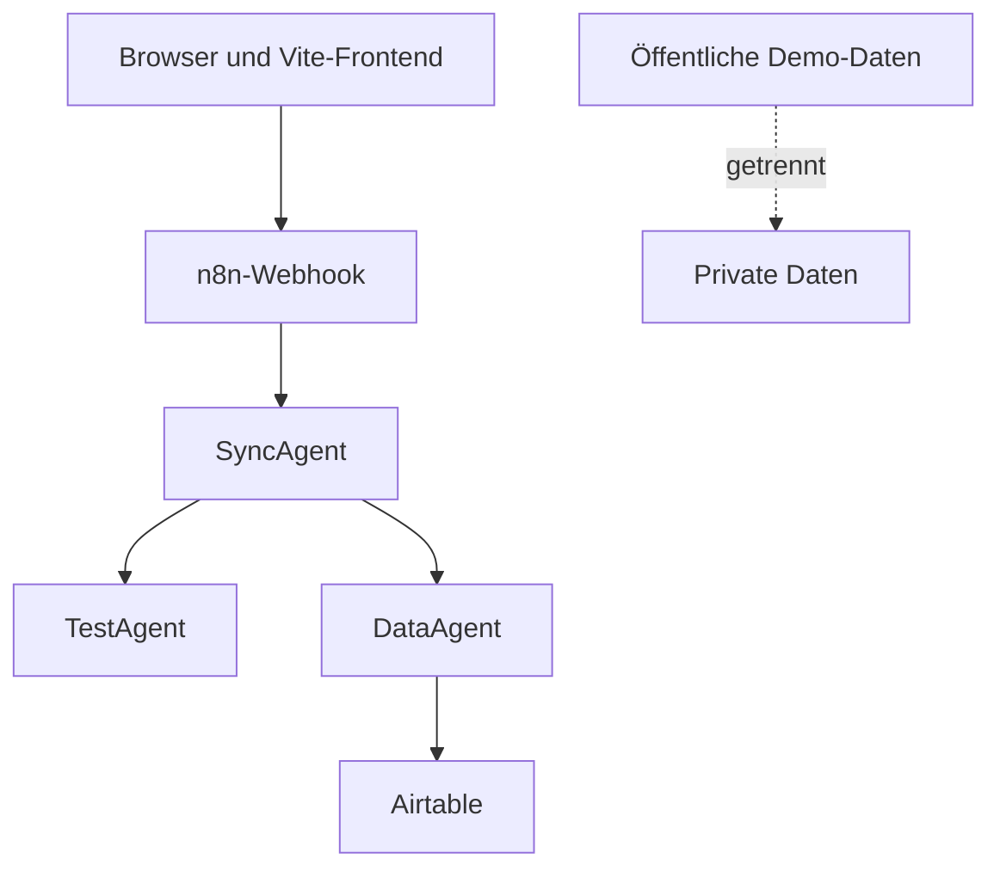

# GoldenDawn OS – Sicherheitsgrundlage

## Dokumentstatus

| Feld | Wert |
| --- | --- |
| Projektphase | `v0.2.2 – LichtwaldLog Local MVP in Arbeit` |
| Geltungsbereich | Version 1 und Portfolio-Demo |
| Status | Verbindliche Sicherheitsbasis; `v0.2.1` aktuelle Paket- und Releaseversion; LichtwaldLog Foundations, Anwendungskomposition, Navigation sowie lokaler CRUD-, Fokus-, Such- und Filterfluss implementiert |
| Letzte Aktualisierung | 2026-08-01 |

Dieses Dokument definiert die Sicherheits- und Datenschutzgrenzen für
GoldenDawn OS. Es ergänzt `AGENTS.md`, `docs/architecture.md` und
`docs/roadmap.md`.

Die Regeln sind eine technische Mindestbasis und keine Garantie vollständiger
Sicherheit. Offene Risiken werden dokumentiert und vor einem öffentlichen
Deployment erneut bewertet.

## Sicherheitsziele

GoldenDawn OS soll:

- keine Secrets im Frontend oder Repository offenlegen;
- private Daten strikt von öffentlichen Demo-Daten trennen;
- externe Requests validieren, begrenzen und nachvollziehbar behandeln;
- Airtable ausschließlich über den DataAgent ansprechen;
- Agenten nur die für ihre Aufgabe nötigen Daten und Fähigkeiten geben;
- Fehler und Logs für die Diagnose nutzbar halten, ohne sensible Inhalte zu
  verbreiten;
- bei Ausfällen kontrolliert reagieren und keine unbemerkten Duplikate oder
  Datenverluste erzeugen.

## Schutzwerte

| Schutzwert | Beispiele | Schutzziel |
| --- | --- | --- |
| Credentials | Airtable-PAT, Modell-Token, n8n-Schlüssel | Vertraulichkeit und Rotation |
| Private Daten | Lernnotizen, Testergebnisse, Reflexionen | Vertraulichkeit und Zweckbindung |
| Systemdaten | Request-IDs, Agentenstatus, Fehlercodes | Integrität und Nachvollziehbarkeit |
| Prompt- und Lerninhalte | PromptVault, Testkontext | Integrität und Schutz vor Injection |
| Airtable-Datensätze | Prompts, Lernfortschritt, Testergebnisse | Vertraulichkeit und Integrität |
| Quellcode und Dokumentation | GitHub-Repository | Integrität und Secret-Freiheit |
| Öffentliche Demo | synthetische Daten und Beispielabläufe | Missbrauchsbegrenzung |

## Datenklassifikation

| Klasse | Inhalt | Erlaubte Ablage | Repository und Logs |
| --- | --- | --- | --- |
| Öffentlich | README, Architektur, bereinigte Beispiele | GitHub und Demo | erlaubt |
| Demo | vollständig synthetische Datensätze | separate Demo-Datenquelle | erlaubt, wenn eindeutig markiert |
| Privat | reale Lern- und Reflexionsdaten | lokale private Ablage oder private Airtable-Base | nicht committen, Logs minimieren |
| Sensitiv | Gesundheitsdaten oder besonders persönliche Notizen | nur ausdrücklich freigegebene private Systeme | nicht committen oder in Ausführungsdaten speichern |
| Secret | Tokens, Schlüssel, Passwörter, Credential-IDs | n8n-Credential-Store oder serverseitige Secret-Verwaltung | niemals committen oder loggen |

Synthetische Demo-Daten dürfen keine leicht veränderten Kopien realer privater
Daten sein. Sie werden neu erstellt und als Demo-Inhalte gekennzeichnet.

## Vertrauensgrenzen



An jeder Grenze gilt:

- Eingaben werden als nicht vertrauenswürdig behandelt.
- Struktur, Datentypen, Wertebereiche und Größe werden validiert.
- Fehlerantworten enthalten keine Secrets oder internen Stacktraces.
- Berechtigungen werden nicht allein aus Angaben des Clients abgeleitet.
- Daten werden nur an den Agenten weitergegeben, der sie benötigt.

## Bedrohungsmodell für Version 1

| Bedrohung | Beispiel | Gegenmaßnahme |
| --- | --- | --- |
| Secret-Leak | Token in `VITE_*`, Git oder Screenshot | keine Secrets im Client, Secret-Scan und Rotation |
| Webhook-Missbrauch | automatisierte oder übergroße Requests | Authentisierung oder Netzschutz, Rate Limit, Größenlimit |
| Prompt Injection | Lerntext fordert den TestAgent zu Fremdaktionen auf | Kontext als Daten behandeln, Toolrechte begrenzen, Output validieren |
| Unberechtigter Datenzugriff | frei wählbare Airtable-Tabelle oder Record-ID | Entitäts- und Feld-Allowlist im DataAgent |
| Mass Assignment | Client sendet zusätzliche geschützte Felder | nur definierte Felder übernehmen |
| Doppelte Schreibvorgänge | Wiederholung nach Timeout | `requestId`, Idempotenz und eindeutige IDs |
| Datenvermischung | Demo schreibt in private Base | getrennte Bases, Tokens, Workflows und Deployments |
| XSS | Prompt-Text wird als HTML gerendert | standardmäßig `textContent`, kein unbereinigtes `innerHTML` |
| Übermäßige Logs | vollständige Prompts oder Tokens in n8n-Ausführung | Redaction, Datensparsamkeit und kurze Aufbewahrung |
| Abhängigkeitsrisiko | unnötiges Paket mit Schwachstelle | wenige Abhängigkeiten und dokumentierte Einführung |

## Frontend-Sicherheit

### Öffentliche Vite-Variablen

Alle Variablen mit dem Präfix `VITE_` gelangen in den Client-Build und gelten
deshalb als öffentlich. Dort dürfen nur nicht-sensitive Konfigurationswerte
liegen.

Nicht erlaubt:

```text
VITE_AIRTABLE_TOKEN
VITE_OPENAI_API_KEY
VITE_N8N_SECRET
VITE_DATABASE_PASSWORD
```

Eine Webhook-URL darf nur dann als Client-Konfiguration verwendet werden, wenn
sie ausdrücklich nicht als Secret oder alleiniger Schutzmechanismus behandelt
wird.

### Browser-Speicher

- `localStorage`, `sessionStorage` und IndexedDB sind keine Secret-Stores.
- `localStorage` speichert Werte unverschlüsselt und kann von JavaScript
  derselben Origin gelesen werden. Eingeschleuster oder kompromittierter
  Same-Origin-Code kann daher auch lokale private Inhalte erreichen.
- Tokens und Passwörter werden dort nicht gespeichert.
- Lokale private Inhalte werden auf das notwendige Minimum begrenzt.
- Beschädigte oder manipulierte Werte werden nicht ungeprüft verwendet.
- `dataOrigin: private` ist nur eine fachliche Klassifikation. Das Feld
  verschlüsselt Daten nicht, authentifiziert keine Person und bildet keine
  technische Zugriffsgrenze.
- Ein fachlich append-only geführter Log ist in `localStorage` technisch ein
  überschreibbarer JSON-Snapshot. Append-only ersetzt weder kryptografische
  Integrität noch eine Signatur oder Manipulationssperre.
- Ein Read-Preflight unmittelbar vor dem Schreiben ist keine Transaktion. Er
  verhindert weder Änderungen zwischen Prüfung und Save noch TOCTOU- oder
  Multi-Tab-Rennen.
- Lokale Browserdaten sind keine Cloud-Sicherung, keine geräteübergreifende
  Synchronisierung und kein Schutz vor dem Löschen des Browserprofils.
- Eine spätere Browser-Authentifizierung benötigt eine eigene serverseitige
  Architekturentscheidung.

### Lokale Modulgrenzen für v0.2.x

Die Module der Reihe `v0.2.x` arbeiten ausschließlich lokal. Sie übertragen
keine Inhalte an Webhooks, Agenten, Airtable oder andere externe Dienste.
Datenzugriffe laufen über fachliche Services und Storage-Adapter; Views und
Controller greifen nicht direkt auf `localStorage` zu.

#### LearningHub Local MVP in v0.2.1

- Der implementierte lokale Inhaltsfluss verläuft ausschließlich über
  `LearningHubView`, `LearningHubController`, `LearningHubService`,
  `LearningHubStorage` und den gemeinsamen `StorageAdapter`. View und
  Controller greifen nicht direkt auf `localStorage` zu. Der Storage verwendet
  den festen, nicht nutzerkontrollierten Key
  `goldendawn.learningHub.content.v1` und akzeptiert im privaten Speicherpfad
  nur Hubs mit `dataOrigin: private`.
- Der davon getrennte Progress-Pfad verläuft über
  `LearningProgressService`, `LearningHubService`,
  `LearningProgressStorage` und den gemeinsamen `StorageAdapter`. Der
  Progress-Service verwendet den Inhaltsservice nur zum Laden und zur
  Referenzprüfung; es gibt keine Rückabhängigkeit. Fortschritt liegt unter dem
  festen Key `goldendawn.learningHub.progress.v1`, während der Inhaltsvertrag
  unverändert unter `goldendawn.learningHub.content.v1` bleibt.
- Der getrennte LearningArtifact-Pfad verläuft über `LearningHubView`,
  `LearningHubController`, `LearningArtifactService`,
  `LearningArtifactStorage` und den gemeinsamen `StorageAdapter`. Der
  Artifact-Service verwendet den Inhaltsservice ausschließlich zum Laden und
  zur vollständigen Referenzprüfung; es gibt keine Rückabhängigkeit. Artefakte
  liegen unter `goldendawn.learningHub.artifacts.v1` und sind als Notizen und
  Zusammenfassungen lokal bedienbar.
- `src/main.js` injiziert Progress- und Artifact-Service in den vorhandenen
  `LearningHubController`. Der Controller hält validierte private Snapshots,
  gibt der View aber nur die benötigten Projektionen ohne Progress-Logs,
  Artefakt- oder Ereignis-IDs, Referenzketten und Zeitstempel. Kapitel-
  Checkboxen, Fortschrittsanzeigen und Artefakteditoren bleiben vollständig
  lokal und übertragen keine Daten an Webhooks, Agenten, Airtable oder andere
  Netzwerke.
- Private LearningModules, Kapitel, LearningNodes, Lernnotizen,
  Zusammenfassungen, Testfragen, Erklärungen, Antworten und Attempts werden
  weder in das Repository übernommen noch in öffentlichen Demo-Daten oder
  unnötigen Logs verwendet.
- Die kanonische LearningHub-Demoquelle verwendet ausschließlich unabhängig
  erfundene synthetische Inhalte mit `dataOrigin: synthetic`; private
  Nutzerdaten fließen niemals in diese Repository-Quelle zurück. ADR 0012
  erlaubt daraus genau einmal eine defensive Arbeitskopie mit
  `dataOrigin: private`, weil die lokalen Fachstorages ausschließlich private
  Arbeitszustände akzeptieren. Das Modul bleibt sichtbar mit `[Demo]`
  gekennzeichnet und der Vorgang überträgt keine Daten an externe Dienste.
- Dieser Erststart ist nur erlaubt, wenn Inhaltsstore, Artifact-Store,
  Testbank und Initialisierungsmarker sämtlich fehlen. Jeder vorhandene Key –
  auch ein leerer oder beschädigter – verhindert Ergänzung und Überschreiben.
  Der zuletzt geschriebene Marker hält sowohl einen Seed als auch ein bewusstes
  Überspringen dauerhaft fest; Bearbeitungen und spätere Löschungen werden
  nicht durch erneutes Seeding rückgängig gemacht.
- Vor dem ersten Write werden alle drei Fachverträge und ihre Referenzketten
  geprüft. Bei einem Teilfehler darf der Rollback ausschließlich noch
  bytegleiche Seed-Werte entfernen. Fremde oder zwischenzeitlich geänderte
  Werte bleiben unangetastet. Attempt- und Progress-Stores werden nicht
  vorbefüllt; es entstehen keine Antworten, Ergebnisse oder Historieneinträge.
- Ein fehlender Storage-Key liefert nur im Arbeitsspeicher einen leeren
  privaten Hub und löst beim Laden keinen Schreibzugriff aus. Beschädigtes JSON,
  ungültige Schema-Daten oder Adapterfehler werden davon unterschieden und
  niemals stillschweigend gelöscht, überschrieben oder durch den leeren Hub
  ersetzt.
- Entsprechend liefert ein fehlender Progress-Key einen frischen privaten Log
  mit leerem `events`-Array ohne Initialisierungsschreibzugriff. Der private
  Progress-Storage akzeptiert ausschließlich `dataOrigin: private`.
  Synthetische, beschädigte oder nicht unterstützte gespeicherte Logs bleiben
  unverändert und werden weder als leerer privater Log ausgegeben noch durch
  ihn überschrieben.
- Entsprechend liefert ein fehlender Artifact-Key einen frischen privaten
  Store mit leerem `artifacts`-Array ohne Initialisierungsschreibzugriff. Der
  Artifact-Storage akzeptiert im privaten Pfad ausschließlich
  `dataOrigin: private`. Synthetische, beschädigte oder nicht unterstützte
  gespeicherte Artefaktdaten bleiben unangetastet und werden nicht als leerer
  Privatbestand ausgegeben oder überschrieben. Lese- und Schreibwerte werden
  defensiv geklont und vor dem Speichern vollständig validiert. Ein
  Read-Preflight desselben Keys blockiert jeden Save über einen vorhandenen
  synthetischen, beschädigten, nicht unterstützten oder nicht sicher lesbaren
  Bestand; er ist keine Transaktions- oder Multi-Tab-Sperre.
- Die LearningTest-Foundation verwendet zwei weitere getrennte feste Keys:
  `goldendawn.learningHub.testBank.v1` für den veränderbaren privaten
  Fragenbestand und `goldendawn.learningHub.testAttempts.v1` für
  abgeschlossene append-only Attempts. Beide Verträge verwenden unabhängig
  `schemaVersion: 1`; sie erweitern weder Inhalt, Progress noch Artifacts.
- Beide Test-Storages akzeptieren im privaten Pfad ausschließlich
  `dataOrigin: private`. Fehlende Keys liefern schreibfrei frische private
  Leerzustände. Synthetische, beschädigte und nicht unterstützte Bestände
  bleiben unangetastet und werden nicht automatisch importiert, gelöscht oder
  überschrieben. Lese-, Schreib- und Rückgabewerte werden defensiv geklont und
  vollständig validiert.
- Vor jedem Bank-Save beziehungsweise Attempt-Append liest der fachliche
  Storage seinen festen Key erneut. Dieser Preflight blockiert erkennbare
  falsche Herkunft und beschädigte Daten, bietet aber keine Transaktion:
  Änderungen zwischen Prüfung und Schreiben sowie TOCTOU- und Multi-Tab-Rennen
  bleiben möglich.
- `LearningTestAttemptStorage` bietet keinen allgemeinen öffentlichen
  Überschreibpfad. Es darf nur genau einen neuen Attempt an einen unveränderten
  gültigen Präfix hängen. Diese append-only Regel beweist weder Urheberschaft
  noch Unveränderlichkeit; derselbe Origin-Speicher bleibt technisch
  überschreibbar und besitzt keine kryptografische Verkettung oder Signatur.
- Der `LearningHubService` trimmt Eingabetexte vor der Längenprüfung und
  begrenzt Titel auf 120 sowie LearningNode-Inhalte auf 10.000 Zeichen. Diese
  Eingabegrenzen reduzieren versehentlich übergroße einzelne Werte, ersetzen
  aber weder Quota-Behandlung noch eine allgemeine Größenbegrenzung des
  vollständigen Hubs. Der persistierte Vertrag bleibt bei
  `schemaVersion: 2`; Schema 3 wird dadurch nicht eingeführt.
- Fehlermeldungen und Logs enthalten keine privaten Titel, LearningNode-Texte,
  Artefakttexte, Testfragen, Optionslabel, Erklärungen, Antworten, Artefakt-,
  Test- oder Referenz-IDs, Referenzketten, Zeitstempel, vollständigen
  Fortschritts- oder Attempt-Logs oder sonstigen Rohdaten. Rohe
  `DOMException`- und Dependency-Fehler werden nicht unkontrolliert an höhere
  Schichten weitergereicht; die Foundation erzeugt keine Console-Ausgaben.
- Die Oberfläche weist sichtbar darauf hin, dass Inhalte, Fortschritt, Notizen,
  Zusammenfassungen, Testfragen und abgeschlossene Versuche nur im aktuellen
  Browserprofil ohne Cloud-Sicherung oder geräteübergreifende
  Synchronisierung liegen und von anderen Skripten derselben Origin
  grundsätzlich aus dem unverschlüsselten `localStorage` gelesen werden
  könnten. Sie behauptet weder Echtzeit- noch Multi-Tab-Konsistenz.
- Die Mock-Test-UI weist zusätzlich darauf hin, dass laufende Sessions nur im
  Arbeitsspeicher liegen und bei einem Reload verloren gehen. Sie ist sichtbar
  als „Lokaler Mock-Test“ gekennzeichnet und behauptet keine KI-Bewertung.
- Schema 2 speichert keine Abschluss- oder Fortschrittsdaten. Kapitelabschluss
  und daraus abgeleiteter Modulfortschritt verwenden den separaten
  LearningProgress-Schema-1-Vertrag; Testkompetenz bleibt ein davon getrenntes
  Konzept.
- Die LearningTestBank unterstützt in Schema 1 ausschließlich
  nutzerkonfigurierte Single-Choice-Fragen mit zwei bis sechs Optionen und
  vollständigen Modul-, Kapitel- und LearningNode-Referenzen. Vor jeder
  fachlichen Operation außer dem rein speicherinternen Session-Abbruch
  validiert der Service den aktuellen Hub und die vollständige Bank; verwaiste
  oder falsch zugeordnete Referenzen werden nicht repariert oder überschrieben.
  `cancelModuleTest` prüft dagegen nur den flüchtigen Sessionzustand und liest
  weder Hub noch Bank oder Attempt-Storage.
- Die öffentliche Testprojektion entfernt vor der Abgabe
  `correctOptionId` und `explanation`. Das reduziert versehentliche
  Lösungsweitergabe an die Runner-View, schützt aber nicht vor anderem
  JavaScript derselben Origin, das lokalen Speicher oder Servicezustand lesen
  kann.
- Laufende Sessions halten den vollständigen Antwortschlüssel ausschließlich
  im privaten Speicher der Serviceinstanz und werden nicht persistiert. Nach
  einem Reload muss der Test neu begonnen werden. Erst eine vollständige
  valide Abgabe hängt genau einen Attempt an; nach erfolgreichem Append wird
  eine Doppelsubmission derselben Session ohne zweiten Schreibzugriff
  abgelehnt.
- Attempts kopieren keine Fragen-, Options-, Erklärungs- oder LearningNode-
  Texte. Referenz-IDs, ausgewählte und korrekte Options-IDs, Fragenrevisionen
  und Zeitstempel bleiben dennoch private Nutzungsmetadaten und dürfen nicht
  unnötig dargestellt oder protokolliert werden.
- Ein lokaler Score verändert weder Kapitelprogress noch LearningArtifacts und
  wird nicht als Testkompetenz ausgegeben. Confidence, Hinweise,
  Freitext-Rubriken, semantische Freitextbewertung und Kompetenzstände sind nur
  mögliche spätere versionierte Erweiterungen; Schema 1 reserviert dafür keine
  Felder.
- Der getrennte LearningArtifact-Schema-1-Vertrag speichert ausschließlich
  stabile Modul-, Kapitel- und LearningNode-Referenz-IDs, den privaten
  Artefakttext sowie Erstellungs- und Änderungszeitpunkt. Er kopiert keine
  Modul-, Kapitel- oder LearningNode-Titel und keine vollständigen
  LearningNode-Inhalte. IDs, Referenzketten und Zeitpunkte bleiben dennoch
  private Metadaten und dürfen nicht unnötig offengelegt werden.
- Pro LearningNode ist höchstens eine aktuelle Notiz und eine aktuelle
  Zusammenfassung erlaubt. Diese Texte sind editierbare Arbeitsstände ohne
  Versionshistorie und ausdrücklich keine append-only Progress-Ereignisse.
  Vor Mutationen werden Zielkette, vorhandene Artefaktketten und beide
  vollständigen Stores geprüft; verwaiste oder falsch zugeordnete Daten werden
  nicht automatisch repariert, gelöscht oder überschrieben.
- Artefakttexte werden vor der Validierung getrimmt und auf 10.000 Zeichen pro
  Artefakt begrenzt. Diese Einzelgrenze ersetzt weder eine
  Gesamtgrößenbegrenzung des Artifact-Stores noch Quota-Behandlung. Browser-
  Quota und Multi-Tab-Rennen können weiterhin zu kontrollierten Fehlern oder
  überholten Schreibständen führen.
- Ein isolierter Artifact-Ladefehler lässt Inhaltsverwaltung und Fortschritt
  bedienbar, deaktiviert nur Artefaktmutationen und bietet einen nicht
  destruktiven Retry. Mutationsfehler erhalten die letzte valide Projektion und
  den eingegebenen Text. Identische Saves bleiben als sichtbarer UI-Zustand
  schreibfrei; der Service behandelt weiterhin auch bereits leere Clear-Ziele
  als No-op. Das Leeren erfordert eine zugängliche Inline-Bestätigung und
  verwendet keinen blockierenden Browserdialog.
- Der Progress-Vertrag speichert ausschließlich Ereignis-ID, Ereignistyp,
  Modul- und Kapitelreferenz sowie UTC-Zeitstempel. Titel und
  LearningNode-Inhalte werden nicht in Ereignisse oder Projektionen kopiert.
  IDs und Nutzungszeitpunkte können dennoch private Metadaten sein und werden
  nicht unnötig protokolliert oder in öffentliche Demo-Daten übernommen.
- Vor einer Progress-Mutation werden der vollständige Hub und Log validiert,
  alle gespeicherten Referenzen gegen den aktuellen Inhaltsstand geprüft und
  verwaiste oder falsch zugeordnete Ereignisse kontrolliert abgelehnt. Diese
  Prüfung schützt vor versehentlicher Weiterverarbeitung inkonsistenter Daten,
  beweist aber weder Urheberschaft noch Manipulationsfreiheit.
- Kann Progress nicht sicher geladen oder gegen den aktuellen Hub projiziert
  werden, bleibt die Inhaltsverwaltung bedienbar. Die Oberfläche zeigt keine
  falschen 0-Prozent-Werte, deaktiviert Fortschrittsaktionen und bietet einen
  nicht destruktiven Retry. Beschädigte oder verwaiste Progress-Daten werden
  weder gelöscht, repariert noch überschrieben.
- Fortschrittsfehler und sichtbare Statusmeldungen enthalten keine privaten
  Titel, LearningNode-Inhalte, Modul- oder Kapitel-IDs, Ereignis-IDs,
  Zeitstempel oder Roh-Payloads. Private Nutzereingaben werden weiterhin nur
  über sichere DOM-Text-APIs gerendert.
- Append-only gilt ausschließlich für die öffentlichen Operationen des
  `LearningProgressService`. Der vollständige Log wird technisch bei jeder
  echten Änderung als neuer JSON-Snapshot geschrieben. Es gibt keine
  kryptografische Verkettung, Signatur oder Manipulationssperre; andere Skripte
  derselben Origin könnten den Wert lesen, überschreiben oder umsortieren. Das
  Modell ist xAPI-inspiriert, aber nicht xAPI-konform, verwendet kein LRS und
  beansprucht kein vollständiges Event Sourcing.
- `chapter.started` ist in Schema 1 nicht erlaubt. Seine spätere Einführung
  benötigt eine versionierte Vertrags- und Sicherheitsprüfung, weil zusätzliche
  Zeit- und Nutzungsmetadaten entstehen würden.
- Eine spätere Archivierung muss Fortschrittsereignisse erhalten. Dauerhaftes
  Löschen von Modulen oder Kapiteln benötigt vor der Implementierung eine
  gesonderte Referenz- und Löschrichtlinie; verknüpfte Ereignisse dürfen nicht
  stillschweigend entfernt oder verwaist werden.
- Der implementierte LearningTest-Pfad arbeitet lokal und deterministisch mit
  nutzerkonfigurierten Single-Choice-Fragen. Er verwendet keine KI, keinen
  `TestAgent`, keine Freitextbewertung und keine externe Kommunikation. Die
  UI kennzeichnet ihn sichtbar als **„Lokaler Mock-Test“** und behauptet keine
  darüber hinausgehende Funktion.
- Die Artifact-Foundation speichert Notizen und Zusammenfassungen bereits
  ausschließlich hinter Controller-, Service- und Storage-Adapter-Grenzen. Die
  implementierte View greift nicht direkt auf `localStorage` zu. Testbank und
  Attempts liegen ebenfalls ausschließlich hinter Service-, fachlichen
  Storage- und `StorageAdapter`-Grenzen; der vorhandene Controller hält
  private Snapshots und gibt nur die erforderlichen redigierten Projektionen an
  die View weiter.
- Vor der Abgabe gelangen weder korrekte Options-IDs noch Erklärungen oder
  interne Bank-Snapshots in das Runner-View-Modell. Ein kontrollierter
  Session-Abbruch schreibt keinen Attempt; laufende oder pending Abgaben werden
  nicht verworfen, damit Retry und Reconciliation möglich bleiben.
- Der lokale MVP garantiert noch keine Multi-Tab-Konsistenz und verwendet keine
  Transaktionssperre. Gleichzeitige Änderungen in mehreren Tabs können sich
  überholen; Browser-Quota, fehlende Verschlüsselung und fehlende
  Synchronisierung bleiben ebenfalls offene Grenzen. Eine spätere Lösung
  benötigt einen eigenen Vertrag.

Schema 2 bleibt der verbindliche interne Inhalts- und Validierungsvertrag. Der
Storage-Key `content.v1` bezeichnet davon getrennt nur dessen
Persistenz-Namespace. Der Fortschrittsvertrag verwendet unabhängig
`schemaVersion: 1` und den Persistenznamespace `progress.v1`. View, Controller,
Service und Storage für private Inhalte sowie Vertrag, Projektion, Service und
Storage einschließlich der zugänglichen Progress-UI sind implementiert. Für
Notizen und Zusammenfassungen sind Vertrag, Service, Storage, Controller-
Anbindung und sichere lokale UI implementiert. Für LearningTest sind Bank- und
Attempt-Vertrag, getrennte private Storages, reine Engine, referenzprüfender
Service sowie Controller-, View- und `src/main.js`-Anbindung implementiert.
`v0.2.1` ist vollständig geprüft und veröffentlicht. Der annotierte Tag
`v0.2.1` und das zugehörige GitHub Release wurden am `2026-07-25`
veröffentlicht. GoldenDawn OS ist seitdem als öffentlich sichtbares
Portfolio-Repository ohne Open-Source-Lizenz verfügbar.
`v0.2.2 – LichtwaldLog Local MVP` ist als rein lokaler Meilenstein in Arbeit.
Die Contract Foundation, private Storage-Foundation, Service-Foundation und
Controller-Foundation sowie die isolierte View- und CSS-Foundation sind
implementiert und über den gemeinsamen `StorageAdapter` in `src/main.js`
komponiert. LichtwaldLog ist über die Navigation mit dem sichtbaren Status
`In Arbeit` erreichbar; der lokale CRUD- und Fokusfluss ist vollständig über
GoldenDawn OS bedienbar und real im Browser auf Desktop mit `1440 × 1000` sowie
bei exakt `390 × 844` geprüft. Die lokale Textsuche sowie exakte Kalenderdatum-
und Tagfilter sind als reine flüchtige Controllerableitung implementiert und
werden nicht persistiert. Nur die getrennte synthetische Demo-Integration bleibt
fachlich offen. ADR 0013 und ADR 0014 bleiben unverändert. Der
vollständige MVP ist weder abgeschlossen noch veröffentlicht.

#### LichtwaldLog Local MVP in v0.2.2

- Implementiert sind der Schema-1-Vertrag, der reine Validator, synthetische
  Contract-Tests und ADR 0013, die private Storage-Foundation und ADR 0014, die
  darauf aufbauenden Service- und Controller-Foundations und die isolierte View-
  und CSS-Foundation, das reine Suchmodul sowie deren Anwendungskomposition über
  den gemeinsamen `StorageAdapter` in `src/main.js`.
- Der implementierte lokale Datenfluss lautet ausschließlich
  `LichtwaldLogView → LichtwaldLogController → LichtwaldLogService → LichtwaldLogStorage → StorageAdapter → localStorage`.
  Der Storage verwendet den festen Key
  `goldendawn.lichtwaldLog.content.v1`, speichert den direkten Schema-1-Root
  als einen Full-Snapshot ohne zweites Envelope oder getrennte Entry- und
  Fokus-Keys und akzeptiert nur `dataOrigin: private`.
- `createLichtwaldLogService` besitzt eine eingefrorene API mit exakt
  `loadLog`, `createEntry`, `updateEntry`, `deleteEntry` und
  `setFeaturedEntry`. Der letzte Aufruf akzeptiert ausschließlich eine
  gültige exakte Entry-ID oder `null`; eine zusätzliche Clear- oder
  Toggle-Operation existiert nicht.
- `createLichtwaldLogController` besitzt eine eingefrorene API mit exakt
  `open` und `close`. Der View-Port wird ausschließlich über
  `render(viewModel, actions)` und `unmount()` injiziert.
  `createLichtwaldLogView(rootElement)` implementiert ihn als isolierte
  DOM-Grenze und liefert eine eingefrorene API mit exakt den eigenen
  Data-Properties `render` und `unmount`. Die feste sechzehnteilige
  Action-Allowlist umfasst `onRetryLoad`,
  `onSelectEntry`, `onBackToOverview`, `onOpenCreateEntryForm`,
  `onOpenUpdateEntryForm`, `onUpdateFormField`, `onSubmitForm`,
  `onCancelForm`, `onRequestDeleteEntry`, `onCancelDeleteEntry`,
  `onConfirmDeleteEntry`, `onSetFeaturedEntry`, `onChangeSearchQuery`,
  `onChangeCalendarDateFilter`, `onChangeTagFilter` und `onResetFilters`.
- `lichtwaldLogSearch.js` ist rein und kennt weder Service, Storage, Adapter,
  DOM, Browserzustand noch Netzwerk. Es normalisiert ausschließlich für den
  Vergleich mit NFC und `toLowerCase()`, wertet Query und Tags literal aus und
  verwendet weder RegExp noch dynamisches Markup. Der Kalenderdatum-Filter wird
  ohne `Date`- oder Zeitzonenumwandlung geprüft.
- Der Controller akzeptiert intern nur erneut vollständig mit
  `validateLichtwaldLog` geprüfte private Snapshots. Sein Snapshot ist eine
  flüchtige, tief entkoppelte UI-Projektion und niemals Grundlage eines
  Persistenzkandidaten. Das View-Modell enthält weder den rohen Schema-1-Root
  noch `schemaVersion`, `dataOrigin`, fremde Resultate oder interne Tokens.
- `searchQuery`, `calendarDateFilter`, `selectedTag`, `availableTags`,
  `visibleEntryIds`, `hasActiveFilters` und `filteredEmptyState` sind
  ausschließlich flüchtige defensive Ableitungen. Sie sind keine Felder von
  Schema 1 und gelangen weder in Storage noch Adapter. Die vollständige
  `entries`-Projektion bleibt für Details und Formulare erhalten.
- Pro akzeptierter Lade- oder Mutationsintention erfolgt exakt ein passender
  Serviceaufruf. Such- und Filteraktionen führen dagegen zu keinem Service-,
  Storage-, Adapter-, ID-Generator- oder Schedulerzugriff. Nach Mutationen gibt
  es keinen zusätzlichen Controller-Load,
  keinen Storage-Fallback und keine optimistische Inhalts-, Delete- oder
  Fokusänderung. Auswahl, Formularbearbeitung und -abbruch sowie Anfordern und
  Abbrechen einer Löschbestätigung sind service- und schreibfrei. Update- und
  Fokus-No-ops entscheidet ausschließlich der Service.
- Ziel-IDs werden exakt und case-sensitive im vertrauenswürdigen Snapshot
  aufgelöst. Eine Auswahl aus der Übersicht muss zusätzlich aktuell sichtbar
  sein. Der gewünschte Fokusendzustand wird ausdrücklich als Entry-ID oder
  `null` übergeben, nie getoggelt. Defensive View-Projektionen behalten die
  Entry- und Tag-Reihenfolge bei und teilen keine veränderlichen Referenzen.
- Die isolierte View baut jeden DOM-Baum ausschließlich über sichere DOM- und
  Formcontrol-APIs neu auf. Private Titel, Texte, Tags und Formwerte bleiben
  ungeparster Plain Text. Es gibt keine dynamische HTML- oder Markup-Auswertung,
  keine aus privaten Inhalten erzeugten URLs und keine Inhaltslogs.
- Query und Kalenderdatum werden nur über `.value`, Tagoptionen nur über sichere
  Text- und Formcontrol-APIs ausgegeben. Query, Datum und Tag werden weder in
  dynamische IDs, Klassen, Selektoren, Meldungen, URLs, `data-*`- oder
  ARIA-Attribute noch in Logs übernommen. Der Ergebnisstatus enthält nur Zahlen
  und statische Texte; gefilterte private Entries werden vollständig aus dem
  jeweils neuen DOM entfernt.
- Entry-IDs verbleiben ausschließlich als unveränderte Action-Ziele in
  Closures und renderlokalen Maps. Sie gelangen weder in sichtbare Texte,
  DOM-/ARIA-IDs, Selektoren, Klassen, `data-*`-Attribute noch View-eigene
  Status-, Fehler- oder Bestätigungsmeldungen.
- Die Mehrfeld-Tag-UI übergibt neue dichte Arrays ohne Komma-Parsing, Trimmen,
  Sortieren, Deduplizieren oder Case-Normalisierung. Die View projiziert Inhalt,
  Löschung und Fokus nicht optimistisch und bildet keine persistente oder
  fachlich autoritative Zustandsquelle.
- Zugängliche Lade-, Leer-, Busy-, Erfolgs-, Notice-, Validierungs- und
  Fehlerzustände sowie die vollständige Fokuszielauflösung verwenden nur feste
  Semantik und redigierte Meldungen. `unmount()` entfernt sämtliche privaten
  Inhalte und den Busy-Zustand aus dem dedizierten Root und verwirft nur
  flüchtige Filter-, Fokus- und Caret-Metadaten.
- Der statische View-Hinweis benennt den Speicherort im aktuellen
  Browserprofil, fehlende geräteübergreifende Synchronisierung und automatische
  Cloud-Sicherung, die unverschlüsselte `localStorage`-Grenze, den möglichen
  Zugriff durch Skripte derselben Origin und möglichen Datenverlust beim
  Löschen von Browserdaten. Daraus wird keine formale Datenschutz-, Sicherheits-
  oder Accessibility-Konformität abgeleitet.
- Der Storage bleibt die einzige veränderliche Wahrheit. Der Service hält
  keinen langlebigen Cache, lädt den aktuellen privaten Snapshot für jede
  gültige Operation neu und akzeptiert ausschließlich vollständig gültige
  Zustände mit `dataOrigin: private`. Ungültige Form- und Ziel-ID-Eingaben
  werden vor Storage-, Generator- oder Schreibzugriffen abgelehnt.
- Formularobjekte und Tags werden über feste Feld- und Container-Allowlists
  gelesen. Kalenderdatum, Titel, Text und Tags werden nur an den Rändern
  getrimmt; interne Whitespaces und Zeilenumbrüche bleiben erhalten.
  Kalenderdaten werden ohne `Date`- oder Zeitzonenumwandlung geprüft.
  Ziel-IDs werden nicht automatisch normalisiert, sondern bereits getrimmt,
  längenbegrenzt, exakt und case-sensitive aufgelöst. Werfende Getter, Proxies
  und Reflection-Fehler werden kontrolliert behandelt.
- Die Standard-ID verwendet `lichtwald-entry-${crypto.randomUUID()}`.
  Ungültige, überlange, kollidierende und werfende Generatorresultate sind
  gemeinsam auf fünf Versuche begrenzt. Bei bereits 1.000 Einträgen erfolgen
  weder Generator- noch Save-Aufruf.
- Jede echte Mutation erzeugt einen neuen privaten Kandidaten, validiert den
  vollständigen Schema-1-Zustand und ruft an der Servicegrenze genau einmal
  `saveLichtwaldLog` auf. Inhaltlich identische Updates, ein bereits gesetzter
  Fokus und das Entfernen eines bereits leeren Fokus sind erfolgreiche
  schreibfreie No-ops. Beim Löschen des fokussierten Eintrags werden Entry und
  `featuredEntryId` im selben Kandidaten atomar geändert; ein verwaister
  Zwischenzustand wird nicht persistiert.
- Die tatsächliche serialisierte JSON-Zeichenfolge ist anhand von
  `String.length` auf 500.000 UTF-16-Codeeinheiten begrenzt. Exakt 500.000 sind
  erlaubt; größere Werte werden vor `JSON.parse` beziehungsweise vor
  `setItem` kontrolliert abgelehnt. Dieses Anwendungslimit garantiert keine
  Browser-Quota, und `QuotaExceededError` bleibt ein eigener Fehlerfall.
- Ein fehlender Key liefert ohne Initialisierungsschreibzugriff bei jedem Load
  einen frischen privaten Leerzustand. Gefundene und zu speichernde Snapshots
  werden vollständig validiert, defensiv tief geklont und als Clone erneut
  validiert. Service-Rückgaben, einzelne Entries und Save-Argumente sind
  zusätzlich von Eingaben, Dependency-Resultaten, internen Kandidaten und
  anderen Rückgaben entkoppelt. Eingaben und Rückgabewerte werden nicht mutiert
  oder geteilt.
- Vor einem Save schützt ein Read-Preflight synthetische, beschädigte,
  inkompatible, übergroße oder nicht sicher lesbare Rohbestände vor
  automatischem Überschreiben. Es erfolgen keine Reparatur, Migration,
  Demo-Übernahme oder automatische Löschung. Der Preflight ist keine
  Transaktion, kein Compare-and-Swap, kein Lock und kein Schutz vor TOCTOU- oder
  Multi-Tab-Rennen. Er bleibt im Storage bestehen; deshalb kann eine Mutation
  trotz genau eines Loads und eines Saves an der Servicegrenze auf Adapterebene
  zusätzliche Reads ausführen. Der Service serialisiert nicht und dupliziert
  weder Preflight noch Größenprüfung.
- Controller, Service und Storage akzeptieren Dependency-Status nur über
  ausdrückliche Allowlists und verwenden ausschließlich feste
  domänenspezifische Meldungen.
  Entry-IDs, `featuredEntryId`, Titel, Texte, Tags, Generatorwerte,
  vollständige JSON-Werte, tatsächliche Größen, fremde Getter-, Proxy-,
  Adapter- oder Exception-Meldungen, Validator-Rohwerte und Stacktraces werden
  weder in `error` noch in Logs oder Console-Ausgaben übernommen.
- Nach einem fehlgeschlagenen Save darf das explizite
  `lichtwaldLog`-Nutzdatenfeld höchstens einen vollständig entkoppelten
  vorherigen vertrauenswürdigen Snapshot enthalten. Der nicht persistierte
  Kandidat wird nie als autoritativ ausgegeben; vor einem erfolgreichen Load
  ist dieses Feld `null`. Private Inhalte bleiben vollständig außerhalb der
  redigierten `error`-Struktur.
- Private lokale Reflexions- und Erkenntniseinträge bleiben strikt von
  synthetischen öffentlichen Demo-Daten getrennt. Es gibt keinen automatischen
  Fallback oder gemeinsamen Datenfluss zwischen beiden Bereichen.
- Bilder werden nicht als Base64-Daten in `localStorage` gespeichert.
- Der private Store liegt unverschlüsselt im aktuellen Browserprofil und kann
  grundsätzlich von JavaScript derselben Origin gelesen oder verändert werden.
  Er bietet keine Authentifizierung, Zugriffskontrolle, Integritätsgarantie,
  Transaktion, Multi-Tab-Sperre, Cloud-Sicherung oder Synchronisierung.
- `src/main.js`-Anbindung, Navigation mit dem sichtbaren Status `In Arbeit` und
  Anwendungskomposition sowie der vollständig über GoldenDawn OS bedienbare
  CRUD- und Fokusfluss sind implementiert. Die Komposition umgeht weder
  Storage-, Service- und Controller-Grenzen noch die DOM-Unmount-Grenze. Die
  reale Browserprüfung war in einem frischen isolierten temporären
  Chrome-Profil auf Desktop mit `1440 × 1000` sowie bei exakt `390 × 844`
  erfolgreich. Der vollständige lokale Navigations-, CRUD-, Fokus-,
  Dirty-Guard-, Delete- und Reload-Fluss, Tastaturfokus, Live-Regionen, der
  sichtbare `3px`-Fokusrahmen und fehlender horizontaler Seitenoverflow wurden
  bestätigt. Es gab 0 Console-Warnungen oder -Fehler, 0 Runtime-Exceptions und
  0 externe Requests. Lokale Suche sowie exakte Kalenderdatum- und Tagfilter
  wurden einschließlich literalem Matching, AND-Verknüpfung, Leerzustand,
  Reset, Caretfokus, gefilterten Mutationsflüssen und ausbleibenden
  Storage-Schreiboperationen real im Browser geprüft und sind permanent
  automatisiert abgedeckt. Die Filterzustände sind
  nicht persistent und verändern weder Schema 1 noch Service-, Storage- oder
  Adapter-APIs. Nur die getrennte synthetische Demo-Integration ist fachlich
  noch offen.
- Für LichtwaldLog existieren in `v0.2.2` keine externe Kommunikation,
  Webhooks, Synchronisierung, Agentenlogik oder Airtable-Anbindung.
- Ein späterer Agentenfluss benötigt einen eigenen minimierten Vertrag. Der
  private lokale Gesamtsnapshot darf nicht automatisch oder vollständig an
  Agenten weitergegeben werden. Aus der lokalen Foundation wird weder formale
  AI-Act- noch allgemeine Sicherheitskonformität abgeleitet.

### Sichere Darstellung

- Unvertrauenswürdige Texte werden standardmäßig über `textContent` dargestellt.
- LearningModule-, Kapitel- und LearningNode-Titel sowie LearningNode-Inhalte
  sind nicht vertrauenswürdiger Klartext. Die implementierte LearningHub-View
  gibt sie über `textContent`, `createTextNode` und sichere DOM-Erzeugung aus.
- Die implementierte LearningArtifact-UI behandelt private Notizen und
  Zusammenfassungen als nicht vertrauenswürdigen Klartext und gibt sie
  ausschließlich über `textContent`, Formularwert-Eigenschaften oder
  gleichwertige sichere DOM-Erzeugung aus.
- LichtwaldLog-Controller und isolierte View behandeln Titel, Text, Tags und
  Formwerte sowie Suchquery, Kalenderdatum- und Tagfilter ausschließlich als
  ungeparsten, nicht vertrauenswürdigen Plain Text und übernehmen sie nicht in
  View-eigene Status-, Fehler- oder Bestätigungsmeldungen. Die View gibt sie
  ausschließlich über `textContent`, `createTextNode`, Formcontrol-Werte und
  gleichwertige sichere DOM-Erzeugung aus.
- Eine spätere LearningTest-UI muss Fragen, Optionen, Erklärungen und Feedback
  ebenso als nicht vertrauenswürdigen Klartext behandeln und darf die vor der
  Abgabe ausgeblendeten Lösungen nicht aus internen Stores nachladen oder
  rendern.
- `innerHTML` wird für Nutzereingaben und Agentenoutput nicht verwendet.
- Markdown oder Rich Text benötigt vor HTML-Ausgabe eine dokumentierte
  Sanitization-Lösung.
- Links aus externen Daten werden validiert und erhalten bei neuen Tabs
  `rel="noopener noreferrer"`.
- Fehlertexte aus externen Systemen werden nicht ungefiltert als HTML gerendert.

### Build- und Deployment-Schutz

- Source Maps werden vor einem öffentlichen Deployment bewusst bewertet.
- Produktions-Builds enthalten keine Debug-Payloads oder privaten Mock-Daten.
- HTTPS ist für verbundene Deployments verpflichtend.
- Sicherheitsheader werden beim Hosting konfiguriert, insbesondere Content
  Security Policy, `X-Content-Type-Options`, Referrer Policy und Schutz gegen
  unerwünschtes Framing.

## Webhook-Sicherheit

### Entwicklungsmodus

Ein n8n-Test-Webhook ohne Authentisierung ist nur zulässig, wenn:

- ausschließlich synthetische oder nicht-sensitive Testdaten verwendet werden;
- der Workflow nicht dauerhaft öffentlich aktiv bleibt;
- keine Schreibrechte auf private Datenquellen bestehen;
- der Test-Endpunkt nach dem Versuch deaktiviert oder ersetzt wird.

`Authentication: None` ist kein Produktionsschutz.

### Privater verbundener Modus

Da ein statisches Browser-Frontend kein dauerhaftes Secret sicher verwahren
kann, benötigt ein privater verbundener Modus mindestens eine kontrollierte
Netzwerkgrenze. Geeignete Optionen werden vor Deployment entschieden:

- Zugriff nur über privates Netzwerk oder VPN;
- Reverse Proxy mit Authentisierung und Rate Limit;
- IP-Allowlist, sofern die Einsatzumgebung stabile IPs besitzt;
- später eine serverseitige Authentifizierungs- oder Gateway-Schicht.

Ein geheimer Header, der fest in den Frontend-Build eingebettet wird, ist keine
gültige Lösung.

### Öffentliche Portfolio-Demo

Eine öffentliche Demo darf nicht auf private Workflows oder Airtable-Bases
zugreifen. Bevorzugte Reihenfolge:

1. rein lokaler Demo-Modus mit synthetischen Daten;
2. getrennte Demo-Workflows mit eingeschränkten Aktionen;
3. separate Demo-Base und minimal berechtigter Token;
4. Rate Limit, Monitoring und klarer Abschaltweg.

Öffentliche Schreibfunktionen werden nur aktiviert, wenn Missbrauchsrisiko,
Kosten und Datenbereinigung kontrolliert sind.

### Request-Regeln

- Nur die benötigten HTTP-Methoden sind aktiv; für Version 1 primär `POST`.
- Der erwartete Content-Type ist `application/json`.
- Erlaubte Aktionen werden über eine feste Allowlist definiert.
- Payloads werden gegen das Schema aus `docs/data-contracts.md` validiert.
- Für Version 1 gilt als Ziel ein maximales JSON-Payload von `64 KiB`, sofern
  ein dokumentierter Anwendungsfall keine andere Grenze verlangt.
- Zeitstempel, `requestId` und Feldlängen werden geprüft.
- Wiederholte Schreibrequests werden idempotent behandelt.
- CORS erlaubt nur bekannte Origins; `*` wird im verbundenen Produktionsmodus
  nicht verwendet.
- CORS ist keine Authentisierung und ersetzt keinen Zugriffsschutz.
- Interne Node-Namen, Stacktraces und Credential-Informationen werden nicht an
  den Client zurückgegeben.

## n8n-Sicherheit

### Instanzschutz

- n8n wird nur über HTTPS betrieben.
- Administrationskonten verwenden starke, einzigartige Passwörter und 2FA.
- Die Instanz und verwendete Nodes werden regelmäßig aktualisiert.
- Editor- und Administrationsoberfläche werden nicht unnötig öffentlich
  erreichbar gemacht.
- Bei Self-Hosting wird ein eigener `N8N_ENCRYPTION_KEY` serverseitig gesetzt,
  sicher gesichert und nicht im Repository gespeichert.
- Reverse-Proxy- und Webhook-Konfiguration werden dokumentiert.

### Credential-Verwaltung

- Airtable- und Modellzugänge werden als n8n-Credentials angelegt.
- Credentials werden nicht in Code-Nodes, Workflow-Namen oder Beschreibungen
  kopiert.
- Workflow-Exporte werden vor dem Commit auf Credential-Werte, IDs und private
  Beispielpayloads geprüft.
- Test- und Produktionscredentials werden getrennt.
- Nicht mehr benötigte Credentials werden entfernt oder widerrufen.

### Ausführungsdaten

- Erfolgreiche Ausführungsdaten werden nur gespeichert, wenn sie für Diagnose
  oder Portfolio-Nachweis nötig sind.
- Fehlerausführungen werden auf sensible Felder geprüft und redigiert.
- Prompts, Lernantworten und Airtable-Datensätze werden nicht pauschal in Logs
  dupliziert.
- Aufbewahrung wird so kurz wie praktisch möglich konfiguriert.
- Bereinigte Metadaten wie `requestId`, Aktion, Agent, Status und Dauer werden
  vollständigen Payloads vorgezogen.

## Airtable-Sicherheit

### Token-Regeln

- Verwendet werden Personal Access Tokens oder eine später dokumentierte
  OAuth-Lösung, keine veralteten API Keys.
- Jeder Token erhält nur die erforderlichen Scopes und Zugriff auf die
  benötigte Base.
- Private und Demo-Bases verwenden unterschiedliche Tokens.
- Schreibrechte werden nur vergeben, wenn der Workflow sie benötigt.
- Schema-Schreibrechte werden für normale Datenflüsse nicht vergeben.
- Tokens werden regelmäßig überprüft und bei Verdacht sofort regeneriert oder
  gelöscht.

### DataAgent als Schutzschicht

Der DataAgent:

- akzeptiert nur bekannte Entitäten und Operationen;
- verwendet feste Tabellen- und Feldzuordnungen;
- erlaubt keine frei übergebenen Base- oder Tabellen-IDs aus dem Client;
- übernimmt nur explizit erlaubte Felder;
- validiert Record-IDs, Filter und Feldlängen;
- normalisiert Airtable-Antworten vor der Rückgabe;
- behandelt Löschvorgänge als gesonderte, bestätigungspflichtige Aktion.

### Datensparsamkeit

- Airtable speichert nur fachlich notwendige Daten.
- Rohprompts, Lernantworten oder Gesundheitsdaten werden nicht automatisch in
  mehrere Tabellen oder Logs kopiert.
- Demo-Daten enthalten keine echten Namen, Kontaktdaten oder Rückschlüsse auf
  private Einträge.
- Exporte und Backups werden wie die ursprünglichen Daten klassifiziert.

## Agenten- und LLM-Sicherheit

### Allgemeine Agentenregeln

- Agenten erhalten nur die Tools und Daten, die ihre Rolle benötigt.
- Kein Agent darf neue Agenten, Credentials oder externe Verbindungen erzeugen.
- Agenten führen keine Git-Commits, Pushes, Merges oder Releases aus.
- Schreibende oder löschende Hochrisikoaktionen benötigen eine explizite
  Bestätigung oder einen eng definierten Workflow.
- Agentenoutput wird als untrusted input validiert, bevor er gespeichert oder
  dargestellt wird.

### Schutz des SyncAgent

- Der SyncAgent verwendet eine feste Aktions-Allowlist.
- Routingentscheidungen basieren auf validierten Feldern, nicht auf frei
  formulierten Anweisungen innerhalb des Payloads.
- Unbekannte Aktionen werden abgelehnt oder kontrolliert als `unknown`
  behandelt.
- Der SyncAgent besitzt keine Airtable-Credentials.

### Schutz des TestAgent

- Lernkontext wird als Datenquelle behandelt, nicht als Systemanweisung.
- Fremde Anweisungen in Lernnotizen dürfen Rollen, Bewertungsregeln oder
  Toolrechte nicht verändern.
- Der TestAgent erhält keine Airtable-Credentials.
- Bewertungsoutputs folgen einem festen Schema und werden validiert.
- Eine Bewertung verändert den Lernfortschritt nicht ohne dokumentierten
  Folgeauftrag.

### Schutz des DataAgent

- Der DataAgent führt keine freien Anweisungen aus Prompt-Texten aus.
- Er akzeptiert nur strukturierte, erlaubte Datenoperationen.
- Tabellen, Felder und Operationen werden serverseitig zugeordnet.
- Schreibvorgänge verwenden stabile IDs und Idempotenzschutz.
- Löschungen werden in Version 1 nicht autonom ausgeführt.

## Logging und Monitoring

Erlaubte Standardmetadaten:

```json
{
  "requestId": "req_example_001",
  "action": "learningTest.evaluate",
  "agent": "TestAgent",
  "success": true,
  "durationMs": 842,
  "timestamp": "2026-07-11T12:00:00.000Z"
}
```

Nicht loggen:

- Tokens oder Authorization-Header;
- vollständige Webhook-URLs mit geheimen Bestandteilen;
- Passwörter oder n8n-Verschlüsselungsschlüssel;
- vollständige private Lern- oder Gesundheitsdaten;
- ungefilterte Modellprompts, wenn sie private Inhalte enthalten;
- vollständige Airtable-Antworten ohne diagnostische Notwendigkeit.

Sicherheitsrelevante Ereignisse werden nachvollziehbar erfasst:

- wiederholt ungültige Requests;
- abgelehnte Aktionen;
- ungewöhnlich große Payloads;
- wiederholte Authentisierungsfehler;
- Airtable-Berechtigungsfehler;
- unerwartete Agenten- oder Schemaantworten.

## Repository-Sicherheit

- Das Repository enthält ausschließlich Quellcode, Dokumentation und klar
  gekennzeichnete synthetische Demo-Daten.
- Private Lern-, Prompt-, Reflexions-, Gesundheits- oder andere persönliche
  Nutzerdaten gehören nicht in das Repository. Nutzerinhalte bleiben im
  aktuellen Browserprofil und werden nicht synchronisiert.
- `localStorage` ist unverschlüsselt und weder Cloud-Sicherung noch
  geräteübergreifende Speicherung.
- Ein öffentlich sichtbares Repository enthält keine produktiven Webhooks,
  Credentials, privaten Airtable-IDs oder persönlichen Daten.
- Öffentliche Vite-Konfiguration enthält ausschließlich nicht-sensitive Werte,
  da jeder `VITE_*`-Wert im Browser-Build öffentlich ist.
- `.env`, `.env.*`, lokale Konfigurationen und Logs werden ignoriert.
- Eine `.env.example` enthält ausschließlich Platzhalter und Erklärungen.
- n8n-Credentials gehören nicht in das Frontend-Repository.
- Workflow-Exporte enthalten keine produktiven Payload-Beispiele.
- Vor jedem Commit werden `git diff` und `git status` geprüft.
- Vor einem öffentlichen Release wird das gesamte Repository auf Secrets,
  private Daten und sensible Historie geprüft.
- Abhängigkeiten werden nur nach dokumentierter Notwendigkeit ergänzt.
- Sicherheitsupdates werden getrennt von unnötigen Refactorings durchgeführt.

Wenn ein Secret versehentlich committed wurde, reicht das Entfernen aus der
aktuellen Datei nicht aus. Das Secret wird zuerst widerrufen oder rotiert;
danach wird die Repository-Historie kontrolliert bereinigt und der Vorfall
dokumentiert.

## Private und öffentliche Umgebungen

| Bereich | Private Umgebung | Öffentliche Demo |
| --- | --- | --- |
| Daten | reale persönliche Daten | ausschließlich synthetische Daten |
| Airtable | private Base | separate Demo-Base oder kein Airtable |
| Credentials | private n8n-Credentials | eigener minimal berechtigter Demo-Token |
| Workflows | private Produktivworkflows | getrennte Demo-Workflows |
| Logs | minimale private Diagnosedaten | bereinigte Metadaten |
| Deployment | privat oder netzwerkgeschützt | öffentlich, begrenzt und überwacht |

Es gibt keinen automatischen Fallback von der Demo auf private Datenquellen.
Umgebungen werden ausdrücklich ausgewählt und sichtbar gekennzeichnet.

## Sicherheitsgates nach Version

| Version | Erforderliches Sicherheitsgate |
| --- | --- |
| `v0.1.0` | Regeln dokumentiert, Repository secret-frei, Gitignore geprüft |
| `v0.2.0` | sichere Textdarstellung, robuste Storage-Validierung, keine Client-Secrets |
| `v0.2.1` | sichere lokale Inhalts-, Progress-, LearningArtifact- und Mock-Test-UI; einmaliger referenzvalidierter Demo-Erststart nur bei vier fehlenden Keys, bedingter Rollback und leer bleibende Attempt-Historie; deterministische lösungsfreie Testprojektion, flüchtige Sessions, kontrollierter Abbruch und defensive Ergebnis-/Historienprojektion; vollständig geprüft und veröffentlicht |
| `v0.2.2` | privater allowlist-basierter View-, Controller-, Service- und Storage-Pfad mit Safe DOM, Closure-/Map-isolierten Entry-IDs, defensiver UI-Projektion, rein flüchtiger nicht persistierter Such-/Filterableitung, DOM-Unmount-Grenze, statisch redigierten Fehlern und atomarer Fokusbereinigung; getrennte synthetische Demo-Daten, keine Base64-Bilder in `localStorage`, keine externe Übertragung |
| `v0.3.0` | Beginn externer Kommunikation: Webhook-Allowlist, Schema- und Größenprüfung, kontrollierte CORS-Regeln |
| `v0.4.0` | minimaler Airtable-PAT, Feld-Allowlist, Idempotenz und getrennte Bases |
| `v0.5.0` | Prompt-Injection-Schutz, strukturierter TestAgent-Output, keine Direktzugriffe |
| `v0.6.0` | End-to-End-Sicherheitsreview und vollständige Demo-Trennung |
| `v1.0.0` | Secret-Scan, Deployment-Review, Incident- und Abschaltweg getestet |

## Incident-Response

Bei Verdacht auf Credential- oder Datenoffenlegung:

1. betroffenen Workflow oder Endpunkt deaktivieren;
2. Token, Schlüssel oder Passwort widerrufen beziehungsweise rotieren;
3. betroffene Logs, Ausführungen und Datensätze eingrenzen;
4. private und öffentliche Umgebungen auf Vermischung prüfen;
5. Ursache beheben und Wiederholungsschutz ergänzen;
6. Repository-Historie erst nach der Rotation kontrolliert bereinigen;
7. Vorfall, Auswirkung und Gegenmaßnahmen dokumentieren;
8. System kontrolliert wieder aktivieren.

Für die öffentliche Demo muss ein schneller manueller Abschaltweg bekannt und
getestet sein.

## Offene Sicherheitsentscheidungen

Diese Punkte werden nicht stillschweigend angenommen, sondern vor dem
jeweiligen Deployment entschieden:

- Hosting-Anbieter und Serverstandort;
- privater Netzwerkzugriff, VPN oder Reverse Proxy;
- Authentisierung des verbundenen Browser-Clients;
- konkrete Rate-Limit-Implementierung;
- Aufbewahrungsdauer für n8n-Ausführungsdaten;
- Source-Map-Strategie;
- Rotationsintervall für produktive Tokens;
- Umfang öffentlicher Schreibfunktionen;
- Backup- und Wiederherstellungsstrategie.

## Security Definition of Done

Eine Änderung mit Daten- oder Integrationsbezug ist aus Sicherheitssicht erst
fertig, wenn:

- keine Secrets im Frontend, Diff oder Log enthalten sind;
- Eingaben und externe Antworten validiert werden;
- erlaubte Aktionen, Entitäten und Felder begrenzt sind;
- Fehler keine internen Details offenlegen;
- private und öffentliche Datenquellen nicht vermischt werden;
- Schreibvorgänge gegen unbeabsichtigte Wiederholung geschützt sind;
- neue Risiken und offene Entscheidungen dokumentiert wurden;
- die relevanten Sicherheitsgates der Projektversion erfüllt sind.

## Referenzen

- [Vite: Env Variables and Modes](https://vite.dev/guide/env-and-mode)
- [n8n: Webhook node](https://docs.n8n.io/integrations/builtin/core-nodes/n8n-nodes-base.webhook/)
- [n8n: Security configuration](https://docs.n8n.io/deploy/host-n8n/configure-n8n/security/)
- [n8n: Manage execution data](https://docs.n8n.io/deploy/host-n8n/configure-n8n/scaling/manage-execution-data/)
- [Airtable: Creating Personal Access Tokens](https://support.airtable.com/docs/creating-personal-access-tokens)
- [OWASP API Security Top 10 – 2023](https://owasp.org/API-Security/editions/2023/en/0x11-t10/)
- [OWASP REST Security Cheat Sheet](https://cheatsheetseries.owasp.org/cheatsheets/REST_Security_Cheat_Sheet.html)
